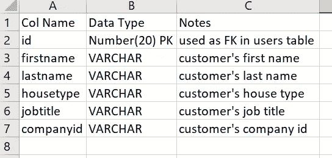
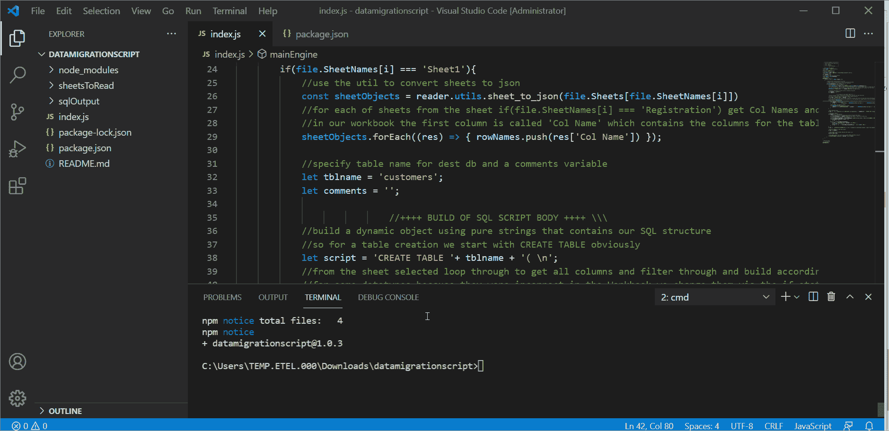

# 1 个用于 SQL 数据迁移项目的黑仔 Node.js 工具

> 原文：<https://javascript.plainenglish.io/1-killer-nodejs-tool-for-sql-data-migration-projects-9d900b9563bf?source=collection_archive---------7----------------------->

Photo by [Oskar Yildiz](https://unsplash.com/@oskaryil?utm_source=medium&utm_medium=referral) on [Unsplash](https://unsplash.com?utm_source=medium&utm_medium=referral)

你知道几乎每个公司都必须做的枯燥的数据迁移项目。

所以，我们都有过需要进行数据迁移项目的经历，但碰巧的是，你是做这种单调乏味工作的最佳人选。这就是你——数据架构师、后端工程师甚至前端工程师。

手头的任务？从源数据库到目标数据库的数据映射和对象创建，起初听起来可能是一项简单的任务，但在大型数据库中，这可能是一项艰巨的任务。可能有 100 种或更多不同类型的对象，如表、存储过程、函数、视图等。

# **场景**

我们的工具适用于特定情况，在这种情况下，您必须首先设计一个构建文件，其中包含要批准和测试的 SQL/PLSQL 脚本和/或借助定义所有 DB 对象的 Excel 文件。然后，构建文件用于在服务器上构建对象。如果没有 Excel 文件，你仍然可以使用这个工具进行一些调整，我会涵盖。

设置:

假设您在目标数据库中首先创建了一个名为 Customers 的表:

那么脚本看起来应该是这样的:

**代码分解**

让我们用几个步骤来分析一下这里发生了什么:

1.  我们首先定义一个名为 mainEngine 的 main 方法——我们所有的函数和事件都应该在这里发生。然后我们可以调用 mainEngine 作为整个脚本运行时运行的第一个方法。
2.  在第 3 行，我们在 NodeJS 的 readFile()的帮助下遍历我们的跨页中的所有工作表/工作簿——这在后面的脚本顶部被定义为导入。
3.  接下来，在第 8 行，我们检查要创建到表中的第一个表——对于我们来说，它是 Customer 表，因此我们检查一个名为“Customer”的表，如果有，就将其所有内容转换为 JSON 对象的数组，例如，对于第一列的[{"col name": "id"}，" col name": "firstname"}]，这是列名，然后它将对表中的其余列也进行同样的操作，例如，数据类型和注释。
4.  然后在第 13 行，对于每个 JSON 对象，我们取出第一列，它现在可以作为名为 sheetObjects 的对象中的一个索引进行访问，由于第一列是“Col Name ”,我们从这里取出所有的字段名，并将它们放入名为 rowNames 的数组中。这是为了以后更容易处理。
5.  然后，我们遍历 sheetObjects 中的其余对象(列名和字段名),并按照我们想要的方式构建我们的脚本。
6.  然后，我们在第 31 行向脚本添加注释
7.  然后，我们在脚本的第 37 行添加组合键
8.  然后我们添加约束，最后添加表空间名称
9.  接下来，我们在第 57 行向脚本的其余部分添加注释
10.  最后，在 NodeJS 方法 writeFile()的帮助下，我们将构建的脚本以 SQL 格式保存到一个文件中，并保存到所需的目录中

现在，我们将添加代码的其余部分，这只是一些导入和变量。我想现在添加它们，这样你就可以看到主函数是多么简单，没有任何其他混乱。

**更复杂的列名和数据类型的帮助方法**

那么，除了一些额外的东西，还有什么比提供一个好工具更好的呢？

因此，如果您想要添加索引或序列，您可以使用这两个额外的辅助方法轻松完成。

**NPM 模块**

如果我没有把它作为一个模块，我想这是因为有些人会认为它本身并不是一个真正的工具。所以，为了方便起见，我将这个脚本打包到了一个 NPM 模块中，可以在这里找到: [**Node.js 数据迁移脚本**](https://www.npmjs.com/package/datamigrationscript) **。**

一旦您克隆了它，您可以轻松地安装它，以便在任何类型的 SQL/PLSQL 或数据迁移项目中使用，如果您调整它的话。

NPM 上也有说明。

**视频演示**

NodeJS Data Migration Tool: Demo end to end of whole script running and it’s files

**结论**

在这里，我们有一个用于数据迁移项目的有用工具，您可以从您最喜欢的代码编辑器(如 VS Code)中使用它，与手动编写相比，它可以在很短的时间内创建 SQL/PLSQL 脚本。

我还演示了额外的 helper 方法，向我们展示了如何通过替换不需要的列名和数据类型中的字符/字符串来清理列和数据类型。

希望你喜欢这篇文章。我试着保持简短和甜蜜！:-)

*更多内容请看*[*plain English . io*](http://plainenglish.io/)