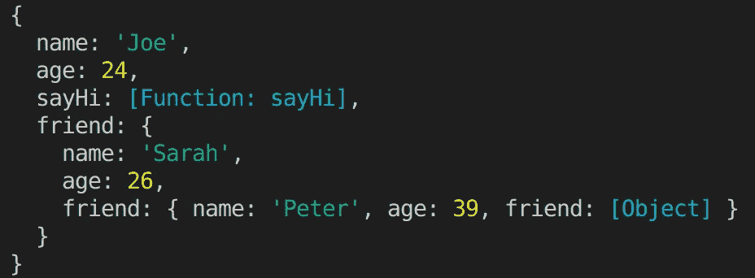
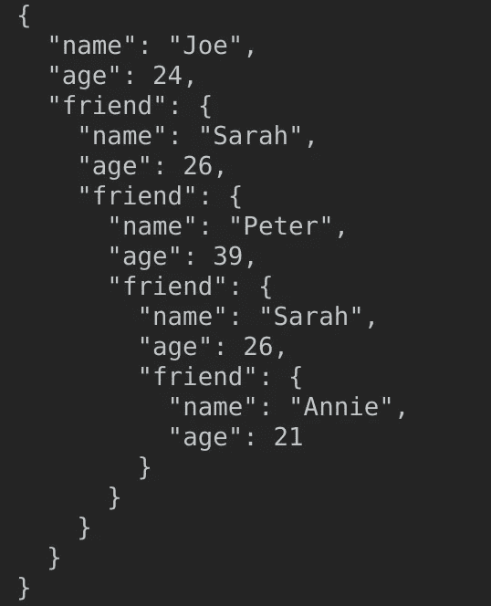
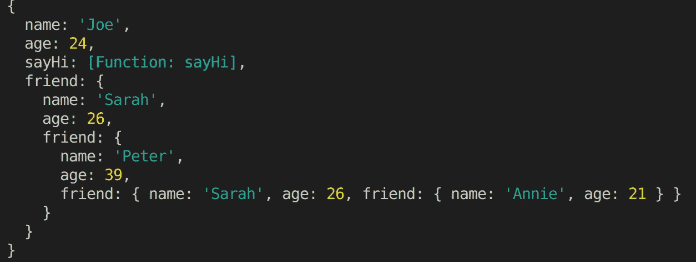

# OMBD#5:在 Node.js 中记录对象的正确方法

> 原文：<https://javascript.plainenglish.io/1-minute-to-become-a-better-developer-5-a7645ddb4637?source=collection_archive---------14----------------------->

## 和一些其他方法，你也可以使用，但要小心的警告！

欢迎来到第 5 期，通过阅读简短的知识，每次一分钟，你将成为一名更成功的软件开发人员。

## [**⏮**](https://jportella93.medium.com/1-minute-to-become-a-better-developer-4-aeabd6586396) **️** [**🔛**](https://jportella93.medium.com/one-minute-to-become-a-better-developer-ombd-5b1a1d37468e) [**⏭**](https://jportella93.medium.com/1-minute-to-become-a-better-developer-6-a732cf1e6670) **️**

Illustration by my buddy [Loor Nicolas](https://www.instagram.com/loornicolas/)

## 问题是

我们希望登录到控制台的这个深度嵌套的 JavaScript 对象:

## 天真的解决方法

初学者常见的错误是只使用该语言提供的最基本的日志工具:`console.log`。但是我们的深度测井有限，使得第三层的`friend`仅仅表现为`[Object]`:

Console.log: Hidden third level as `friend: [Object].`

## 拙劣的解决方案

我过去使用的一个技巧是通过 JSON.stringify 使用两个额外的参数:`console.log(JSON.stringify(person, null, 2))`。您可以在 [MDN](https://developer.mozilla.org/en-US/docs/Web/JavaScript/Reference/Global_Objects/JSON/stringify) 中了解这些功能。

但是这种方法存在一些问题:

1.  函数将从输出中消失。
2.  您不会得到语法高亮显示，因为您基本上是在记录一个格式化的字符串。

JSON.stringify: no colors and… where’s is sayHi()??

## **(更好的)解决方案**

使用`console.dir(person, {depth: null})`，这将显示所有嵌套的对象，包括函数，语法高亮显示。

Console.dir(person, {depth: null})

## 如果您喜欢这篇文章，您可能也会喜欢:

 [## 1 分钟成为更好的开发人员(#4)

### 欢迎阅读本系列的第 4 期，通过阅读简短的知识，您将成为一名更成功的开发人员…

jportella93.medium.com](https://jportella93.medium.com/1-minute-to-become-a-better-developer-4-aeabd6586396)  [## 1 分钟成为更好的开发人员(#6)

### 欢迎阅读本系列的第 6 期，通过阅读简短的知识，你将成为一名更成功的开发人员…

jportella93.medium.com](https://jportella93.medium.com/1-minute-to-become-a-better-developer-6-a732cf1e6670) 

## [⏮](https://jportella93.medium.com/1-minute-to-become-a-better-developer-4-aeabd6586396) ️ [🔛](https://jportella93.medium.com/one-minute-to-become-a-better-developer-ombd-5b1a1d37468e) [⏭](https://jportella93.medium.com/1-minute-to-become-a-better-developer-6-a732cf1e6670) ️