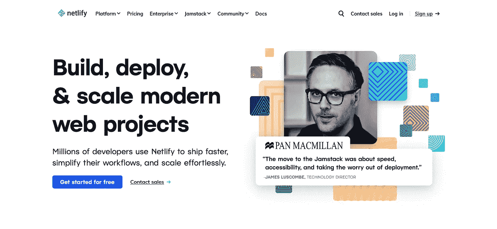
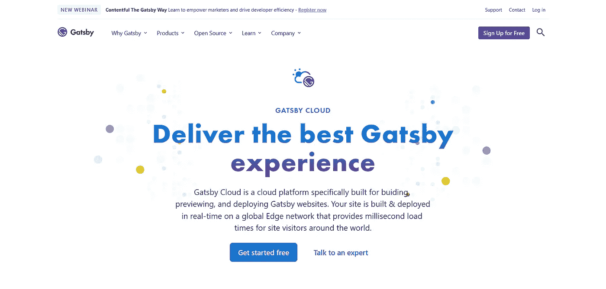
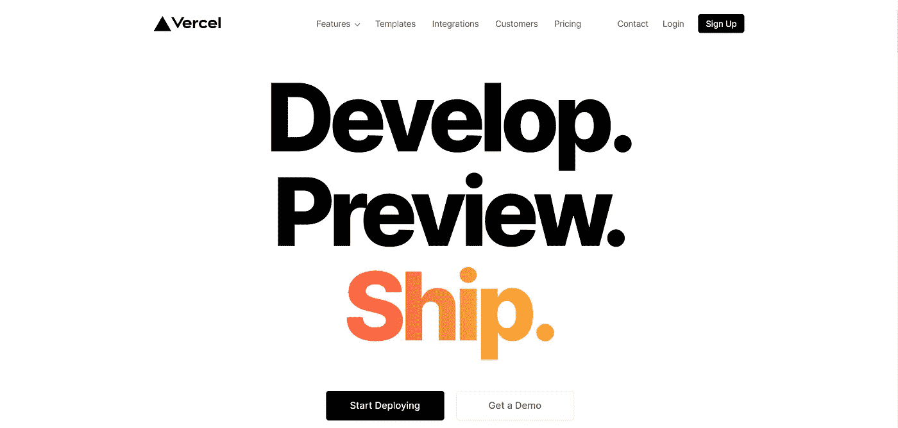
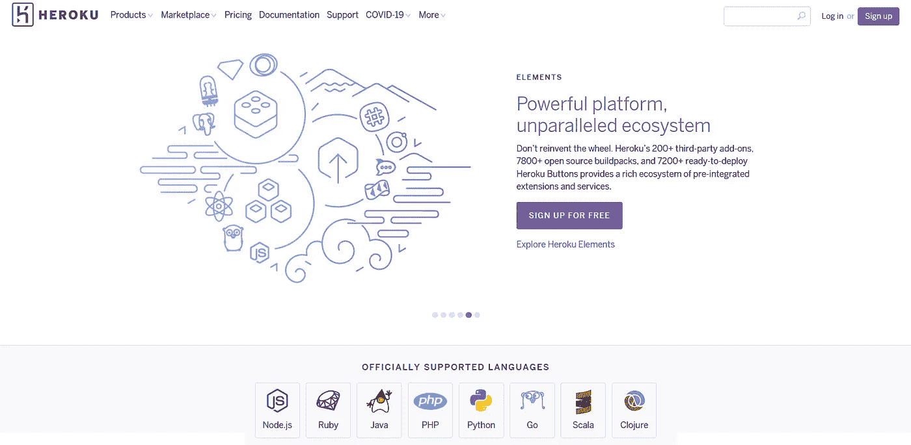
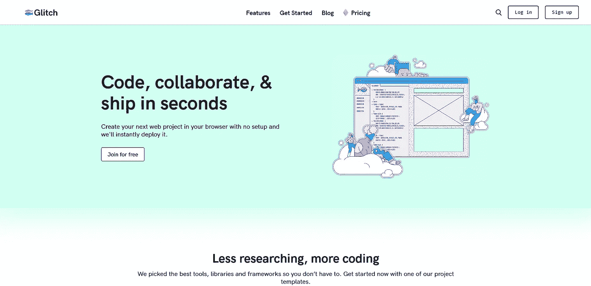
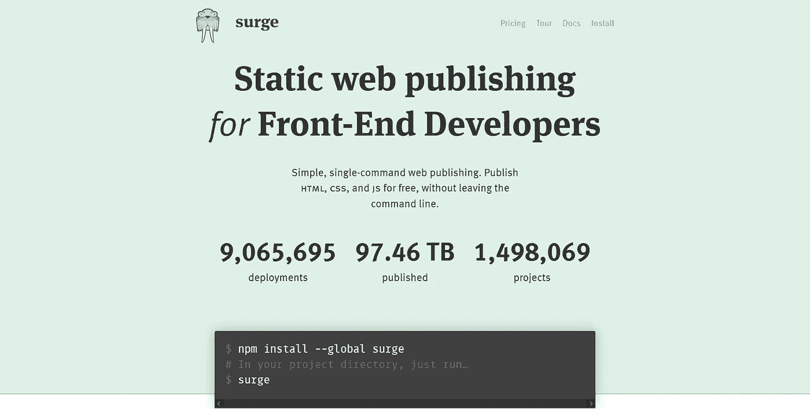
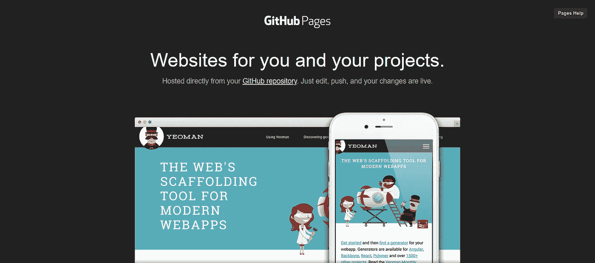
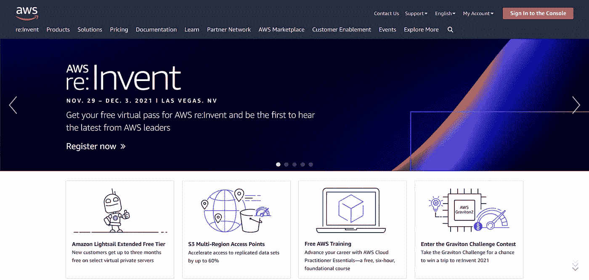

# 免费托管您的 Web 应用程序的 10 个惊人解决方案

> 原文：<https://javascript.plainenglish.io/10-amazing-solutions-to-host-your-web-app-for-free-f3ed8f70dc1c?source=collection_archive---------14----------------------->

## 以及它们对于专业用途有多好

在我的 web 开发之旅中，我用 bare React (CRA)、Gatsby 或 Next 创建了多个应用程序。

我寻找不同用途的免费主机服务。辅助项目、暂存环境，或者启动一个稍后需要付费解决方案的项目。

在这里，您可以找到最佳解决方案，以及它们在现实世界中的应用。

# 网络生活

[Netlify](https://www.netlify.com/) 将自己定义为:

> 功能强大的无服务器平台，具有直观的基于 Git 的工作流程。自动化部署、可共享预览等等。

这是一个托管静态网站的伟大工具，也是运行在[无服务器架构](https://www.netlify.com/products/functions/)上的动态应用。它提供了一种简单的方法来部署您的应用程序:您所要做的就是提供您的 GIT 存储库、构建命令和输出目录。就这样，你的 app 部署好了。

您可以配置想要部署的分支，以及[预览](https://www.netlify.com/products/deploy-previews/)。这些是针对您的主要分支机构的拉取请求的部署。对于合作工作和真实世界的测试来说，这是一个很好的工具。

它也广为人知:我见过它被用于登台环境以及生产站点。说到开发者体验是第一位的。

他们提供带宽为每月 100GB 的[免费层](https://www.netlify.com/pricing/)，并且他们的集成 CI 限制为每月 300 分钟。

# 盖茨比云

> [Gatsby Cloud](https://www.gatsbyjs.com/products/cloud/) 是一个端到端的统一平台，用于在全球边缘网络上构建、预览、部署和托管。盖茨比云是向您的访问者提供最佳盖茨比网站和应用程序体验的最佳平台。

致力于用 [Gatsby](http://gatsbyjs.com/) 制作的网站，他们的架构有助于比所有竞争对手更快地构建。它的性能与 Netlify 相当，但需要一些额外的配置才能完全优化。

我没有机会专业地使用它，也不需要更快的构建。对于 Gatsby 应用程序，我选择了 Netlify，但对于有大量内容且构建缓慢的站点，我会 100%推荐它。

盖茨比云提供[免费计划](https://www.gatsbyjs.com/pricing/)单个应用，100GB 带宽/月。

# 韦尔塞尔

> Vercel 是一个用于前端框架和静态站点的平台，旨在与你的无头内容、商务或数据库集成。
> 
> 我们提供无摩擦的开发人员体验来处理困难的事情:即时部署、自动扩展以及在全球范围内提供个性化内容。
> 
> 我们让前端团队更容易开发、预览和交付令人愉快的用户体验，其中性能是默认的。

Vercel 主要用作 [Next.js](https://nextjs.org/) 的 Netlify 的等价物。这是一个惊人的解决方案，具有相同的功能(如基于 GIT 的工作流和部署预览)。

但这还不是全部，Vercel 与广泛的技术合作，如 [Nuxt](https://nuxtjs.org/deployments/vercel/) 、 [bare React (CRA)](https://vercel.com/guides/deploying-react-with-vercel-cra) 以及许多其他技术！我也看到了 next 在专业领域的广泛应用，并亲自在一个登台环境中使用它。

可以找一个[爱好计划](https://vercel.com/pricing)，免费非商业使用。该计划提供每月 100GB 的带宽。

# 赫罗库

> [Heroku](https://www.heroku.com/) 是基于容器的云平台即服务(PaaS)。开发人员使用 Heroku 来部署、管理和扩展现代应用。我们的平台优雅、灵活且易于使用，为开发人员将应用推向市场提供了最简单的途径。

Heroku 并不局限于部署前端(忽略 lambda 函数的无服务器架构)。

对于开发人员和他们的辅助项目来说，这是一个受欢迎的解决方案。不幸的是，我看到它的商业计划受到了广泛的批评，因为价格很容易飙升。

我经常用它来为附带项目部署后端应用程序(用 NodeJS 制作),但是当涉及到前端时，我更喜欢它的替代品。

其[免费计划](https://www.heroku.com/pricing)在 dyno 方面受到限制(每月 550-1000 dyno 小时)，这对于小项目来说很少达到。它通过在给定时间内没有请求时暂停应用程序执行来降低成本。

# 小故障

[小故障](https://glitch.com/)解释了人们喜欢它的原因:

> Glitch 是一个友好的社区，它使得构建一个全栈应用程序并在不到一分钟的时间内在一个安全的 URL 上启动它变得非常容易。

我发现这是一个很好的社区应用和协作工具。它提供了一个在线编辑器，可以轻松地构建/部署。

Glitch 为前端和后端应用程序提供了多个入门项目，并帮助您轻松入门。它主要用于辅助项目，在这方面不容易被其他人击败！

他们有一个[免费计划](https://glitch.com/pricing)默认为公共应用，每月有 1000 个活跃小时。Glitch 的工作过程与 Heroku 相同，应用程序不使用时会休眠。

他们的 pro 计划允许私人应用程序和 5 个具有更大功能的应用程序在任何时候都不会暂停。

# 汹涌

[增兵](https://surge.sh/)告诉我们:

> 交付 web 项目应该快速、简单、低风险。Surge 是面向前端开发人员的静态 web 发布，直接来自 CLI。

Surge 因其简单明了和帮助开发者轻松部署而广受欢迎。它仅限于静态网站，但这是一个优势，使其性能惊人。

那些讨厌免费托管平台生成的唯一网址的人会喜欢使用 surge:它允许你添加一个 CNAME。一旦你有了一个自定义域，你可以很容易地在 Surge 上免费配置它。

它提供了一个无限制发布的[自由层](https://surge.sh/pricing)。

# GitHub 页面

> 您可以使用 GitHub Pages 直接从 GitHub.com 上的存储库中托管一个关于您自己、您的组织或您的项目的网站。

GitHub Pages 广为人知，但我相信还不够用。它是为静态网站设计的:在你的 GitHub 存储库中，启用 pages 并将你的构建输出推送到一个分支`gh-pages`。

这就是您在`[username].github.io`访问前端应用程序所需的一切。

GitHub Pages 主要用于开源项目的文档。这也是我见过并推荐的唯一用例。

请注意，GitHub 页面可以由企业管理的用户私下发布。可以从其他提供商那里找到替代方案，例如 [GitLab Pages](https://docs.gitlab.com/ee/user/project/pages/) 。

# 云提供商:AWS、GCP 和 Azure

云提供商的缺点是需要大量的知识(和高级用户的实践)。另一方面，当涉及到扩展时，它们是最好的解决方案。

[亚马逊网络服务](https://aws.amazon.com/)、[谷歌云平台、](https://cloud.google.com/)和[微软 Azure](https://azure.microsoft.com/) 应用最为广泛。我看到它们都被用于暂存环境和生产应用程序。平均来说，AWS 被选中的次数最多。

它们都提供免费的功能。

## 亚马逊网络服务

AWS 提供了两种免费资源。

免费试用是从您激活特定服务之日开始的短期服务。其中包括 750 小时的亚马逊 Lightsail 托管服务和 1000 小时的设备农场服务。

12 个月免费是指从您首次注册 AWS 之日起 12 个月内的优惠。在这 12 个月里，你可以使用 750 个小时的 EC2，在亚马逊 S3 上存储 5GB 的内容，还有很多其他的。

## 谷歌云

GCP 免费提供[月度服务](https://cloud.google.com/free/docs/gcp-free-tier#free-tier-usage-limits)有使用限制，包括[云存储](https://cloud.google.com/free/docs/gcp-free-tier/#storage)或 [Kubernetes 引擎](https://cloud.google.com/free/docs/gcp-free-tier/#kubernetes-engine)。

你不仅可以免费使用一些服务，而且在创建你的帐户时还会得到 300 美元。这些可以在任何可用的服务上使用，所以你可以评估谷歌云平台。

## 微软 Azure

使用 Microsoft Azure 创建新帐户时，您会看到:

*   12 个月免费热门服务。
*   除了受欢迎的服务之外，还有 30 天 200 美元的 Azure 信用。

# 结论

希望你找到了符合自己需求的托管解决方案。我最喜欢的是 NextJS 的 Vercel 和其他前端的 Netlify。

Heroku 非常适合后端暂存环境，而 AWS 则处理其生产环境。

如果你想使用 AWS，但害怕它的复杂性，像 [Elastic Beanstalk](https://aws.amazon.com/fr/elasticbeanstalk/) 这样的服务可以解决很多问题。

这个题目到此为止。感谢您的阅读。

*更多内容看* [*说白了. io*](http://plainenglish.io/) *。在这里注册我们的* [*免费周报*](http://newsletter.plainenglish.io/) *。*