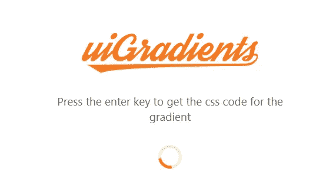
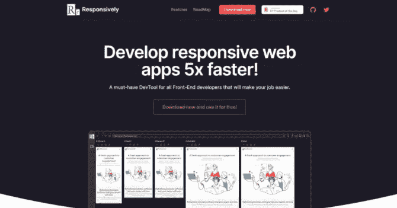
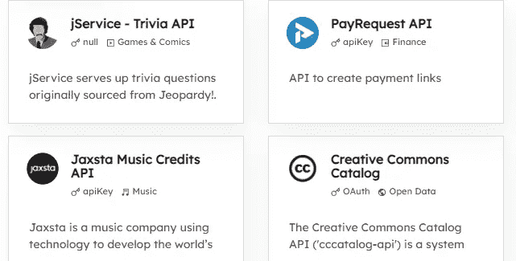
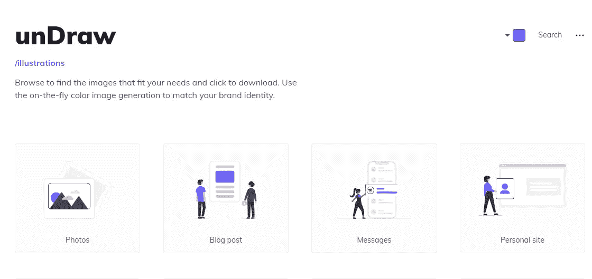
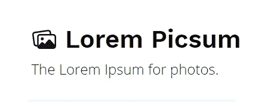
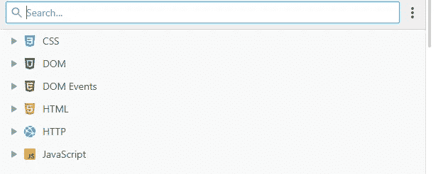
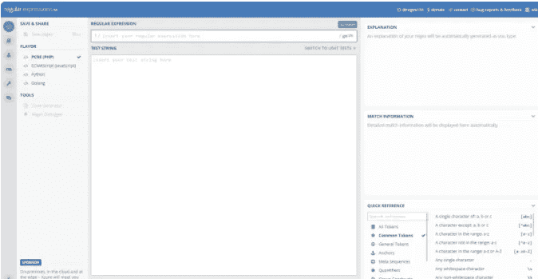
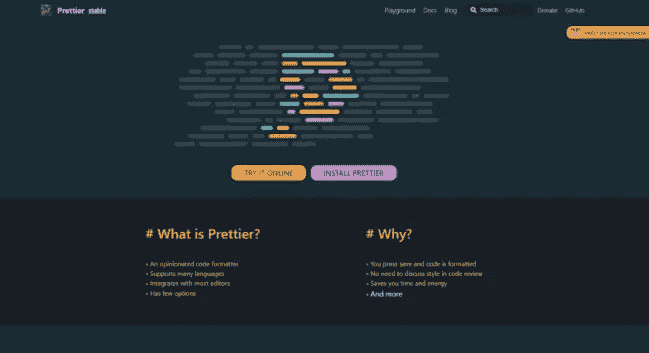
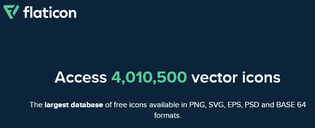

# 10 个令人敬畏的前端开发工具来提高您的生产力

> 原文：<https://javascript.plainenglish.io/10-awesome-front-end-development-tools-to-boost-your-productivity-b1d2efc4c4ba?source=collection_archive---------2----------------------->

## 你可能需要用到的有用的前端开发工具。

Photo by [ThisisEngineering RAEng](https://unsplash.com/@thisisengineering?utm_source=medium&utm_medium=referral) on [Unsplash](https://unsplash.com?utm_source=medium&utm_medium=referral)

# 介绍

作为开发人员，我们总是需要使用一些资源和工具，这些资源和工具可以使我们的生活更轻松，并在从事项目或学习某些东西时提高我们的生产率。好的一面是网上有很多工具，而且是专门为开发者开发的。很多都是免费的，你不用支付任何费用。

在本文中，我们将为您提供一些非常有用的前端开发工具，这些工具可以在 web 上免费获得。让我们开始吧。

# 1.ui 渐变

UiGradients 是一个令人惊叹的网络工具，它包含了一系列令人惊叹的颜色渐变，你可以自定义并从中选择。你也可以获得这些颜色渐变的 CSS 代码，或者以 JPG 格式下载。

[uiGradients](https://uigradients.com/#Peach).

# 2.响应性应用程序

[响应式应用](https://responsively.app/)帮助你更快地开发响应式网络应用。对于所有前端开发人员来说，这是一个很好的开发工具，因为它会使您的工作更容易。

[Responsively](https://responsively.app/).

# 3.公共 API

[公共 API](https://public-apis.io/)是一个为开发者提供一系列免费公共 API 的网站，比如电影 API、音乐 API、开放数据 API 等等。你也可以在那里提交你自己的 API。

[Public APIs](https://public-apis.io/).

# 4.拉开

Undraw 是一个很棒的网络应用程序，在这里你可以找到很多 SVG 图片和插图，你可以在你的网页上使用它们。

它还允许您将 SVG 图像与嵌入到您的网站的能力相结合。

[Undraw](https://undraw.co/illustrations).

# 5.Lorem Picsum

Lorem Picsum 是一个简单的网站，你可以根据自己的需要轻松获得随机和特定的图片。这是照片的 lorem ipsum。

[Lorem Piccsum.](https://picsum.photos/)

# 6.DevDocs

DevDocs 是一个非常有用的开源 web 应用程序，它在一个易于导航和访问的界面中结合了多个 API 文档。它包含许多关于不同 web 技术的文档，您可以很容易地访问和学习。它也可以在离线模式下工作。

[DevDocs](https://devdocs.io/).

# 7.Onepagelove

[Onepagelove](https://onepagelove.com/) 。是一个网站，给你一堆主题和模板，还有一些前端开发的学习技巧。这是一个可以获得灵感的好地方。如果你想使用的话，它们还可以让你下载免费的模板。

[Onepagelove](https://onepagelove.com/).

# 8.正则表达式 101

RegEx 101 是一个免费的正则表达式调试器，具有实时解释、错误检测和高亮显示功能。它适用于 PHP、JavaScript、Python 和 Golang。

[RegEx 101](https://regex101.com/).

# 9.较美丽

[更漂亮的](https://prettier.io/)是一个免费的工具，你可以用它来使你的代码格式良好。它支持多种语言，并集成了大多数编辑器，如 VSCode、Sublime 等。

[Prettier](https://prettier.io/).

# 10.扁平图标

[Flaticon](https://www.flaticon.com/) 允许你获得 SVG、PNG 和其他格式的免费矢量图标。你可以访问他们数据库中的数千个图标。这比创建自己的图标要容易得多，因为创建自己的图标要花很多时间。

[Flaticon](https://www.flaticon.com/).

# 结论

如你所见，所有这些工具都是有用且免费的。它们允许您以一种简单的方式完成不同的任务，从而提高您作为前端 web 开发人员的工作效率。

感谢您阅读这篇文章。希望你觉得有用。

*想在与队友一起工作或交流时更有效率吗？嗯，你可以看看这个有用的列表，里面有一些很棒的* [*协作应用*](https://insiderapps.com/collaboration) *软件，可以帮助你虚拟地协作完成任务和项目。*

# 更多阅读

*如果你对 JavaScript 和 web 开发相关的更有用的内容感兴趣，也可以* [*订阅*](https://mehdiouss.ck.page/) *我的快讯。*

*下面是另一篇有用的文章，请点击链接查看:*

 [## 你应该知道的 20 个有用的 JavaScript 数组方法

### 20 个有用的方法和例子，帮助你在 JavaScript 中轻松操作数组。

medium.com](https://medium.com/javascript-in-plain-english/20-useful-javascript-array-methods-that-you-should-know-6f0e5a9c710a)