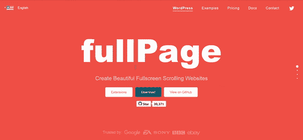
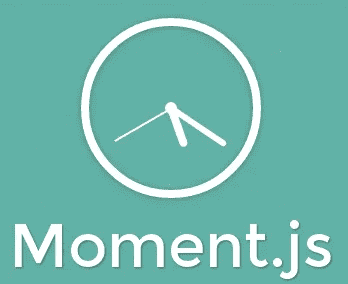
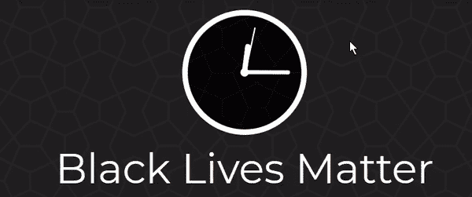
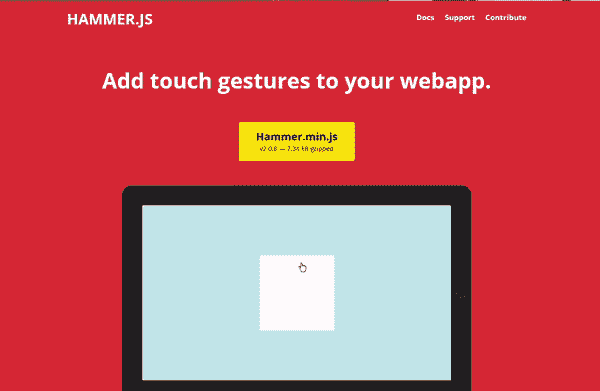
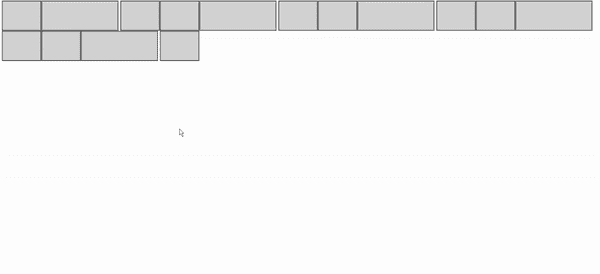
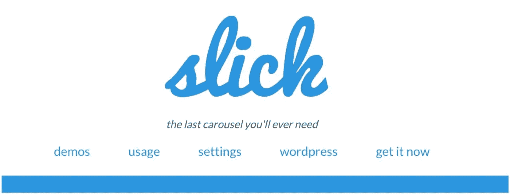
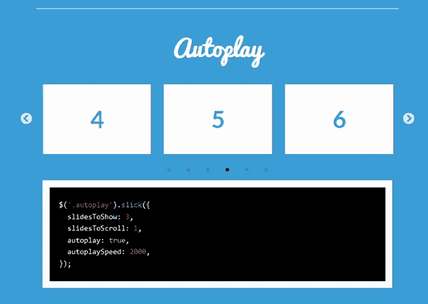

# 2021 年你应该尝试的 10 个超棒的 JavaScript 库

> 原文：<https://javascript.plainenglish.io/10-awesome-javascript-libraries-you-should-try-out-in-2021-34ee431cd341?source=collection_archive---------19----------------------->


Photo by [Alfons Morales](https://unsplash.com/@alfonsmc10?utm_source=medium&utm_medium=referral) on [Unsplash](https://unsplash.com?utm_source=medium&utm_medium=referral)

JavaScript 是网络上最流行的语言之一。尽管它最初只是为网页开发的，但在过去的二十年里它已经有了指数级的增长。

现在，JavaScript 几乎可以做任何事情，并且可以在包括物联网在内的多种平台和设备上工作。随着最近 SpaceX Dragon 的发布，JavaScript 甚至进入了太空。

它受欢迎的原因之一是大量框架和库的可用性。与传统的普通 JS 开发相比，它们使得开发更加容易。

几乎任何东西都有图书馆，而且几乎每天都有更多的图书馆问世。但是有这么多的库可供选择，很难跟踪每一个库以及如何根据您的需要进行定制。

在本文中，我们将讨论 10 个最流行的 JS 库，您可以用它们来构建您的下一个项目。

# 传单


Leaftlet

我认为 Leaflet 是为你的应用程序添加移动友好的交互式地图的最好的开源库。

它的小尺寸(39kB)使它成为比其他地图库更好的选择。凭借跨平台的效率和完善的 API，它拥有让你坠入爱河所需的一切。

以下是创建传单地图的一些示例代码:

在传单，我们需要提供一个瓷砖层，因为没有默认的。但这也意味着我们可以从大量免费和高级层中进行选择。你可以在这里探索各种免费的瓷砖层[。](https://leaflet-extras.github.io/leaflet-providers/preview/)

阅读[文档](https://leafletjs.com/reference-1.6.0.html)或跟随[教程](https://leafletjs.com/examples.html)了解更多。

# F [ullPage.js](https://alvarotrigo.com/fullPage/)



FullPage.js

这个开源库可以帮助你创建全屏滚动的网站，正如你在上面的 GIF 中看到的。它易于使用，并且有许多选项可以定制，所以它被成千上万的开发人员使用并在 GitHub 上获得超过 30k 颗星也就不足为奇了。

这是一个 Codepen 演示，您可以使用它:

您甚至可以将它用于流行的框架，例如:

*   [react-fullpage](https://alvarotrigo.com/react-fullpage/)
*   [vue-全页](https://alvarotrigo.com/vue-fullpage/)
*   [角度-全页](https://alvarotrigo.com/angular-fullpage/)

大约一年前我偶然发现了这个图书馆，从那时起它就成了我最喜欢的图书馆之一。这是几乎可以在每个项目中使用的少数几个库之一。如果你还没有开始使用它，那就试试吧，你不会失望的。

# 一个 [nime.js](https://animejs.com/)


anime.js

Anime.js 是最好的动画库之一，使用起来既灵活又简单。这是一个完美的工具，可以帮助你添加一些非常酷的动画到你的项目中。

Anime.js 可以很好地处理 CSS 属性、SVG、DOM 属性和 JavaScript 对象，并且可以很容易地集成到您的应用程序中。

作为一名开发人员，拥有一个好的投资组合很重要。人们对你的投资组合的第一印象有助于决定他们是否会雇用你。还有什么比这个库更好的工具来给你的投资组合带来活力呢？这不仅会增强你的网站，而且有助于展示实际技能。

查看此代码笔以了解更多信息:

你也可以在 [Codepen](https://codepen.io/collection/XLebem) 或 [](https://codepen.io/collection/XLebem) [上看看所有其他很酷的项目。](https://animejs.com/documentation/)

# [Screenfull.js](https://github.com/sindresorhus/screenfull.js)


screenfull.js

在我的项目中寻找实现全屏特性的方法时，我偶然发现了这个库。

如果你也想拥有全屏特性，我会推荐使用这个库而不是[全屏 API](https://developer.mozilla.org/en/DOM/Using_full-screen_mode) ，因为它的跨浏览器效率(虽然它是建立在那个之上的)。

它小到你甚至不会注意到它——只有大约 0.7kB 的 gzip 文件。

尝试[演示](https://sindresorhus.com/screenfull.js)或阅读[文档](https://github.com/sindresorhus/screenfull.js)了解更多信息。

# [Moment.js](https://momentjs.com/)



Moment.js

处理日期和时间可能是一件非常痛苦的事情，尤其是 API 调用、不同时区、本地语言等等。Moment.js 可以帮助您解决所有这些问题，无论是操作、验证、解析还是格式化日期或时间。

有很多很酷的方法对你的项目非常有用。例如，我在我的一个博客项目中使用了`.fromNow()`方法来显示文章发表的时间。

虽然我不经常使用它，但我是它支持国际化的粉丝。例如，我们可以使用`.locale()`方法定制上面的结果。



Moment.js Homepage

点击阅读[文件。](https://momentjs.com/)

【2020 年 9 月更新: Moment.js 已进入维护模式。点击了解更多信息[。你可能想探索其他选择，比如](https://momentjs.com/docs/#/-project-status/) [Day.js](https://day.js.org/) 或 [date-fns](https://date-fns.org/) 。

# [Hammer.js](http://hammerjs.github.io/)



Hammer.js

Hammer.js 是一个轻量级的 JavaScript 库，允许您将多点触摸手势添加到 Web 应用程序中。

我推荐这个库给你的组件增加一些乐趣。这里有一个例子。只要运行笔和点击或点击灰色的 div。

它可以识别触摸、鼠标和指针事件所做的手势。对于 jQuery 用户，我会推荐使用 [jQuery 插件](http://hammerjs.github.io/jquery-plugin/)。

```
$(element).hammer(options).bind("pan", myPanHandler);
```

在此阅读[文档](http://hammerjs.github.io/getting-started/)。

# [砌筑](https://masonry.desandro.com/)


Masonry.js

Masonry 是一个 JavaScript 网格布局库。它超级棒，我用它做了很多项目。它可以根据可用的垂直空间来放置简单的网格元素，有点像承包商如何将石头或石块放入墙中。

您可以使用这个库从不同的角度展示您的项目。将它与卡片、图像、模态等一起使用。

这里有一个简单的例子，向您展示实际中的神奇之处。嗯，不完全是魔术，而是当你在网页的上**放大**时，布局是如何变化的。



下面是上面的代码:

这是 Codepen 上一个很酷的演示:

看看这些项目

*   [https://halcyon-theme.tumblr.com/](https://halcyon-theme.tumblr.com/)
*   [https://tym pus . net/Development/gridloading effects/index . html](https://tympanus.net/Development/GridLoadingEffects/index.html)
*   [https://www.erikjo.com/work](https://www.erikjo.com/work)

# [D3.js](https://d3js.org/)


D3.js

如果你是一个痴迷于数据的开发者，那么这个库就是为你准备的。我还没有找到一个库能像 D3 一样高效、漂亮地操作数据。在 GitHub 上有超过 92k 的星星，D3 是许多开发人员最喜欢的数据可视化库。

我最近用 D3 通过 React 和 GitHub 上的[约翰霍普金斯 CSSE 数据仓库来可视化新冠肺炎数据。这是一个非常有趣的项目，如果你想做类似的事情，我建议试试 D3.js。](https://github.com/CSSEGISandData/COVID-19)

点击了解更多[。](https://github.com/d3/d3/wiki)

# ■舔舔



Slick.js

Slick 完全响应，支持刷卡，无限循环等等。正如主页上提到的，这确实是你需要的最后一个旋转木马。

我使用这个图书馆已经有一段时间了，它节省了我很多时间。只需几行代码，您就可以向 carousel 添加如此多的功能。



Autoplay

点击查看演示[。](https://kenwheeler.github.io/slick/)

# [Popper.js](https://popper.js.org/)


Popper.js

js 是一个轻量级的大约 3 kB 的 JavaScript 库，没有依赖性，它提供了一个可靠的可扩展的定位引擎，可以用来确保所有的 Popper 元素都被定位在正确的位置。

花时间配置 popper 元素似乎并不重要，但是这些小事情会让你成为一名优秀的开发人员。而且体积这么小，不占地方。

在这里阅读[文档](https://popper.js.org/docs/v2/)。

# 结论

作为一名开发人员，拥有和使用正确的 JavaScript 库非常重要。这将使你更有效率，并使开发更容易和更快。最后，您可以根据自己的需要选择哪个库。

这是 10 个 JavaScript 库，你可以尝试并开始在你的项目中使用。你还用哪些很酷的 JavaScript 库？你想再要一篇这样的文章吗？

*更多内容请看*[***plain English . io***](http://plainenglish.io/)