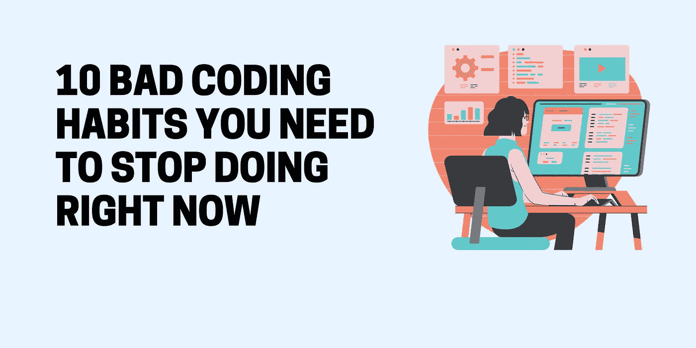

# 10 个你需要马上改掉的坏习惯

> 原文：<https://javascript.plainenglish.io/10-bad-coding-habits-you-need-to-put-an-end-to-right-now-b39d12074563?source=collection_archive---------2----------------------->

每个人都不是完美的，这是最诚实的事实。程序员和生活中的任何其他领域都是如此。有很多优秀的、伟大的、仍在成长的程序员，但他们往往不是最好的。我们都会犯错，每个人都是人。除了缺点，坏习惯也会带来很多麻烦。这些坏习惯乍一看似乎是无害的，但如果不改正，会造成很多问题。在这篇文章中，我将讨论每个程序员都应该避免的 10 个坏习惯。

# 1.一直独立工作

与团队分享你的进步和想法是很重要的。以正确的方式建造东西并不总是可能的，所以持续的沟通非常重要。当你和他人一起工作时，交流也能使他们受益。如果你和他们讨论想法，并指导团队中容易陷入困境的缺乏经验的成员，他们的工作通常会有所改善。

# 2.对自己的代码过于自信

如果你写了一些东西，不要因为你写了它就认为它很棒。在你的职业生涯中，当你从事新项目并获得经验时，你会学到更多关于编程的知识，所以花一点时间来反思一下作为一名程序员你是如何成长的。

# 3.拒绝编写糟糕的代码

有时候，开发人员会因为截止日期而写出可怕的代码。即使你已经警告过客户或经理后果，他们还是坚持按计划行事，所以你现在必须开始编码。可能是有一个紧急的问题不能等到你想出解决方案的时候。因此，对于一个多才多艺的程序员来说，能够同时写出好的和差的代码是很重要的。这样，你就可以重温和消除你的技术债务。

# 4.责备他人

傲慢是技术专业人员(如开发人员)的普遍特征。能够承认自己的错误让你脱颖而出。当你犯错时，不要回避道歉。接受这个事实后，你可以开始从你的错误中学习，并在未来避免它们。不承认错误会使学习变得不可能。

# 5.高估你的个人风格

确保您的工作方式和环境设置与您的团队相协调。团队中的每个成员都应该遵循相同的编码风格，在相似的条件下工作。如果你用自己的方式做事，你可能不习惯你同事的编码风格，如果这不寻常，下一个开发人员可能会发现很难在你已经构建的基础上工作。

# 6.浪漫化您的开发工具包

有时候，您首选的编辑器或命令行工具并不适合这项工作。比如 Visual Studio 是开发 ide 的好工具，Sublime 是动态语言的好工具，Eclipse 是 Java 的好工具等等。Vim 或 emacs 可能是您最喜欢的工具，但这并不意味着它们对所有情况都是完美的。

# 7.向经理/客户提供反馈太慢

确保每个人都尽可能知道对他的期望是什么，这是一个工匠能够拥有的最优秀的品质之一。你的经理不会是唯一从中受益的人。此外，这也是为了你自己的利益:你对项目的未来会少一些担心。

# 8.使用不添加信息的名称

为变量和函数选择名称可能很棘手，但是您可以轻松地确保它们的名称是正确的。在您的名字中添加信息将有助于其他人理解您的代码。名称很有用，因为它们描述了代码的功能。如果给它一个好名字，你可以在几秒钟内看到一段代码做了什么，而不需要深入计算。

# 9.没有充分使用谷歌

一个复杂的问题，根本不用解决，也能很快解决。如果你不确定，谷歌一下。可以问你旁边的工程师，但是他不能提供栈溢出那样多的细节。还有，你会打扰他的工作。

# 10.放弃

你应该这么快就放弃吗？尽管离解决方案如此之近，但太多的程序员在达成解决方案之前就放弃了。开发者的生活充满了挑战，这是毫无疑问的。我们的日常生活充满了新的挑战，偶尔我们会感到停滞不前，以至于想要放弃。然而，你必须记住，放弃不是一个选项。确实有一些技术上的挑战阻碍了我们开发一些东西。但是，过程长不代表做不到。放弃和知道什么时候停止是不同的。不要让放弃的想法爬进你的脑海。

随着年龄的增长，我们往往会养成习惯。养成你遵循的习惯可以帮助你不必对每种情况想太多。当你习惯了好的做事方式，它们就会变得毫不费力。

我很想听听你还认为哪些编码习惯是有害的。请在下面留下评论

如果你喜欢我的内容，请看看我的博客。我撰写关于 web 开发、技术和方法的文章，以使开发人员的生活更加轻松。

*更多内容尽在*[***plain English . io***](http://plainenglish.io/)