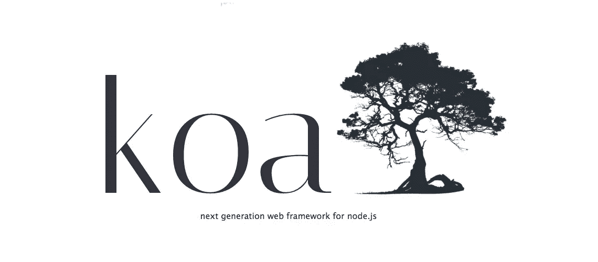
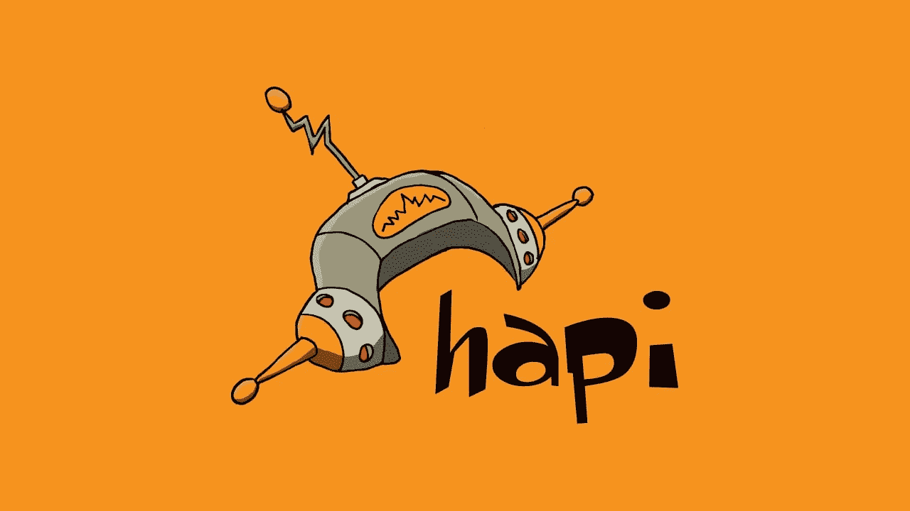

# 2021 年 Web 应用的 10 个 Node.js 框架

> 原文：<https://javascript.plainenglish.io/10-best-node-js-frameworks-for-webapps-in-2021-f217fc4e9f0f?source=collection_archive---------15----------------------->

## 流行的 Node.js 框架提供了高度可伸缩的 web 应用程序

## 1.快递. js

有一个非常简约的方法和一个经典而简单的框架。它不需要你更深入的学习曲线，你需要的只是对 **Node.js** 环境的基本理解。

*   **Rapid-Server:** 拥有很多 Node.js 的特性，比如 ***函数*** ，用很少的几行代码就加快了进程。
*   **更好的内容协商:**通过为 URL 提供一个 **HTTP** 头，为用户/客户端获取准确的信息，从而有助于客户端和服务器之间更好的通信。
*   MVC 架构模式。

## 2.Koa.js

构建**API**变得非常有趣，因为它可以用类似堆栈的方法有效地处理 HTTP 中间件。此外，它建设性地规范了节点缺陷，您可以用相同的 URL 维护呈现给用户的各种形式的内容，如翻译页面，在电子商务中个性化内容&它非常类似于 **Express** 。

*   异常处理错误。
*   规范化**节点**的不一致性，帮助维护代码。
*   清理缓存，支持代理和内容协商。

## 3.流星. js

一个只使用一种语言的特定于 JavaScript 的框架，一个开源的 JavaScript web 框架，无需开发人员的努力就可以自动对客户端进行数据更改&它可以适应包括 Android 在内的各种设备操作系统。

*   一个跨平台框架，用 **CLI** 构建快速原型。
*   全栈解决方案。
*   超快的互动。
*   易于与其他框架集成。

## 4.Socket.io

一个 **JavaScript** 库，用于构建**实时**应用并在 web 客户端和服务器之间建立双向通信。可以开发有 **WebSocket** 开发需求的应用。

**例如**-***Whatsapp***等聊天应用持续运行进行实时更新和刷新。

*   自动重新连接支持。
*   错误检测和自动纠正。
*   用于客户端和**服务器端**开发的类似 API。

## 5.嵌套. js

一个渐进式 Node.js 框架，用于构建动态和可伸缩的企业级应用程序，提供完整的灵活体验。你可以称之为后端生产力助推器，也可以使用这个框架来构建多层企业应用程序。而且是 **OOP & FRP 的组合。**

*   模块化结构和功能的 CLI。
*   平滑的学习曲线。
*   由于系统的代码安排，东方使用外部库。
*   与前端的**角度**高度兼容。

## 6.帆. js

类似于来自 Ruby on Rails 等框架的 **MVC** 架构模式，并为现代化的、面向数据的开发提供支持。兼容所有数据库，灵活集成 **JavaScript** 框架。

*   自动生成**REST API。**
*   可重用的安全策略。
*   集成了针对 **HTTP** 请求的 Express 和针对 WebSockets 的 Socket.io。

## 7.Total.js

提供类似 CMS 的体验，并且拥有 Node.js 环境中几乎所有您需要的东西。该框架有不同的版本，如 **Eshop** 、 **CMS** 和 **HelpDesk** 。

有了这些变体，你的应用在物联网、REST 服务、超快应用的未来，在低维护成本下，有了更大的空间。

*   实时跟踪。
*   API 测试。
*   多数据库兼容性。
*   灵活支持不同的前端框架。

## 8.哈皮网

它是一个商业可用的服务器和 web 应用程序的开源框架。并因代理服务器、REST APIs 和其他桌面应用程序而广为人知。

*   安全默认值。
*   丰富的生态系统。
*   快速简单的错误修复。
*   最小的开销。

## 9.Feather.js

一个流行的 **JavaScript** 后端开发框架，通过在多个数据库上使用 **Node.js** 和 **React-Native** 提供了灵活性。它以一种简单明了的方式解决了编程问题，这样开发者就不会陷入复杂的 RESTful APIs 中。

*   超轻量。
*   硬币指示器 （coin-levelindicator 的缩写）命令行界面（Command Line Interface for batch scripting）
*   自动 RESTful APIs。
*   服务的重用。

## 10.Loopback.js

它提供了与任何 Node.js 框架更好的连接，并且您可以将它与几种不同的 API 服务集成。提供卓越的灵活性，可连接更广泛的设备、浏览器、数据库和服务。

*   干净和模块化代码。
*   高度可扩展。
*   内置客户端 API 资源管理器。