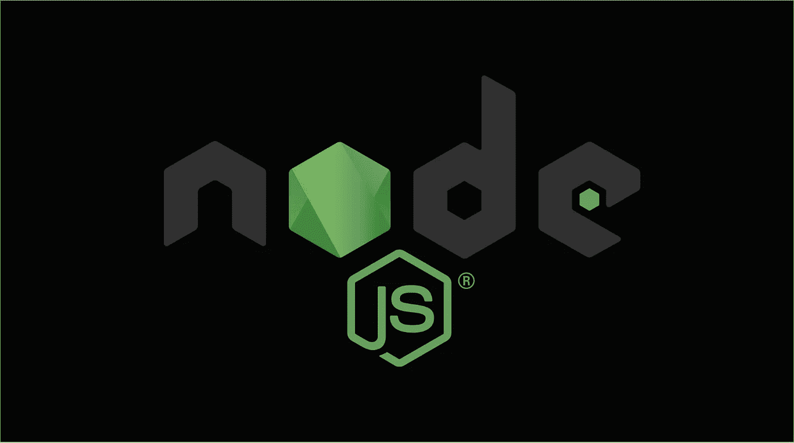

# Node.js 应用程序的 10 个最佳实践

> 原文：<https://javascript.plainenglish.io/10-best-practices-for-node-js-applications-2093b3c50799?source=collection_archive---------2----------------------->

## 你需要知道的 Node.js 实践

## **1。使用特定的 Node.js 插件**

开发人员犯的最大错误之一是在 ***Node.js*** 中使用各种数量的插件，而不是使用符合标准规则的新插件，这些规则涵盖了普通的 **JavaScript** ，使用特定的插件，如 **eslint-plugin-node，eslint-plugin-mocha**&**eslint-plugin-node-security**。在 Node.js 应用程序中使用非特定插件会导致错误的代码模式。 ***例如，*** 开发人员可能要求文件中的变量被指定为一个路径，使得攻击者能够执行 JS 脚本。

## **2。报表**

不管你是否使用分号来分隔你的陈述，但是如果你没有正确地分隔它们，那么结果将会是一片混乱。为了避免这种情况，你可以使用 **ESLint** 来获得关于分离问题的意识，**beautiful**&**standards js**很好地解决了这些问题。否则，如果没有分号，JavaScript 解释器会自动在语句末尾添加一个分号，这会导致一些不希望的结果。

## **3。首选常量**

使用变量可能会成为 JavaScript 中一个棘手的部分，但是使用 **const** 要比 **let** & **var，**好得多，因为变量一旦被赋值就不能再被重新赋值。如果你想让你的代码更整洁，使用 ***常量*** 总是有帮助的。

## **4。避免回调，使用异步等待**

最新版本的 Node 完全支持 **async-await，**这开启了一种新的方式来处理带有回调和承诺的异步代码。使用 **async-await** 可以改变你的代码的外观，因为它提供了一个更紧凑和熟悉的代码语法，像 **try-catch**

## **5。使用 AAA 模式**

在这种情况下，AAA 代表测试结构的三个部分，即**安排、行为** & **断言**，AAA 模式用于结构化测试，第一部分包括测试设置，然后是被测单元的执行，最后是断言阶段。没有这样的测试模式，您将花费很长时间来理解主要代码。

## **6。寻找过期的包**

您可以使用 ***(npm 过时)*** 来检测已安装的过时软件包，过时的软件包可能会成为一个巨大的问题，因为您的生产将使用其作者已弃用的软件包。

## **7。利用所有 CPU 内核**

一个节点应用程序使用一个 CPU 内核，而其余的都处于空闲状态，因此要优化节点进程并利用所有的 CPU 内核。对于较小的应用程序，可以使用**节点集群**或**PM2**；对于较大的应用程序，可以考虑使用 **Docker 集群**或基于 ***Linux init*** 系统的部署脚本。如果没有这些 CPU 优化技术，您将只使用 25%甚至更少的 CPU 能力，因为典型的服务器有 4 个或更多的 CPU 核心&node . js 的简单部署只使用 1 个。

## **8。将您的前端资产移出节点**

如果你存储了太多的静态文件，你需要注意节点的 ***单线程*** 模型，否则，你的节点线程将忙于传输一百个资产，而不是为任务分配所有资源。

## 9。使用 Node.js 的 LTS 版本

始终确保您使用的是 LTS 版本，以获得关键的错误修复、安全更新和性能改进。

## 10。使用*NPM CLI*安装包

您必须确定产品代码使用的是您用来测试它的包的确切版本。运行 ***npm cli*** 严格的对你匹配 **package.json** 和 **package-lock.json.** 的依赖项进行全新安装

 [## Node.js 年开发者路线图

### 成为 Node.js 开发人员的路线图

js .平原英语. io](https://js.plainenglish.io/node-js-developer-roadmap-for-2021-2ae9c057bff4)  [## 2021 年 Web 应用的 10 个 Node.js 框架

### 流行的 Node.js 框架提供了高度可伸缩的 web 应用程序

js .平原英语. io](https://js.plainenglish.io/10-best-node-js-frameworks-for-webapps-in-2021-f217fc4e9f0f)  [## 需要关注的 8 个 Node.js 项目

### SheetJS、ESlint & More

js .平原英语. io](https://js.plainenglish.io/8-node-js-projects-to-keep-an-eye-on-66465e221db5)  [## 优化 Node.js 应用程序的 9 种方法

### 构建更好的优化 Node.js 应用程序

js .平原英语. io](https://js.plainenglish.io/9-ways-to-optimize-node-js-applications-2d1444b02985)