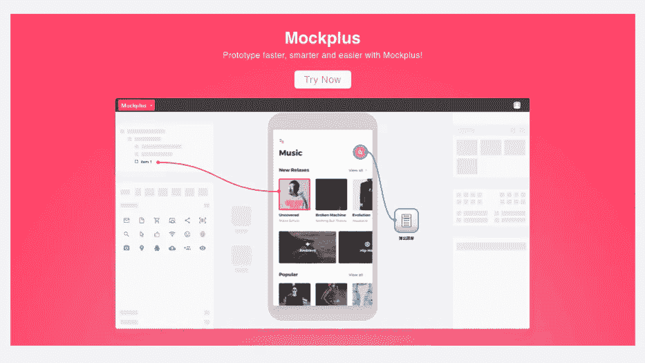
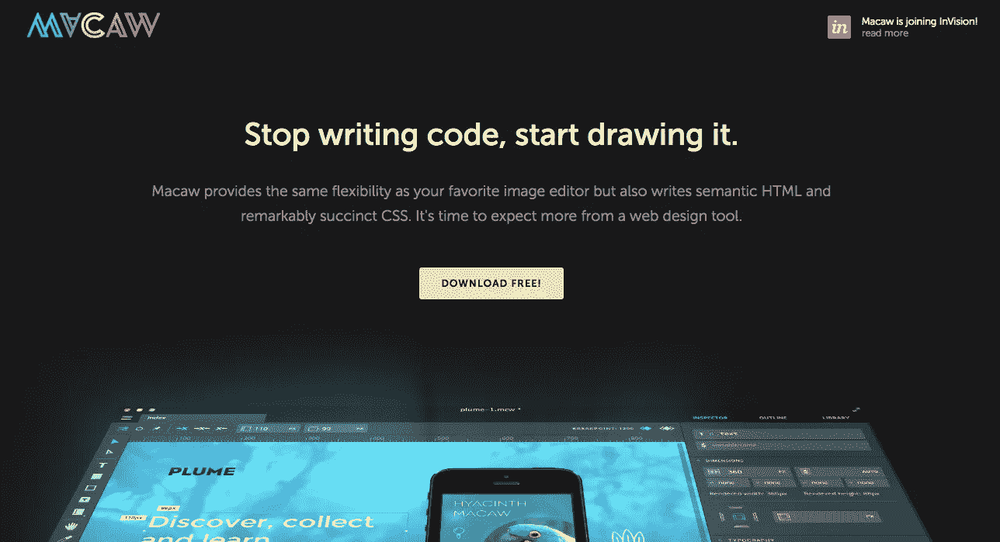
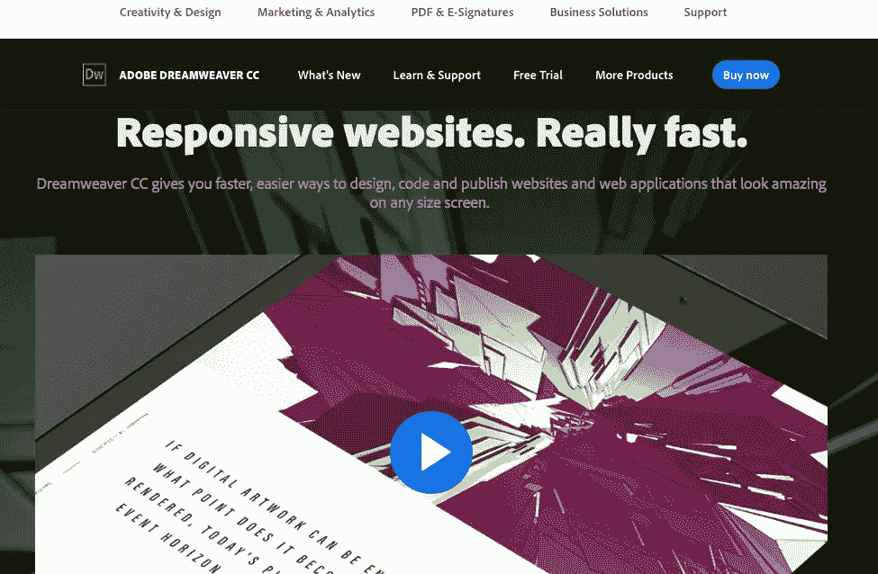
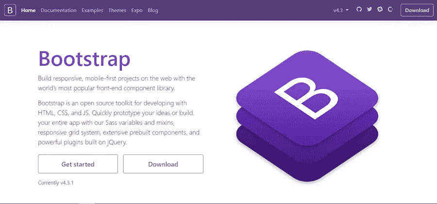

# 网站开发者的 10 款最佳网站开发软件

> 原文：<https://javascript.plainenglish.io/10-best-web-development-software-for-web-developer-4d349f486d2a?source=collection_archive---------5----------------------->

如果你正在搜索**最好的网页开发软件**，那么你可能会对从哪里开始建立一个网站感到有点困惑。对于我们大多数人来说，建立一个网站或做任何与网络开发相关的事情都是一项令人生畏的任务。嗯，没有必要担心，因为我们可以利用技术，用正确的网站开发或设计软件来创建一个功能齐全、外观漂亮的网站。

# 1.[WordPress](https://wordpress.com/)——最流行的网站建设平台

*   易于安装和开始，包括几十个网站建设工具。
*   丰富的第三方插件，用于扩展功能的使用，灵活而强大。
*   各种网站模板和主题都可以免费使用。
*   SEO 优化，对高 SERP 友好。
*   强大的[社区支持](https://wordpress.org/)，数以千计的开发者贡献和审查 WP，安全而活跃。

# 2.一个一体化的网络原型工具

*   包括一组现成的组件(3000)和图标(200)，用于快速原型制作。
*   它提供了不少功能来提高重复网页元素和布局的设计效率，如重复器、自动数据填充、格式刷和粘贴样式。
*   预览和测试项目的最全面方式，包括导出到图像、导出到演示包、发布到在线和离线 HTML、使用二维码在移动应用程序上查看等。
*   思维导图和 UI 流设计模式可以帮助快速反映设计思路和布局项目结构。

# 3.Macaw——对精通代码的人来说最好的网页设计软件

*   将您的设计元素保存在您自己的库中以备后用。
*   Alchemy 工具可以将你的设计元素转换成 CSS 或 HTML 代码。
*   有一个实时布局引擎，让您可以轻松操纵您的设计元素。
*   您的整个网站将针对所有设备进行优化。

# 4.Weebly——新手和专业设计师中最简单的网站构建者

*   超过 40 种布局设计，包括网站地图和作品集，帮助您在网页设计和开发方面大放异彩。
*   大量的信息按钮，弹出窗口，列表和电子邮件序列，以照顾好你的工作流程。
*   在应用程序上可用的响应模板/主题和流行模板/主题之间轻松切换。

# 5. [Adobe Dreamweaver](https://www.adobe.com/sea/products/dreamweaver.html) —最值得信赖的 web 开发工具之一

*   它提供了一个自适应网格。
*   它可以让你编写和编辑任何代码，包括 JavaScript，HTML，CSS 和 XTL。
*   它的 WYSIWYG 界面可以让你在创建时查看最终结果。

# 6. [Bootstrap](https://getbootstrap.com/) —世界上最流行的 HTML、CSS 和 JS 库

*   一个很棒的[免费引导表单模板示例库&可用](https://www.mockplus.com/blog/post/bootstrap-form-template)，包括定制组件、框架、导航条和实验。
*   它是用缺省的引导组件和实用程序构建的，几乎不需要定制。
*   提供团队功能和多种支持选项。

# 7. [Codepen](https://codepen.io/) —最好的在线代码编辑器和开源学习环境

*   构建和测试编辑器允许您使用多种方法查看和测试代码。
*   帮助开发人员和设计人员更好地理解网站是如何构建的以及代码是如何工作的。
*   寻找灵感，与前端社区分享作品。

# 8.[MAMP](https://www.mamp.info/en/)—MAC OS 和 Windows 的本地 web 开发解决方案

*   使专业 web 开发人员能够轻松管理开发环境。
*   模拟真实的测试环境，通过打开本地邮件服务器来测试 PHP 脚本。
*   用于本地调试的强大配置。
*   学习曲线低。

# 9. [Github](https://github.com/) —全球领先的软件开发平台

*   内置的审查工具提供了无缝的代码审查。
*   项目管理工具有助于识别、分配和跟踪进度。
*   大约 600 万个托管的 Git 存储库。
*   通过协作功能与 4000 万志趣相投的开发者和项目建立联系。

# 10. [Photoshop](https://www.photoshop.com/) —最佳照片、图像和设计编辑软件

*   创建和增强照片、插图和 3D 作品。
*   设计网站和移动应用程序。
*   编辑视频模拟现实生活中的绘画等等。

## 进一步阅读

 [## 代码文档被破坏了——但是我认为 Swimm 可能已经修复了它

### 传统的文档管理系统让软件开发人员失望了，是时候来点新的了。游泳吗…

javascript.plainenglish.io](/code-documentation-is-broken-but-i-think-swimm-may-have-fixed-it-daaa7547d834) 

*更多内容请看*[***plain English . io***](https://plainenglish.io/)*。报名参加我们的* [***免费周报***](http://newsletter.plainenglish.io/) *。关注我们关于*[***Twitter***](https://twitter.com/inPlainEngHQ)[***LinkedIn***](https://www.linkedin.com/company/inplainenglish/)*[***YouTube***](https://www.youtube.com/channel/UCtipWUghju290NWcn8jhyAw)*[***不和***](https://discord.gg/GtDtUAvyhW) ***。*****

*****对缩放您的软件启动感兴趣*** *？检查* [***电路***](https://circuit.ooo/?utm=publication-post-cta) *。***