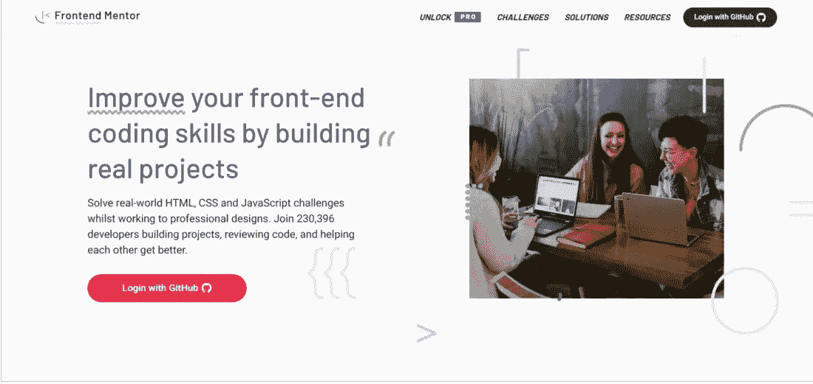
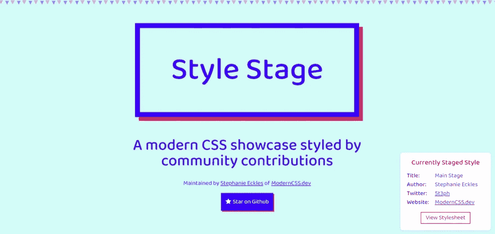

# 实践和完善前端开发的 10 个最佳网站

> 原文：<https://javascript.plainenglish.io/10-best-websites-for-practising-and-perfecting-front-end-development-56e382b2c0ac?source=collection_archive---------1----------------------->

10 Best Websites for Practising and Perfecting Front-End Development

学习如何编码最好通过解决现实世界的问题和参与现实世界的项目来完成。尽管理论知识很重要，但是如果没有运用它的能力，你就没有多少进步的机会。

我花了大量时间在浩瀚的互联网世界中搜索和筛选，列出了 10 个练习前端技能的最佳网站。您将通过教程强化您所学的一切，并通过使用这些网站成为一名更有能力的前端开发人员。所以让我们开始吧

# 1.Ace 前端

[链接](https://www.acefrontend.com/)

Ace Front End

准备面试时，熟能生巧。通常，前端开发人员很难找到好的面试资源。Ace 前端就是为了解决这个问题而形成的。使用 Ace 前端，您将面临完整的编码挑战，以及如何创建有效面试解决方案的全面解释。虽然你可能不是在准备面试，但你仍然可以使用这个平台。

# 2.代码战争

[链接](https://www.codewars.com/)

Codewars

有了这个平台，你可以用几种不同的语言挑战自己，不像 CSS 之战。这个平台主要关注编码挑战，而不是关注视觉效果。这个平台可以用来开发和提高你实际构建项目的技能。这是一个锻炼你解决问题能力的绝佳平台。作为前端开发者，Codewars 是一个很好的练习 JavaScript 的平台。

# 3.CSS 之战

[链接](https://cssbattle.dev/)

CSS Battles

虽然这是 CSS 特有的，但游戏化系统是继续学习的一个很好的方式，而且在一些战斗结束时，还有奖品可以赢取。

虽然上面的战斗不会告诉你如何制作网页布局，但它们肯定会帮助你掌握一些更高级的 CSS 属性。

# 4.树上小屋

[链接](https://teamtreehouse.com/)

Tree House

Treehouse 提供每月 25 美元的课程，因此你可以学习某些语言，如 JavaScript，甚至编程语言，如 PHP。除了他们的热门课程，他们还提供特定课程的跟踪，以便您可以学习特定的内容。

# 5.前端导师

[链接](https://www.frontendmentor.io/)

Front End Mentor

前端导师允许您使用现实的工作流程来练习您的前端技能。他们面临的挑战包括移动和桌面设计、资产以及帮助您入门的风格指南。我不仅为初学者，也为不断学习新事物的学习者推荐这个平台。您将使用 HTML、CSS、JavaScript、框架(如 React、Vue.js 等)，并与 API 进行交互。该平台会定期更新新的挑战，因此您可以找到一些事情来做，分享您的解决方案，并获得反馈。

# 6.Codewell

[链接](https://www.codewell.cc/)

CodeWell

Codewell 提供了真实世界的 Figma 模板，您可以使用这些模板来提高您的 HTML、CSS 和 JavaScript 技能。甚至有可能通过网站或通过他们不断增长的 Slack 社区来分享解决方案。这个平台如果你有免费账号就不会让你看到 Figma 文件，但是可能会让你查看项目资产，所以你还是可以用免费账号享受这个平台。

# 7.发展挑战

[链接](https://devchallenges.io/)

Devchallenges

该平台类似于前端导师，因为您可以根据挑战的难度定制挑战，并且可以将挑战进一步分为三组——响应型 web 开发人员、前端开发人员和全栈开发人员。作为前端开发人员，您可以专注于前两条途径，并从这些类别中设计和开发项目。每个类别包含八个项目。使用 Github 作为提交工具，并对其他贡献者的提交进行反馈也是可行的。

# 8.风格舞台

[链接](https://stylestage.dev/)

Stylestage

这个平台提供了一个基本的 HTML 文件，您可以为其重新设计样式并提交不同的样式表。指南要求您遵循可访问性规则，这样您不仅可以创建看起来很棒的项目，还可以创建一个可访问的项目。提交您的拉取请求后，如果您的提交需要更改，您将会收到通知。您继续进行这些更改，直到您的提交通过了需求，这时您的项目将会启动。在这个平台上，你将主要发展你的 CSS 技能，因为你将使用 CSS 文件。

# 9.Coderbyte

[链接](https://coderbyte.com/)

Coderbyte

该平台提供了几个免费的挑战，让你在承诺 35 美元/月的计划之前测试它的功能。Codebyte 为你提供了向 web 开发职业过渡所需的所有工具。

# 10.正面循环

[链接](https://frontloops.io/)

Frontloops

在这个平台上接受挑战需要付费。这个平台上有两类挑战，标记，帮助你提高 HTML 和 CSS 技能，元素，帮助你提高 JavaScript 技能。在这个平台上，您将发现 30 个挑战，以及 30 个代码解决方案(免费的第一个解决方案)，技术提示和建议。花费大约 19 美元就可以终身获得你选择的任何类别的挑战和资源。

感谢您阅读这篇文章。希望你学了很多新站练习前端开发，在以后的某个时候对你有用。

如果你喜欢我的内容，请看看我的博客。我撰写关于 web 开发、技术和方法的文章，以使开发人员的生活更加轻松。

快乐学习！💻 😄

*更多内容尽在*[***plain English . io***](http://plainenglish.io/)