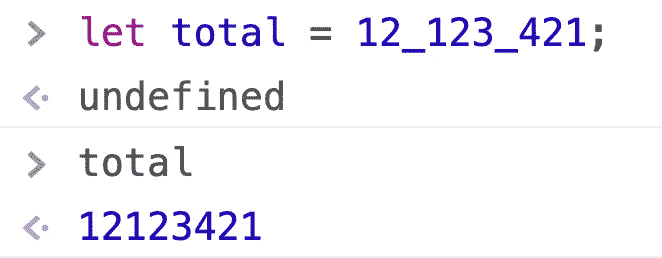

# 10 个令人困惑的打字稿符号，我希望我能早点理解

> 原文：<https://javascript.plainenglish.io/10-confusing-typescript-notations-i-wish-i-understood-earlier-d1c6f722828c?source=collection_archive---------0----------------------->

## 初学者理解 TypeScript 的一个特殊方面。


Create by bytefish

当我第一次学习 TypeScript 时，我注意到 TS 代码充满了难以理解的符号。一些符号也出现在 JavaScript 中，但是当它们出现在 TypeScript 中时，它们具有完全不同的含义。这曾经让我很困惑。

后来随着进一步的学习，我明白了这些记数法的用法，也感受到了它们的魅力。这里有 10 个符号，我当时觉得很奇怪，但现在发现非常有用。

## 目录:

```
· [Unions type: |](#019f)
· [Intersection Types: &](#7d7d)
· [Numeric Separators: _](#34a2)
· [Non-null assertion operator: !](#3058)
· [Optional notation:](#79be) [?](#79be)
  ∘ [Optional Chaining: ?.](#5a19)
  ∘ [Optional Properties: ?:](#e877)
· [Nullish coalescing operator: ??](#9eb1)
· [Private property: #](#99e0)
· [Angle brackets: <>](#a77d)
  ∘ [Type assertion](#8e31)
  ∘ [Generic types](#f35d)
· [Decorators: @](#46d3)
```

# 1.工会类型:|

在 JavaScript 中，`|`是位操作的符号:

> 按位 OR 运算符(`*|*`)在每个位位置返回一个`*1*`，其中一个或两个操作数的对应位为`*1*`

例如，类似这样的 JavaScript 代码将在运行时在控制台中打印 7:

```
const a = 5;
const b = 3;console.log(a | b);
// expected output: 7
```


这是如何工作的？

因为 5 的二进制表示是`101`，3 的二进制表示是`011`。用 OR 计算对应的位，得到`111`，十进制是 7。


虽然 TypeScript 是 JavaScript 的扩展，但您也可以在 TS 代码中使用该运算符。

类型脚本代码:

```
let a: number = 5;
let b: number = 3console.log(a | b)
// 7
```

然而，在 TypeScript 中，我们也使用`|`来表示联合类型。

例如，如果变量可以是字符串或数字，我们可以这样写:


TypeScript Code

```
let val: string | number;
val = 1;
val = "hi";
```

有时一个类型只有几个可能的值，所以我们也可以用联合类型来表示它们。例如，常用的 HTTP 方法只有几种，我们可以这样定义它们:


```
type HttpMethod = "GET" | "POST" | "PATCH" | "DELETE";function *xhr*(method: HttpMethod, url: string): void {
    console.log(`${method}: ${url}`);
}
```

当我们使用上述函数时，我们可以看到 TypeScript 为我们提供的类型检查:


TS 会提醒我们`xhr`方法不支持`Get`作为参数，这有助于我们避免许多可能的类型错误。

让我们看看另一个奇怪的代码:


```
type BooleanType = 0 | 1;let flag: BooleanType;flag = (0 | 1) as BooleanType;console.log(flag);
```

我们如何理解这个代码？

首先，我们定义一个 BooleanType。该类型的可能值为 0 或 1，符号`|`代表联合类型。然后我们声明一个 BooleanType 类型的变量 flag。

然后我们把`0 | 1`的值赋给`flag`，这里的`|`是按位运算符。为了确保类型兼容性，我们使用`as`操作符强制`0 | 1`的结果为 BooleanType。

嗯，上面代码运行的结果是 1。

当然，这段代码实际上没有任何意义，但我这样写是为了向您展示`|`的两种用法。嗯，我似乎把事情变得更奇怪了…

# 2.交叉点类型:&

与`|`类似，在 JavaScript 中，`&`也是位操作的符号:

> 按位 AND 运算符(`*&*`)在两个操作数的相应位为`*1*` s 的每个位位置返回一个`*1*`

在 TypeScript 中，`&`也可以用来表示类型交集。
例如，有两个接口:

```
interface Runnable{
    run(): void;
}interface Swimmable{
    swim(): void;
}
```

然后我们想定义一个新的类型，鹅，鹅既能跑又能游泳，那么我们怎么做呢？

我们只需要用`&`将两种类型结合在一起:

```
type Goose = Runnable & Swimmable;
```

以下是 TS 代码:


如果参数不满足两个接口，编译器将报告一个错误。


# 3.数字分隔符:_

这个符号是用来分隔数字的。这实际上是一个 JavaScript 语法，但我发现它很有用，所以我就把它留在这里。

当我们写一个大的数字时，我们可能会这样写:

```
let total = 12123421;
```

此时，由于数字太长，读码的人往往要花几秒钟才能数清数字的长度。不使用数字分隔符，我们可以写:



用`_`可以快速读出数字:121230421。`_`用来分隔数字，没有实际意义。这样的语法糖果可以帮助我们写出更容易阅读的大数字。

# 4.非空断言运算符:！

在 JavaScript 中，`!`是用于反转布尔值的逻辑运算符。

> 逻辑 NOT ( `*!*`)运算符(逻辑补码、否定)将真转化为假，反之亦然。

以下是 JavaScript 代码:

```
!false // return true!true // return falselet flag = false;
flag = !flag;
console.log(flag); // true
```


Chrome Console

在 TypeScript 中，您仍然可以将它用作逻辑运算符。然而，这种符号还有一个额外的用途。

以这样的类型脚本代码为例:


在上面的代码中，`reverse`函数接受一个字符串作为参数。`maybeString`的类型是字符串和 null 的联合类型。如果我们直接使用`revere(maybeString)`，编译器会报错。

但如果仔细看代码，我们知道`Math.random()`总是返回一个从 0 到 1 的数，所以在执行这个三元表达式的时候，`maybeString`一定是一个字符串，而不是 null。

我们可以 100%确定`revere(maybeString)`是安全的，而编译器不能。在这种情况下，我们可以使用非空断言操作符:`!`


您可以在自己的编译器中测试它，因此代码应该不会报告错误。

这个符号告诉编译器:以一个程序员的尊严，我肯定变量不会为空(也不会未定义)。

这种符号也可以用于函数调用。


在上面的函数中，如果我们直接调用`getRandomString()`，编译器会警告我们该参数可能未定义。但是，如果您非常确定参数不会未定义，那么您可以使用非空断言操作符来断言它。

需要注意的是，编译器的提示是合理的。使用`!`时，需要确保操作安全。

# 5.可选符号:`?`

该符号有两个衍生用途:`?.`和`?:`

## 可选链接:？。

有时我们不确定一个对象是否具有某种属性，这会使我们的代码难以编写。

下面是一段 JavaScript 代码:

```
function *getCity*(user){
    return user.location.city
}
```

如果参数没有位置字段，将在运行时导致错误:


如果我们想用 JavaScript 编写更健壮的代码，我们只能这样做:

```
function *getCity*(user){
    return user.location ? user.location.city : undefined
}
```

在尝试获取`location.city`之前，检查一下`user.location`属性是否存在。


但是这种写法有点麻烦，不那么方便。TS 为我们提供了句法糖:`?.`

```
function *getCity*(user: any){
    return user.location?.city
}
*getCity*({name: 'Jon'})
```

如果用 ts-node 执行上面的代码，就没问题了。如果`user.location`为空或未定义，它将停止访问其 city 属性。这确保了我们的代码是安全的。

如果我们使用`tsc`编译上面的代码，结果如下所示:

```
function getCity(user) {
    var _a;
    return (_a = user.location) === null || _a === void 0 ? void 0 : _a.city;
}
```

在上面的代码中，`void 0`等于`undefined`。原因可以看[关于栈溢出](https://stackoverflow.com/questions/7452341/what-does-void-0-mean)的回答。如果`user.location`等于 null 或 undefined，则返回 undefined，而不是获取`location.city`属性。

这种符号也可以用于函数调用。下面是一段 JavaScript 代码:

```
function run(obj){
    obj.run()
}
```

这个函数和上一个有同样的缺点，就是我们不确定`obj`是否有 run 方法，如果没有，运行时会报错。


我们可以编写这样的打字稿代码:

```
function *run*(obj: any){
    obj.run?.()
}*run*({})
```

这个代码和以前一样。如果`obj.run`不存在，则不调用该方法。

## 可选属性:？：

除了在尝试获取属性时使用可选操作符之外，我们还可以在定义属性时使用它们。

例如，以下代码将在编译时引发错误:

```
interface User{
    name: string;
    email: string;
}let user1: User = {
    name: "Jon",
};
```


这是因为编译器期望`user1`有两个属性:name 和 email。

但是在实际项目中，我们可能认为姓名是必需的，电子邮件是可选的。在这种情况下，我们可以编写这样的代码:


我们给它添加了一个可选符号`?`，告诉编译器这个属性是可选的。编译上述代码后，不会返回错误。

# 6.无效合并运算符:？？

`??`:如果左操作数为空或未定义，则返回右操作数，否则返回左操作数。

```
let foo = null ?? "default string";
console.log(foo); // default stringlet bar = 0 ?? "default string";
console.log(bar); // 0let value = "value" ?? "default string";
console.log(value); // value
```


# 7.私有财产:#

类的私有属性是一个非常常见的需求，我们可以用`#`符号来声明。

```
class Person{
    #name: string; constructor(name: string) {
        this.#name = name
    } greet(){
        console.log(`Hello, I am ${this.#name}`)
    }
}
```

如果一个字段以`#`开头，那么你不能在类方法之外访问这个属性:


你们中的一些人可能也知道`private`关键字也可以用来声明私有字段，那么有什么区别呢？

答案是由`private`关键字声明的私有属性实际上存在于实例中，我们可以强制访问它们。由`#`声明的私有属性不直接存储在实例中。


我们可以先将对象转换为`any`类型，然后访问由`private`定义的私有字段，这对于由`#`定义的私有字段是不可能的。

# 8.尖括号:<>

这种符号用在两个地方:一个用于类型断言，一个用于泛型类型。

## 类型断言

以下代码在编译时会产生错误:


因为编译器认为`someValue`要么是字符串，要么是数字，所以它与`doubleString`参数类型不匹配。但是当我们分析代码的时候，我们知道`someValue`一定是一个字符串。然后我们可以使用类型断言告诉编译器变量必须是字符串。


这次编译上面的代码不会返回错误。

但是，TSLint 不建议这样写；相反，它建议使用`as`:


这两种语法的效果是一样的:它们断言变量的类型。

# 9.泛型类型

使用 TypeScript 给我们一个类型系统，帮助我们编写更安全的代码。但是这也牺牲了 JavaScript 的灵活性。

例如，如果我们要写一个`add`函数，它需要两个参数。如果参数是字符串，则将它们连接在一起；如果参数是数字，则将它们相加:

在 JavaScript 中，这段代码非常简单:

```
function add(a, b){
  return a + b
}
```

但是，在 TypeScript 中很难实现。你不能这样写:

```
function *add*(a: string | number, b: string | number) {
    return a + b;
}
```

因为不能直接添加这样的联合类型，所以编译上面的代码将会返回一个错误。

或者你可以写:

```
function *addString*(a: string, b: string) {
    return a + b;
}function *addNumber*(a: number, b: number) {
    return a + b;
}
```

这样写是可以的，但是很麻烦。

如您所见，在上述两个函数中，它们具有相同的主体。唯一的区别是一个处理字符串参数，另一个处理数字参数。

我们也可以把类型看作是需要传递的参数。在这种情况下，我们可以写:

```
function *add*<T>(a: T, b: T){
    return a as any + b
}
```

上面的代码意味着`add`函数还不确定它需要处理什么类型的数据，所以我们在使用它的时候可以将类型作为参数传递。

像这样:


这样，我们的`add`函数可以处理字符串和数字，甚至 BigInt。

泛型让我享受到了类型系统的安全性，又不失 JavaScript 的灵活性。

# 10.装饰者:@

假设我们有这样一个函数:

```
function *hello*(name) {
    console.log("Hello " + name)
}
```

我们每次调用`hello`都想打印一个日志，那怎么办呢？

在 JavaScript 中，没有办法直接做到这一点，但是我们可以用装饰函数包装`hello`:


结果是:

```
Start execute function "hello" at 2021-03-17T04:15:47.724Z
Hello Jack
```

但是在 JavaScript 中，这并不优雅。TS 提供了一个装饰语法来更好地实现这一点。

例如，下面是我们的朋友类:

```
class Friend {
    name: string;
    constructor(name: string) {
        this.name = name
    } hello() {
        console.log(this.name + " says: Hello")
    }
}
```

我们想在调用`hello`方法时打印一个日志，所以我们可以指定一个装饰函数`logging`来装饰方法`hello`。

如果要定义一个装饰类方法的装饰器，装饰器函数必须采用以下格式:

```
function *logging*(target: any, propertyKey: string,
                 descriptor: PropertyDescriptor) {
}
```


其中`target`是将来调用方法的实例对象，`propertyKey`是对应方法的属性名，`descriptor`是属性描述符。这是装饰者必须遵循的固定语法。

然后我们就可以在日志方法中写具体的逻辑了。


编译并运行上述代码后，控制台应该会显示如下内容:

```
Start execute function "hello" at 2021-03-17T01:31:11.607Z
Jon says: Hello
```

装饰者在不修改方法本身的情况下向现有方法添加新功能。想象一下，如果我们需要向许多类方法添加日志功能，我们可以简单地在每个类方法前面添加一个装饰器，而不改变方法本身。

## 装饰工厂

以前的日志装饰器仅限于打印日期消息。事实上，我们可以利用装饰工厂，批量生产不同特点的装饰工。

像这样:


在上面的函数中，每次调用 loggingFactory 时，它都返回不同的 decorator，以便可以定制功能。

下面是它的使用方法:


编译并执行上述代码，结果如下:

```
Start execute function "hello" at 2021-03-17T01:49:05.087Z
message: executing Person#hello
Jon says: Hello
```

# 结论

我们做到了！我希望这有助于澄清 TypeScript 中的一些特性以及随之而来的一些复杂性。一定要在评论里让我知道你的想法。谢谢！