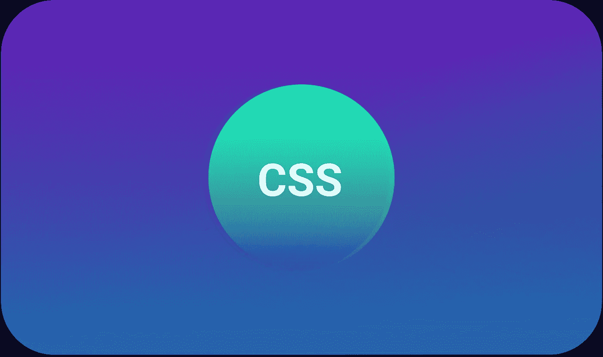
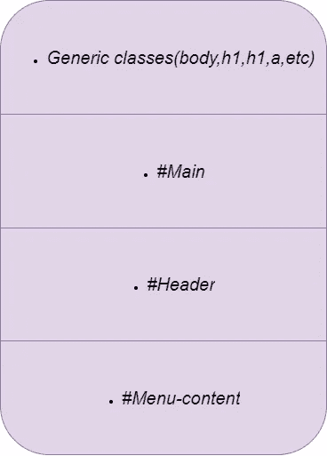
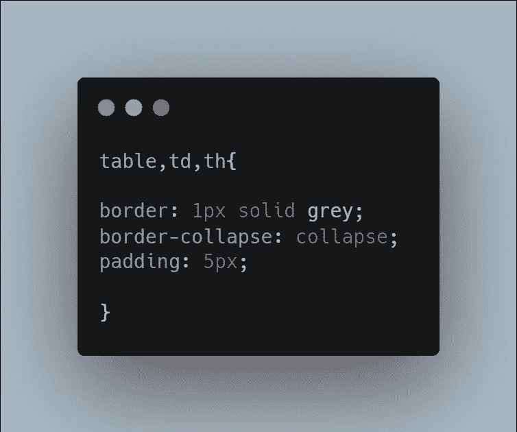

# 初学者的 10 个 CSS 最佳实践

> 原文：<https://javascript.plainenglish.io/10-css-best-practices-for-beginners-81ac8b471187?source=collection_archive---------15----------------------->

CSS 初学者的最佳实践

## **1。使其可读**

开发人员犯的最大错误之一是没有一个可读的 CSS 结构。大多数时候，人们会忽略这一点，但是你的 CSS 代码应该总是具有很好的可读性，因为这样可以更容易地维护你的代码以供将来使用，因为你可以很容易地找到元素。

*   同样，当你在团队中工作时，它会变得更有帮助；其他人也更容易理解代码。

## **2。保持一致**

开发人员在构建过程中会忘记保持 CSS 代码的一致性和可读性。在你做项目的时候，你应该在 CSS 中开发你自己的**【子语言】**。

*   ***比如*** 你可以在任何时候做某个主题的时候创建某个类名，每次都用同一个名字。
*   您可以在您的 id 和类名中使用下划线和破折号。有自己的标准会让你精通。

## **3。用自顶向下的结构组织样式表**

在你的代码中使用自顶向下的结构，因为它允许你快速容易地找到你的代码的任何部分。在你的代码中使用一个**自顶向下的**结构，这样它可以显示所有出现在你代码中的样式。

***例如；***

*   它还帮助您跟踪代码中的注释。

## **4。组合元素**

代码中的一些元素共享一个共同的风格，而不是为每个元素编写代码，只是将这些元素组合起来，因为这将减少代码。

***例如；***

## **5。按字母顺序排列您的属性**

这项技术有助于快速扫描。但是为了获得更好的可读性而降低了速度。

## 6。使用 CSS 压缩器

CSS 压缩器通过移除**换行符、空白、**和组合元素来帮助减小文件大小。这种组合减小了文件大小，提高了加载速度。

*   CSS Minifier 和 HTML Compressor 是缩小 CSS 的绝佳工具。
*   值得注意的是，使用压缩器提高了加载速度，但降低了代码的可读性。

## **7。少用黑客**

完全避免使用浏览器专用工具。确保代码在所有浏览器上保持一致有着巨大的压力，但是使用 hacks 使得将来维护代码变得困难。另外，**重置**将消除浏览器之间的所有不规则性。

## **8。少用绝对定位**

绝对定位是 CSS 的一个有用的方面，它允许你使用精确的像素来定义一个元素在页面上的确切位置。**然而，**这个功能不考虑页面上的任何其他元素，在布局中运行多个绝对定位会很麻烦。

## **9。验证您的代码**

验证 HTML 或 CSS 代码有助于确定代码中的错误。在处理 CSS 的时候，如果你的代码看起来不对劲，试着使用标记和 CSS 验证器，看看会弹出什么样的错误。然后，您可以删除这些错误，使您的代码正常工作。

*   如果您根据验证器给出的错误进行修改，您的代码将变得更具可读性。

## 10。使用文本转换

CSS 的这个特性非常有用，可以让你标准化网站上的文本格式。

例如，如果您想创建一个只包含小写字母的标题，只需将 ***文本转换*** 属性添加到**标题**样式中。

*   现在页眉部分的所有字母默认为 ***小写*** 。

 [## 成为终端忍者你应该知道的 15 个终端命令

### 面向高效开发人员的终端命令

javascript.plainenglish.io](/15-commands-that-will-make-you-a-terminal-ninja-403399ab55b6)  [## 给 Web 开发人员的 9 个专业 CSS 技巧

### 你需要知道的 CSS 技巧

javascript.plainenglish.io](/9-pro-css-tips-for-web-developers-508b8302ff6f)  [## 3 个隐藏的 CSS 功能

### 对前端开发者有用的 CSS 特性

javascript.plainenglish.io](/3-hidden-features-of-css-566e8c27597f) 

*更多内容请看*[***plain English . io***](http://plainenglish.io/)