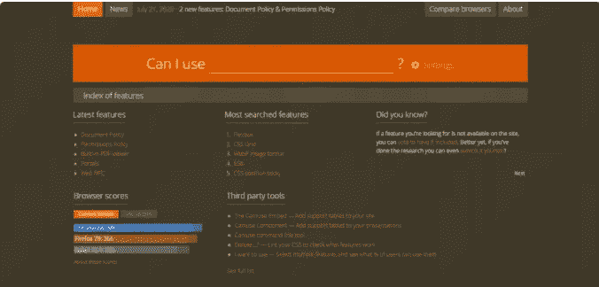
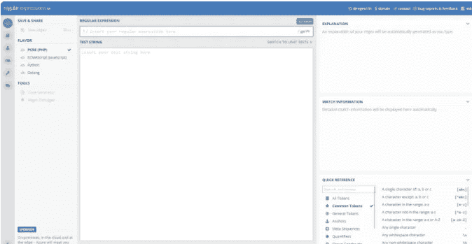
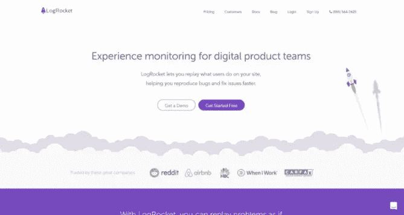
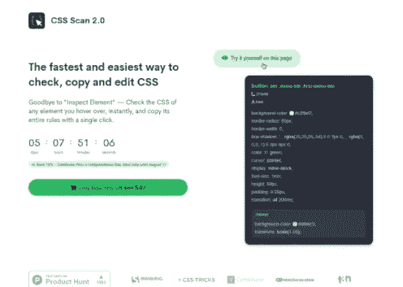
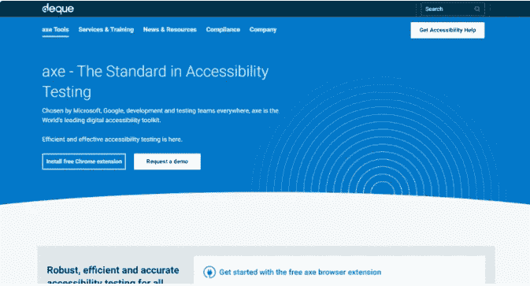
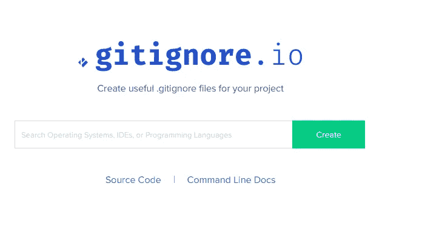
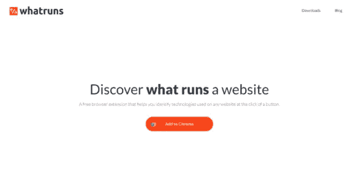

# 你可能需要使用的 10 个开发工具

> 原文：<https://javascript.plainenglish.io/10-developer-tools-that-you-probably-need-to-use-1772982d3ad7?source=collection_archive---------1----------------------->

## 有用的开发工具，让您的生活更轻松。

Image created with ❤️️ By [author](https://mehdiouss315.medium.com/).

# 介绍

作为开发人员，当我们开发时，我们每天都有许多任务要做。这就是为什么我们肯定需要一些工具来使我们的生活更轻松，并帮助我们提高生产力。网上有很多专门为开发者开发的工具，对我们有很多好处。

在本文中，我们将为您列出一些您可能不知道的极其有用的开发人员工具。让我们开始吧。

# 1.我能用吗？

“我能用吗？”是一个很棒的网站，它提供了最新的浏览器支持表，用于支持移动和桌面 web 浏览器上的前端 web 技术。

因此，如果你想检查某个特性是否被所有浏览器支持，“我可以使用吗？”是你最好的选择。您还可以测试您的网站在 2000 多种真实浏览器和设备上的兼容性。

Can I Use?

这里有[网站](https://caniuse.com/)如果你想去看看。

# 2.正则表达式 101

基于 PCRE 的免费正则表达式调试器，具有实时解释、错误检测和突出显示功能。这适用于 PHP、JavaScript、Python 和 Golang。

RegEx 101.

你可以点击查看[网站。](https://regex101.com/)

# 3.较美丽

格式化的自以为是的代码，支持多种语言，与大多数编辑器集成，选项很少。这是一个非常有用的工具，可以让你的代码格式良好。

Prettier.

如果你想看的话，这是他们的[网站](https://prettier.io/)。

# 4.原木火箭

LogRocket 让你重放用户在你的网站上做了什么，帮助你更快地重现错误和修复问题。

Log Rocket.

你可以点击查看更多细节。

# 5.CSS 扫描

这个工具可以帮助你在悬停时检查任何元素的 CSS，而无需使用开发工具中的“检查元素”。

您还可以通过单击来复制元素的整个 CSS 规则。

CSS Scan.

从[这里](https://getcssscan.com/)进入网站了解更多详情。

# 6.用斧砍

易访问性测试的标准。被微软、谷歌、开发和测试团队所选择，axe 是世界领先的数字可访问性工具包。

Axe.

这是他们的[网站](https://www.deque.com/axe/)如果你想看看的话。

# 7.响应性应用程序

该工具可帮助您以 5 倍的速度开发响应迅速的 web 应用。它是所有前端开发人员必备的 DevTool，因为它会让你的工作变得更简单。

Responsively.

从[此处](https://responsively.app/)进入网站了解更多详情。

# 8." gitignore.io "

这是一个很好的工具，可以很容易地为你的项目创建有用的“`.gitignore`”文件。

gitignore.io

有兴趣的可以在这里[看看。](https://www.toptal.com/developers/gitignore)

# 9.哨兵

sentry 的应用监控平台帮助每个开发人员诊断、修复和优化他们代码的性能。真的很有用。

Sentry.

如果你想了解更多细节，这里是他们的[网站](https://sentry.io/welcome/)。

# 10.什么运行

WhatRuns 是一个免费的浏览器扩展，只需点击一个按钮，就可以帮助你识别任何网站上使用的技术。如果你知道的话，它是 Wappalyzer 的一个很好的替代品。

WhatRuns.

这里是[网站](https://www.whatruns.com/)去看看吧。

# 结论

所有这些工具都很棒，在我看来，它们将帮助你完成一项有用的任务，使你作为一名开发人员的事情变得更容易。

感谢您查看这篇文章，希望您觉得有用。

# 更多阅读

 [## 你可能不知道的 4 个有用的 HTML5 特性

### 非常有用的 HTML 特性和例子

medium.com](https://medium.com/javascript-in-plain-english/4-useful-html5-features-you-probably-dont-know-a4be822378d0)