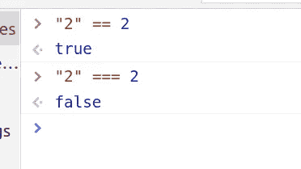
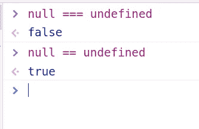

# 10 个入门级 React 面试问题

> 原文：<https://javascript.plainenglish.io/10-entry-level-react-interview-questions-5a8ea74e2130?source=collection_archive---------0----------------------->


面试是获得一份工作的直接途径，其方式比你想象的要多。你可能会问不止一种方法？是啊！面试不仅仅是让你展示你的技能和你知道的东西，也是一个很好的方式来看看你不知道什么，这个行业的人在要求什么，你应该更专注于什么。

在这一部分，我将讨论 5 个 React 和 5 个 JavaScript 问题。

在这篇文章中，我想给你 10 个问题和相对简短但全面的答案，供入门级开发者参考，我个人认为这是最重要的问题之一。还是那句话，这些只是我的看法，所以要有所保留。

## 1.什么是虚拟 DOM，它是如何工作的？

到目前为止，这个问题被问得最多。我确实有一篇关于 React 如何工作的文章，其中我深入讨论了虚拟 DOM[https://JavaScript . plain English . io/how-React-works-under-the-hood-277356 c 95 E3 d](/how-react-works-under-the-hood-277356c95e3d)，但是为了更简短的回答，你可以这样说:虚拟 DOM 是 DOM 的虚拟表示，其中更新是轻量级的。它的工作方式是将其状态与更新前拍摄的虚拟 DOM 快照进行比较。比较新旧版本，React 精确地计算出哪些对象发生了变化，并只更新那些对象。这个过程叫做 diffing。

总而言之，下面是 DOM 更新时 React 中发生的步骤:

1.  它拍摄当前状态的快照。
2.  虚拟 DOM 得到更新
3.  它将当前状态与之前拍摄的快照进行比较
4.  React 计算出哪些对象发生了变化
5.  反应过来变化的*只有那个*物体
6.  真正的 DOM 现在得到了更新。

## 2.说出一些最重要的生命周期挂钩及其目的。(这是新 React 挂钩的替代方案)

让我们按顺序概括一下。我将突出我认为最重要和最常用的。

**关于渲染:**

1.  构造器
2.  静态 getDerivedStateFromProps—
    use effect(()=>{ }，[props1，props2])
3.  提供；给予
4.  *componentidmount—use effect(()=>{ }，[])*

**重新渲染时:**

1.  静态 getDerivedStateFromProps—
    use effect(()=>{ }，[props1，props2])
2.  shouldComponentUpdate()—use memo()
3.  提供；给予
4.  getsnapshotbeforupdate()-自定义挂钩以保持以前的状态
5.  componentDidUpdate—use effect(()= > { })

**卸载:**

ComponentWillUnmount—use effect(()= > return { }，[])

## 3.为什么我们在 React 中使用箭头函数，它们能解决什么问题？

*这个*关键字在箭头函数中的工作方式不同。它们不绑定自己的 *this，*相反，它们从父作用域继承一个，这被称为“词法作用域”。如果我们不使用箭头函数，我们需要将这个绑定到父节点，这通常是在构造函数中完成的。

```
import React from 'react';
class MyComponent extends React.Component {
  constructor(props) {
    super(props)
    this.clickHandler = this.clickHandler.bind(this);
  }

  clickHandler() {
    console.log( this )
  }

  render() {
    return <button onClick={this.clickHandler}>Click Me</button>
  }
}import React from 'react';
class MyComponent extends React.Component {
  constructor(props) {
    super(props)
  }

  clickHandler = () => {
    console.log( this )
  }

  render() {
    return <button onClick={this.clickHandler}>Click Me</button>
  }
}
```

使用箭头函数可读性更强，值得推荐。

## 4.React 中的键是什么，我们为什么需要它们？

简而言之，密钥用于 React for diffing 算法。在键的帮助下，React 可以判断哪个 DOM 节点发生了变化，并只更新那个节点。当映射数组时，它们是必不可少的。
`<ul>
<li>New York</li>
<li>London</li>
</ul>`

`<ul>
<li>New York</li>
<li>London</li>
<li>Tbilisi</li>
</ul>`

在这种情况下，因为我们在数组的末尾插入了一个新元素，所以它会很好地工作，因为 React 只是遍历列表，并在发现差异时生成一个变异。请记住，React 在更新之前会拍摄快照，因此它会查看以前的列表。

但是如果我们在数组的开头插入一个新元素会发生什么呢？
`<ul>
<li>New York</li>
<li>London</li>
</ul>`

`<ul>
<li>Tbilisi</li>
<li>New York</li>
<li>London</li>
</ul>`

React 将在开头插入城市 Tbilisi，但它还会变异其他所有元素，因为它不知道它们是相同的。

这就是钥匙来救援的地方。使用键，React 可以将原始列表与新列表进行匹配，并且只更新必要的元素。
这就是为什么总是建议对键使用唯一的 id。

## 5.为什么应该使用 React 而不是真正的 JavaScript 框架，比如 Angular？

与 Angular 或 Vue 不同，React 只是一个库，当然有它的利弊。关注优点:

React 更加轻量级，允许创建动态应用程序。此外，由于 React 基本上是带有一些 JSX 的 JS，因此更容易上手。
使用 VDOM，使 web 应用程序执行速度更快。

React 使用单向数据流，这意味着数据从上到下流动。这使得调试错误更加容易。

chrome 有许多扩展，使得 React 应用程序的工作和调试更加容易。下面是我最喜欢的三个:组件、Redux 和 React 上下文。还有其他的，但是这些是我在几乎每个应用程序中使用的主要工具。

因为没有 JavaScript 就没有 React，所以你肯定会在面试中遇到一些 JavaScript 问题。以下是其中的一些。

## 6.JavaScript 中有哪些不同的数据类型？

**原始数据类型:**
undefined —未定义类型
Boolean —布尔类型
Number —数字类型
String —字符串类型
BigIng—bigint 类型
Symbol —符号类型
null —对象类型

还有我们应该提到的非原始数据类型，如对象、数组、映射、集合。

## 7.var 和 let 有什么区别？

`var`大多用在 ES6 推出之前。var 和 let 的主要区别在于作用域规则。由`var`关键字声明的变量的作用域是直接函数体(因此是函数作用域),而`let`变量的作用域是直接*包围由`{ }`表示的*块(因此是块作用域)。

将`let`关键字引入到语言中的原因是函数作用域令人困惑，并且是 JavaScript 中错误的主要来源之一。

## 8.“==”和“===”有什么区别？

==只比较值，as ===也比较值和类型。



## 9.**空**和**未定义**有什么区别？

它们都代表空值，但区别在于当你定义了一个变量但没有给它赋值时，它会自动变成未定义的，但对于 null，你必须给它赋值。另一个区别是，正如我们在数据类型问题中讨论的，未定义的类型是未定义的，而空的类型是对象。

回到我们的“==”和“===”答案，我们肯定知道，因为 null 和 undefined 是不同的类型，它们严格来说并不相等，但是让你吃惊的是，它们大致相等。



## 10.异步是什么意思？

正常情况下，一个给定程序的代码直接运行，一次只发生一件事。如果一个函数依赖于另一个函数的结果，它必须等待另一个函数完成并返回，在此之前，从用户的角度来看，整个程序实际上是停止的。

异步技术非常有用，尤其是在 web 编程中。当 web 应用程序在浏览器中运行时，它会执行大量代码，而不会将控制权返回给浏览器，浏览器可能看起来像是被冻结了。这叫做**阻挡**；浏览器被阻止继续处理用户输入和执行其他任务，直到 web 应用程序返回对处理器的控制。

异步通过不等待其他操作完成来解决这个问题。想象一下:你正在做意大利面。你把水放在炉子上，等着水开始沸腾。这并不意味着在那之前你不能做任何事，对吗？你可以开始准备调料，摆放盘子，或者做任何你想做的事情。水开始沸腾后，你回去把意大利面放进去。这就是异步函数的工作方式。