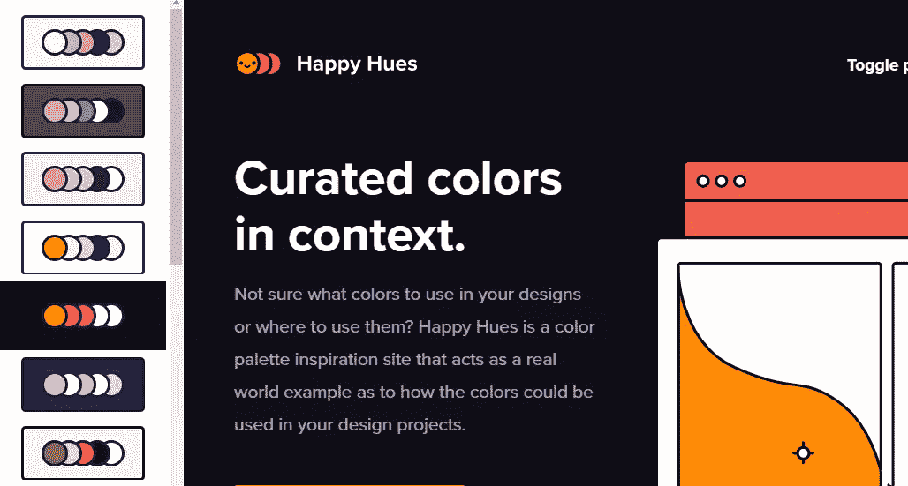
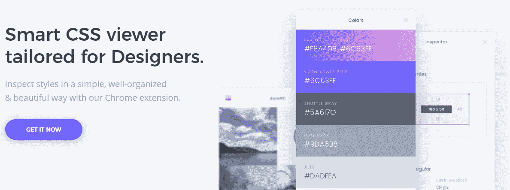
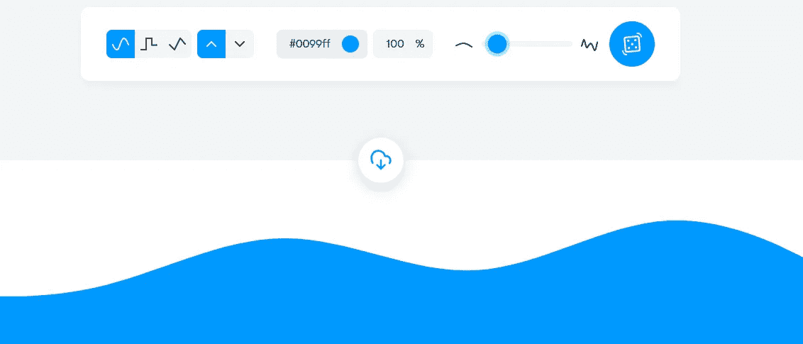
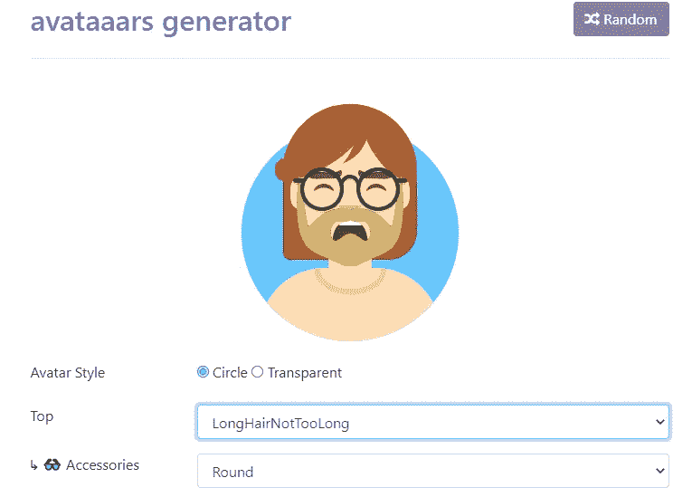
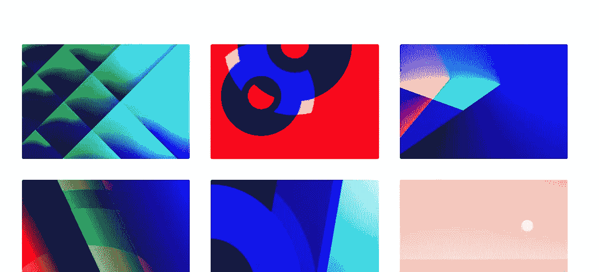
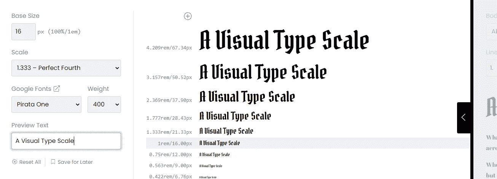
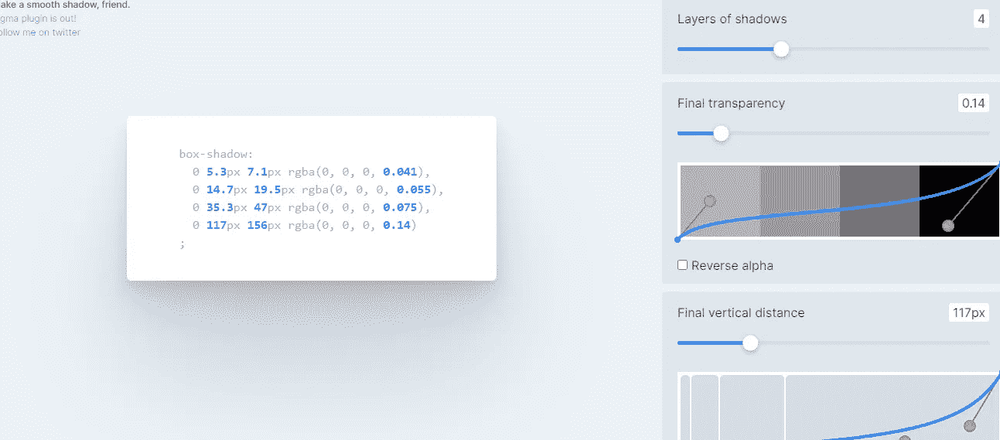
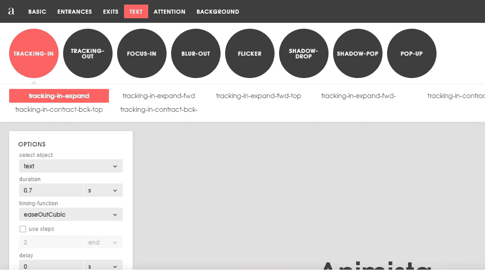
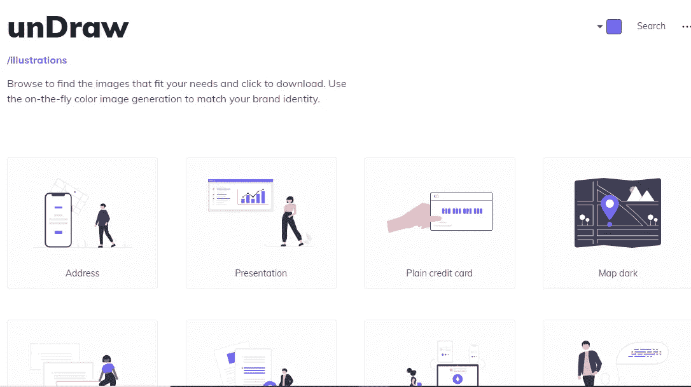
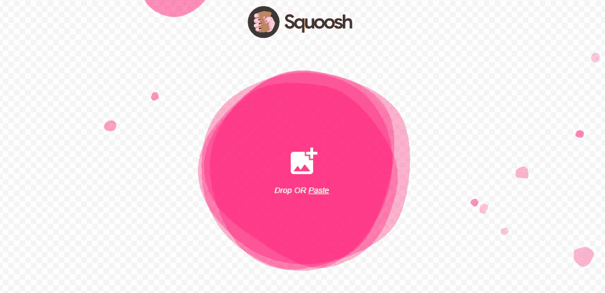

# 构建用户界面时节省时间的 10 个免费工具

> 原文：<https://javascript.plainenglish.io/10-free-tools-to-save-time-when-building-user-interfaces-e8406c58ba6c?source=collection_archive---------1----------------------->

## 为你的项目构建用户界面时帮助你的神奇工具。

Photo by [Ryland Dean](https://unsplash.com/@ryland_dean?utm_source=medium&utm_medium=referral) on [Unsplash](https://unsplash.com?utm_source=medium&utm_medium=referral)

# 介绍

作为一名网站开发人员，当你建立网站时，你会发现自己要处理大量的任务。构建用户界面是需要时间的挑战性任务之一。幸运的是，网上有很多工具可以帮助你节省时间，更快地构建令人惊叹的用户界面。

这就是为什么在这篇文章中，我们会给你一些有用的免费工具，可以帮助你做到这一点。所以让我们开始吧。

# 1.快乐的色调

[快乐色调](https://www.happyhues.co/)是一个神奇的工具，可以让你为你的网站选择令人敬畏的调色板。除此之外，他们给你一个真实世界的例子，告诉你如何在你的项目中使用这些颜色。

因此，如果你不擅长为你的网站选择颜色，这是一个很好的工具。有一些设计灵感也是有用的。

Capture by the author from [Happy Hues](https://www.happyhues.co/).

# 2.CSS 窥视者

[CSS Peeper](https://csspeeper.com/) 是一个非常有用的 chrome 扩展，允许你在浏览器中检查任何网站的风格。所以你可以得到颜色，字体，等等。您还可以使用这个惊人的扩展生成网页上任何元素的 CSS。

Capture by the author from [CSS Peeper](https://csspeeper.com/).

# 3.获得波浪

[Get Waves](https://getwaves.io/) 是一款令人惊叹的网络应用，它让你能够为你的项目生成令人敬畏的 SVG waves。也可以在 app 上编辑，随心所欲地编辑和造波。

Capture by the author from [Get Waves](https://getwaves.io/).

# 4.头像生成器

头像生成器是一个很棒的工具，可以让你为你的项目生成很酷的自定义头像。为了制作一个你喜欢的自定义个人头像，有很多风格可供选择。

你也可以随机生成头像。除此之外，它们还能让你导出不同格式的头像，比如 SVG、PNG、React 代码和一个图片链接。

Capture by the author from [Avatar Generator](https://getavataaars.com/).

# 5.多色渐变

Gradienta 是一个非常有用的工具，它可以让你的用户界面获得令人惊叹的多色渐变。你也可以得到纯 CSS 代码或 JPG 图像的渐变。

Capture by the author from [Gradienta](https://gradienta.io/).

# 6.类型标度

如果你发现很难在你的网站用户界面中定义完美的字体大小和字体系列，那么这是一个很好的工具。

因此[字体缩放](https://type-scale.com/)允许你为你的字体尝试不同的缩放比例。您可以选择不同的字体选项，看看哪种最适合您。除此之外，你还可以得到你选择的 CSS。

Capture by the author from [Type Scale](https://type-scale.com/).

# 7.平滑阴影

[平滑阴影](https://shadows.brumm.af/)也是一个免费的工具，允许你用曲线创建自定义的平滑阴影，并为它们生成 CSS。你可以去了解更多信息。

Capture by the author from [Smooth Shadow](https://shadows.brumm.af/).

# 8.泛灵论者

[Animista](https://animista.net/) 是一个网络应用程序，它给你一个不同类型的 CSS 动画的集合，你可以在你的项目中使用。你也可以自定义应用程序上的动画并生成代码。

Capture by the author from [Animista](https://animista.net/).

# 9.拉开

[Undraw](https://undraw.co/) 是一个开源的网络应用程序，它允许你获得令人敬畏的 SVG 插图，以便在你的项目中使用它们。你也可以得到 SVG 或 PNG 格式的任何颜色的插图。

Capture by the author from [Undraw](https://undraw.co/).

# 10.Squoosh

Squoosh 是一个有用的网络应用程序，它允许你压缩图片的大小以提高性能。

Capture by the author from [Squoosh](https://squoosh.app/).

# 结论

如你所见，如果你想轻松地构建好看的用户界面并节省时间，以上所有工具都是免费且有用的。这些工具对于不擅长设计和 CSS 的开发人员也很有用。

感谢您阅读这篇文章。希望你觉得有用。

**延伸阅读**

 [## 10 个令人敬畏的前端开发工具来提高您的生产力

### 你可能需要用到的有用的前端开发工具。

javascript.plainenglish.io](/10-awesome-front-end-development-tools-to-boost-your-productivity-b1d2efc4c4ba) 

*还有，如果你对 JavaScript 和 web 开发相关的更有用的内容感兴趣，那么你可以* [*订阅*](https://mehdiouss.ck.page/) *我的简讯。*