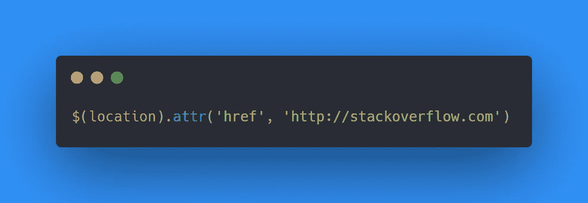
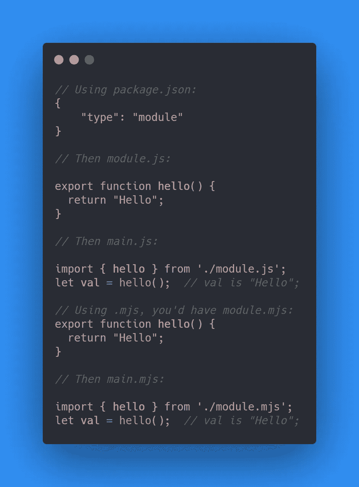

# 2021 年关于堆栈溢出的 10 个投票最高的 JavaScript 问题

> 原文：<https://javascript.plainenglish.io/10-highest-voted-javascript-questions-on-stack-overflow-in-2021-cd19b282c7aa?source=collection_archive---------10----------------------->

## 用 10 个投票率最高的堆栈溢出问题提升您的 JavaScript 知识。


Photo by [SHVETS production](https://www.pexels.com/@shvets-production?utm_content=attributionCopyText&utm_medium=referral&utm_source=pexels) from [Pexels](https://www.pexels.com/photo/extravagant-black-woman-in-fashionable-sunglasses-touching-face-7204238/?utm_content=attributionCopyText&utm_medium=referral&utm_source=pexels)

[Stack Overflow](https://stackoverflow.com/) 是一个网站，你可以在这里提出与计算机工程、编程和开发相关的问题。你也可以找到你脑海中出现的问题的答案。

这对 JavaScript 开发人员更有利，因为它是第一种在堆栈溢出中通过两百万个问题的语言。有一个可爱的社区可以找到你的问题的答案。你也可以通过回答别人的问题来帮助这个社区成长。

Stack Overflow 有 200 多万个 JavaScript 问题。今天，我将向您展示 Stack Overflow 中投票率最高的 10 个 JavaScript 问题及其最佳答案。了解这些问题的答案将有助于提高您的 JavaScript 知识。

# 1.如何从数组中移除特定的项目？

问这个问题的开发人员正在寻找从数组中移除元素的方法。要向数组中添加元素，可以使用`push()`。这个人在寻找一个内置的方法，类似于`array.remove(number);`

最高票的解决方案建议找到你想要移除的数组元素的索引，然后用`splice()`移除那个索引。答案里有 14k 票，很多了。


# 2.如何检查一个元素在 jQuery 中是否隐藏？

这个人问是否可以使用功能`hide(), slow(), or toggle()`来切换一个元素的可见性。此外，如何测试一个元素是可见的还是隐藏的？下面的代码块是投票最高的。


# 3.JavaScript 中的“使用严格”是做什么的，背后的推理是什么？

这位开发人员通过 Crockford 的 JSLint 运行了一些 JavaScript 代码，得到了以下错误:

```
Problem at line 1 character 1: Missing “use strict” statement.
```

然后，他想知道**【use strict】**在 JavaScript 中做什么。

最佳答案参考文章 [John Resig — ECMAScript 5 严格模式、JSON 等](http://ejohn.org/blog/ecmascript-5-strict-mode-json-and-more/)

> 在文章中，作者说，“严格模式是 ECMAScript 5 中的一个新特性，它允许您将程序或函数放在“严格”的操作上下文中。这种严格的上下文会阻止采取某些操作，并引发更多异常。

严格模式的作用是捕捉常见的编码错误并抛出异常，防止采取相对不安全的操作，禁用令人困惑或考虑不周的功能。您也可以使用**“使用严格的”**方法来实现特定的功能。


# 4.如何重定向到另一个网页？

开发人员要求使用 jQuery 或纯 JavaScript 将用户从一个页面重定向到另一个页面。

最佳解决方案提出了两种可能的解决方案。

*   如果你想模拟某人点击一个链接，使用`location.href`
*   如果你想模拟一个 HTTP 重定向，使用`location.replace`

举个例子，


对于 jQuery 解决方案，以下答案是最佳答案。



# 5.JavaScript 闭包是如何工作的？

这个人想学习 JavaScript 闭包，他问:“你如何向一个知道由函数、变量组成的概念但不理解闭包的人解释 JavaScript 闭包？”对于那些不知道闭包的人来说，闭包让你可以从内部函数访问外部函数的作用域。闭包帮助您在函数内部使用函数，以使用您在父函数和内部函数中声明的局部变量。

举个例子，


在[最佳答案](https://stackoverflow.com/questions/111102/how-do-javascript-closures-work)中有更详细的解释。在 [MDN 闭包页面](https://developer.mozilla.org/en-US/docs/Web/JavaScript/Closures)上也有很好的解释。

# 6.如何在 JavaScript 中检查字符串是否包含子串？

开发人员希望检查一个字符串是否包含子字符串，并期待一个`String.contains()`方法。这是一个非常合理的愿望，因为函数的名字很清楚。

以下两个码块是最佳答案。

对于 ECMAScript6，可以使用`String.prototype.includes`。


对于 ECMAScript 5 或更老的环境，可以使用`String.prototype.indexOf`。


# 7.JavaScript 中函数声明的两个区别。

原问题不是上面那句话。开发人员询问声明函数的两种方式的区别，如下所示。


最好的答案是用两个例子简单地说出解决方案。


不同之处在于，`functionOne()`是一个函数表达式，所以只在到达该行时定义，而`functionTwo()`是一个函数声明，只要它周围的函数或脚本被执行，它就会被定义。

# 8.如何从 JavaScript 对象中移除属性？

问题很清楚。开发人员希望从对象中移除属性。

比如你有一个`user`对象，你想删除`email`属性。通过修改用户对象的最佳答案，您可以使用以下内容。


# 9.如何从异步调用返回响应？

开发者有一个函数`foo`可以发出异步请求。问题是如何从`foo`返回响应/结果。

有三个例子，使用了开发者给出的 **jQuery 的 Ajax** 、 **Node.js** ，然后是 block of a promise。

最佳答案给[详细解释](https://stackoverflow.com/questions/14220321/how-to-return-the-response-from-an-asynchronous-call)。第二高票答案也给出了详细的描述和完美的解决方案。第二个问题是，如果你没有在代码中使用 jQuery，这个答案是适合你的，你的代码应该是这样的:


# 10.如何将一个 JavaScript 文件包含在另一个 JavaScript 文件中？

开发者正在寻找 CSS 中类似`@import`的答案。对于 ES6 模块有一个很好的解释。



Stack Overflow 是学习各种编程语言的绝佳平台。你可以做很多事情来提高你的编程技能。

*   可以试着回答问题。
*   你可以找到你问题的答案。
*   你可以提出你的问题来得到答案。
*   作为一名开发人员，您可以发现一些令人兴奋的问题，从而获得一些技能。
*   你从人们那里得到一些见解。
*   甚至可以学习零到高级的编程概念。

在本文中，我向您展示了 10 个投票率最高的 JavaScript 问题。甚至其中一个是十年前问的，但仍然是最新的。您可以发现更多关于堆栈溢出的内容，以提高您的开发技能。

*更多内容请看*[***plain English . io***](http://plainenglish.io/)