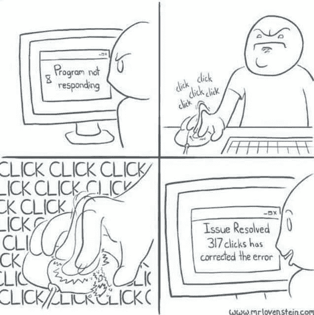
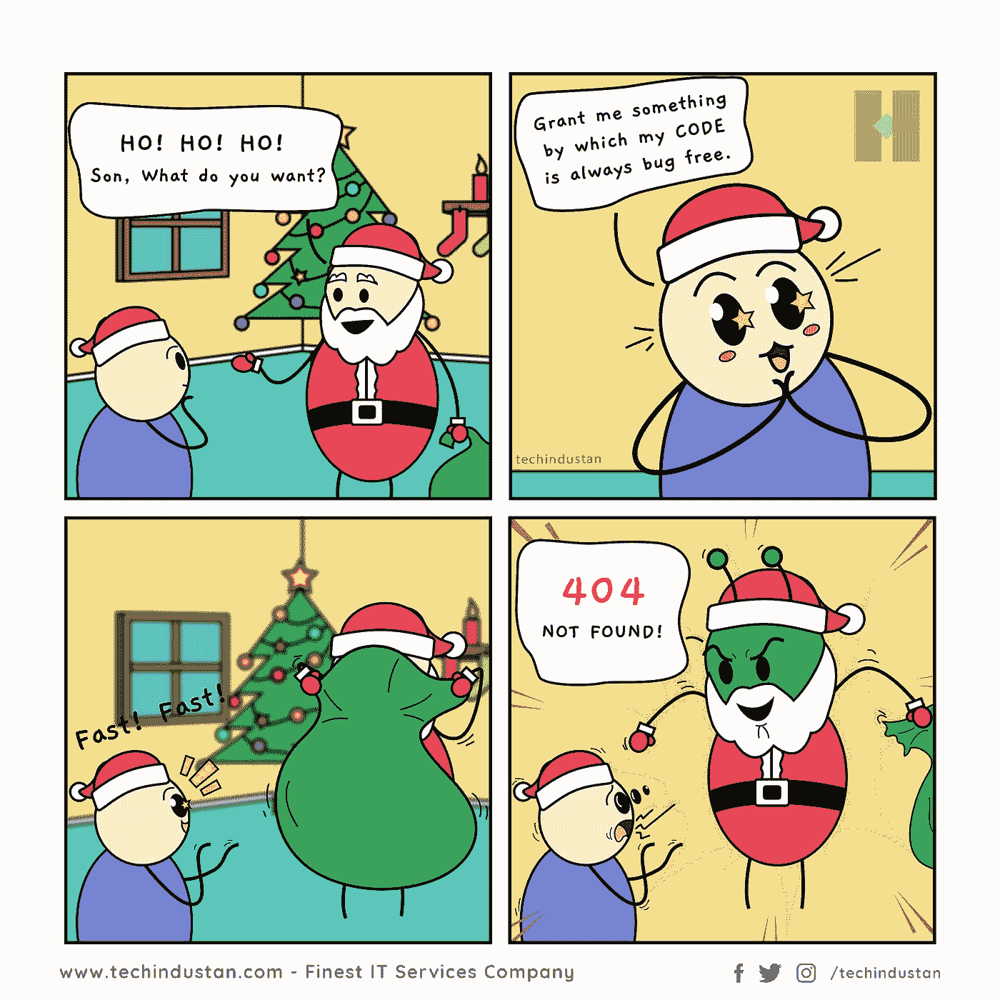

# 检验你是否是程序员的 10 个幽默模因

> 原文：<https://javascript.plainenglish.io/10-humorous-memes-to-check-out-if-you-are-a-programmer-3244248e3e7e?source=collection_archive---------2----------------------->

## 程序员的周五幽默

Photo by [Sincerely Media](https://unsplash.com/@sincerelymedia?utm_source=medium&utm_medium=referral) on [Unsplash](https://unsplash.com?utm_source=medium&utm_medium=referral)

是的，今天是星期五。

一个非常值得的周末即将到来，放松你的大脑。我们许多人都在等待这一天。在你进入周末之前，这里有一些笑声可以帮助你放松心情。

## “笑声是任何人最好的提神按钮”

你准备好了吗？

# 测试您自己的应用程序…

[https://programmerhumor.io/programming-memes/testing-your-own-chatbot-like/](https://programmerhumor.io/programming-memes/testing-your-own-chatbot-like/)

**来源:**【https://programmerhumor.io/】T2

# 大多数冷静的人…

[https://programmerhumor.io/programming-memes/the-lag-is-real/](https://programmerhumor.io/programming-memes/the-lag-is-real/)

【https://programmerhumor.io/】来源:

# 你是不是按了两次才确定？

[https://www.reddit.com/r/ProgrammerHumor/comments/pf1hgl/keys_go_brrrrrr/](https://www.reddit.com/r/ProgrammerHumor/comments/pf1hgl/keys_go_brrrrrr/)

**来源:**[https://www.reddit.com/r/ProgrammerHumor/](https://www.reddit.com/r/ProgrammerHumor/comments/pf1hgl/keys_go_brrrrrr/)

# 代码重用…

[https://www.monkeyuser.com/2018/code-reuse/?sc=true&dir=random](https://www.monkeyuser.com/2018/code-reuse/?sc=true&dir=random)

**来源:**[https://www.monkeyuser.com/](https://www.monkeyuser.com/2018/code-reuse/?sc=true&dir=random)

# 有人经历过这种转变吗？

[https://www.monkeyuser.com/2018/sprint-break/?sc=true&dir=random](https://www.monkeyuser.com/2018/sprint-break/?sc=true&dir=random)

**来源:**[https://www.monkeyuser.com/](https://www.monkeyuser.com/2018/sprint-break/?sc=true&dir=random)

# 当开发人员错过时，意味着没有适当的单元测试。当 QA 错过时…

[https://www.facebook.com/yuva.krishna.memes](https://www.facebook.com/yuva.krishna.memes)

# 这种感觉…

[https://www.facebook.com/yuva.krishna.memes](https://www.facebook.com/yuva.krishna.memes)

# 好建议…

[https://www.facebook.com/yuva.krishna.memes](https://www.facebook.com/yuva.krishna.memes)

# 希望这个梦想成真…

[https://www.facebook.com/yuva.krishna.memes](https://www.facebook.com/yuva.krishna.memes)

# 这是谁写的？我们来玩一个指责游戏吧… LOL

[https://www.facebook.com/yuva.krishna.memes](https://www.facebook.com/yuva.krishna.memes)

# 让我们有一个 PJ…

[https://www.reddit.com/r/ProgrammerHumor/](https://www.reddit.com/r/ProgrammerHumor/)

# 奖励时间:

# 浏览量每天都在增加，是的，人们好奇的看着，怎么会有人这么做呢？英雄联盟

[https://www.facebook.com/ProgrammersCreateLife/](https://www.facebook.com/ProgrammersCreateLife/)

# 打算买床垫？像问答一样思考…这将有助于:D

[https://www.monkeyuser.com/](https://www.monkeyuser.com/)

# 这种情况经常发生…风扇会启动，声音会出现…

[https://www.quora.com/What-are-some-of-the-best-programmer-jokes-and-memes-out-there](https://www.quora.com/What-are-some-of-the-best-programmer-jokes-and-memes-out-there)

# 你的愿望是什么？无 Bug 代码？抱歉 404:未找到

[https://www.facebook.com/techindustan/](https://www.facebook.com/techindustan/)

# 那种只有你的人能理解你的感觉…

[https://www.facebook.com/programminggeeks.in](https://www.facebook.com/programminggeeks.in)

# 当你有很多东西在桶里的时候，没有时间工作…

Source:[https://www.monkeyuser.com/](https://www.monkeyuser.com/)

# 当每个人都建议添加一些功能来美化网站时..结局会是这样的…

[https://www.monkeyuser.com/](https://www.monkeyuser.com/)

# 只有戴眼镜的人才能感受到这一点…

[https://www.facebook.com/JokesTechnical](https://www.facebook.com/JokesTechnical)

# 对不起，这种事不会再发生了..欢迎好友…

[https://www.facebook.com/DZoneInc/photos/10158894902394712](https://www.facebook.com/DZoneInc/photos/10158894902394712)

# 当初级开发给出评估时…项目经理也有同样的感觉…

[https://www.facebook.com/javascriptJS/photos/1559356324201966](https://www.facebook.com/javascriptJS/photos/1559356324201966)

# 你错过了以前的搞笑炸弹吗？看看这里，爆发你的快乐…

# 延伸阅读:

 [## 每个程序员都能理解的 10 个笑话

### 最佳编程笑话汇编 2021 系列

javascript.plainenglish.io](/10-jokes-every-programmer-can-relate-to-184a803ac537)  [## 每个程序员都能理解的 10 个笑话

### 2021 年最佳编程笑话汇编

javascript.plainenglish.io](/10-jokes-every-programmer-can-relate-to-48c583b3a827)  [## 有趣的比较:程序员与普通人

### 是什么让程序员与众不同？

javascript.plainenglish.io](/funny-comparisons-programmers-vs-normal-people-3aa7002f62f0)  [## 10 个流行的编程迷因

### 最佳编程迷因汇编 2021 系列

javascript.plainenglish.io](/10-popular-programming-memes-20a67e97b499) 

*更多内容看*[***plain English . io***](http://plainenglish.io/)