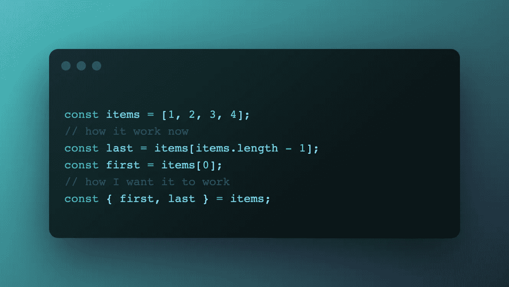

# 10 个有用的 JavaScript 数组方法

> 原文：<https://javascript.plainenglish.io/10-javascript-array-methods-i-need-8dac4513d716?source=collection_archive---------18----------------------->

ECMAScript 5 包括许多实用的方法来处理 JavaScript 的数组:

*   `Array.isArray()`
*   `Array.prototype.every()`
*   `Array.prototype.filter()`
*   `Array.prototype.forEach()`
*   `Array.prototype.indexOf()`
*   `Array.prototype.lastIndexOf()`
*   `Array.prototype.map()`
*   `Array.prototype.reduce()`
*   `Array.prototype.some()`

接下来的标准增加了 find、findIndex、flat、flatMap、fill 等。但在我看来，这还不够。在本文中，我将讨论在使用数组时我遗漏了哪些方法。

# 1.第一个和最后一个吸气剂

最常见的用例之一是获取数组的第一个和最后一个值。

`Array.prototype.first`是一个 getter，返回数组的第一个元素。如果数组为空，那么 getter 将返回`undefined`。

代码也好不到哪里去。没有`first` getter，您也可以轻松地编码。但是要得到数组的最后一个元素，我们肯定需要知道它的长度。getter 将把我们从这种依赖中解放出来。

`Array.prototype.last`是一个 getter，返回数组的最后一个元素。如果数组为空，那么 getter 将返回`undefined`。

有一个将`last`和`first`与析构一起使用的例子

# 2.Array.prototype.clear()

在 JavaScript 中有很多方法可以清除数组。通过下面的链接，你可以阅读其中的 4 篇，并对性能进行解释。

 [## 如何在 JavaScript 中清空数组？

### 清除现有数组的方法 A:方法 1(这是我最初对这个问题的回答)这段代码将设置…

stackoverflow.com](https://stackoverflow.com/questions/1232040/how-do-i-empty-an-array-in-javascript) 

例如:

代码看起来不可读。甚至不清楚开发者想要实现什么。

我向你介绍`Array.prototype.clear`——一个清除数组的方法。

代码干净、简短、易读。

# 3.Array.prototype.get(索引)

我不喜欢通过索引从数组中获取元素的方式。我想为此使用`get`方法。我没有特别的理由为什么`get`方法比经典的方括号好，但是我更喜欢它。

`Array.prototype.get`是一个按索引返回数组项的方法。

# 4.Array.prototype.insert(索引，…元素)

将元素插入数组有三种方法:

1.`push`在数组末尾插入、

2.`unshift`在开头插入

3.`splice`从特定位置插入元素。

推和不推一切都清楚了。但是有了`splice`，一切都变得更有趣了。这个方法既可以删除元素，也可以插入元素。我会对每次手术采用不同的方法。第一个是插入。

`Array.prototype.insert`是一种可以从指定索引开始向数组中插入元素的方法。

# 5.数组.原型.删除(项目)

要从数组中删除一个项，我们首先需要获取它的索引，然后删除它。

`Array.prototype.delete`是一种可以删除没有索引的项目的方法

# 6.Array.prototype.deleteAt(索引)

`Array.prototype.deleteAt`是一个通过索引删除数组项的方法。

# 7.array . prototype . delete where((item，index)boolean)

`Array.prototype.deleteWhere`是一个移除所有通过测试的数组元素的方法，由提供的函数实现。将为每个元素调用该函数。如果函数返回`true`，那么元素将被删除。

`deleteWhere`的工作方式类似于`filter`方法，但是有一个重要的区别:`deleteWhere`改变了原始数组。

# 8.Array.prototype.findLast((item，index)boolean)

`Array.prototype.findLast`是返回数组中通过条件的最后一个元素的方法。

# 9.array . prototype . findlastindex((item，index)boolean)

`Array.prototype.findLastIndex`是返回通过条件的元素的最后一个索引的方法。

# 10.Array.prototype.shuffle()

`Array.prototype.shuffle`是一个将数组就地洗牌并返回的方法。

# 结论

我已经列出了我最常用的方法，这是我最常感觉到的不足。也许其中一些会出现在 ECMAScript 标准的下一个版本中。JavaScript 中缺少哪些处理集合的方法？

*更多内容看* [***说白了. io***](https://plainenglish.io/)