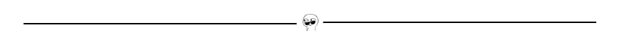

# 你应该知道的 10 个 JavaScript 数组方法

> 原文：<https://javascript.plainenglish.io/10-javascript-array-methods-you-should-know-7d4d5cd635ba?source=collection_archive---------19----------------------->

## 您肯定会发现有用的 JavaScript 数组方法。


我们都同意数组方法在 JavaScript 项目中非常有用。所以在这篇文章里，我会告诉你 10 个你应该知道的数组方法。

所以让我们开始吧！

## 1 .为每一个

方法为数组中的每个元素调用一次特定的函数。

```
const arr = [1, 2, 3, 4, 5, 6];

arr.forEach(item => {
  console.log(item); // output: 1 2 3 4 5 6
});
```



## 2 .减少

`**reduce()**`方法将数组简化为一个值。它为数组的每个值执行一个提供的函数(从左到右)。函数的返回值存储在累加器中(结果/总计)。

```
const arr = [1, 2, 3, 4, 5, 6];

const res = arr.reduce((total, value) => total + value, 0);
console.log(res); // 21
```


## 3 .包含

`**includes()**`方法确定一个字符串是否包含指定字符串的字符。结果/输出是一个*布尔*。

```
const arr = [1, 2, 3, 4, 5, 6];

arr.includes(4); // output: true
arr.includes(9); // output: false
```


## ***4 .Array.of()***

`**Array.of()**`方法从可变数量的参数创建一个新的`Array`实例，而不管参数的数量或类型。

```
const nums = Array.of(1, 2, 3, 4, 5, 6);
console.log(nums); // output: [1, 2, 3, 4, 5, 6]
```


## 5.排序()

`**sort()**`方法对数组中的元素进行排序，并返回排序后的数组。默认的排序顺序是升序，建立在将元素转换为字符串，然后比较它们的 UTF-16 代码单元值序列的基础上。

```
const daysofweek= [‘Thus’, ‘Mon’, ‘Wed’, ‘Fri’];
daysofweek.sort();
console.log(daysofweek);
// expected output: ["Fri", "Mon", "Thus", "Wed"]
```


## 6***array . from()***

静态方法从一个类似数组或可迭代的对象创建一个新的浅拷贝的实例。

```
console.log(Array.from('medium'));
// expected output: Array ["m", "e", "d", "i", "u", "m"]
```


## 7 .过滤器

`**filter()**`方法**创建一个新数组**，其中所有通过测试的元素都由提供的函数实现。

```
const arr = [1, 2, 3, 4, 5, 6];

// item(s) greater than 3
const res = arr.filter(num => num > 4);
console.log(res); // output: [5, 6]

console.log(arr); // output: [1, 2, 3, 4, 5, 6]
```


## 8 .薄片

`**slice()**`方法将数组的一部分创建成一个新的数组对象，该对象从`start`到`end`(不包括`end`)中选择，其中`start`和`end`表示数组中项目的索引。还要注意，原始数组没有被修改。

```
const companies = ['Apple', 'Microsoft', 'Google', 'Amazon', 'Netflix'];console.log(companies.slice(2));
// output: ['Google', 'Amazon', 'Netflix']console.log(companies.slice(2, 4));
// output: ["Google", "Amazon"]console.log(companies.slice(1, 5));
// output: ["Microsoft", "Google", "Amazon", "Netflix"]
```


## 9 .发现

`find()`方法返回所提供数组中满足所提供测试函数的第一个元素的值。如果没有满足测试函数的值，则返回`undefined`。

```
const arr = [14, 74, 22, 46, 142];const res = arr.find(element => element > 10);console.log(res); // output: 14
```


## 10 .索引 Of

`**indexOf()**`方法返回给定元素在数组中的第一个索引，如果不存在则返回-1。

```
const people = ['naruto', 'sakura', 'sasuke', 'itachi', 'kakashi'];console.log(people.indexOf('itachi')); // output: 1
```


## 参考

*   [雷切尔**科尔**](https://morioh.com/p/3ba421a8a63d)
*   [MDN 网络文档](https://developer.mozilla.org/en-US/)
*   [w3schools](https://www.w3schools.com/)

在 [Twitter](https://twitter.com/GarvitMotwani) 和 [Medium](https://garvitmotwani.medium.com/) 上关注我。

感谢阅读！

*更多内容请看*[*plain English . io*](http://plainenglish.io/)