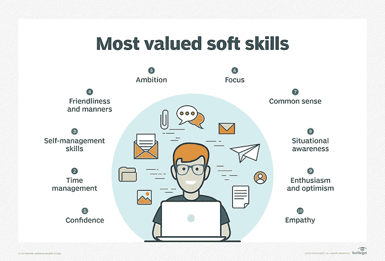

# 软件开发人员求职的 10 个最佳实践

> 原文：<https://javascript.plainenglish.io/10-job-hunting-best-practices-for-software-developers-c06f2cb09548?source=collection_archive---------8----------------------->

## 软件开发人员求职最佳实践和技巧

Photo by [Pavel Danilyuk](https://www.pexels.com/@pavel-danilyuk?utm_content=attributionCopyText&utm_medium=referral&utm_source=pexels) from [Pexels](https://www.pexels.com/photo/woman-in-black-blazer-sitting-on-chair-8111894/?utm_content=attributionCopyText&utm_medium=referral&utm_source=pexels)

作为一名软件开发人员，求职可能会同时充满压力和压力。塑造你的技术和非技术技能需要很多细节。在收到面试邀请和签署第一封录取通知书之前，你应该已经经历了一定的过程和准备。

本文将讨论一些可行的最佳实践，在求职时实施，以提高你被雇用的机会，并确保你的梦想工作。

这些做法并不被认为是求职的“一刀切”,但有助于提高你找到工作的几率。

## **1。进行背景调查/公司跟踪**

Image from Getty

在向任何公司提交申请之前，建议你对公司进行一些背景调查。这将为你提供必要的背景信息，关于该公司和他们正在进行的工作。

公司跟踪是必要的，有助于你确定你的目标和抱负是否与潜在公司一致。进行背景调查将有助于你确定这家公司是否能成为你个人或职业发展的源泉。这将帮助你对你职业生涯的下一个篇章做出可行的决定。

由此，你可以决定是否继续申请。为了确保你不会加入一个与你的目标不一致的公司文化，一定要确保并利用公司跟踪来获得最大的优势。

公司跟踪可以通过网站、社交档案和 LinkedIn 进行。

## **2。定制/优化你的简历**

Image by B Ventures

你的简历应该概述你的工作经历和与你申请的工作相关的背景信息。你的简历应该介绍你自己，但不一定要说话。

你的简历应该把你介绍给别人，而不一定要介绍你自己。修改你的简历可能包括记录你过去工作经历的可操作的影响，以一种可能暗示你贡献的有效性的方式。

根据你申请的公司的角色和需求，你应该在申请各种角色时定制你的简历。另一个大多数人都会犯的错误是用一份简历去做不同的申请。始终确保根据工作申请和该工作机会所需的技能来优化你的简历。

始终确保包含必要和需要的信息。让你的简历至少有 1-2 页。

## **3。永远保持社交清洁**

Image by Van Patter Group

社交媒体非常有影响力，尤其是在人际交往和向潜在客户展示你的技能方面。在你找工作的过程中，你的社会关系总是会派上用场的。

公司和客户想要一个可以信任的人，一个不会给公司带来不健康和坏习惯的人。你的社交网络是你真实网络形象的代表。

尤其是现在，招聘人员在雇用你或邀请你参加面试之前，有对你进行背景调查的习惯。永远确保你的社交保持清洁，远离传播坏的和不健康的能量。这会出卖你，让你成为一个充满消极和仇恨的人。

同样，确保你的个人资料突出你的职业自我，这是你一直希望别人知道的。任何不好的或负面的评论都会让你看起来像个坏人。

## **4。提高你的软技能**

Image by Techtarget

根据 Investopedia 的说法，软技能是表征一个人与其他人关系的性格特征和人际交往技能。在职场中，软技能被认为是硬技能的补充，硬技能指的是一个人的知识和职业技能。

尽管技能是最好的，但软技能在求职过程中也是非常必要的。磨练软技能将会改善你与同事的关系以及你处理自己的方式。

软技能将使你能够领导一个团队，有效地谈判，说服潜在的客户/顾客，遵循指示，甚至按时完成工作。

## **5。利用网络优势**

Image by Dreamstime

网络包括与他人互动的行为或过程，以交换信息和发展职业或社会联系。在求职过程中，人际关系网在任何领域都非常重要。

大多数人获得工作机会完全是靠他们关系网中的人。在你的领域内建立关系网是非常方便的，尤其是当你想建立长期的友谊和关系网的时候。人际交往可能包括给你圈子里的人发电子邮件，建立健康有益的友谊。

## **6。时刻准备面试**

Illustration by Flexjobs

为面试做准备是无可替代的。为了更好地参加面试，你必须一遍又一遍地练习。记住这句谚语“准备失败就是没有准备好”。

为了确保你通过面试，你必须确保你为面试做了充分的准备。目的是确保你在面试中表现最好。不要总是依赖最后一分钟的仓促准备。

这对你来说可能并不总是好事。在参加面试之前，一定要确保你已经从技术和非技术的角度做好了充分的准备。

## **7。永远扩展你的技能**

随着新技术的不断出现，软件开发日新月异。为了确保你与新技术并驾齐驱，你应该不时地努力拓展你的技能。

这是必要的，以确保你在就业市场上与获得机会所需的必要技能保持相关。拓展各种技能组合将永远让你在就业市场上拥有各种应用机会和技能。

## **8。优化您的 LinkedIn 个人资料**

LinkedIn 彻底改变了雇主和雇员在就业市场上的互动方式。你的 LinkedIn 简介和你的在线简历很相似。招聘人员可以根据你的技能和背景直接联系你。

求职时，定制和优化你的 LinkedIn 个人资料是非常重要的考虑因素。总是设计你的个人资料，用相关信息描绘出一个专业的形象。您可以自定义您的个人资料照片，更新工作经历、头衔和您所承担的角色。

## **9。高价出售自己**

Image by Dreamstime

知道如何向招聘人员推销自己是一项需要掌握和磨练的技能。它包括给招聘人员信心让他们接受你的职位。它包括展示你自己的优秀，还包括塑造你的技术和非技术技能。

推销自己需要提供令人信服的细节，包括你的经历以及你的成就，如果有机会的话。它还包括提供解决方案和积极的体验。这有助于让招聘人员相信，一旦获得机会，你会带来一份丰厚的报酬。

## **10。跟进您的申请/利用冷电子邮件**

在申请工作之后，跟进你的申请总是被认为是一个好的做法。这可能包括给在同一家公司工作的人发电子邮件，告诉他们他们做得很好，以及你有兴趣和他们一起工作。

这可以是以上冷邮件样本的形式。

> “大家好，我是 John Philip，是一名开发人员和技术作家。我使用 xxx 已经有一段时间了，并且发现它的文档很有帮助。我想为此祝贺你和技术文档团队。在过去的 x 年里，我一直从事软件开发和技术写作。在此期间，我有幸以 FT 和自由职业者的身份与各种团队合作。我也非常热衷于为开源工作做贡献。我注意到你在网站上申请了一个技术写作的职位。我想做一个跟进，说这个角色听起来很有趣。期待连接！”

你可以根据自己的需要调整和定制你的信息。

**出发前**

感谢您花时间阅读这篇文章，希望对您有所帮助。

*每周三，我都会发送一封独家电子邮件，其中包含我认为有用的、与技术写作相关的技巧、文章、应用、书籍和想法。加入像你一样想提高技术写作水平的人。👇*

[***技术写作问题***](https://artisanal-thinker-2556.ck.page/6e2ba71172)

**更读**

 [## 作为一名开发人员，以正确的方式处理工作拒绝

### 作为开发人员，面对工作拒绝的更好方式

javascript.plainenglish.io](/handle-job-rejections-the-right-way-as-a-developer-99b5658d035b)  [## 作为开发人员，用技术写作赚钱的 5 种方法

### 作为一名开发人员，我对通过技术写作赚钱的真实体验

javascript.plainenglish.io](/5-ways-to-make-money-with-technical-writing-as-a-developer-fffd263a37ed) 

*更多内容请看*[*plain English . io*](http://plainenglish.io/)*。在这里报名参加我们的* [*免费周报*](http://newsletter.plainenglish.io/) *。*