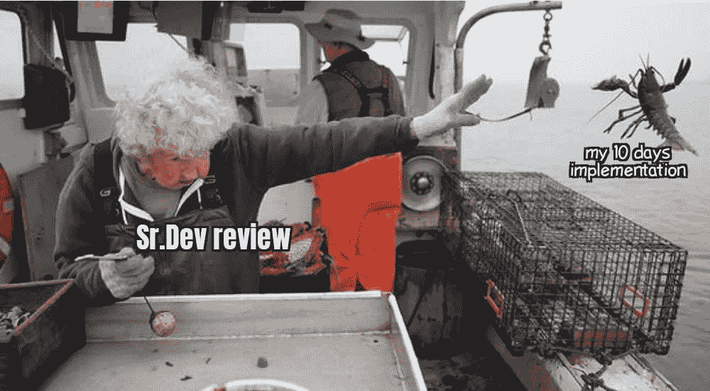

# 每个程序员都能理解的 10 个笑话

> 原文：<https://javascript.plainenglish.io/10-jokes-every-programmer-can-relate-to-184a803ac537?source=collection_archive---------4----------------------->

## 最佳编程笑话汇编 2021 系列

Photo by [Kelly Sikkema](https://unsplash.com/@kellysikkema?utm_source=medium&utm_medium=referral) on [Unsplash](https://unsplash.com?utm_source=medium&utm_medium=referral)

***模因和快乐有什么联系吗？*** 如果你是我这种类型的人，那么你可能也爱在下班后查看手机。猜猜我在那里看到了什么？

我主要是在互联网上看到**视频、抖音和模因**。我不知道为什么，但这有助于我提神醒脑，减轻工作压力。这就是为什么我相信 *laugher 是人类最好的刷新按钮。*

在这篇文章中，我收集了一些我喜欢的网络迷因。

# 一系列按钮？奇怪…谁错过了测试或者谁错过了单元测试？

[https://www.facebook.com/yuva.krishna.memes/photos/a.105527467815845/398780625157193/](https://www.facebook.com/yuva.krishna.memes/photos/a.105527467815845/398780625157193/)

**来源:**[https://www.facebook.com/yuva.krishna.memes/](https://www.facebook.com/yuva.krishna.memes/photos/a.105527467815845/398780625157193/)

# 实际上，在改变搜索 10-15 次之后…我应该使用哪个关键字来获得答案？

[https://www.facebook.com/yuva.krishna.memes/photos/a.105527467815845/398418748526714/](https://www.facebook.com/yuva.krishna.memes/photos/a.105527467815845/398418748526714/)

**来源:**[https://www.facebook.com/yuva.krishna.memes/](https://www.facebook.com/yuva.krishna.memes/photos/a.105527467815845/398418748526714/)

# 让我来帮你们…你们为什么会有矛盾？你不懂感情…(开发和质量保证)

[https://www.facebook.com/yuva.krishna.memes/photos/a.105527467815845/398089741892948/](https://www.facebook.com/yuva.krishna.memes/photos/a.105527467815845/398089741892948/)

**来源:**[https://www.facebook.com/yuva.krishna.memes/](https://www.facebook.com/yuva.krishna.memes/photos/a.105527467815845/398418748526714/)

# 资深 dev 说重写逻辑也是这种感觉…

[https://www.facebook.com/yuva.krishna.memes/photos/a.105527467815845/398088485226407/](https://www.facebook.com/yuva.krishna.memes/photos/a.105527467815845/398088485226407/)

**来源:**[https://www.facebook.com/yuva.krishna.memes/](https://www.facebook.com/yuva.krishna.memes/photos/a.105527467815845/398418748526714/)

# 回忆…

[https://www.monkeyuser.com/](https://www.monkeyuser.com/)

来源:[https://www.monkeyuser.com/](https://www.monkeyuser.com/)

# 是时候尝试一个新的库了…但是等等...

[https://www.monkeyuser.com/](https://www.monkeyuser.com/)

来源:[https://www.monkeyuser.com/](https://www.monkeyuser.com/)

# 我也会紧张…当有人站在我背后…

[https://www.reddit.com/r/ProgrammerHumor/comments/p9ucw8/backspacing_furiously/](https://www.reddit.com/r/ProgrammerHumor/comments/p9ucw8/backspacing_furiously/)

**来源:**[https://www.reddit.com/r/ProgrammerHumor/](https://www.reddit.com/r/ProgrammerHumor/comments/p9ucw8/backspacing_furiously/)

# 不同的语言看到对方…像这样…

[https://www.reddit.com/r/ProgrammerHumor/comments/p9sx26/perspective/](https://www.reddit.com/r/ProgrammerHumor/comments/p9sx26/perspective/)

**来源:**[https://www.reddit.com/r/ProgrammerHumor/](https://www.reddit.com/r/ProgrammerHumor/comments/p9ucw8/backspacing_furiously/)

# 你在通过 QA 之前进行单元测试了吗？

[https://programmerhumor.io/programming-memes/developers-not-testing-code-2/](https://programmerhumor.io/programming-memes/developers-not-testing-code-2/)

**来源:**【https://programmerhumor.io/programming-memes/】T2

# 奖励时间:

# 不要试图问愚蠢的问题…完美的答案在这里…

[https://programmerhumor.io/programming-memes/actual-photo-of-the-stackoverflow-hiring-process/](https://programmerhumor.io/programming-memes/actual-photo-of-the-stackoverflow-hiring-process/)

# 哇！新定义…满栈表示我已经满了… LOL

[https://programmerhumor.io/programming-memes/i-love-me-a-good-full-stack-of-pancakes-%f0%9f%a5%9e/](https://programmerhumor.io/programming-memes/i-love-me-a-good-full-stack-of-pancakes-%f0%9f%a5%9e/)

# 我们不知道我们到底想要什么……但我们希望尽快得到——客户

[https://programmerhumor.io/programming-memes/yes-now/](https://programmerhumor.io/programming-memes/yes-now/)

# 这个图像可以制造很多迷因…让我们用一个编程的…

[https://programmerhumor.io/programming-memes/legacy-code-comments/](https://programmerhumor.io/programming-memes/legacy-code-comments/)

# 让我们通过添加注释使我的代码更具可读性，哈哈…

[https://programmerhumor.io/programming-memes/more-like-commenting-whole-code/](https://programmerhumor.io/programming-memes/more-like-commenting-whole-code/)

# 我的代码是我做的研究…它正在工作，这就足够了…

[https://www.facebook.com/photo/?fbid=515368519672176&set=gm.2881890155411868](https://www.facebook.com/photo/?fbid=515368519672176&set=gm.2881890155411868)

# 让我们重构变量名和方法名…这就足够了，因为逻辑可以是相同的

[https://www.facebook.com/photo/?fbid=912219536303209&set=gm.2881823462085204](https://www.facebook.com/photo/?fbid=912219536303209&set=gm.2881823462085204)

# 是啊。我也忘了办公室的衣服…

[https://www.facebook.com/javascriptJS/photos/2204497796354479/](https://www.facebook.com/javascriptJS/photos/2204497796354479/)

# 我爱你，我的朋友…你做得很好…

[https://www.facebook.com/ICT.LK99/photos/a.109557074287643/295998745643474/](https://www.facebook.com/ICT.LK99/photos/a.109557074287643/295998745643474/)

# 周五的一些动力？

[https://www.facebook.com/jokesvala/photos/a.2339158462775928/6317562231602178/](https://www.facebook.com/jokesvala/photos/a.2339158462775928/6317562231602178/)

# 说真的，不知何故这是真的…

[https://www.facebook.com/jokesvala/photos/a.2330223400336101/6283562938335441/](https://www.facebook.com/jokesvala/photos/a.2330223400336101/6283562938335441/)

# 延伸阅读:

 [## 每个程序员都能理解的 10 个笑话

### 2021 年最佳编程笑话汇编

javascript.plainenglish.io](/10-jokes-every-programmer-can-relate-to-48c583b3a827)  [## 25 个以上的 StackOverflow 编程迷因，所有开发人员都可以涉及到

### 编程幽默可以通过刷新你的情绪来减轻你的压力

javascript.plainenglish.io](/25-more-stackoverflow-programming-jokes-that-all-devs-can-relate-to-ebc2f9c11ca3)  [## 有趣的比较:程序员与普通人

### 是什么让程序员与众不同？

javascript.plainenglish.io](/funny-comparisons-programmers-vs-normal-people-3aa7002f62f0) 

*更多内容尽在*[***plain English . io***](http://plainenglish.io/)