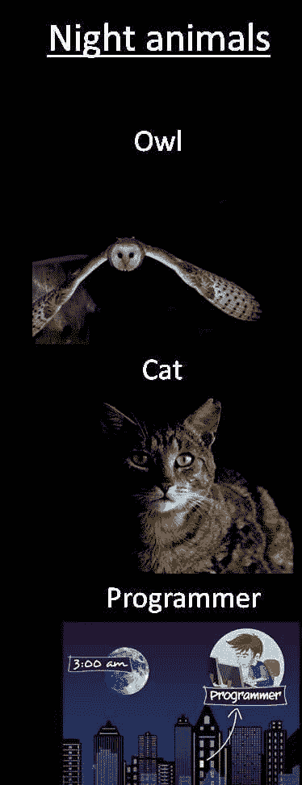

# 每个程序员都能理解的 10 个笑话

> 原文：<https://javascript.plainenglish.io/10-jokes-every-programmer-can-relate-to-48c583b3a827?source=collection_archive---------2----------------------->

## 2021 年最佳编程笑话汇编

Photo by [Caleb Woods](https://unsplash.com/@caleb_woods?utm_source=medium&utm_medium=referral) on [Unsplash](https://unsplash.com?utm_source=medium&utm_medium=referral)

***模因和快乐有什么联系吗？*** 如果你是我这种类型的人，那么你可能也爱在下班后查看手机。猜猜我在那里看到了什么？

我主要是在互联网上看到**视频、抖音和模因**。我不知道为什么，但这有助于我提神醒脑，减轻工作压力。这就是为什么我相信 *laugher 是人类最好的刷新按钮。*

在这篇文章中，我收集了一些我喜欢的网络迷因。

# 有人属于同一个社区吗？

[https://www.facebook.com/techwithcodex/photos/a.137007467972178/350816823257907/](https://www.facebook.com/techwithcodex/photos/a.137007467972178/350816823257907/)

**来源:**[https://www.facebook.com/techwithcodex/](https://www.facebook.com/techwithcodex/photos/a.137007467972178/350816823257907/)

# “硬编码”程序的完美例子

[https://www.facebook.com/photo?fbid=1297862840642289&set=gm.857233531662570](https://www.facebook.com/photo?fbid=1297862840642289&set=gm.857233531662570)

**来源:**[https://www.facebook.com/techwithcodex/](https://www.facebook.com/techwithcodex/photos/a.137007467972178/350816823257907/)

# 虫子是我最好的伙伴…

[https://www.facebook.com/photo?fbid=3924696810973376&set=gm.954427101782567](https://www.facebook.com/photo?fbid=3924696810973376&set=gm.954427101782567)

**来源:**[https://twitter.com/VishalMalvi_](https://twitter.com/VishalMalvi_)

# 100%自动化是不可行的:测试仪

[https://programmerhumor.io/programming-memes/qa_irl-2/](https://programmerhumor.io/programming-memes/qa_irl-2/)

来源:[https://programmerhumor.io/programming-memes/](https://programmerhumor.io/programming-memes/qa_irl-2/)

# 我为每天参观 stackoverflow 感到自豪…

[https://programmerhumor.io/programming-memes/yea-i-know-thanks-stackoverflow/](https://programmerhumor.io/programming-memes/yea-i-know-thanks-stackoverflow/)

**来源:**[https://programmerhumor.io/programming-memes](https://programmerhumor.io/programming-memes)

# 模拟数据的快乐流程总是有效的，直到真正的集成…

[https://www.monkeyuser.com/2018/happy-flow/?sc=true&dir=random](https://www.monkeyuser.com/2018/happy-flow/?sc=true&dir=random)

**来源:**[https://www.monkeyuser.com](https://www.monkeyuser.com/2018/happy-flow/?sc=true&dir=random)

# 敏捷开发的本质得到了很好的解释…

[https://www.monkeyuser.com/2019/applied-scrum/?sc=true&dir=random](https://www.monkeyuser.com/2019/applied-scrum/?sc=true&dir=random)

**来源:**[https://www.monkeyuser.com](https://www.monkeyuser.com/2018/happy-flow/?sc=true&dir=random)

# 你用哪种方法来修复漏洞？

[https://www.monkeyuser.com](https://www.monkeyuser.com/2018/happy-flow/?sc=true&dir=random)

**来源:**[https://www.monkeyuser.com](https://www.monkeyuser.com/2018/happy-flow/?sc=true&dir=random)

# 向老板展示的最佳方式…在休病假后…

[https://www.reddit.com/r/funny/comments/9b7qml/when_your_boss_ask_for_proof_youre_in_hospital/](https://www.reddit.com/r/funny/comments/9b7qml/when_your_boss_ask_for_proof_youre_in_hospital/)

**来源:**【https://www.reddit.com/r/funny/】T42

# 你为什么责备我？这是你的主意…

[https://www.facebook.com/DZoneInc/photos/10157380585604712](https://www.facebook.com/DZoneInc/photos/10157380585604712)

**来源:**【https://www.facebook.com/DZoneInc/】T2

# *奖金时间:

# 新员工根据市场获得工资，老员工根据什么获得加薪？？？

[https://www.monkeyuser.com/2020/new-hire/?sc=true&dir=random](https://www.monkeyuser.com/2020/new-hire/?sc=true&dir=random)

# 它直接进入我的大脑…

[https://www.facebook.com/photo/?fbid=319001836626514&set=gm.2881565295444354](https://www.facebook.com/photo/?fbid=319001836626514&set=gm.2881565295444354)

# 我需要问是谁帮助了我… LOL

[https://www.facebook.com/yuva.krishna.memes/photos/a.105527467815845/376844277350828/](https://www.facebook.com/yuva.krishna.memes/photos/a.105527467815845/376844277350828/)

# 从哪里开始？

[https://www.facebook.com/javascriptJS/photos/a.1387402908063976/2261895900614668/](https://www.facebook.com/javascriptJS/photos/a.1387402908063976/2261895900614668/)

# 在家工作或学习时可以考虑哪些交通？

[https://www.facebook.com/adultswholovecartoons/photos/a.105042201224485/361407612254608/](https://www.facebook.com/adultswholovecartoons/photos/a.105042201224485/361407612254608/)

# 现在让我们来评论一下..我们稍后会修复它…

[https://www.facebook.com/jokesvala/photos/a.2330223400336101/6283557961669272/](https://www.facebook.com/jokesvala/photos/a.2330223400336101/6283557961669272/)

# 正则表达式可以在网上找到…老实说，从来没有试图学习这个东西…

[https://www.facebook.com/DZoneInc/photos/10159094540494712](https://www.facebook.com/DZoneInc/photos/10159094540494712)

# 所以编程给你守卫还是成为守卫？

[https://www.facebook.com/Coding000/photos/a.100326075349488/210613724320722/](https://www.facebook.com/Coding000/photos/a.100326075349488/210613724320722/)

# 她的眼睛说明了一切…

[https://www.facebook.com/yuva.krishna.memes/photos/a.105527467815845/376834894018433/](https://www.facebook.com/yuva.krishna.memes/photos/a.105527467815845/376834894018433/)

# 测试人员无论如何都能找到 bug 即使它是有效的或无效的…

[https://www.facebook.com/javascriptJS/photos/2210011465803112](https://www.facebook.com/javascriptJS/photos/2210011465803112)

# 为什么有人问它，盖伊？他们应该打电话给医生…

[https://www.facebook.com/photo/?fbid=10159583001913436&set=gm.6450394781652918](https://www.facebook.com/photo/?fbid=10159583001913436&set=gm.6450394781652918)

# 你的地址是什么？让我们检查一下你的 IT 幽默…

[https://www.facebook.com/techwithcodex/photos/a.137007467972178/333269081679348/](https://www.facebook.com/techwithcodex/photos/a.137007467972178/333269081679348/)

# 当我开始调试时…哈哈

[https://programmerhumor.io/programming-memes/why-dont-you-just-step-over-2/](https://programmerhumor.io/programming-memes/why-dont-you-just-step-over-2/)

# 当开发人员错过时，意味着没有适当的单元测试，当 QA 错过时…

[https://www.facebook.com/yuva.krishna.memes](https://www.facebook.com/yuva.krishna.memes)

# 这种感觉…

[https://www.facebook.com/yuva.krishna.memes](https://www.facebook.com/yuva.krishna.memes)

# 好建议…

[https://www.facebook.com/yuva.krishna.memes](https://www.facebook.com/yuva.krishna.memes)

# 希望这个梦想成真…

[https://www.facebook.com/yuva.krishna.memes](https://www.facebook.com/yuva.krishna.memes)

# 这是谁写的？我们来玩一个指责游戏吧… LOL

[https://www.facebook.com/yuva.krishna.memes](https://www.facebook.com/yuva.krishna.memes)

# 让我们有一个强制性的 PJ…

[https://www.reddit.com/r/ProgrammerHumor/](https://www.reddit.com/r/ProgrammerHumor/)

# 为什么免费试用会询问信用卡详情？

[https://www.facebook.com/codewithK.K](https://www.facebook.com/codewithK.K)

# 程序员练习…

[https://www.facebook.com/techindustan](https://www.facebook.com/techindustan)

# 进一步阅读

 [## 11 个让你笑死的编程笑话

### 2021 年最佳编程迷因

javascript.plainenglish.io](/11-programming-jokes-that-will-make-you-die-laughing-df41d5547f11)  [## 2021 年最佳编程幽默汇编

### 编程迷因可以减轻你的压力

blog.devgenius.io](https://blog.devgenius.io/best-programming-humor-compilations-2021-623473bfb0d)  [## 有趣的编程迷因会让你笑死

### 编笑话来点亮你的周五

blog.devgenius.io](https://blog.devgenius.io/funny-programming-memes-that-will-make-you-die-laughing-1ccd8e139040)  [## 编程迷因和幸福之间的联系

### 2021 年最佳编程迷因汇编

blog.devgenius.io](https://blog.devgenius.io/the-connection-between-programming-memes-and-happiness-d768ab85b83d)  [## 10 个能让你心情轻松的最佳编程笑话

### 你读过的关于编程迷因 2021 的最不可思议的文章

medium.com](https://medium.com/geekculture/10-best-programming-jokes-to-lighten-up-your-mood-8870dab2bff7)  [## 日常的编程笑话

### 最佳编程迷因汇编(第 1 部分)

javascript.plainenglish.io](/daily-dose-of-programming-jokes-cb9b74fcfa2e) 

*更多内容尽在*[***plain English . io***](http://plainenglish.io/)