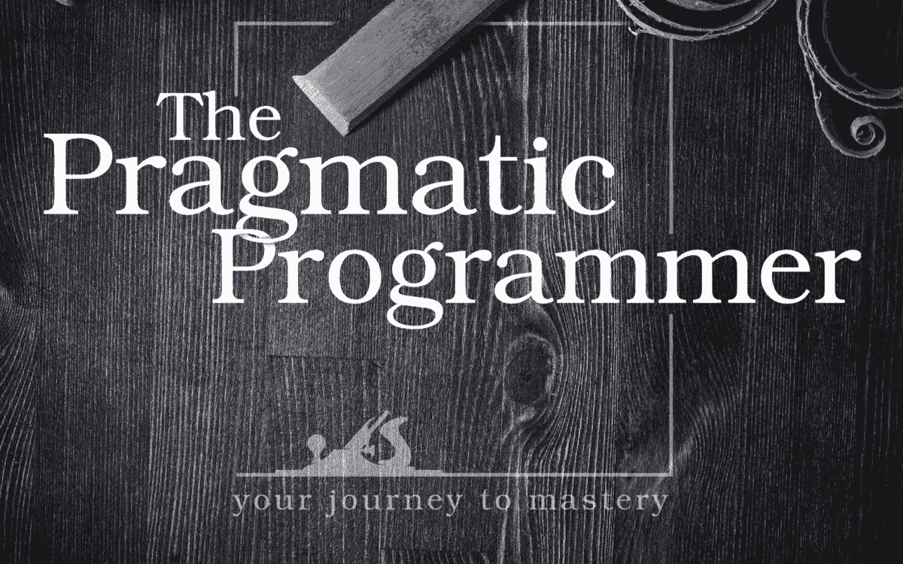

# 帮助我成长为开发人员的 10 堂课

> 原文：<https://javascript.plainenglish.io/10-lessons-that-helped-me-grow-as-a-developer-d71451bafe3b?source=collection_archive---------2----------------------->

## 名著《务实的程序员》的启示

有时候我们会碰到一本很棒的书，它完全改变了我们的一些核心信念，帮助我们成长。它彻底改变了我们思考自己的方式，我们对作者心存感激。

《实用程序员》就是这样一本书。

今天，我将分享我从这本书里学到的 10 大教训。

# 1.“刚刚好”是最好的策略

软件并不完美。完美是不可能的。你不可能一次就写出完美的软件，甚至在工作多年后也不可能。

许多初级软件开发人员犯了一个错误，试图为给定的问题编写绝对完美和最佳的解决方案，并在这个过程中变得自大。

我们都喜欢并欣赏一个好的软件，但是我们有太多的限制！我们没有时间了，我们没有所有必要的知识，等等。

所以，试着采用**“刚刚好”**的哲学来对待你面临的任何问题。

# **2。查看大图**

在当前的微服务时代，在整个系统的很小一部分工作并不罕见。或者开发一个小功能。

*   试着看到更大的画面。试着想象你的代码对其他部分的影响。
*   此外，试着去理解你的产品是为哪一个行业生产的。
*   记住一件事，你不是为了好玩才造东西的。你正试图解决一个实际的现实生活中的问题。所以记住这一点，它会帮助你走下去。

# 3.对你的工作负责

我们都会犯错。这是软件开发的唯一真理。

也许我们忘了检查一个边缘案例，或者以绝对错误的方式设计了一些东西。

误差可能很小，也可能很大。但是你必须对你的工作负责。不要责怪其他人或其他系统或时间限制或任何其他事情。

做这项工作是你的责任，而你却搞砸了。

相反，提供一些解决方案。如果需要，慢慢来。这是成长和成为一个可靠的开发人员的方法。

# 4.不要留下任何破碎的窗户

在软件开发中，一个坏的窗口可能是由一段糟糕的代码或一个糟糕的架构造成的。

这是一件非常危险的事情，因为它具有在整个代码库中传播的邪恶力量。软件不会一夜之间就烂掉。这是在你背后慢慢发生的。

因此，如果你有任何已知的破损窗户，尽快修复它们，即使不是你造成的。

# 5.知道什么时候停下来

这就引出了下一条建议。

不要因为过度修饰和过度精炼而破坏一个完美的程序。

任何程序都是一件艺术品。但是不要陷入过分精炼的想法。

这是一种平衡行为。你必须找到最佳点。

# 6.丰富你的知识

做一件事的专家。在一项技术上变得非常非常优秀。

阅读该主题的相关书籍。试着理解核心概念，然后扩展。

不要只学那个技术。试着去理解它存在背后的原因。

你必须成为这项技术的关键人物。所以变得非常非常好，拥有深入多样的知识是非常重要的。

# 7.变得奇怪

不要害怕与科技打交道。尝试学习和玩新事物。尽可能经常地接触新技术。

这将有助于了解当前的技术世界，并帮助你站在顶端。

如果你不得不走出你的舒适区，这表明你在成长。

# 8.成为变革的催化剂

如果你需要从别人那里得到什么，尽量要求最少的东西。然后和它一起工作，让他们去想。记住一件事:*“人们试图成为持续成功的一部分”*

所以从那一点来说，他们会用他们的意志来帮助你。

# 9.回顾你的投资组合

定期回顾你的知识组合(我说 6 个月)。

找出你在过去 6 个月里学到了什么，并规划未来。

不时更新个人简历是一个很好的方法。不要在需要求职的时候随便打开简历。即使你在职业生涯中处于舒适的位置，也要更新你的简历。

# 10.沟通是关键

尝试参与小组讨论。

这个小组可以是你的办公室同事，甚至是一个 StackOverflow 问题。倾听他人并参与其中。

不要害羞或犹豫地问问题，即使他们有时很笨。

如果你陷入困境，就去找一位大师帮忙。这意味着你的职业生涯中应该有一个导师。

今天到此为止。编码快乐！

**通过** [**LinkedIn**](https://www.linkedin.com/in/56faisal/) **或我的** [**个人网站**](https://www.mohammadfaisal.dev/) **与我取得联系。**