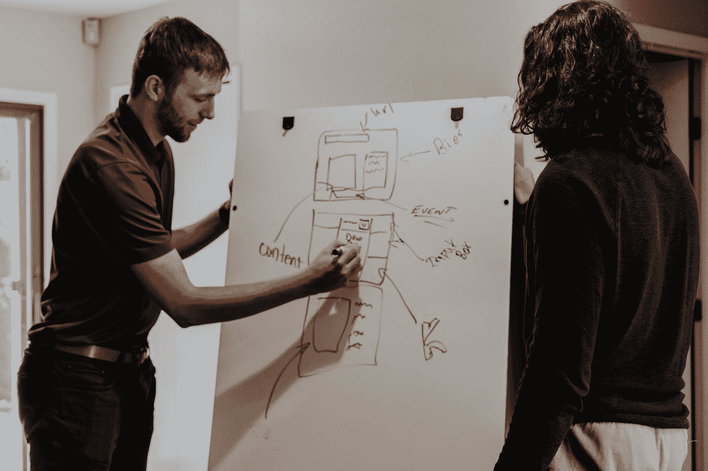

# 编程和创业之间的 10 个相似之处

> 原文：<https://javascript.plainenglish.io/10-parallels-between-programming-and-entrepreneurship-5bc13e5ff515?source=collection_archive---------22----------------------->

Photo by [Kaleidico](https://unsplash.com/@kaleidico?utm_source=medium&utm_medium=referral) on [Unsplash](https://unsplash.com?utm_source=medium&utm_medium=referral)

由于我既是程序员又是企业家，我脑海中出现了一个又一个案例之间的相似之处。

1.  不开始编程，就无法学习编程。同样，成为一名企业家而不开始通过做你自己正在做的事情来赚钱也是。
2.  一个程序员的冷静是由他的项目的冷静决定的，而不是由培训完成证书的数量决定的。所以，是的，出示你的 MBA。
3.  展示一公里长从未运行过的代码，并声称这个程序会工作，这是轻率的。或者以向上弯曲的曲棍球棒的形式显示一个千米 Excel 表格，其中包含对未来收入的计算。
4.  真正的用户，而不是测试，最终验证程序的质量。所以，尽早做一个 MVP 很重要。
5.  大部分时间花在调试上，而不是写程序。因此，商业的全部问题不在于想法，而在于实施。
6.  没有人能一次创建程序的第十个版本。你需要从现在开始创业，从现在开始。
7.  发明自行车写了几百遍是缺点，不是优点。以及大众服务的第二十八个克隆体。
8.  一个程序在负载下迅速耗尽所有资源，并在尖叫“内核崩溃”时死去，这是不好的。既指创始人本人，也指他的企业。
9.  如果你编程的是人们需要的东西，你就可以通过编程谋生。但是，当然，任何想法也可以被发明和实现，但是结果如何呢？
10.  没有令人信服的理由说明为什么想编程的人不能学习编程。问题是如何开始。

由此得出的结论是，每个程序员都是优秀的企业家。但是，很多优秀的企业家都是程序员。

*更多内容尽在*[*plain English . io*](http://plainenglish.io/)