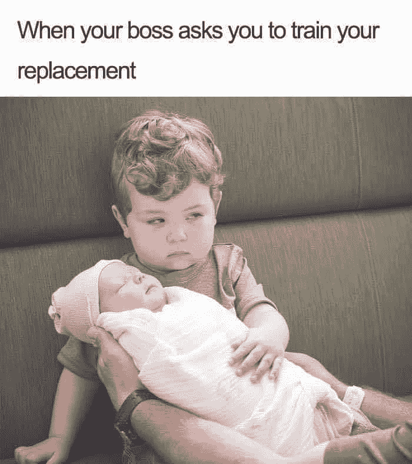
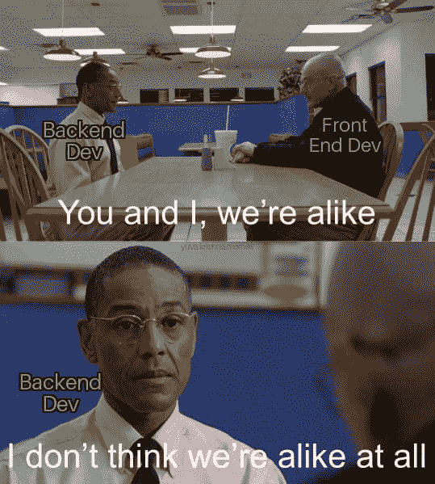
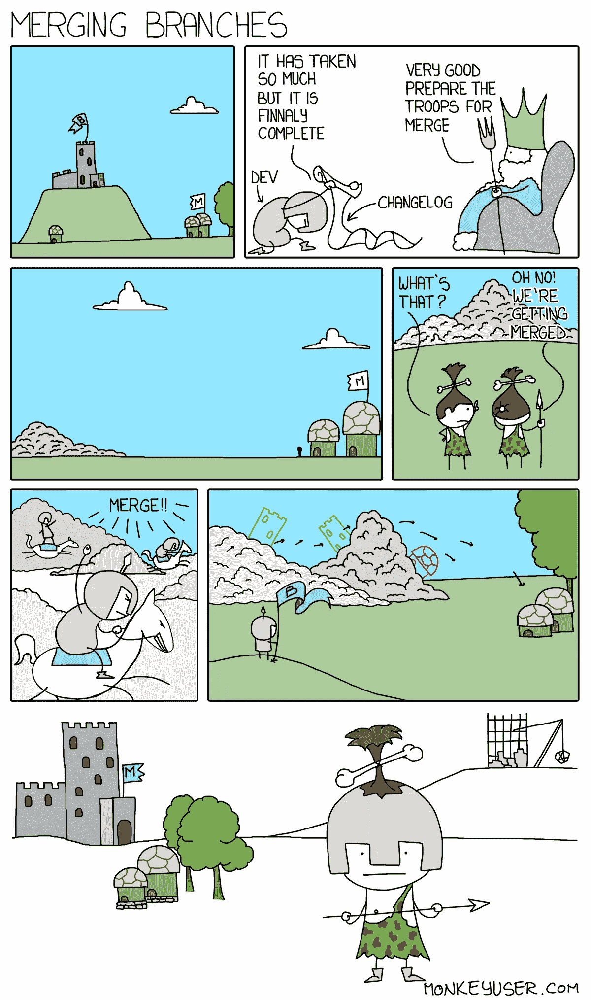
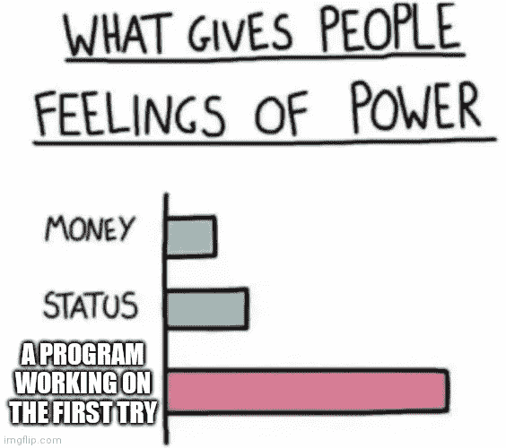
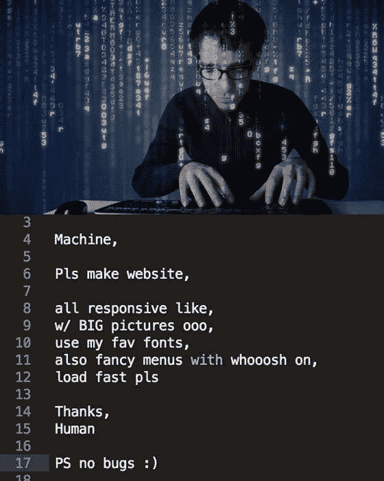
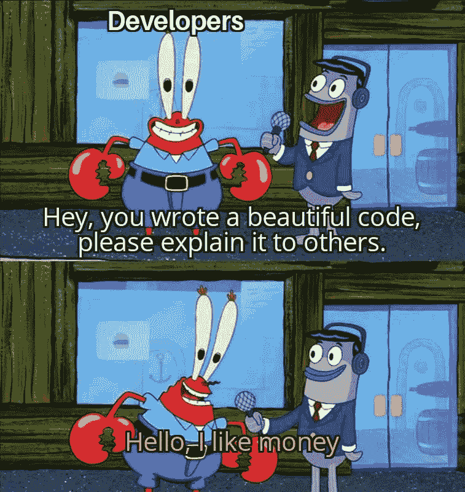
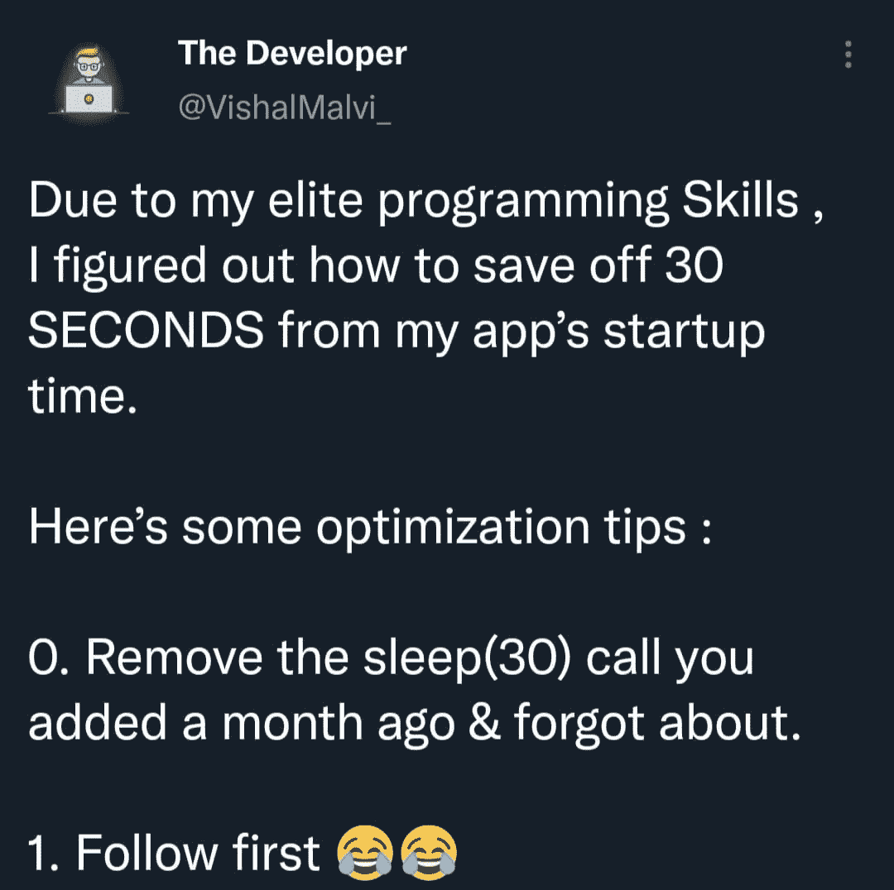
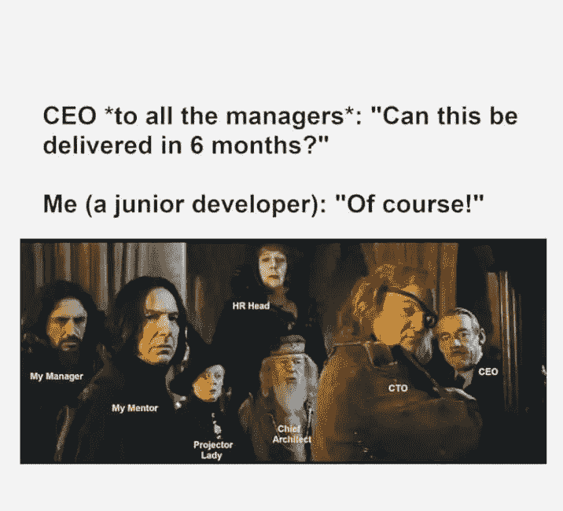

# 10 个流行的编程迷因

> 原文：<https://javascript.plainenglish.io/10-popular-programming-memes-20a67e97b499?source=collection_archive---------1----------------------->

## 最佳编程迷因汇编 2021 系列

Photo by [CardMapr.nl](https://unsplash.com/@cardmapr?utm_source=medium&utm_medium=referral) on [Unsplash](https://unsplash.com?utm_source=medium&utm_medium=referral)

***模因和快乐有什么联系吗？*** 如果你是我这种类型的人，那么你可能也爱在下班后查看手机。猜猜我在那里看到了什么？

我主要是在互联网上看到**视频、抖音和模因**。我不知道为什么，但这有助于我提神醒脑，减轻工作压力。这就是为什么我相信 *laugher 是人类最好的刷新按钮。*

在这篇文章中，我收集了一些我喜欢的网络迷因。

# 当你要搬到另一个地方，请提供 KT 给新的人…

[https://www.facebook.com/yuva.krishna.memes/photos/a.105527467815845/400621604973095/](https://www.facebook.com/yuva.krishna.memes/photos/a.105527467815845/400621604973095/)

**来源:**[https://www.facebook.com/yuva.krishna.memes/](https://www.facebook.com/yuva.krishna.memes/photos/a.105527467815845/400621604973095/)

# 如果你只是热起来，那么它是完美的管理…

[https://www.facebook.com/yuva.krishna.memes/photos/a.105527467815845/399700421731880/](https://www.facebook.com/yuva.krishna.memes/photos/a.105527467815845/399700421731880/)

**来源:**[https://www.facebook.com/yuva.krishna.memes/](https://www.facebook.com/yuva.krishna.memes/photos/a.105527467815845/400621604973095/)

# 我们不一样…

[https://www.facebook.com/yuva.krishna.memes/photos/a.105527467815845/395622472139675/](https://www.facebook.com/yuva.krishna.memes/photos/a.105527467815845/395622472139675/)

**来源:**[https://www.facebook.com/yuva.krishna.memes/](https://www.facebook.com/yuva.krishna.memes/photos/a.105527467815845/400621604973095/)

# 我不知道，但是它开始起作用了…也许我手里有魔法

[https://www.facebook.com/codevweb95/photos/a.109799858049136/125626996466422/](https://www.facebook.com/codevweb95/photos/a.109799858049136/125626996466422/)

**来源:**[https://www.facebook.com/codevweb95](https://www.facebook.com/codevweb95/photos/a.109799858049136/125626996466422/)

# 当两个分支合并时…这是在幕后发生的

[https://www.monkeyuser.com/2017/merging-branches/?sc=true&dir=random](https://www.monkeyuser.com/2017/merging-branches/?sc=true&dir=random)

**来源:**[https://www.monkeyuser.com/2017/merging-branches/?sc=true&dir = random](https://www.monkeyuser.com/2017/merging-branches/?sc=true&dir=random)

# 当我的代码没有任何问题地运行时，我感到非常高兴…

[https://www.reddit.com/r/ProgrammerHumor/comments/pb64yr/when_it_happens_you_feel_like_a_superior_being/](https://www.reddit.com/r/ProgrammerHumor/comments/pb64yr/when_it_happens_you_feel_like_a_superior_being/)

**来源:**[https://www.reddit.com/r/ProgrammerHumor/](https://www.reddit.com/r/ProgrammerHumor/comments/pb64yr/when_it_happens_you_feel_like_a_superior_being/)

# 人工智能…我们想长大达到这个水平…

[https://www.facebook.com/codevweb95/photos/a.109799858049136/125112946517827/](https://www.facebook.com/codevweb95/photos/a.109799858049136/125112946517827/)

**来源:**[https://www.facebook.com/codevweb95](https://www.facebook.com/codevweb95/photos/a.109799858049136/125112946517827/)

# 当有人采访一个开发者时…

[https://www.facebook.com/jokesvala/photos/a.2330223400336101/6458330477525352/](https://www.facebook.com/jokesvala/photos/a.2330223400336101/6458330477525352/)

**来源:**【https://www.facebook.com/jokesvala/】T2

# 最佳优化技巧..

[https://www.facebook.com/photo?fbid=3939141809528876&set=gm.957487971476480](https://www.facebook.com/photo?fbid=3939141809528876&set=gm.957487971476480)

【https://www.facebook.com/groups/151139362111349】来源:

# 当初级开发人员致力于该特性时…

[https://www.facebook.com/171693141223918/photos/a.171697311223501/326499809076583/](https://www.facebook.com/171693141223918/photos/a.171697311223501/326499809076583/)

**来源:**[https://www.facebook.com/groups/151139362111349](https://www.facebook.com/groups/151139362111349)

# 奖励时间:

# “我能做的最好的事是……”——《典当之星》中最好的对白之一

[https://www.facebook.com/jokesvala/photos/a.2330223400336101/6284001301624938/](https://www.facebook.com/jokesvala/photos/a.2330223400336101/6284001301624938/)

# 别担心…我们稍后会修复缺陷…让我们专注于特性…

[https://www.facebook.com/jokesvala/photos/a.2330223400336101/6283984434959958/](https://www.facebook.com/jokesvala/photos/a.2330223400336101/6283984434959958/)

# 我感觉很幸运…哈哈

[https://www.reddit.com/r/ProgrammerHumor/comments/ort8im/i_got_your_back/](https://www.reddit.com/r/ProgrammerHumor/comments/ort8im/i_got_your_back/)

# 感觉棒极了…因为我现在必须开始…

[https://www.reddit.com/r/ProgrammerHumor/comments/oryzuy/github_stars_be_like/](https://www.reddit.com/r/ProgrammerHumor/comments/oryzuy/github_stars_be_like/)

# 如何知道自己写的代码好不好？让我们来看一个最好的测量结果…

[https://www.reddit.com/r/ProgrammerHumor/comments/os2nf8/how_code_reviews_happens/](https://www.reddit.com/r/ProgrammerHumor/comments/os2nf8/how_code_reviews_happens/)

# 如果你成为项目经理…

[https://www.reddit.com/r/ProgrammerHumor/comments/orwx1p/when_you_get_promoted_as_subproject_manager/](https://www.reddit.com/r/ProgrammerHumor/comments/orwx1p/when_you_get_promoted_as_subproject_manager/)

# 我知道捷径…但有时会出错…

[https://www.facebook.com/yuva.krishna.memes/photos/a.105527467815845/379862280382361/](https://www.facebook.com/yuva.krishna.memes/photos/a.105527467815845/379862280382361/)

# 填空:你正在编写真正的代码

[https://www.facebook.com/yuva.krishna.memes/photos/a.105527467815845/379491883752734/](https://www.facebook.com/yuva.krishna.memes/photos/a.105527467815845/379491883752734/)

# 当 BA 要求您添加您想要的文本时…

[https://www.facebook.com/photo/?fbid=2950599335268534&set=gm.6472478532777876](https://www.facebook.com/photo/?fbid=2950599335268534&set=gm.6472478532777876)

# 延伸阅读:

 [## 每个程序员都能理解的 10 个笑话

### 最佳编程笑话汇编 2021 系列

javascript.plainenglish.io](/10-jokes-every-programmer-can-relate-to-184a803ac537)  [## 每个程序员都能理解的 10 个笑话

### 2021 年最佳编程笑话汇编

javascript.plainenglish.io](/10-jokes-every-programmer-can-relate-to-48c583b3a827)  [## 25 个以上的 StackOverflow 编程迷因，所有开发人员都可以涉及到

### 编程幽默可以通过刷新你的情绪来减轻你的压力

javascript.plainenglish.io](/25-more-stackoverflow-programming-jokes-that-all-devs-can-relate-to-ebc2f9c11ca3)  [## 有趣的比较:程序员与普通人

### 是什么让程序员与众不同？

javascript.plainenglish.io](/funny-comparisons-programmers-vs-normal-people-3aa7002f62f0) 

*更多内容请看*[***plain English . io***](http://plainenglish.io/)