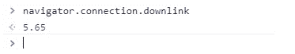

# 你应该知道的 10 个强大的 JavaScript 代码片段

> 原文：<https://javascript.plainenglish.io/10-powerful-javascript-code-snippets-that-you-should-know-217363914589?source=collection_archive---------4----------------------->

## 每个 web 开发人员都应该知道的 JavaScript 代码片段。


JavaScript 现在非常流行，尤其是在 web 开发中。有了新的 ECMAScript 版本，JavaScript 语法有了很大的改进。因此，这种语言现在有了许多强大而有趣的特性，我们可以作为开发人员在代码中使用它们。

另一件好事是，目前大多数主流浏览器都很好地支持新的 JavaScript 特性。无论您是哪种类型的开发人员，至少拥有 JavaScript 的基础知识是一个很好的优势。

现在，开发人员使用不同的代码片段来解决程序中的问题，并创建他们需要的功能。不管他们使用什么编程语言，这总是一个事实。然而，最重要的是你写的代码清晰，计算机和人类都能理解。

因此，在本文中，我想与您分享一份 JavaScript 代码片段列表，您可以作为开发人员使用。所以让我们开始吧。

# 1.检查是偶数还是奇数

有时，在某些情况下，您需要检查一个数字是偶数还是奇数。例如，您可能希望创建一个或输入字段，用户只能在其中输入奇数。我想你明白了。

所以下面的 JavaScript 代码片段允许我们检查一个数字是否是偶数。

```
 const isEven = num => num % 2 === 0;

console.log(isEven(2));  *//returns true*console.log(isEven(3)); *//returns false*
```

如您所见，上面的箭头函数有一个名为`num`的参数。如果输入的数字是偶数，则返回 true。如果是奇数，则返回 false。

# 2.检查参数是否为数字

为了检查函数参数是否为数字，我们可以在 JavaScript 中使用并组合三种方法。这些方法是`isNaN()`、`parseFloat()`和`isFinite()`。

您可以在 [MDN 文档](https://developer.mozilla.org/en-US/docs/Web/JavaScript/Reference/Global_Objects/isFinite)中了解更多信息。

```
function isNumber(num){
  return **!isNaN(parseFloat(num)) && isFinite(num)**;
}isNumber(**7**); //returns true
isNumber(**"Hello"**); //returns false
```

正如你在上面看到的，如果参数`num`是一个数字，函数返回 true。否则，它返回 false。

# 3.求平均值

假设你想在你的程序中创建一个函数来计算多个数字的平均值。你可以使用 reduce 方法和 rest 参数来实现。

下面是一个例子:

```
const averageNum = (**...args**) => **args.reduce((a, b) => a + b) / args.length;**

averageNum(55, 8, 37, 4); *//returns 26*averageNum(66, 8, 3, 99); *//returns 44*
```

如你所见，rest 参数允许我们知道传递给函数的参数数量。另一方面，reduce 方法允许我们获得所有传递的数字的总值。

因此，我们能够获得数字的总值，并除以传递的参数数，从而获得平均值。

# 4.使用 JavaScript 滚动到顶部

如今大多数网站都有滚动到顶部的功能。你只需点击一个按钮，它就会把你滚动到页面的顶部。

JavaScript 中的方法`window.scrollTo(0, 0)`允许我们这样做。你只需要将`x`和`y`设置为 0。

这里有一个例子:

```
const scrollToTop = () => **window.scrollTo(0, 0)**;

scrollToTop();
```

# 5.复制到剪贴板

在许多情况下，您可能希望程序或网站的用户能够轻松地将文本复制到剪贴板。嗯，您可以使用`navigator.clipboard.writeText`在 JavaScript 中实现这一点。

下面是代码示例:

```
const copyText = **(text)** =>  **navigator.clipboard.writeText(text)**;

copyText("Hello JavaScript");
```

# 6.轻松展平阵列

您可以使用`flat()`方法在 JavaScript 中轻松展平数组。该方法接受一个可选的数字参数，即展平级别(2 倍、3 倍等等)。

看看下面的例子:

```
let numbersArray = [8, **[**100, 9**]**, **[**7, 3**]**, 5];numbersArray.**flat()**; *//returns [8, 100, 9, 7, 3, 5]* let twoLevels = ["Hello", [6, [8, 9], "Java"], 66];twoLevels.**flat(2)**; *//returns ['Hello', 6, 8, 9, 'Java', 66]*
```

# 7.轻松反转字符串

在 JavaScript 中可以很容易地反转一个字符串。你可以通过使用方法`split()`、`reverse()`和`join()`来完成。

下面是代码示例:

```
const reverseStr = str => str.split('').reverse().join('');

reverseStr('Hello JavaScript'); *//returns* *'tpircSavaJ olleH'*
```

正如您在上面看到的，我们使用方法`split`将字符串转换为数组，使用方法`reverse`反转数组项，使用方法`Join`将数组再次转换回字符串。

因此，该函数返回一个反向字符串。所以这是一个简单的方法，你可以用它来反转 JavaScript 中的字符串。

# 8.检测互联网带宽

带宽经常被误认为是互联网速度，而它是在特定时间段内通过互联网连接传输的数据量。您可以使用 navigator 对象在 JavaScript 中轻松检测网络带宽。

看看下面的代码示例:

```
**navigator.connection.downlink;**
```

*输出:*



Capture by the author from the console.

`downlink`属性返回每秒兆比特的估计带宽。正如你在上面看到的，我得到了 5.65，但是你可以根据你的网速，浏览器等得到不同的值。

# 9.返回网页上的选定文本

使用 window 对象中的方法`getSelection()`可以很容易地在网页上获得选中的文本。

下面是代码示例:

```
const selectedText = () => **window.getSelection().toString()**;

selectedText();
```

当您运行此函数时，它会返回您使用鼠标在网页上选择的文本。

# 10.振动你的手机

你知道你可以用 JavaScript 震动你的手机吗？

navigator 对象的方法`vibrate()`允许您这样做。

下面是代码示例:

```
//vibrating the device for 600 milliseconds**window.navigator.vibrate(600);**
```

上面的代码片段会让你的手机震动 600 毫秒。

# 结论

正如你在上面的列表中看到的。无论您是哪种类型的开发人员，都可以在 JavaScript 代码中使用这些有用且强大的代码片段。希望这篇文章对你有用。如果是这样，一定要给它鼓掌。我真的很感激。

*感谢您阅读本文。此外，如果你觉得我的内容有用，而你不是一个媒体成员，你可以抓住你的媒体成员* [*这里*](https://mehdiouss.medium.com/membership) *(媒体推荐链接)获得无限制的访问媒体上的所有文章，并支持我们作为作家。*

[](https://mehdiouss.medium.com/membership) [## 通过我的推荐链接加入 Medium-Mehdi Aoussiad

### 作为一个媒体会员，你的会员费的一部分会给你阅读的作家，你可以完全接触到每一个故事…

mehdiouss.medium.com](https://mehdiouss.medium.com/membership) 

**延伸阅读:**

[](/6-awesome-sites-for-all-front-end-developers-d15835790796) [## 面向所有前端开发人员的 6 个优秀网站

### 你可能不知道的有用网站列表。

javascript.plainenglish.io](/6-awesome-sites-for-all-front-end-developers-d15835790796) [](https://blog.devgenius.io/7-useful-front-end-web-developer-cheatsheets-you-must-know-32e9ef3c03bb) [## 你必须知道的 7 个有用的前端 Web 开发人员备忘单

### 作为一名前端 web 开发人员，帮助您节省时间的精彩备忘单。

blog.devgenius.io](https://blog.devgenius.io/7-useful-front-end-web-developer-cheatsheets-you-must-know-32e9ef3c03bb) 

*更多内容请看*[*plain English . io*](http://plainenglish.io/)*。报名参加我们的* [*免费周报*](http://newsletter.plainenglish.io/) *。*