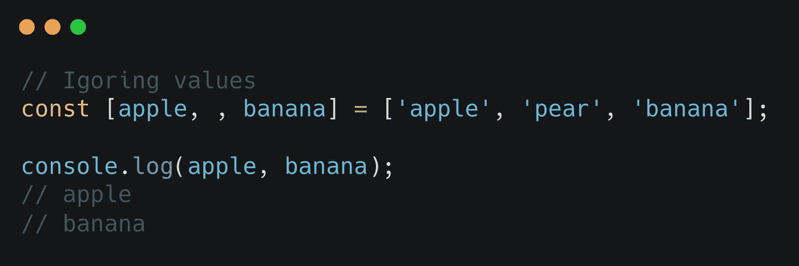
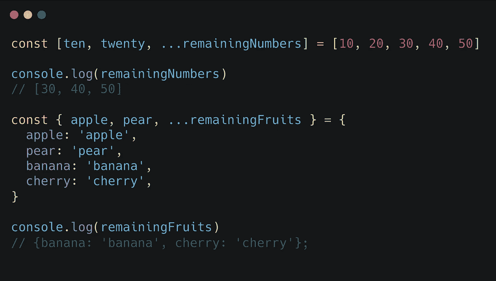
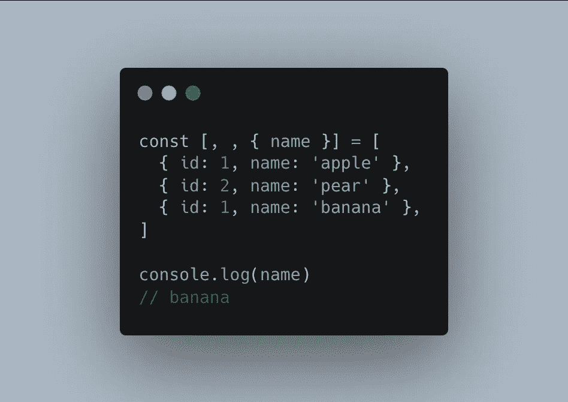
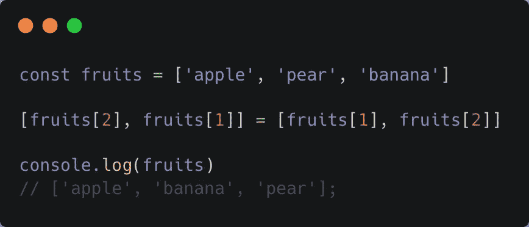
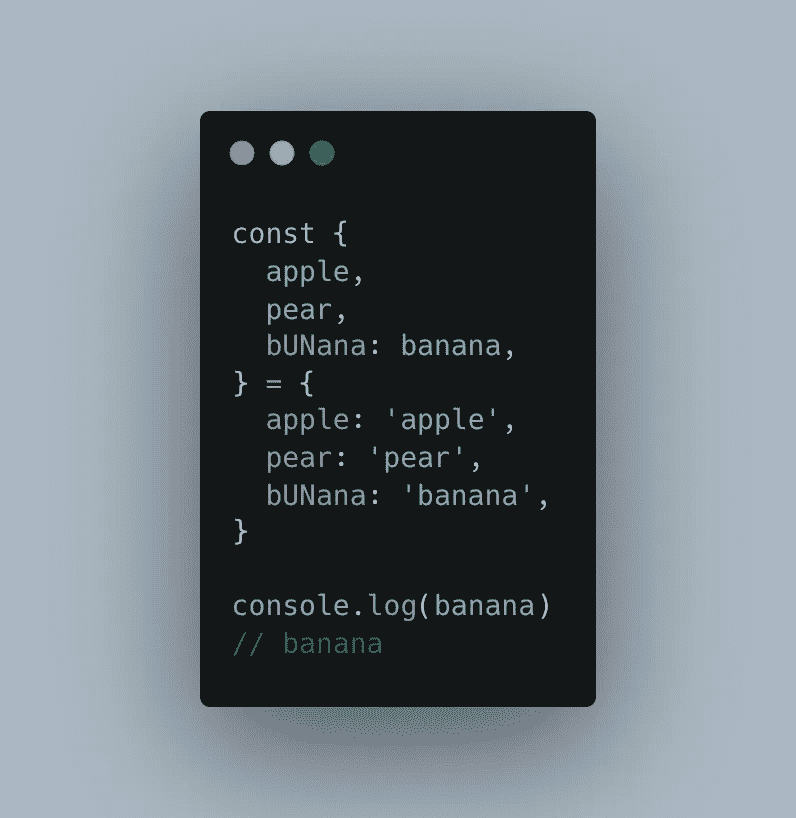
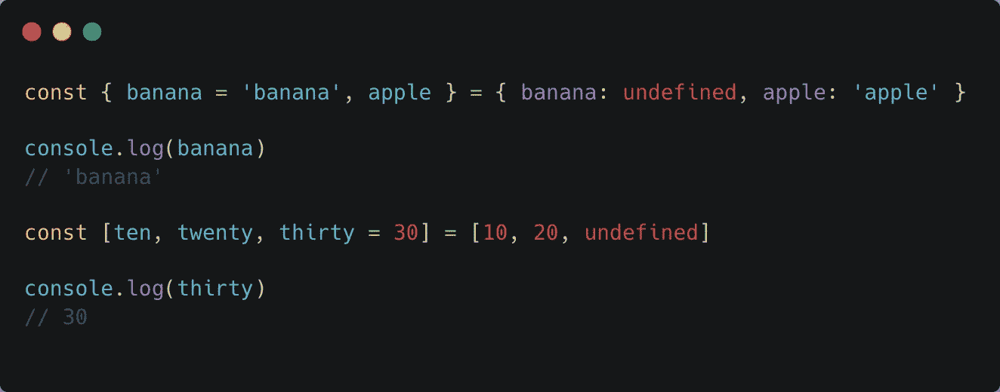
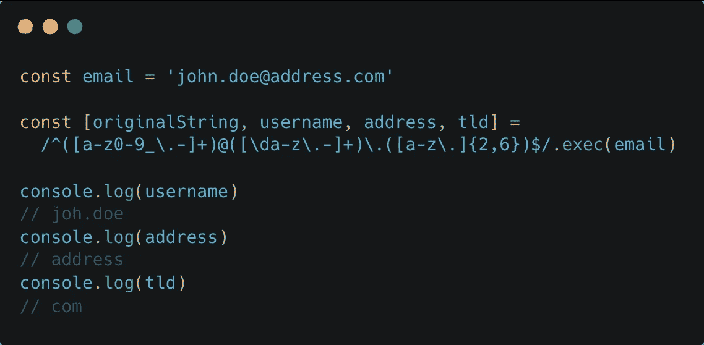
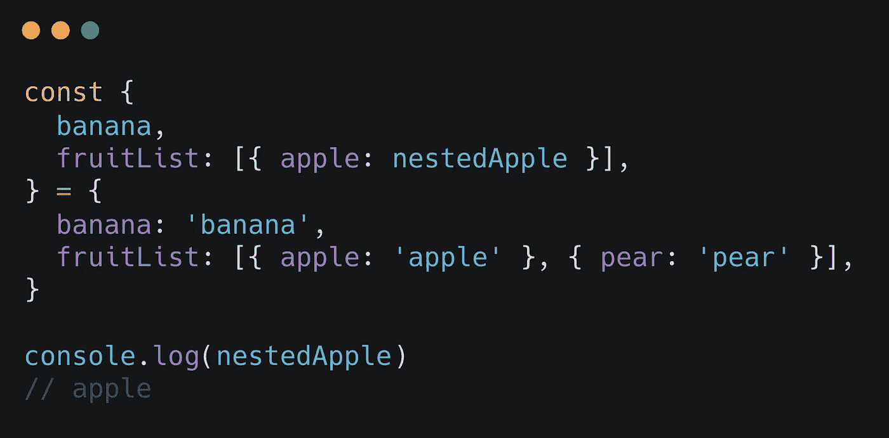
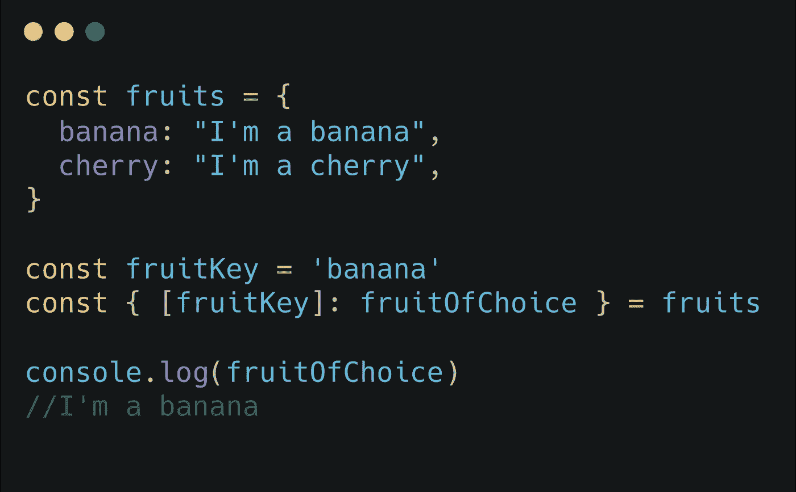
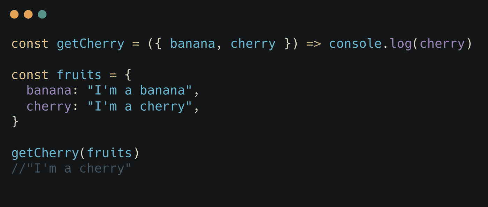

# 每个开发人员都应该知道的 10 个强大的 JavaScript 析构技术

> 原文：<https://javascript.plainenglish.io/10-powerful-javascript-destructuring-techniques-every-developer-should-know-15ae06818bb6?source=collection_archive---------1----------------------->

## 从零到英雄的解构


Photo by [Joshua Aragon](https://unsplash.com/@goshua13?utm_source=unsplash&utm_medium=referral&utm_content=creditCopyText) on [Unsplash](https://unsplash.com/s/photos/code?utm_source=unsplash&utm_medium=referral&utm_content=creditCopyText)

JavaScript 析构赋值已经存在一段时间了。它提供了将对象和数组中的值直接解包到变量中的机会，为我们开发人员节省了大量的时间和代码。

因为析构如此强大和方便，我猜你很难找到一个没有使用过它的 JavaScript 开发人员。但是，尽管你可能已经掌握了析构的要点，但很可能你还没有触及它的全部潜力。为了帮助你从学徒到大师，这里有 10 种方法来提升你的破坏能力。

## 1.忽略值

数组通常携带大量数据。很多时候，这些数据中只有一部分需要进一步处理。因此，当析构数组时，可以有选择地解包值，忽略不需要的值。如果您希望某个值保持不变，只需写一个逗号。



## 2.分配剩余值

大多数开发者都会知道 [rest 参数](https://developer.mozilla.org/en-US/docs/Web/JavaScript/Reference/Functions/rest_parameters)。一个函数的参数以 3 个点为前缀，接受无限数量的参数，并将它们解析为一个数组。

但是你知道 rest 模式也可以用于析构吗？通过在一个变量前加上 3 个点，你可以将所有剩余的值放入其中。

这适用于对象和数组析构。虽然很高兴知道对象的[提案](https://github.com/tc39/proposal-object-rest-spread)目前处于第 4 阶段，这意味着它将正式包含在 ECMAScript 的下一个版本中。



## 3.组合数组和对象析构

对象和数组的析构本身就很强大，但是将两者结合起来会给你带来开发的超能力。如果您面对一个内部有对象的数组，您可以使用这种技术直接解包嵌套的对象。



## 4.交换数组中的变量

你曾经需要交换数组中的两个变量吗？如果是这样，你知道这是一个繁琐的任务。为了交换到这两个变量，您需要引入一个临时的第三个变量来存储要交换的其中一个值。

```
var temp = array[index1];

array[index1] = array[index2];
array[index2] = temp;
```

但是使用析构，这个临时变量就不再需要了。你可以直接交换这两个变量！



## 5.重命名变量

至少可以说，每个开发人员都见过不明确的对象键。键经常包含拼写错误或者没有以一种清晰的方式与它们的值相关联。为了克服这个问题，您可以在析构对象时设置一个新的变量名。解包值时，只需写一个冒号，后跟新名称。



## 6.默认值

如果说写代码有一个保证的话，那就是不能相信数据。值可能会发生意外变化，边缘情况不可避免。

因此，提供默认值或后备值通常是个好主意。析构时设置默认值非常简单。只需在变量名后写一个`=`符号，并提供默认值。当数组或对象中的值为`undefined`时——任何其他空值都将被解包——默认值被赋给变量。



## 7.析构正则表达式

正则表达式用于定位字符串中的模式。当一个正则表达式在 javascript 中被执行(`RegExp.exec()`)时，匹配项作为一个字符串数组返回。

使用数组析构，您可以直接将 RegExp 匹配解包到所需的变量。在下面的例子中，我们将一个邮件地址分解成几个独立的部分，并直接将它们赋给变量。漂亮！



## 8.嵌套解构

对象和数组并不总是平面的。你知道你不需要单独的析构赋值来解包值吗？这些赋值可以嵌套在一个子句中，以直接到达所需的级别。



## 9.动态对象键

假设您想要解包一个键是动态的对象。既然你不能确定键名的有效性，析构是不可能的吗？

没有。析构时可以动态分配对象键，提供了额外的灵活性。



## 10.析构函数参数

在前面的所有例子中，我们将对象值解包到变量中。但是如果一个对象是作为函数参数提供的，我们可以完全跳过这一步。函数参数可以直接被析构，使得值可以在函数体中使用。



这是一个总结！在 10 个步骤中，我试图向你展示析构赋值的全部潜力。我希望你在这个过程中学到了一些新东西。对改进 JavaScript 的更多技术感兴趣吗？下面的文章可能很适合你！

[](/7-little-known-techniques-to-improve-your-javascript-20a9e870a5fe) [## 提高 JavaScript 的 7 个鲜为人知的技巧

### 世界上最著名的编码语言的隐藏宝石

javascript.plainenglish.io](/7-little-known-techniques-to-improve-your-javascript-20a9e870a5fe) 

**资源:**

*   destructing assignment:[https://developer . Mozilla . org/en-US/docs/Web/JavaScript/Reference/Operators/destructing _ assignment？retiredLocale=ar](https://developer.mozilla.org/en-US/docs/Web/JavaScript/Reference/Operators/Destructuring_assignment?retiredLocale=ar)
*   Rest 参数:[https://developer . Mozilla . org/en-US/docs/Web/JavaScript/Reference/Functions/rest _ parameters](https://developer.mozilla.org/en-US/docs/Web/JavaScript/Reference/Functions/rest_parameters)
*   休息/散提议:【https://github.com/tc39/proposal-object-rest-spread 
*   regex exec:[https://developer . Mozilla . org/en-US/docs/Web/JavaScript/Reference/Global _ Objects/RegExp/exec](https://developer.mozilla.org/en-US/docs/Web/JavaScript/Reference/Global_Objects/RegExp/exec)

*更多内容请看*[*plain English . io*](http://plainenglish.io/)*。报名参加我们的* [*免费周报*](http://newsletter.plainenglish.io/) *。在我们的* [*社区获得独家写作机会和建议*](https://discord.gg/GtDtUAvyhW) *。*