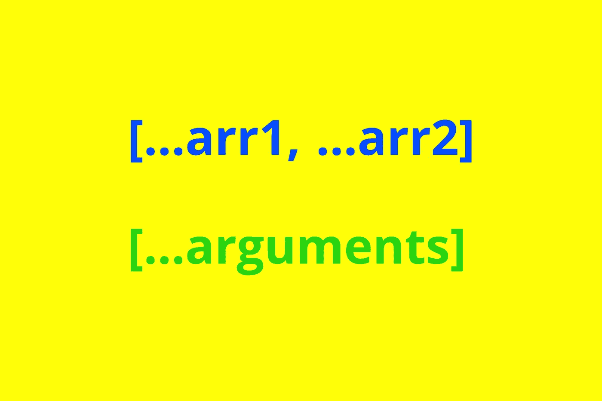
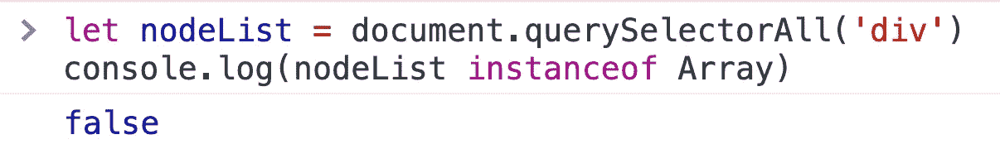
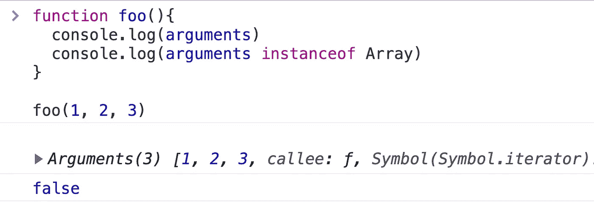
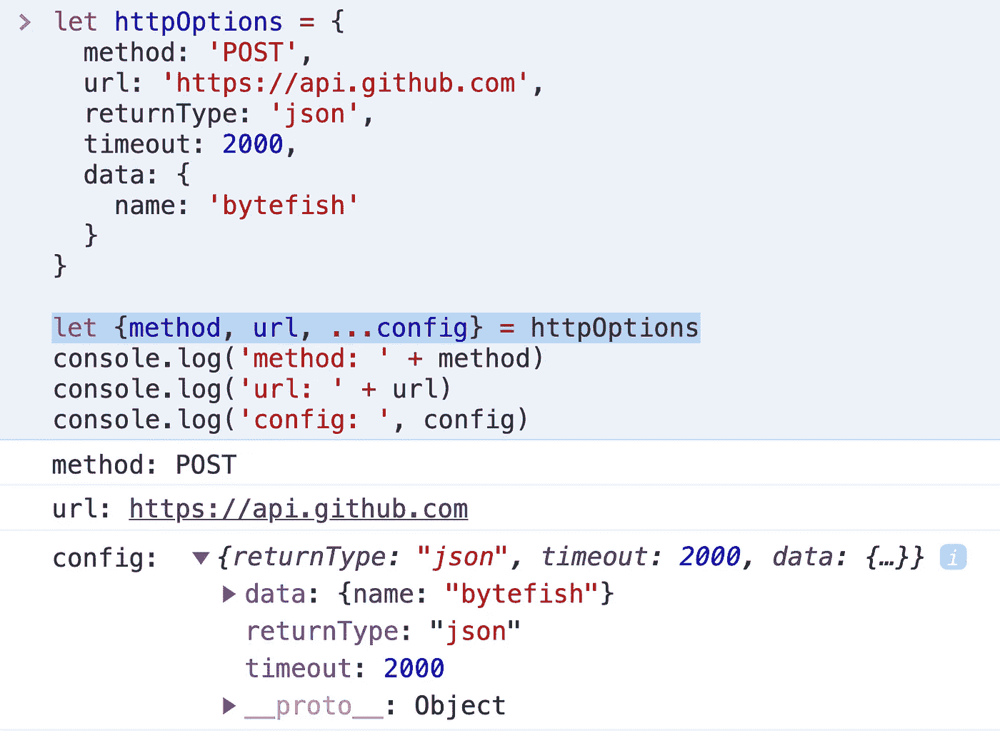
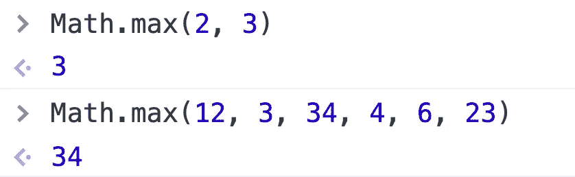
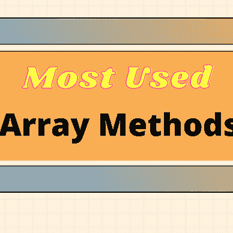
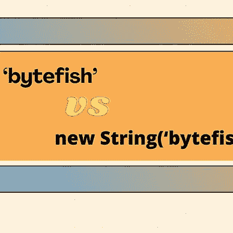
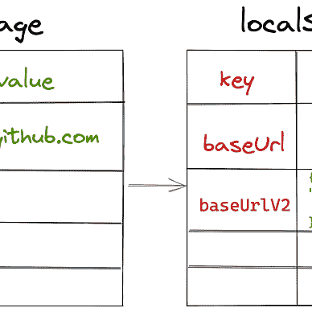

# JavaScript Spread 语法的 10 个强大用途(…)

> 原文：<https://javascript.plainenglish.io/10-powerful-uses-of-spread-syntax-that-youll-love-a3fe70ae503c?source=collection_archive---------2----------------------->



Created by the author

**Spread Syntax(…)** 是 ES6 中引入的一个特性，它允许我们快速地从可迭代对象中提取元素。使用这种语法，我们可以避免使用大量复杂的 API，并编写更简洁的代码。你看完这篇文章，相信你会喜欢这个功能的。

注意:嵌入演示可能需要一点时间来加载；请稍等片刻。

# 1.复制数组

复制数组的传统方法是使用数组的切片方法。

然而，slice 方法最初是为了捕获数组的片段，而不是复制它们。这个 API 很容易忘记，但是使用 spread 语法非常简单明了:

# 2.复制一个对象

要复制一个对象，您可以使用`Object.assign()`:

使用扩展语法:

使用 spread 语法，可以提取对象的所有可枚举属性，并将它们添加到新对象中。

# 3.将元素添加到数组的开头或结尾

在数组的开头和结尾添加元素是一项常见的任务，数组提供了推送和取消推送方法:

如果我们使用 spread 语法，代码会更加简洁易懂:

注意:`arr.push`和`arr.unshift`修改当前数组，而 spread 语法创建一个新数组。你应该根据自己的需要选择合适的方法。*(感谢* [*蓝色折纸数码——雷诺·哈梅林*](https://medium.com/u/b4bfe71efbd2?source=post_page-----a3fe70ae503c--------------------------------) *的评论)*

# 4.合并数组

传统方式:

使用扩展语法:

# 5.合并对象

传统方式:

使用扩展语法:

# 6.将字符串转换为数组

传统方式:

使用扩展语法:

# 7.将类似数组的对象转换为数组

JavaScript 中的一些数据结构看起来像数组，但不是数组，例如节点列表、函数的参数对象等。像数组一样，它们是一种顺序结构，其中的元素可以通过索引来访问。但是它们没有普通数组的一些属性和方法。



为了处理这些类似数组的对象，我们有时需要将它们转换成数组。

传统方式:

使用扩展语法:

在 JavaScript 中， [Rest 语法](https://developer.mozilla.org/en-US/docs/Web/JavaScript/Reference/Functions/rest_parameters)和 Spread 语法的符号是相同的，都是`…`。还有一个微妙的区别:

*   Rest 语法将所有剩余的元素收集到一个数组或对象中。
*   spread 语法将收集的元素(如数组)解包成单个元素。

这里还有几个例子也使用了`…`，理论上应该属于 Rest 语法。虽然 Spread 语法和 Rest 语法相似，但我认为没有必要关心这些概念上的细微差别。所以我也将在这里放几个 Rest 语法用法的例子。

# 8.提取对象

假设有一个物体:

```
let httpOptions = {
  method: 'POST',
  url: '[https://api.github.com'](https://api.github.com'),
  returnType: 'json',
  timeout: 2000,
  data: {
    name: 'bytefish'
  }
}
```

我们想得到这个对象的`method`和`url`，把其他字段放在一起，那么我们能做什么呢？

使用扩展语法，我们可以这样写:



提取这个对象的属性只需要一行代码，你几乎找不到更简洁的写法了。

# 9.具有无限参数的函数

假设我们需要编写一个求和函数，它可以接受任意数量的参数并将它们相加。我们如何编写这样一个函数？

一个程序员新手可能想知道一个函数怎么能接受无限多的参数。他可能会使用一个数组作为参数，并编写如下代码:

*如果你不知道* `*arr.reduce()*` *是怎么工作的，可以去查一下* [*我之前的文章*](/4-practices-to-help-you-understand-array-reduce-f3138cfef095) *。*

但是，这种写法需要我们将参数组合成一个数组来传递，不是很优雅。更好的办法是使用函数的 argument 对象来动态读取参数。

如果我们使用 spread 语法，我们可以直接将所有参数组合在一起:

这样，无论我们传递多少论证，它们都将被置于`arr`中。这个显然比第一个优雅，比第二个方便。

## Math.max

很多 JavaScript 内置函数都使用这种技术，比如`Math.max`。



如您所见，`Math.max`可以接受任意数量的参数。

如果我们想得到数组中最大或最小的数，我们可以写:

# 10.休息参数

除了上述用法，我们还可以使用 rest 参数。假设我们有一个函数，它的前两个参数是固定的，其余的参数是不确定的，所以我们可以这样写:

# 结论

现在我们有了。JavaScript 中使用 spread 语法的 10 种方式。我希望你已经发现这是有用的。如果有，一定要在评论里让我知道。

# 建议


[字节鱼](https://bytefish.medium.com/?source=post_page-----a3fe70ae503c--------------------------------)

## 关于 JavaScript 的所有事情

[View list](https://bytefish.medium.com/list/all-things-about-javascript-5e55ebd6a712?source=post_page-----a3fe70ae503c--------------------------------)25 stories