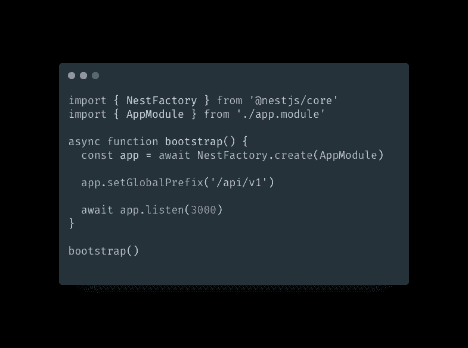
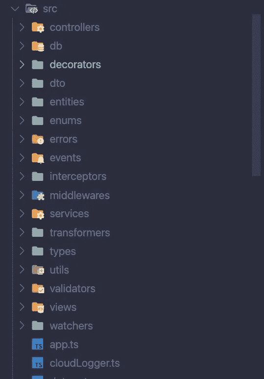
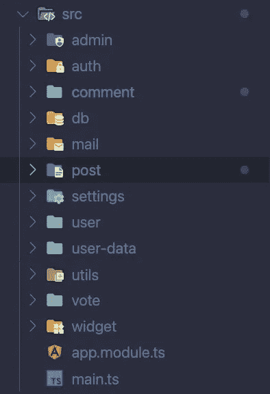
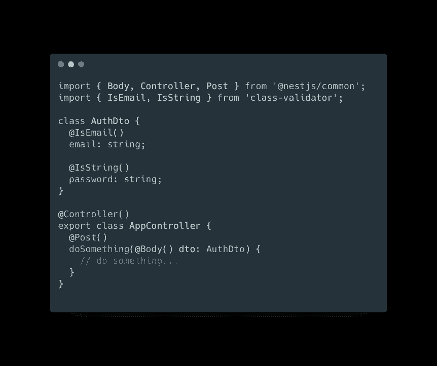
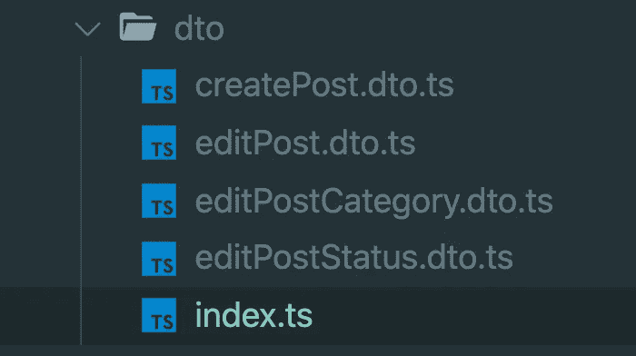
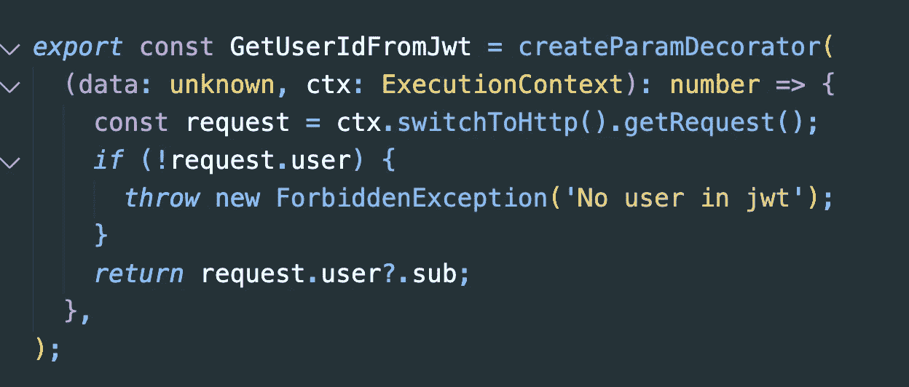
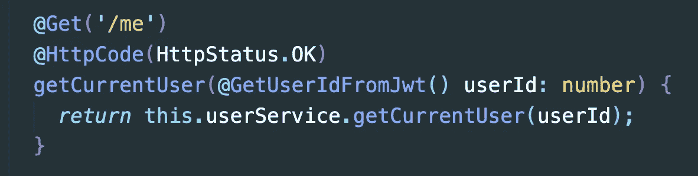

# 每个 Nest.js 开发者都应该知道的 10 件事

> 原文：<https://javascript.plainenglish.io/10-things-every-nest-js-developer-should-know-911dec32f66a?source=collection_archive---------1----------------------->

## 如何像坏蛋一样使用 Nest.js


Photo by [Cookie the Pom](https://unsplash.com/@cookiethepom?utm_source=medium&utm_medium=referral) on [Unsplash](https://unsplash.com?utm_source=medium&utm_medium=referral)

当我发现 Nest.js 的时候，我立马就搞定了。Nest.js 是一个现代化的、类型脚本友好的框架，可以用来构建任何东西。

在每天使用它一年后，它仍然是正确的。

不过，**框架是新的**。学的时候卡了很多。有时文档可以更好，有时我希望有更多的指导。

但是我学到了很多，想在这篇文章中与你分享。因此，没有进一步的原因，这里是我的**每个 Nest.js 开发者应该知道的 10 件事**。

# 1.API 需要一个全局前缀

为您的 API 设置一个全局前缀是一个很好的做法。我通常会给我的 API 端点加上前缀`/api/v1`。

为什么我们需要前缀？ [**格拉森伯格**](https://www.quora.com/Why-do-developers-use-the-API-V1-prefix-while-developing-a-server-side-API) 解释道:

> “好的 API 在设计时都考虑到了向后兼容性。在增强/添加 API 时，API 管理人员应该确保已经连接到该 API 的应用程序不会受到影响。”

简而言之，API 前缀是为了**向后兼容**和**清晰**。



# 2.模块化！

Nest.js 采用模块化结构。你的应用程序应该被分成块，分成**模块。**

通常将你的应用程序按照功能划分成文件夹，按照主题而不是类型。

**这是一个按类型划分的项目:**



**这个是按主题拆分的:**



对于 Nest.js 来说，模块是一个包含一个`@Module({})`装饰器的`.module.ts`文件的文件夹。但是也不尽然！不是每个文件夹都需要有一个`.module.ts`文件。例如，您可以创建一个文件夹" **utils"** ，在其中存储您的助手和 JSON 文件。

通过将你的文件组织到主题文件夹中，你会变得清晰明了，并且避免很多错误。此外，如果您不遵守这个原则，Nest.js 可能会在构建过程中崩溃。

# 3.使用 dto

**DTO =数据传输对象**。dto 就像接口，但它们的全部目标是传输数据并验证数据。它们主要用于路由器/控制器。

通过使用它们，您可以简化 API 主体和查询验证逻辑。例如，下面的 AuthDto 自动将用户的电子邮件和密码映射到一个对象`dto`来执行验证



如果您希望密码超过 5 个字符，您可以将 d to 与 class-validator 包配对来自动抛出错误。

有很多技巧可以让我们的 dto 变得不可思议，但那是以后的事了。

# 4.始终使用数据映射器/存储库模式，而不是活动记录

如果您正在使用 PostgreSQL 或 MySQL 之类的关系数据库，那您就在天堂了。Nest.js 附带了 TypeOrm，这是 Typescript 最强大的 Orm 之一。

TypeOrm 可以使用两种模式，一种是由 ruby on rails 推广的**活动记录模式**，另一种是使用存储库的**数据映射模式**。

> 使用活动记录方法，您可以在模型内部定义所有的查询方法，并使用模型方法保存、删除和加载对象。

下面是使用活动记录模式的情况:

```
const user = new UserEntity()
user.name = "Vladimir"
user.job = "programmer"
*await* user.save()
```

> 使用数据映射器方法，您可以在称为“存储库”的单独类中定义所有查询方法，并使用存储库保存、删除和加载对象。

下面是使用数据映射器模式的情况:

```
const user = this.userRepository.create()
user.name = "Vladimir"
user.job = "programmer"
*await* this.userRepository.save(user)
```

虽然活动记录乍一看似乎更好，但它违背了 Nest.js 提供的模块化，因为活动记录与**全局实体**一起工作，而数据映射器需要在使用实体之前将它们注入每个模块。

数据映射器可能看起来有点冗长，但对于大中型项目来说，它是一个更好的解决方案。它对于测试来说也很棒，因为它与依赖注入一起工作！

# 6.使用相对路径，而不是绝对路径

您可以使用绝对路径或相对路径来导入 es6 模块。Nest.js 将在开发中工作，但当你试图构建它时，它将崩溃。当你使用 Nest.js 时，总是使用相对导入路径。你以后会感谢我的。(当您`npm run build`时，绝对路径会出现错误)

```
// relative imports
*import* { SecurityService } *from* '../security/security.service';
*import* { CommentService } *from* '../comment/comment.service';// absolute imports
*import* { SecurityService } *from* 'src/security/security.service';
*import* { CommentService } *from* 'src/comment/comment.service';
```

# 7.若要隐藏数据，请使用 Exclude()

通常通过转换器过滤从数据库中获得的数据。转换器的全部目标是删除或格式化来自数据库的数据。那会导致很多垃圾逻辑。

为了避免它 [**你可以使用**](https://docs.nestjs.com/techniques/serialization#serialization) `@Exclude()`装饰器。

```
import { **Exclude** } from 'class-transformer';

export class UserEntity {
  id: number;
  firstName: string;
  lastName: string;

  **@Exclude()**
  password: string;

  constructor(partial: Partial<UserEntity>) {
    Object.assign(this, partial);
  }
}
```

# 8.使用实体 getters

一些逻辑可以作为属性直接附加到您的实体**上。最常见的用例与密码散列和获取全名有关。但是注意不要让你的实体负载过多的逻辑。为此使用 [**自定义库**](https://docs.nestjs.com/techniques/database#custom-repository)**

```
import { Exclude } from 'class-transformer';

export class UserEntity {
  id: number;
  firstName: string;
  lastName: string;

  **get fullName**() {
    return this.firstName + " " + this.lastName;
  }
}
```

# 9.使用集中式命名导出

您可以从同一个文件夹中导入所有的**，而不是从不同的文件中导入您的类。**



```
// inside index.ts
*export* * *from* './createPost.dto';
*export* * *from* './editPost.dto';
*export* * *from* './editPostCategory.dto';
*export* * *from* './editPostStatus.dto';**// and so to import those dtos you use**
import { CreatePostDto, EditPostDto } from './dto'**// instead of**
import { CreatePostDto } from './dto/createPost.dto'
import { EditPostDto } from './dto/editPost.dto'
```

更干净吧。

# 10.使用自定义装饰器来简化您的逻辑

如果使用 decorators，您的逻辑可以大大简化。

在这个例子中， **GetUserIdFromJwt** 将把用户“sub”字段从请求对象中分离出来，这是我们之前用 Jwt 策略验证过的。



所以你可以像这样在你的路线中直接使用这个逻辑



你可以为**的各种东西**使用定制装饰器。装饰者的另一个非常方便的用例是分页。

# 下一步是什么？

我希望您喜欢这篇文章，并发现它很有用。当我继续记录我的创业和软件开发之路时，你可以在 Twitter 上关注我。

点击此处阅读类似文章:

[](https://www.codewithvlad.com/blog/nestjs-caching-with-redis) [## NestJs 缓存与 Redis |代码与 Vlad 博客

### 恭喜你！您已经部署了一个越来越受欢迎的 NestJs 应用程序！很多用户都在使用你的应用程序…

www.codewithvlad.com](https://www.codewithvlad.com/blog/nestjs-caching-with-redis) 

*详见*[***plain English . io***](https://plainenglish.io/)