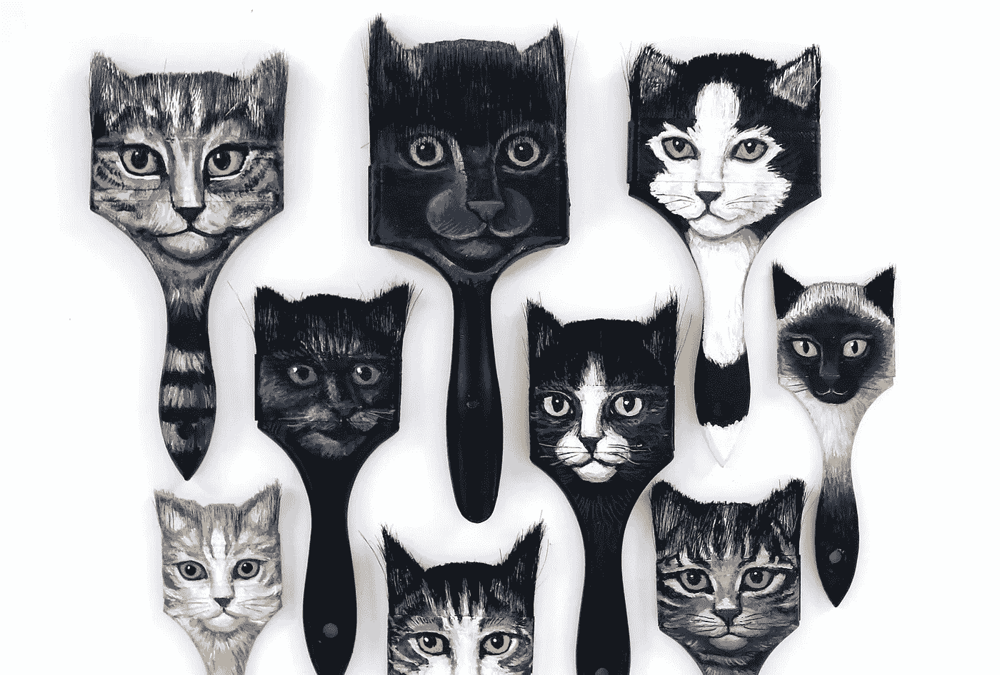
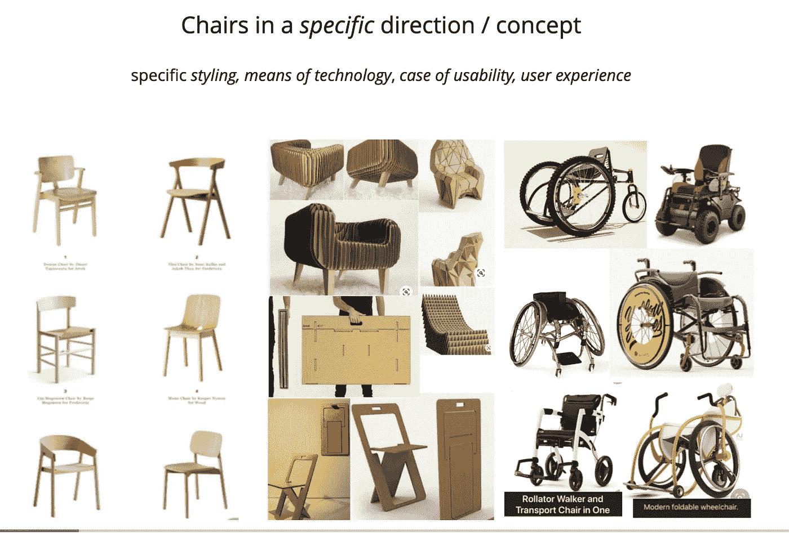
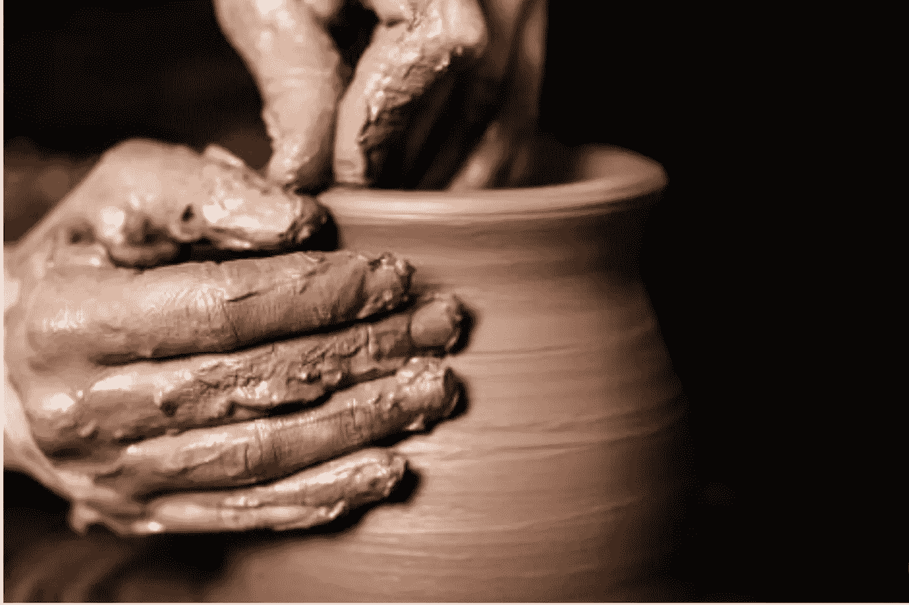
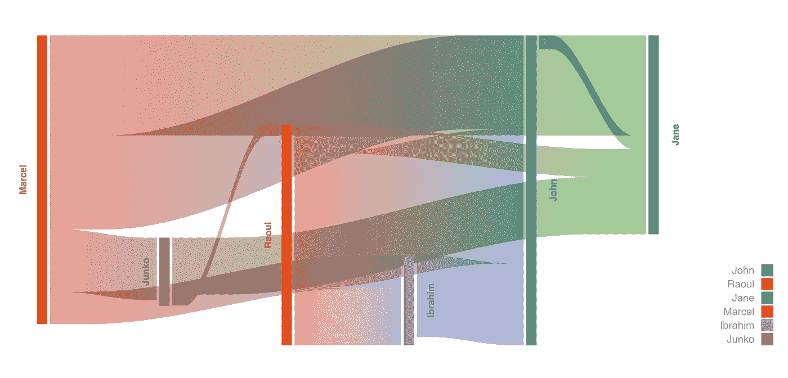
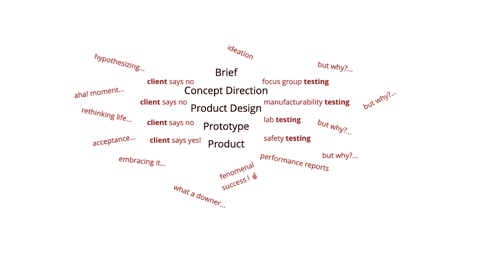
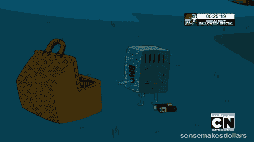

# 我在 10 年的产品设计和开发中学到的 10 件事

> 原文：<https://javascript.plainenglish.io/10-things-i-learned-in-10-years-of-product-design-and-development-aad81c0dff22?source=collection_archive---------14----------------------->

正如产品设计和开发包含迭代、细化和改进一样，我们也要经历类似的过程！以下是我在 10 年的产品设计和工程中总结出的 10 条突出的经验。

# 1.深切同情最终用户和你的利益相关者，设计一个双赢的产品

最终用户和你的利益相关者(创始人、客户、许可方等)是产品服务的双方。了解他们的观点和“使命”并深入回答以下问题非常重要:

*   他们最大的痛点是什么？
*   他们想要什么或者他们的主要目标是什么？
*   这方面的什么问题或需求困扰着他们？
*   什么样的结果会让他们感到幸福甚至欣喜若狂？

对他们的故事、使命、需求和感受越感同身受，产品机会就越明确，包括多方面的用户和利益相关者的需求…

# 2.*“说得好的问题是解决了一半”* —查尔斯·凯特林，通用汽车公司

我了解到，简报或问题定义越好，就越容易产生伟大的概念和产品设计，最终用户和利益相关者都会因为产品提供了双赢的解决方案而感到高兴。考虑在我关于[将产品问题定义为简短](https://klpdjolanta.medium.com/what-is-a-product-brief-artefact-a71df6acd969)的文章中阅读更多相关内容。

# 3.好产品=他们的问题得到解决

这可能是一个显而易见的说法，但值得一提的是，最终所有好的产品都是——解决了用户问题的*。用骨头砸椰子的猿猴痛苦地需要一些热量——骨头被用来解决他们的需要，即打碎椰子。*

*他们的问题越大越痛苦——获得巨大成功的机会就越大。关于这个主题最令人难忘的书籍之一是唐·诺曼的《日常用品的设计》*

**

# *4.概念设计是产品设计的元层次*

*概念设计和产品设计不是一回事，可能会导致**截然不同的**产品结果。许多“解决方案化”的想法是产品想法，而不是概念。换句话说——概念设计可以与更大的主题或服务设计相比较，而产品设计是遵循总体概念的具体解决方案说明。我了解到这种区别，而且这种区别在产品设计师中也很难找到——所以我在这里[放了一些幻灯片](https://slides.com/jolantajasiulion/product-pipeline)*

**

# *5.产品是过程的反映*

*通过尝试不同的产品流程，我了解到管道塑造了产品结果。有明确定义的(设计的？)处理或根本没有处理会导致截然不同的产品。*

*当考虑哪些方法成为流程的一部分时，像扩展预生产以创建内部团队和外部用户经历的所有事情的完整服务地图，或承诺预生产完整的原型以重复概念和想法等事情对最终产品的成功产生了巨大的影响。投资好的方法，尝试新的或成熟的管道实践，会产生好的或不太好的产品。*

**

# *6.出色的前期制作降低了产品成本*

*预生产阶段包括以下步骤:定义用户需求、制定定位、重复概念和设计、预生产产品并进行测试。我了解到这是最关键的一步，通常保证和预测两件事:产品在关键参与者中的成功*和*廉价、可预测的资源。*

*有信心的前期制作通常可以防止旋转和昂贵的重建，允许廉价的设计迭代、测试、资源可预测性、满足最后期限、清晰度和所有相关方的一致性。*

**

# *7.高质量的交流来自积极的倾听*

*这一条触及了导致成功产品的团队文化。我很快了解到，积极的倾听和同情会导致团队成员、关键利益相关者和最终用户的良好配合和认同。*

*不仅其他人感到被倾听和被深刻理解，而且它确保了需求和目标转化为成功的健壮产品。*

**

# *8.实践中学习*

*设计软件和技术堆栈都有一个共同点——它们变化很快。在过去 10 年尝试不同方法的过程中，我认为学习新技术的最好(最快)方法是沉浸式的方法——在你理解软件或主题(如机器学习)之前就开始编码/设计。*

*边做边学的方法让大脑在潜意识中自己进行强有力的联系。这是一种经过实践检验的方法，比如像 3 个月的流利的沉浸式语言课程、[创客学院——16 周的程序员训练营和](https://makers.tech/)[像 fast 这样的实用深度学习。艾](https://www.fast.ai/)*

# *9.作为项目领导的设计师和工程师组合产生了强大的产品*

*它还消除了对主动项目管理的需求——项目经理支持业务拓展职能，但他们的大部分角色是促进设计师和工程师之间交流的中间人。当项目分配了一个*设计师&工程师对*时，情况不再如此。*

*这两个人密切合作，并自己吸引各种需要的人。通常，一个高级设计师+初级工程师或(产品意识)高级工程师+初级设计师的伟大组合不仅能快速提升团队技能，还能平衡新鲜热情的想法和丰富的经验，从而产生强大的产品解决方案和(额外的)精益团队。*

**

# *10.如果你没有学到任何新东西，是时候去寻找新的、扣人心弦的挑战了*

*这是我从一个朋友和一个 x 同事那里学到的，这个建议改变了我对应该设定的目标的看法。*

*作为一名优秀的设计师/开发人员，我知道保持*多才多艺和适应性*对于保持你积极的生产力和竞争力是非常重要的。确保你在学习并增加你的多面性是关键。对你所面临的学习和问题保持兴奋也有助于克服困难。*

**

*我希望你喜欢这篇文章！花时间反思和审视所学到的东西是一种特权和一种祝福，♥️如果想获得更多额外的知识，可以考虑阅读我的 [5 个技巧来提升程序员的技能和自信。](https://klpdjolanta.medium.com/5-tips-to-boost-your-confidence-skill-as-a-programmer-illustrated-using-lego-6a3da50f9ba6)*

**更多内容请看*[***plain English . io***](http://plainenglish.io)*