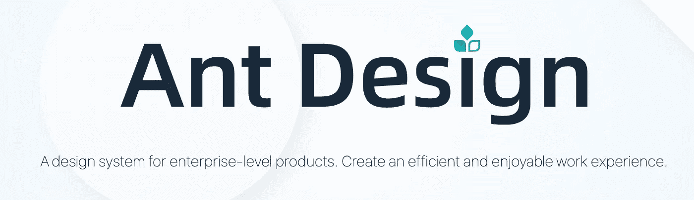
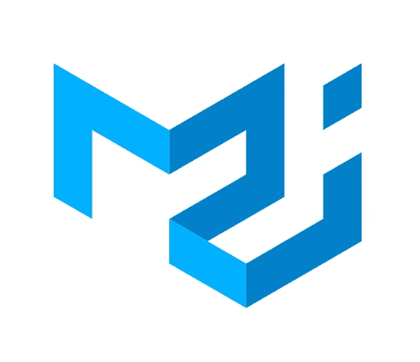
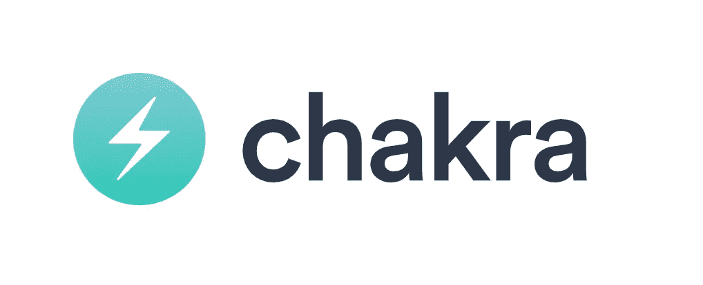
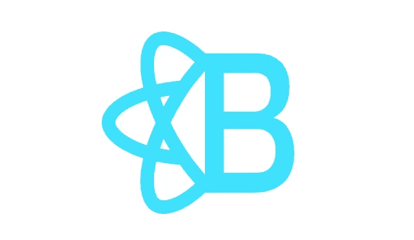
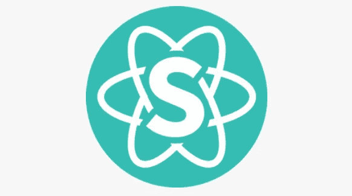
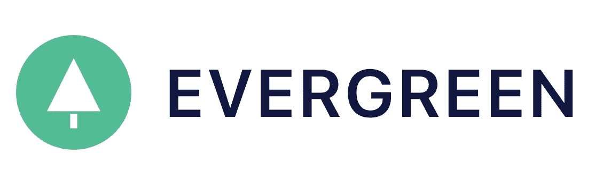
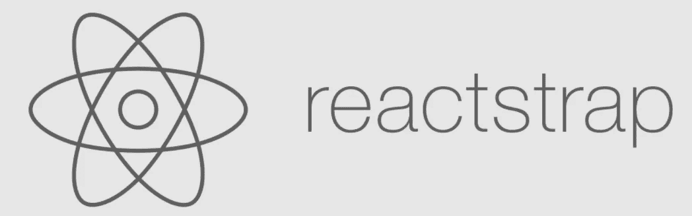
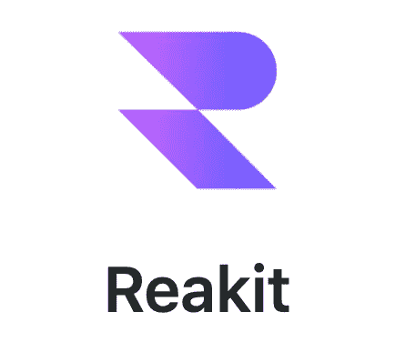

# 10 个 UI 库，让您的 React 应用程序开发更快

> 原文：<https://javascript.plainenglish.io/10-ui-libraries-to-make-your-react-app-development-faster-8c807bf54781?source=collection_archive---------6----------------------->

## 10 React UI 库，让开发更快更流畅。

Photo by [UX Store](https://unsplash.com/@uxstore?utm_source=unsplash&utm_medium=referral&utm_content=creditCopyText) on [Unsplash](https://unsplash.com/s/photos/design?utm_source=unsplash&utm_medium=referral&utm_content=creditCopyText)

React 有一个非常大的社区，它有 *n* 个用于所有功能的包。UI 是任何应用程序中最有价值的部分。说到 React 应用，我们可能会有一些复杂的用户界面和流程。

我们可能需要额外的时间来从头构建一个组件。例如，如果我们的组件有一个表单或表格，我们可能会选择第三方库来减少开发时间。但这将导致我们在应用程序中使用许多第三方包。

当我们的依赖性增加时，会导致一些问题，如一些包贬值或无法与新的 React 版本兼容。这将阻止我们的应用程序升级到新版本。这个要看项目。

为了减少这类问题和包，我们可以选择一个 UI 库。UI 库包含最常用的组件，它有一个更大的社区来保持它的最新状态。对于大多数 React 应用来说，这已经足够了。

在本文中，我们可以看到基于 Github stars 的 10 大 React UI 库。

# 1.蚂蚁设计

[蚂蚁设计](https://github.com/ant-design/ant-design)是企业级 UI 设计语言和 React UI 库。它是最流行的基于 GitHub Stars 的 React UI 库。它有 100 多个组件，从排版到表格。Ant 设计文档非常干净，有清晰的例子。

Ant Design 不仅节省了开发人员的时间，也节省了设计人员的时间，因为它包括所有组件的草图和 Figma 文件。Ant 设计组件支持 JSX 和类型脚本。自定义 ant 主题也很简单。Ant 组件为开发人员节省了大量处理表单和验证的时间，因为它预先构建了表单组件。蚂蚁设计也支持钩子。

GitHub - 73.8K ⭐

# 2.材料-用户界面

[Material-UI](https://github.com/mui-org/material-ui) 也是最流行的 React UI 库。这是一个简单且可定制的组件库，用于构建更快、更漂亮、更易访问的 React 应用程序。Material-UI 包含 100 多个组件。还包括 1K plus 图标。

Material-UI 还为设计师提供付费的 Sketch、Figma、Adobe Xd 文件。Spotify、NASA、网飞、亚马逊等顶级组织也在使用 Material-UI。Material-UI 有准备充分的文档和代码示例。

GitHub - 70.3K ⭐

# 3.Chakra UI

[Chakra UI](https://github.com/chakra-ui/chakra-ui) 提供了一套可访问、可重用和可组合的 React 组件，使创建网站和应用程序变得非常容易。查克拉 UI 组件遵循 [WAI-ARIA](https://en.wikipedia.org/wiki/WAI-ARIA) 指南规范，并拥有正确的`aria-*`属性。Chakra UI 社区因其性能和体验而增长更快。Chakra UI 有准备充分的文档和代码示例。

GitHub - 20K ⭐

# 4.反应引导

[React 引导](https://github.com/react-bootstrap/react-bootstrap)启用 React 组件的引导 JS。React 引导组件是用 React 从头开始构建的，不包含 jQuery。React Bootstrap 包含了我们在 JavaScript 中使用的所有引导组件。现在它包括测试阶段的 Bootstrap 5。React Bootstrap 有准备充分的文档和代码示例。

GitHub - 19.8K ⭐

# 5.语义 UI 反应

语义是一个基于自然语言有用原则的 UI 组件框架。

语义 UI React 是官方的语义-UI-React 集成。它包含 50 多个组件，是 jQuery 免费的，有自动控制的状态，子组件，等等。如果你的 React App 需要语义 UI，可以首选这个包。

GitHub - 12.4K ⭐

# 6.流畅的用户界面

[Fluent](https://www.microsoft.com/design/fluent/#/) 是一个开源、跨平台的设计系统，为设计师和开发者提供了创建引人入胜的产品体验所需的框架，包括可访问性、国际化和性能。Fluent 设计用于 Windows 10 设备、工具，也用于 Windows 11。

[Fluent UI](https://github.com/microsoft/fluentui) 由微软开发，它集合了用于构建 web 应用的实用程序、React 组件和 web 组件。它有很好的文档。

GitHub - 12K ⭐

# 7.常绿树

[Evergreen](https://github.com/segmentio/evergreen) 是在[部门](https://segment.com/)构建产品体验的 UI 框架。它作为一个灵活的框架，它的许多视觉设计是通过与细分设计团队和外部贡献者的大量迭代来实现的。Evergreen 有 30 多个组件，文档看起来也不错。

GitHub - 11K ⭐

# 8.反应阱

[Reactstrap](https://github.com/reactstrap/reactstrap) 通过 React 帮助使用 Bootstrap 4 组件。这很容易配置和使用。它有很好的使用组件的文档。

GitHub - 10.1K ⭐

# 9.索环

[Grommet](https://github.com/grommet/grommet) 是一个基于 React 的框架，它在一个整洁的包中提供了可访问性、模块化、响应性和主题化。它有 60 多个组件。它还提供了 Sketch、Figma、AdobeXd 文件和 600 plus SVG 图标。索环被网飞，三星，优步，波音，IBM 和更多的组织使用。

GitHub - 7.4K ⭐

# 10.雷基特

[Reakit](https://github.com/reakit/reakit) 是一个低级组件库，用于使用 React 构建可访问的高级 UI 库、设计系统和应用程序。它又小又快。

GitHub - 5K ⭐

# 结论

UI 库节省了开发时间，减少了更多依赖项的使用。还有一些 UI 库，我只列出了最常用的。我希望你已经发现这是有用的。感谢您的阅读。

# 进一步阅读

 [## 2023 年最佳的 5 个 React UI 框架和组件库——开发者指南

### MUI，Saas UI，Mantine，Tailwind。基于组件多样性、性能和效率的 React UI 库综合指南

javascript.plainenglish.io](/best-react-ui-frameworks-and-component-libraries-408df66a1f31) 

*更多内容请看*[***plain English . io***](http://plainenglish.io/)