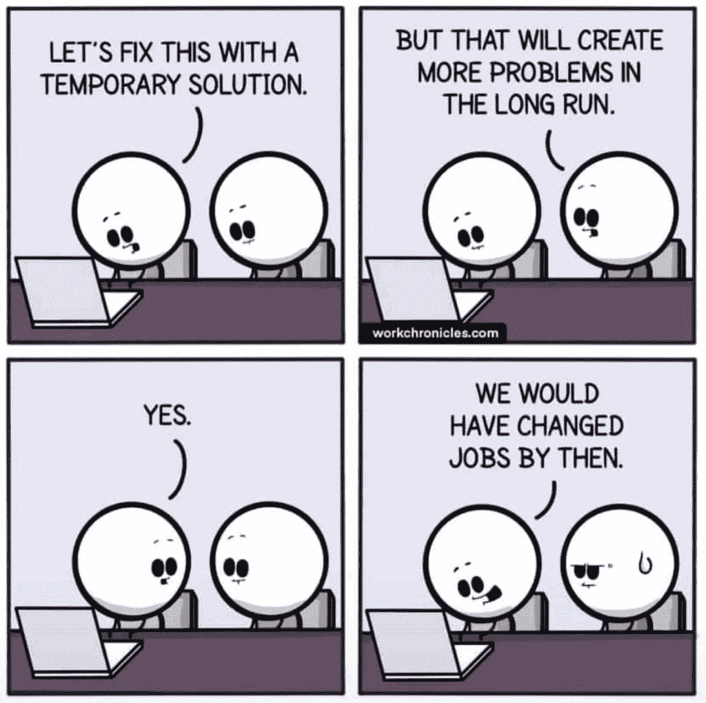
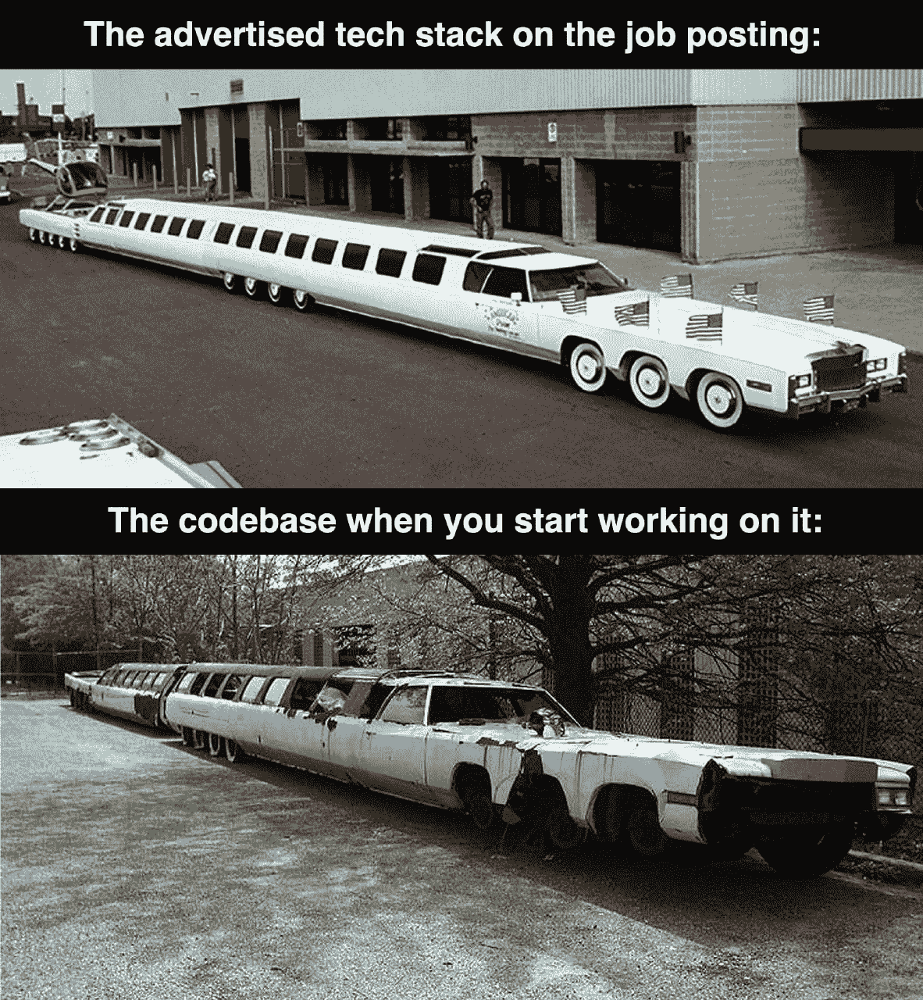
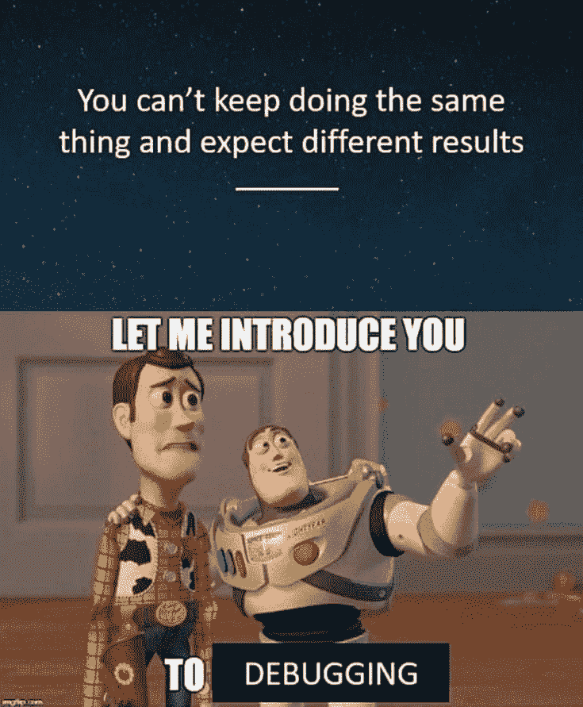
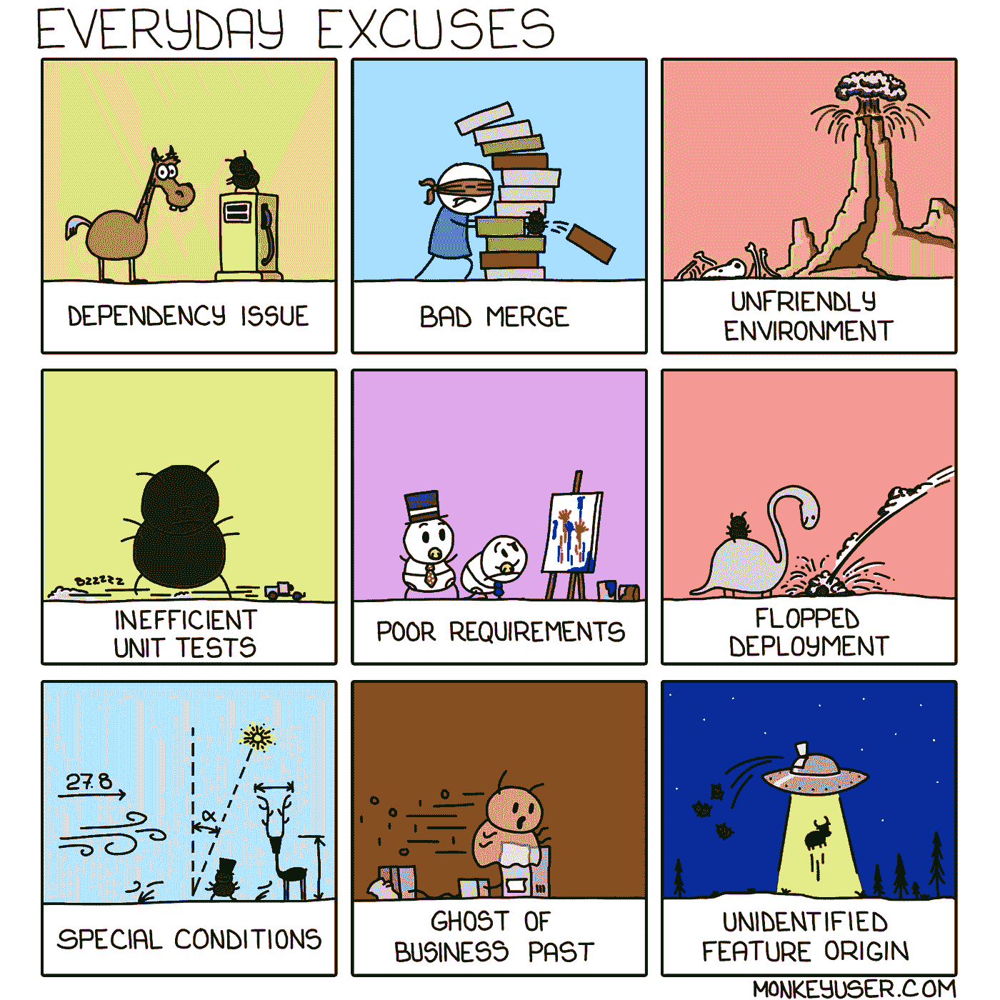
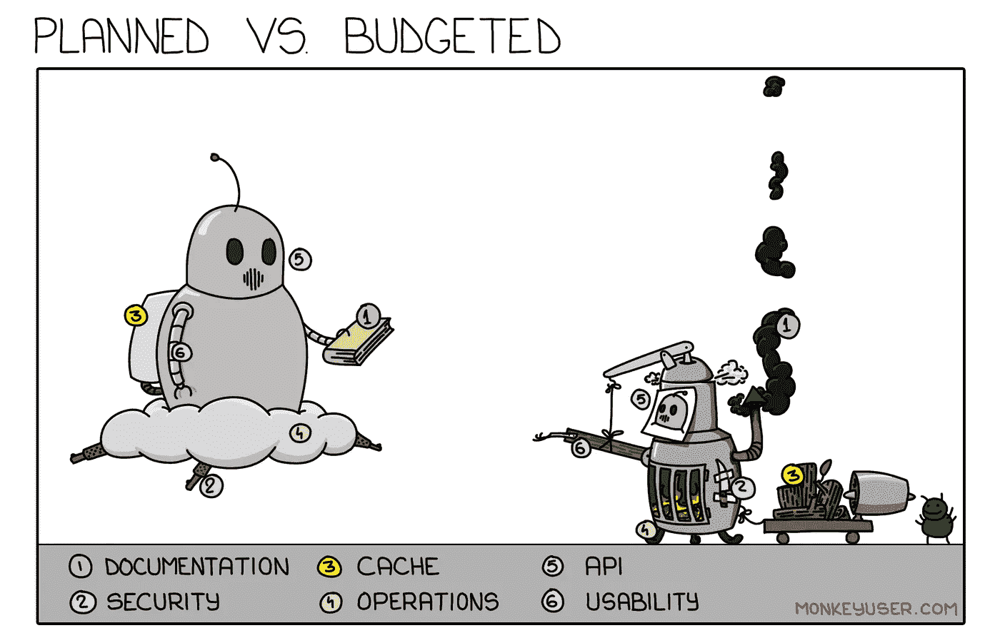
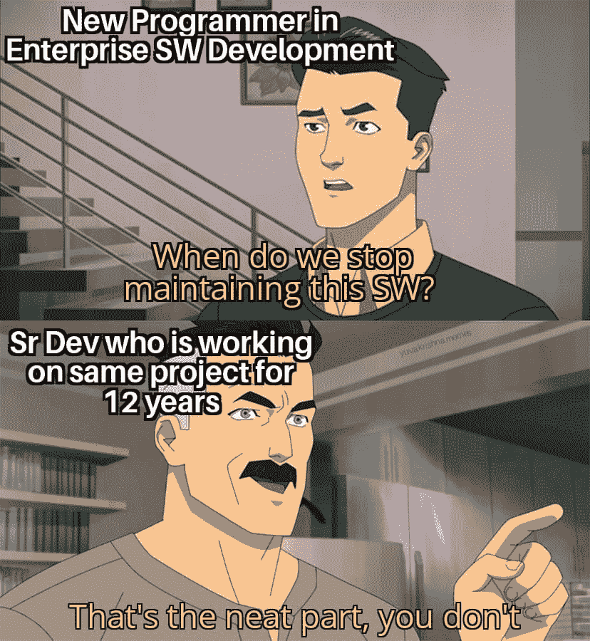
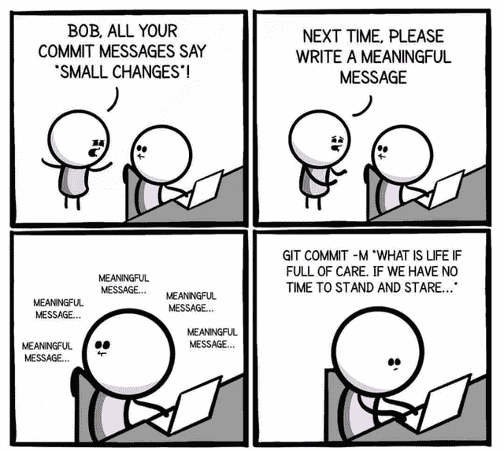
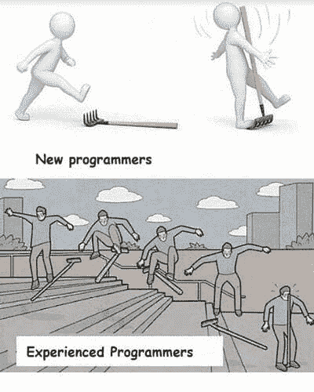
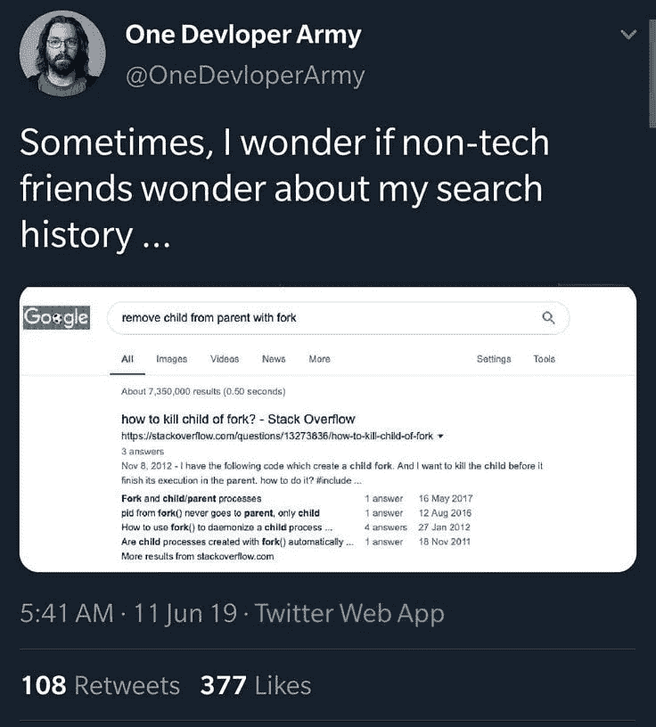

# 给程序员的 10 个 Ulitmate 笑话

> 原文：<https://javascript.plainenglish.io/10-ulitmate-jokes-for-programmers-4cc070cbbcf5?source=collection_archive---------1----------------------->

## 最佳编程笑话汇编 2021 系列

Photo by [Eliott Reyna](https://unsplash.com/@eliottreyna?utm_source=medium&utm_medium=referral) on [Unsplash](https://unsplash.com?utm_source=medium&utm_medium=referral)

***模因和快乐有什么联系吗？*** 如果你是我这种类型的人，那么你可能也爱在下班后查看手机。猜猜我在那里看到了什么？

我主要是在互联网上看到**视频、抖音和模因**。我不知道为什么，但这有助于我提神醒脑，减轻工作压力。这就是为什么我相信 *laugher 是人类最好的刷新按钮。*

在这篇文章中，我收集了一些我喜欢的网络迷因。

# 在这种在家工作的环境中，这是一件日常的事情…

[https://www.facebook.com/photo/?fbid=1242842096154148&set=gm.6657168974308830](https://www.facebook.com/photo/?fbid=1242842096154148&set=gm.6657168974308830)

**来源:**[https://www.facebook.com/groups/it.humor.and.memes](https://www.facebook.com/groups/it.humor.and.memes)

# 为什么要长期担心..虽然是坏习惯…

[https://www.facebook.com/photo/?fbid=10220125108430376&set=gm.6656120821080312](https://www.facebook.com/photo/?fbid=10220125108430376&set=gm.6656120821080312)

**来源:**[https://www.facebook.com/groups/it.humor.and.memes](https://www.facebook.com/groups/it.humor.and.memes)

# 当你看到 JD 拥有所有技术堆栈并为大型机工作时，这种情况经常发生…

[https://www.facebook.com/jokesvala/photos/a.2330223400336101/6458422107516189/](https://www.facebook.com/jokesvala/photos/a.2330223400336101/6458422107516189/)

**来源:**[https://www.facebook.com/groups/151139362111349](https://www.facebook.com/groups/151139362111349)

# 当比萨饼制造商从开发商那里得到具体指示时…

[https://www.facebook.com/photo?fbid=558024112082117&set=gm.959718131253464](https://www.facebook.com/photo?fbid=558024112082117&set=gm.959718131253464)

**来源:**[https://www.facebook.com/groups/151139362111349](https://www.facebook.com/groups/151139362111349)

# 同样的事情但是不同的结果…..

[https://www.facebook.com/techwithcodex/photos/a.137007467972178/356285432711046/](https://www.facebook.com/techwithcodex/photos/a.137007467972178/356285432711046/)

**来源:**[https://www.facebook.com/techwithcodex/](https://www.facebook.com/techwithcodex/photos/a.137007467972178/356285432711046/)

# 当我的合并破坏了代码…哈哈

[https://www.facebook.com/jokesvala/photos/a.2330223400336101/6458379167520483/](https://www.facebook.com/jokesvala/photos/a.2330223400336101/6458379167520483/)

**来源:**[https://www.facebook.com/jokesvala/](https://www.facebook.com/jokesvala/photos/a.2330223400336101/6458379167520483/)

# 你最常用的借口是什么？

[https://www.monkeyuser.com/2019/everyday-excuses/?sc=true&dir=random](https://www.monkeyuser.com/2019/everyday-excuses/?sc=true&dir=random)

**来源:**[https://www.monkeyuser.com/](https://www.monkeyuser.com/2019/everyday-excuses/?sc=true&dir=random)

# 啊…

[https://www.reddit.com/r/ProgrammerHumor/comments/pdv03s/you_guys_agree_with_me/](https://www.reddit.com/r/ProgrammerHumor/comments/pdv03s/you_guys_agree_with_me/)

**来源:**[https://www.reddit.com/r/ProgrammerHumor/](https://www.reddit.com/r/ProgrammerHumor/comments/pdv03s/you_guys_agree_with_me/)

# 软件开发周期的现实…

[https://www.monkeyuser.com/2020/planned-vs-budgeted/?sc=true&dir=random](https://www.monkeyuser.com/2020/planned-vs-budgeted/?sc=true&dir=random)

**来源:**【https://www.monkeyuser.com/】T2

# 你有使用多种语言的实践经验吗？是的，事实上，我用所有的…

[https://programmerhumor.io/programming-memes/page/5/](https://programmerhumor.io/programming-memes/page/5/)

【https://programmerhumor.io/programming-memes/】来源:

# 奖金时间

# 我的生活问题…

[https://www.facebook.com/DZoneInc/photos/a.336758034711/10159553517674712/](https://www.facebook.com/DZoneInc/photos/a.336758034711/10159553517674712/)

# 当我和朋友谈论 JavaScript 和 Java 时，这种情况经常发生

[https://www.facebook.com/yuva.krishna.memes/photos/a.105527467815845/385113166523939/](https://www.facebook.com/yuva.krishna.memes/photos/a.105527467815845/385113166523939/)

# 如果你参加所有的产品会议，这意味着你知道一切…你是救世主…

[https://www.facebook.com/yuva.krishna.memes/photos/a.105527467815845/384661446569111/](https://www.facebook.com/yuva.krishna.memes/photos/a.105527467815845/384661446569111/)

# 我们能不能停止维护这个软件…

[https://www.facebook.com/yuva.krishna.memes/photos/a.105527467815845/384653033236619/](https://www.facebook.com/yuva.krishna.memes/photos/a.105527467815845/384653033236619/)

# 其中一个拙劣的笑话…

[https://www.facebook.com/photo/?fbid=4381277188618065&set=gm.6507842149241514](https://www.facebook.com/photo/?fbid=4381277188618065&set=gm.6507842149241514)

# LOL…安全测试是最差的…

[https://www.facebook.com/photo/?fbid=1286443845117522&set=gm.847086009343989](https://www.facebook.com/photo/?fbid=1286443845117522&set=gm.847086009343989)

# 有意义的信息。

[https://www.facebook.com/codevweb95/photos/a.109799858049136/118691307159991/](https://www.facebook.com/codevweb95/photos/a.109799858049136/118691307159991/)

# 不同的体验，不同的击球方式…

[https://www.facebook.com/coder724/photos/gm.1181013739084032/395320245487954/](https://www.facebook.com/coder724/photos/gm.1181013739084032/395320245487954/)

# 你在寻找什么？用叉子移除孩子？

[https://www.facebook.com/coder724/photos/gm.1181201935731879/395512935468685/](https://www.facebook.com/coder724/photos/gm.1181201935731879/395512935468685/)

# 延伸阅读:

 [## 每个程序员都能理解的 10 个笑话

### 2021 年最佳编程笑话汇编

javascript.plainenglish.io](/10-jokes-every-programmer-can-relate-to-48c583b3a827)  [## 25 个以上的 StackOverflow 编程迷因，所有开发人员都可以涉及到

### 编程幽默可以通过刷新你的情绪来减轻你的压力

javascript.plainenglish.io](/25-more-stackoverflow-programming-jokes-that-all-devs-can-relate-to-ebc2f9c11ca3)  [## 有趣的比较:程序员与普通人

### 是什么让程序员与众不同？

javascript.plainenglish.io](/funny-comparisons-programmers-vs-normal-people-3aa7002f62f0) 

*更多内容请看*[***plain English . io***](http://plainenglish.io/)