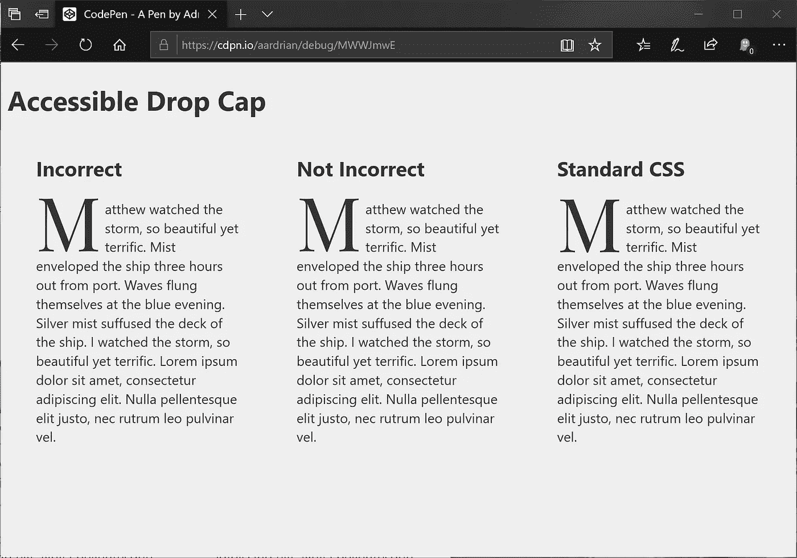
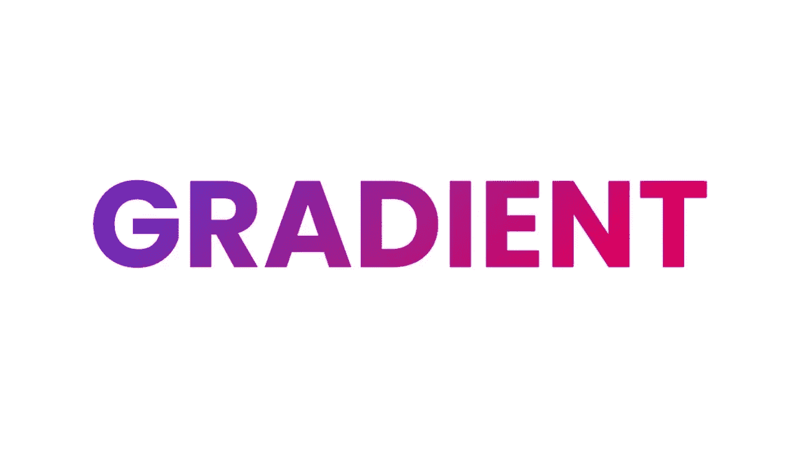
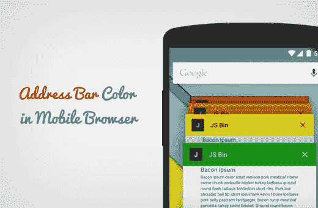

# 每个开发人员都应该知道的 10 个有用的 CSS 技巧和窍门

> 原文：<https://javascript.plainenglish.io/10-useful-css-tips-and-tricks-every-developer-should-know-4d8b2a5dcea1?source=collection_archive---------11----------------------->

## 改善前端开发过程的有用 CSS 技巧列表。

Image by [Mohit](https://medium.com/u/da968086e185?source=post_page-----4d8b2a5dcea1--------------------------------)

在开发交互式用户界面时，层叠样式表(CSS)非常棒，非常强大。CSS 有一些惊人的隐藏技巧和窍门，可以用来改善你的网站的外观。

在这篇文章中，我们将看到一些优秀的 CSS 技巧，每个前端开发人员都需要知道这些技巧来开发出令人惊叹的、用户友好的网页。

## **1。首字下沉**

我们可以在 CSS 中实现首字下沉。它比看起来简单得多。查看下面显示的图片和代码片段。

Drop Cap Sample

## **2。给文本添加渐变**

给文本添加渐变会使文本看起来很棒，因为它提供了令人惊叹的文本颜色。

它也为你的设计增加了一些引人注目的功能。

Gradient Text

要给文本添加渐变，它采用如下代码片段的形式。

## **3。使用 SVG** 屏蔽图像

这个特性是什么，我们可以在一个 SVG 里面屏蔽一个图像。检查下图。

Image on SVG mask

CSS 非常强大，为我们提供了许多功能，我们可以实现这些功能。

## **4。将图像用作光标**

是的，我们可以在 CSS 中使用图像作为光标，如果你不知道的话。举个例子，你想在你的内容上提供一个图像光标。

为此，您需要提供如下面的代码片段所示的内容。

## **5。样式列表标记**

你是否厌倦了普通的无聊列表，CSS 使得列表样式化成为可能。

要定制列表标记，您需要编写如下所示的 CSS 代码。

## **6。视频字幕样式。**

CSS 拥有强大的 cue 伪元素，可以用来设计视频中的字幕。

## **7。用文本剪辑视频**

CSS 使得剪辑包含文本的视频成为可能。

查看下面显示的代码片段。

这一招最初来自推特上的[乔治·莫勒](https://twitter.com/_georgemoller)。

## **8。平滑滚动**

虽然我们可以用 JavaScript 实现平滑滚动，但 CSS 让我们更容易在网站中实现平滑滚动。

要启用平滑滚动，您需要将平滑行为设置为平滑。

检查下面显示的代码片段。

## **9。过滤图像**

图像构成了网络的一大部分，你可以使用滤镜来模糊图像。您可以使用 filter 属性来模糊、饱和、增加亮度、增加饱和度以及其他属性。

查看下面的代码片段。

## 10。自定义移动浏览器标题中的地址栏。

请看下图。手机浏览器的标题有多种颜色。我们可以修改这一点，并创建一个与我们网站的颜色主题相融合的颜色。

要更改或定制移动浏览器标题中的默认地址栏，我们需要包含 meta 标记，如下面的代码片段所示。

在 meta 标签中，我们需要传入两个参数，即名称和内容，在这里我们指定我们想要的颜色。您可以将颜色包含在十六进制代码中。

## **最终想法**

当你想建立一个交互式用户界面时，级联样式表是非常强大的。

这些只是我们可以在 CSS 中利用的一些技巧和窍门。

感谢您到目前为止阅读完这篇文章。希望对你有帮助。

如果你认为其他人可能会从这篇文章中受益，不要犹豫，与他人分享。

## **更多内容:**

 [## 如何在 React 中使用字体出色的图标

### 了解如何在 React 中使用字体出色的图标。

javascript.plainenglish.io](/how-to-use-font-awesome-icons-in-react-229af382dfa0)  [## 如何在 Vue.js 中进行数据绑定

### Vue.js 中的数据和输入绑定，并附有示例。

javascript.plainenglish.io](/how-to-perform-data-binding-in-vue-js-c22934f7721a) 

*更多内容尽在*[*plain English . io*](http://plainenglish.io/)