# 你可能不知道的 10 个有用的 VS 代码快捷方式

> 原文：<https://javascript.plainenglish.io/10-useful-vs-code-shortcuts-you-probably-dont-know-32c908179a91?source=collection_archive---------8----------------------->

使用 Visual Studio 代码中的这些快捷方式提高您的工作效率并简化您的编码。

Photo by the author

作为程序员，我们每天大部分时间都在电脑前度过，而且大部分时间都在我们最喜欢的代码编辑器中度过。

通过了解每种情况下合适的键盘快捷键，你将会节省数年的工作时间。在这篇文章中，我将向你展示我所学到的，每个程序员都应该知道的 10 个最有用的键盘快捷键。

在我们开始之前，我想提一下，这些是 VS 代码的快捷方式，但是它们也可以在其他现代编辑器中使用。

# 1.多个结果的选择

如果要同时选择特定文本，此快捷键会选择光标处的单词或当前选择的下一个单词。

*   **Linux/Windows**:`ctrl`+`D`
*   **macOS** : `command` + `D`

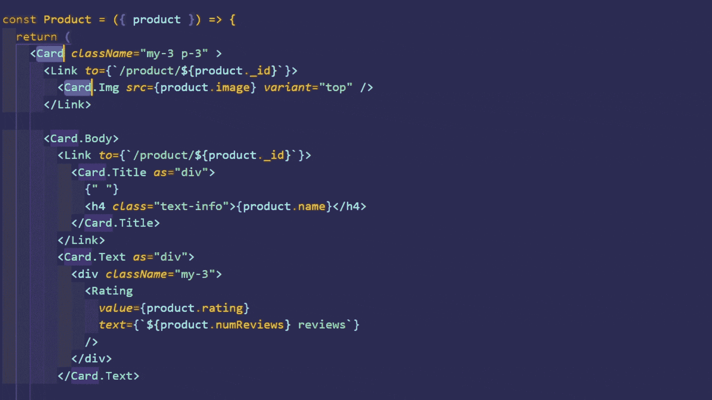

# 2.插入和移除附加光标

如果您需要多个光标，每个光标位于文件中的不同位置，您可以使用以下快捷方式插入一个新光标:

*   **Windows/Linux** : `alt` +鼠标点击位置
*   **macOS** : `option` +鼠标点击位置

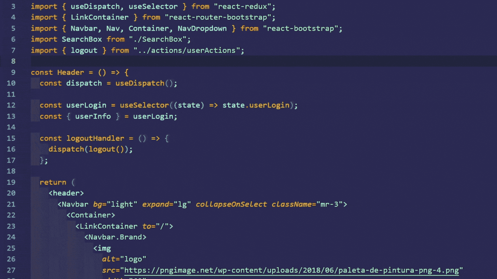

如果要删除最后插入的内容:

*   **Linux/Windows**:`ctrl`+`U`
*   **macOS** : `command` + `U`

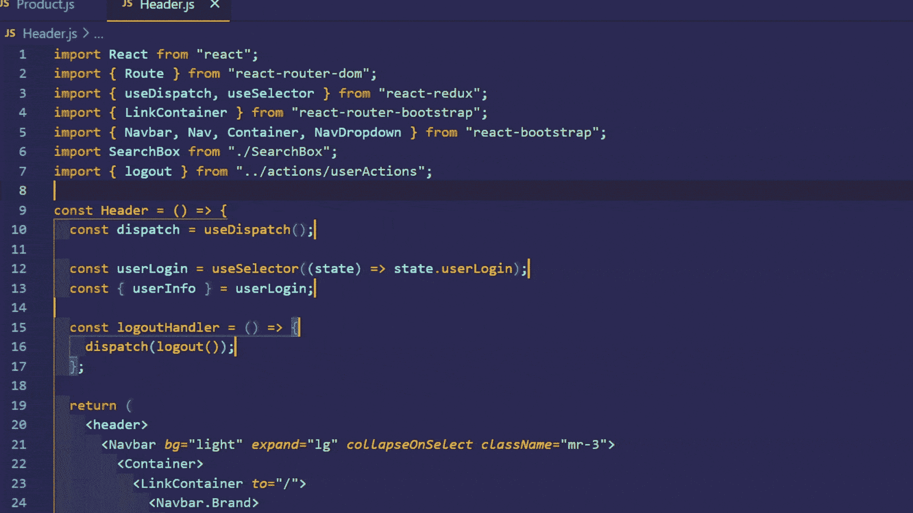

# 3.选择当前行

很多时候，您需要选择光标所在的整个当前行。这个键盘快捷键使它变得非常简单。

*   **Linux/Windows**:`ctrl`+`L`
*   **macOS** : `command` + `L`

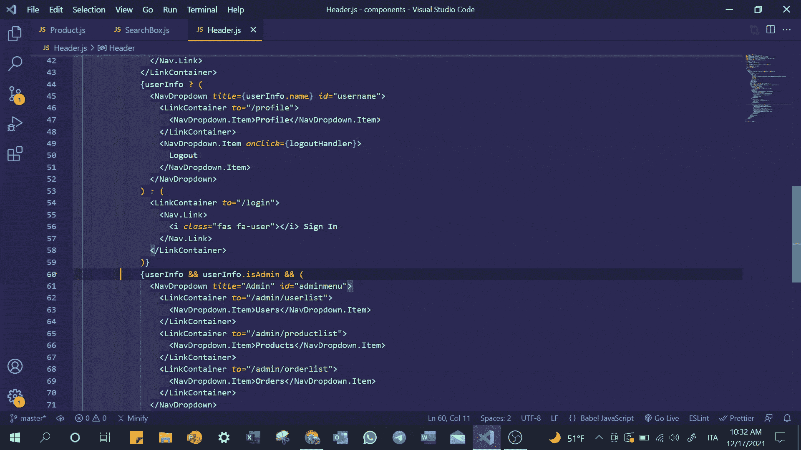

# 4.禅宗模式

Zen 模式通过隐藏除编辑器之外的所有 UI，让您专注于代码。可以使用此快捷键切换 Zen 模式:

*   **Windows/Linux**:`ctrl`+`K`，然后`Z`
*   **macOS** : `command` + `K`，然后`Z`

按两次`esc`返回正常编辑器视图。

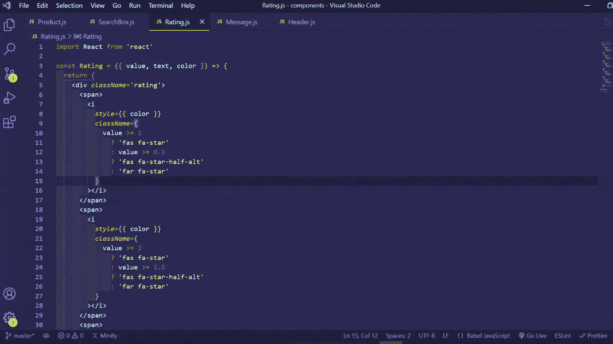

# 5.切换注释

在许多情况下，您可能需要注释或取消注释一行。

对于行注释，单击要注释掉的行并使用此快捷键:

*   **Linux/Windows**:T21+`/`
*   **macOS** : `command` + `/`

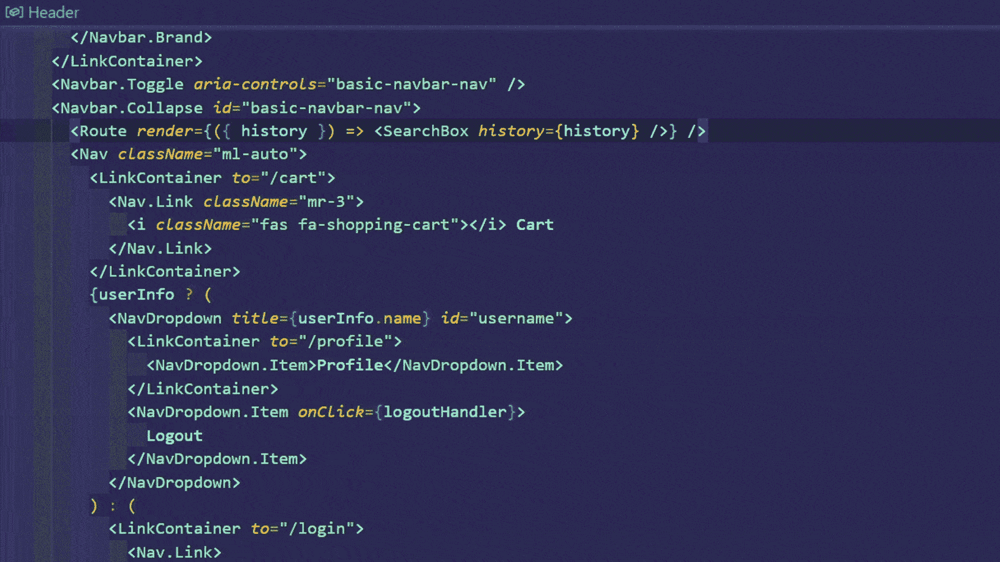

如果您想将突出显示的代码注释掉，作为一个单独的注释，请使用下面的代码:

*   **Linux/Windows**:`shift`+`alt`+`A`
*   **macOS** : `shift` + `option` + `A`

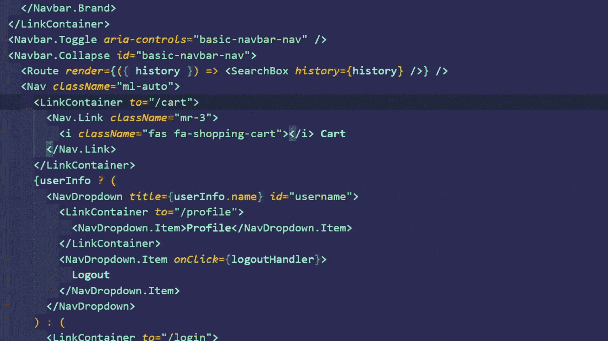

# 6.复制行和块

要在其下方或上方复制一行，可以使用以下快捷方式:

*   **Windows/Linux**:`shift`+`alt`+↓或↓
*   **macOS** : `shift` + `option` + ↓或↓

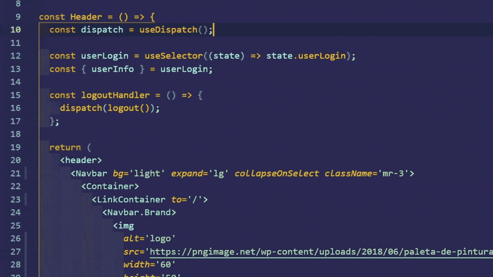

要以同样的方式复制文本块或代码块，请先突出显示它，然后使用此快捷键。

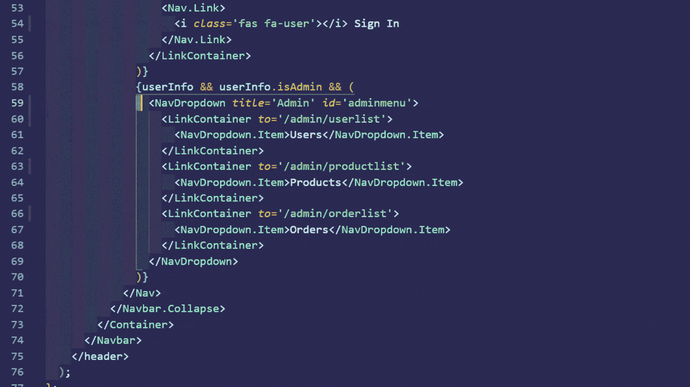

# 7.找到匹配的括号

寻找块的匹配右括号有时会很困难。此键盘快捷键帮助您轻松找到当前块的匹配右括号。在 HTML 标签中，它让你移动到当前标签的末尾。

*   **Windows/Linux**:`ctrl`+`shift`+\
*   **macOS** : : `command` + `shift` + \

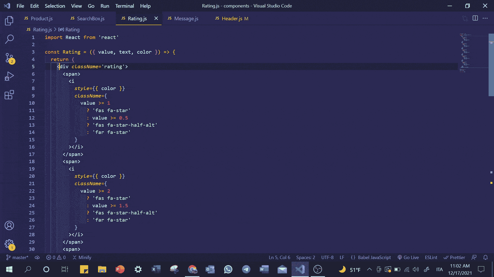

# 8.选择直到单词的末尾

当选择代码的某一部分时，可以使用此快捷方式移动和扩展选择。使用向右键或向左键向您想要的方向移动。

*   **Windows/Linux**:`shift`+`alt`+→或←
*   **MAC OS**:`shift`+`option`+→or←

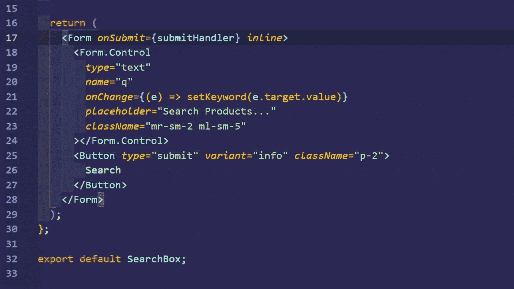

# 9.转到线

如果您得到一个编译或运行时错误，并指出是哪一行代码导致了它，您可以使用以下快捷方式快速找到它:

*   **Windows/Linux** : `ctrl` + G
*   **macOS** : `control` + G

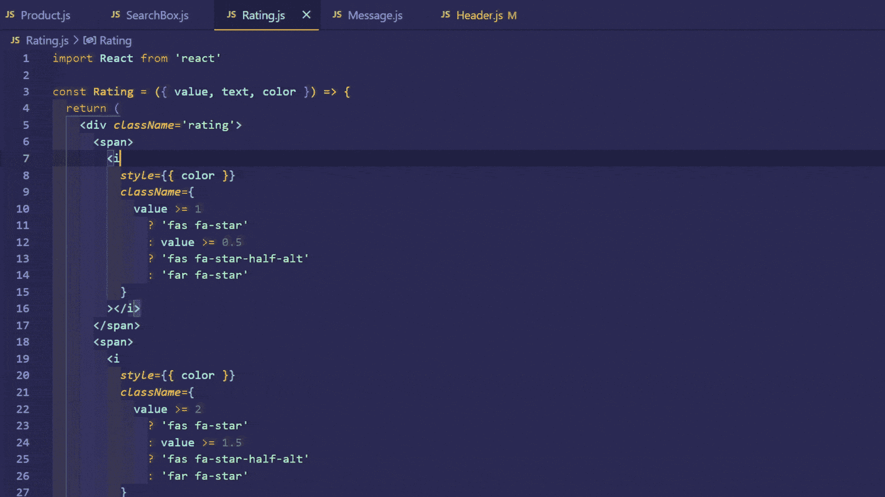

# 10.导航错误和警告

要快速查找代码中的错误和警告，而不是滚动文件来查找确切的问题，请使用此快捷方式移动到下一个错误或警告。

*   **Windows/Linux/MAC OS**:F8

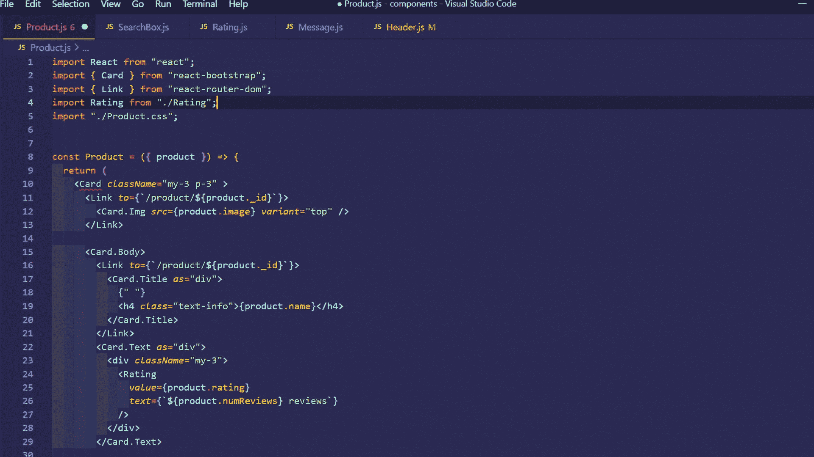

# 结论

在本文中，我们学习了 10 个有用的 Visual Studio 代码快捷方式，它们保证会提高您的工作效率。

尽管如此，VS 代码有更多的快捷键来做更多的事情。点击以下链接查看所有快捷方式:

*   [Linux](https://code.visualstudio.com/shortcuts/keyboard-shortcuts-linux.pdf)
*   [窗户](https://code.visualstudio.com/shortcuts/keyboard-shortcuts-windows.pdf)
*   [macOS](https://code.visualstudio.com/shortcuts/keyboard-shortcuts-macos.pdf)

*考虑* [***成为中等成员***](https://ebelinggianmarco.medium.com/membership)**如果你喜欢看这样的故事，想帮助我这个作家。每月 5 美元，你可以无限制地访问媒体内容。如果你通过* [***我的链接注册，我会得到一点佣金。***](https://ebelinggianmarco.medium.com/membership)*

**更多内容请看*[***plain English . io***](http://plainenglish.io/)***。*** *报名参加我们的* [***免费每周简讯这里***](http://newsletter.plainenglish.io/) ***。****