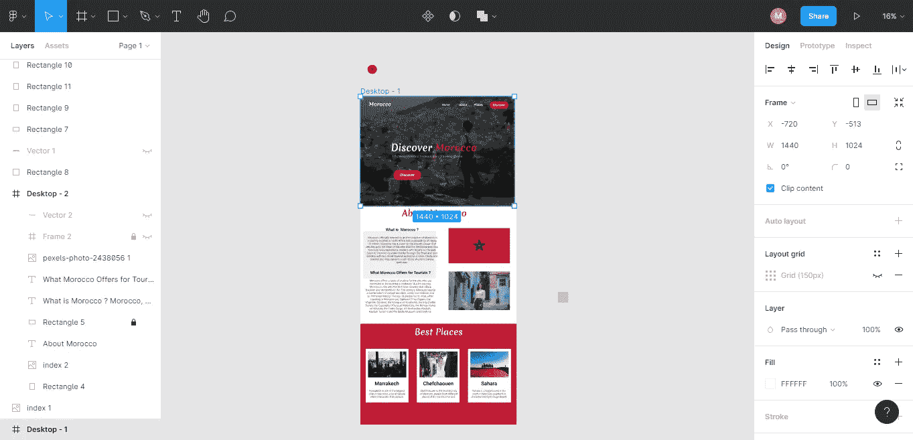
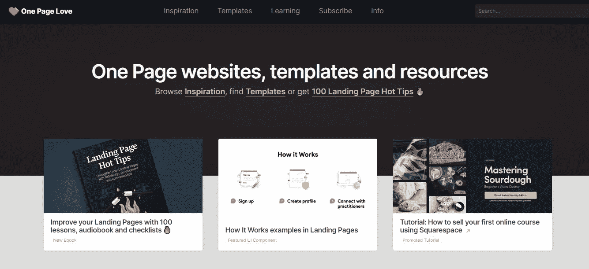
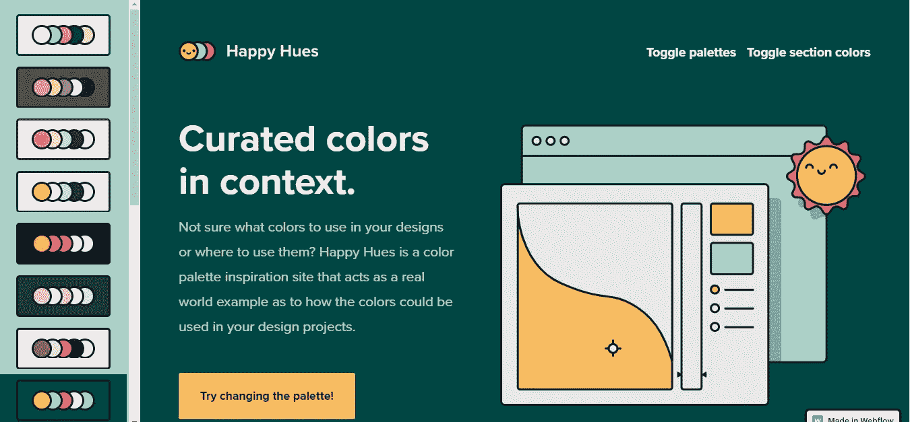
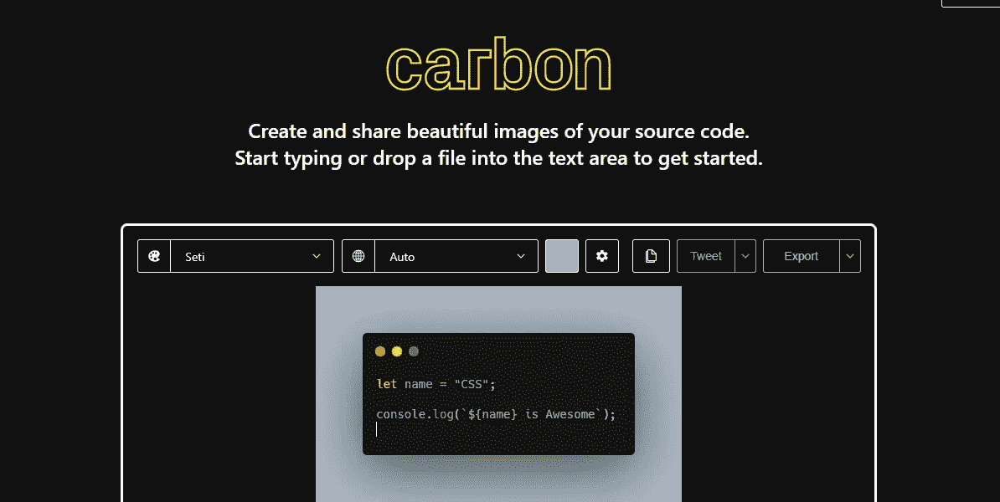
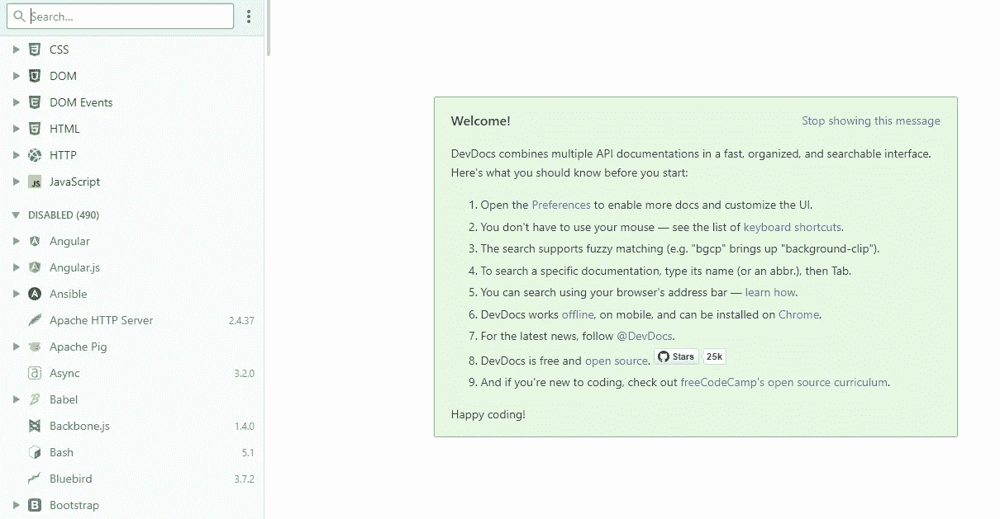
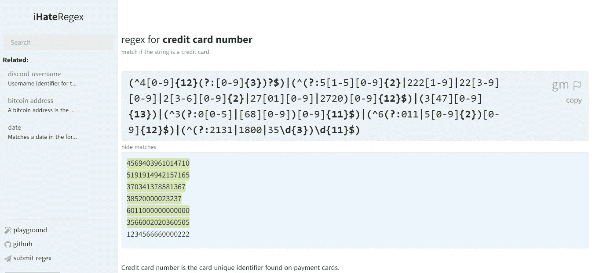
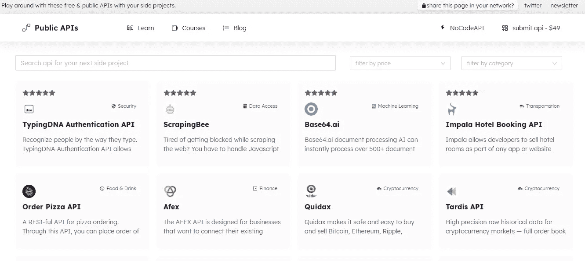
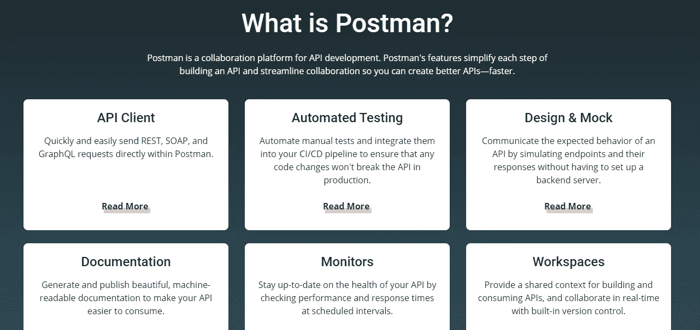
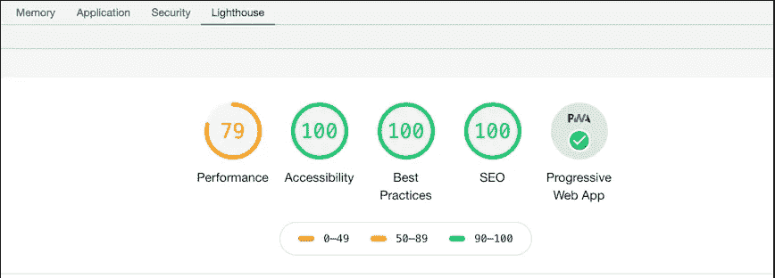
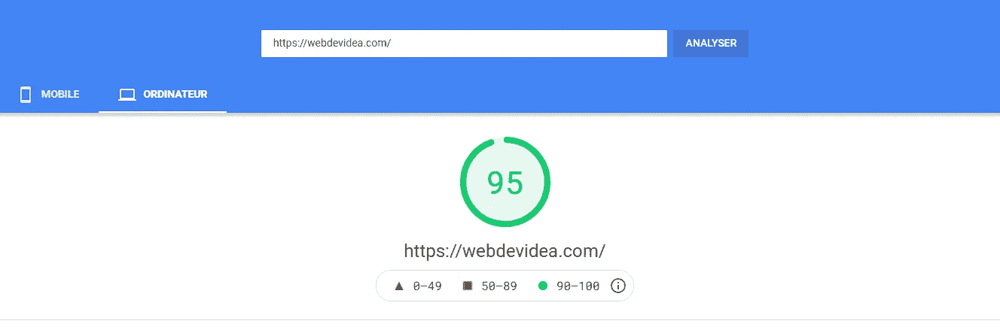

# 你应该知道的 10 个有用的网络开发工具

> 原文：<https://javascript.plainenglish.io/10-useful-web-development-tools-that-you-should-know-a1a0277b91f3?source=collection_archive---------11----------------------->

## 你可能不知道的了不起的网络开发工具。

Photo by [Shamin](https://unsplash.com/@haky?utm_source=medium&utm_medium=referral) on [Unsplash](https://unsplash.com?utm_source=medium&utm_medium=referral)

Web 开发本身就是一个很大的领域。有很多事情需要你去处理，有很多技术需要你去了解。除此之外，从头构建一个 web 项目并不是一件容易的事情。你必须处理设计、前端、后端、部署等等。

幸运的是，有很多有用的 web 开发工具，我们可以使用它们来加快开发过程，并使其变得更加容易。所以作为一名 web 开发人员，你应该充分利用现有的工具。

在本文中，我们将为您提供一些有用的 web 开发工具，您可能需要使用它们来简化您的工作。让我们开始吧。

# 1.菲格玛

Figma 是最好的设计工具之一，你可以用它来为你的网络项目创建设计。和 Adobe XD 差不多，但在我看来更人性化。

除此之外，Figma 还允许您创建原型并检查您的设计的 CSS。您可以选择在您的机器上安装桌面应用程序，或者只使用 web 应用程序。

Capture by author.

# 2.一页爱情

[One page love](https://onepagelove.com/) 是一个非常有用的网站，作为一名网页开发者，你可以在这里获得设计灵感。有很多很棒的设计和网站模板，你会喜欢的。我真的建议去看看。

Capture by author.

# 3.快乐的色调

[Happy Hues](https://www.happyhues.co/) 作为一名网络开发人员，你可以为你的网络项目选择令人惊叹的调色板。该工具还为您提供了一个真实世界的例子，说明颜色如何适合您的网站或 web 应用程序。

Capture by author.

# 4.碳

Carbon 是一个免费的工具，让你能够为你的代码创建漂亮的图像。你也可以下载 PNG 和 SVG 格式的图片。

Capture by author.

# 5.DevDocs

DevDocs 是一个免费的网络应用程序，在这里你可以找到几乎所有网络技术的文档。这是一个学习的好地方，因为它提供了一个可搜索的界面，你可以搜索任何你想了解的概念。

Capture by author.

# 6.Ihateregex

很多 web 开发人员讨厌正则表达式。幸运的是， [Ihateregex](https://ihateregex.io/) 附带了您可以使用的正则表达式 cheatSheet。好的一面是，你也可以搜索任何你想在你的项目中实现的正则表达式，它会为你生成它。

Capture by author.

# 7.公共 API

[Public API](https://public-apis.io/)是一个 web 应用程序，它管理不同类型的免费和公共 API，您可以在您的项目中使用它们。你也可以把自己的 API 提交到他们的 web app 上。

Capture by author.

# 8.邮递员

[Postman](https://www.postman.com/) 是一个简化 API 开发并允许前端和后端开发者协作的平台。它还允许您测试和记录 API。这是一个非常有用的工具，它简化了构建 API 的过程。

Captured by the author from [Postman](https://www.postman.com/).

# 9.灯塔

Lighthouse 是一个集成到 Chrome 开发工具中的免费工具。它允许您测试和识别站点上的问题。它给出了关于性能、渐进式网络应用、可访问性、搜索引擎优化和最佳实践的分数。

Capture by author.

# 10.PageSpeed 洞察

[PageSpeed Insights](https://developers.google.com/speed/pagespeed/insights/) 是谷歌的一款流行工具，可以让你测试网站的性能。它还为您提供了提高性能的见解和技巧。

Capture by author.

# 结论

如你所见，所有这些工具都非常有用。作为一名网络开发人员，你肯定需要其中的一些。还有许多其他工具使 web 开发变得更加容易和快速。

感谢您阅读这篇文章。希望你觉得有用。

**延伸阅读**

 [## 你可能需要使用的 10 个开发工具

### 有用的开发工具，让您的生活更轻松。

javascript.plainenglish.io](/10-developer-tools-that-you-probably-need-to-use-1772982d3ad7) 

*更多内容请看*[***plain English . io***](https://plainenglish.io/)