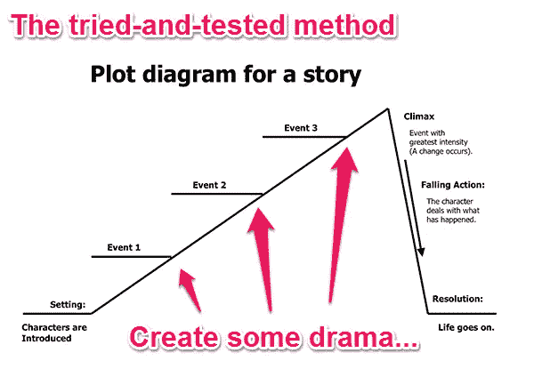

# 我一直遵循的 10 个用户体验秘诀

> 原文：<https://javascript.plainenglish.io/10-user-experience-hacks-you-should-implement-on-your-website-ab0f0cb51859?source=collection_archive---------6----------------------->

## 并在我参与的任何 web 开发项目中实现。

Photo by [Jud Mackrill](https://unsplash.com/@judmackrill?utm_source=medium&utm_medium=referral) on [Unsplash](https://unsplash.com?utm_source=medium&utm_medium=referral)

这些天我们被信息宠坏了。我们可以免费获得宝贵的、可操作的、实用的建议，这是前所未有的，并且每天都在不断改进。

这对任何 SaaS 企业来说都是一件好事，因为它让你可以阅读像这篇文章一样的文章，这篇文章精选了关于用户体验设计的最佳见解。

但是等等，首先什么是“用户体验”?一位多产的作家兼演讲者，小罗伯特·霍克曼，将它定义如下:

> “用户体验是一个发现、愿景定义、策略、规划、执行、衡量和迭代的过程。这需要灵活性，以及愿意犯错直到你是对的。”

我们今天要关注的正是如何让您的客户生活得更好的这一简洁观点。因为如果你能改善用户的生活，你就能通过改善用户体验设计来提高你的关注度和保留率，减少放弃，提高转化率，或者改善产品的其他方面。

## 1.对于较长的加载时间，总是使用进度条

这里有一个很好的例子让我们开始。这个技巧属于“系统状态可见性”的前提，这是让人们知道在任何给定时刻发生了什么的恰当术语。

基本的想法是，如果用户等待的时间超过 10 秒，那么有一些指示器向他们显示还剩多少时间是很重要的。我是说，他们要看多久？比如，在加载特性的同时，有足够的时间快速喝一口咖啡，而不会损失宝贵的工作时间？或者更像是有足够的时间进行一次全面的午休？

如果你没有详细说明，你的用户本已脆弱的注意力范围会被电子邮件、社交媒体和其他通知分散，因为他们决定“当它完成加载后再回来”

## 2.使用适当的方法分析用户输入

为了改善您的用户体验，您必须使用适合工作的正确分析工具来制定用户数据决策。最适合你的方式很大程度上取决于你经营的企业类型和你试图改善客户体验的阶段。这是一个快速概览图表:

Photo provided by the author.

老实说，这是一个非常复杂的主题，但关键是，使用不同的工具，相同的用户输入操作会产生不同的结果，因此将这些结果匹配起来非常重要。

## 3.简单、以利益为导向的价值主张、品牌和说明

在用户交互的每一个阶段，你的文案都应该简单，以利益为导向。请记住，当您的客户第一次进入您的用户界面(UI)时。销售过程已经“完成”但是，在现实中，它从未真正“结束”。

在用户体验的每个时刻，客户都会问自己一个问题:

> “我在这里花费的时间真的值得吗？”

通过确保每一个标题，每一个说明，每一个副标题都是利益驱动的，你会让人们和你呆得更久。

## 4.实施用户加入以扩大您的社区

入职可以说是 UX 最被忽视的方面，尤其是在 SaaS 领域。这是通过成功地向潜在客户介绍你的产品，并帮助他们获得产品应该提供的价值，从而将潜在客户转变为全职客户的过程。

毕竟，创造有价值的产品是一回事，但帮助人们理解和使用它完全是另一回事。这就是入职培训的切入点。

## 5.陈述价格，让 B2B 网站具有竞争优势

尼尔森诺曼集团进行的大量研究表明，网站访问者会因为没有提前报价而感到沮丧并离开。NNG 发现，价格是网上最需要的信息，尤其是产品比较是购买过程中如此重要的一部分。

总是在你的网站上显示价格，看着你的跳出率下降。销售行业有一条古老的格言:“在你解释清楚产品的好处之前，永远不要定价。”也许这就是为什么在你的网站上提前给出价格会让人害怕。然而，这个公理不再成立。

## 6.提供具体可行的错误消息

每个人都讨厌错误消息，包括你的用户。UI 可能会出错，这可能不是一个好主意，但是当它们出错时，需要有效地解决。

在 NNG 的一项研究中，扣除电话费和代理人工资等费用，客户服务电话的平均成本约为 5.5 美元。另一方面，如果用户可以自助，每次通话的典型成本仅为 0.10 美元。

可操作的错误消息不仅可以改善用户体验，而且从长远来看，还可以为您节省大量资金。

## 7.社会证明

1984 年，罗伯特·恰尔迪尼博士出版了一本名为《影响力:说服心理学》的书。在他的科学努力中发现的“说服的六个关键原则”之一是社会证明，这是为什么社交媒体营销如今如此重要的一个关键原因。基本的想法是，人们模仿他们看到别人在做的事情。

这意味着你应该炫耀其他人喜欢你的产品的社会证明。因为那样的话，人们更有可能随大流，并且乐在其中。可能的策略包括:

*   把你的“喜欢”和其他社交信号放在你网站的“上方”。
*   发布客户评价。
*   实施小激励措施，鼓励人们留下更多推荐和社交分享

## 8.讲故事

营销人员早就知道故事的力量。在互联网和电话会议出现之前，你可以在商店、办公室或会议上与企业主面对面交流。时下？必须讲故事才能知道真实的活生生的人可以连接到一个情感层面。

幸运的是，无数代的故事讲述者已经削减了这个过程，并将其提炼为一种经过尝试和测试的方法。这里有一个图表:

Photo provided by the author.

考虑到没有一家初创公司是没有大量“事件”的，因此将一些危机放在一起以吸引读者并创造一个引人注目的故事应该不会太难。

## 9.针对不同设备优化的用户体验

自今年 2 月以来，美国通过移动设备接入互联网的人数已经超过了个人电脑。如果您的用户体验没有针对不同设备进行响应和优化，您可能会疏远一半以上的受众。这是一个相当可怕的统计数字。

响应式设计比以往任何时候都更容易实现，所以马上去见见你的开发极客吧。

## 10.为您公司的营销工作优化的用户体验

最后，正如 Robert Hoekman，Jr .在文章开头指出的，用户体验不仅仅适用于你的客户使用你的产品的时候。这也适用于你营销的第一个接触点。

花时间对你的营销材料和你的产品之间的一致性做一个全面的回顾。它从头到尾传达了相同的信息吗？它的文案风格、标志和图像是否有相同的主题？

如果没有，是时候改进你的材料，为你的用户从头到尾创造一个更精确、更一致的形象，帮助他们更清楚地认同你。享受改善用户生活的乐趣。

## 结论

我希望这些用户体验技巧对你有所帮助。感谢您的阅读！