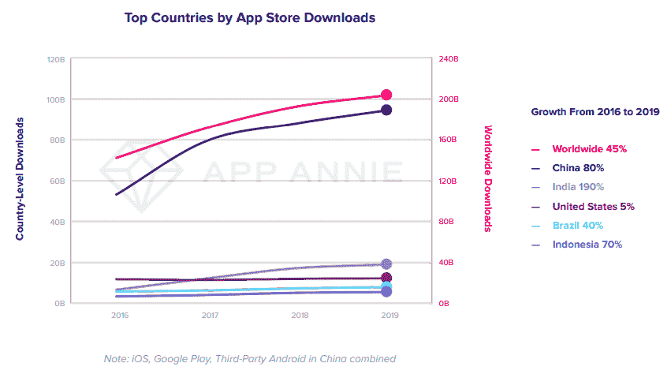
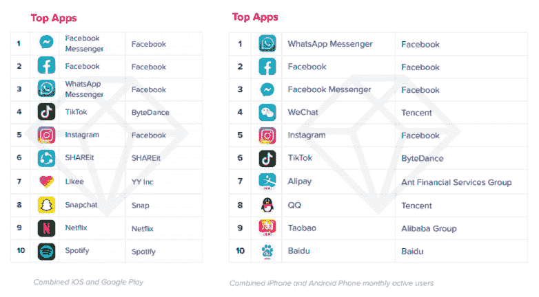

# 为什么 React 原生 App 开发成本更低

> 原文：<https://javascript.plainenglish.io/10-valid-proofs-that-show-react-native-app-development-cost-is-lower-4939538a35eb?source=collection_archive---------11----------------------->

## 显示 React 原生应用开发成本更低的 10 大有效证据

无论你是创业者还是领先的企业家，为应用程序开发选择最佳技术并估算构建一个应用程序的成本是一个组织最迫切的关注点。

说到应用程序开发，大家都很熟悉这样一个事实:JavaScript 总是给 web 行业带来好东西。但随着 React Native 的推出，JavaScript 也成为了移动应用开发世界的福音。尽管 React Native 于 2015 年由脸书推出，但它已迅速成为 42%的全球开发者的选择，并继续增长，被广泛用于跨平台应用开发。

所以，如果你在犹豫 React-Native 的性价比，那么这篇博客将帮助你了解 React 原生应用的性价比。

## **让我们进入博客的细节，主要关注这些参数:**

*   了解移动应用程序开发行业是如何运行的
*   React Native 如何为企业提供经济高效的解决方案
*   证明 React Native 正在削减应用开发成本的 10 个证据
*   为什么初创公司和领先的组织正在使用 React Native 开发应用程序
*   签署

> **让我们直接进入市场的数据和事实。**

## **1。了解移动应用开发行业的运行方式**

毫无疑问，随着全球移动应用的使用日益增加，市场竞争日益激烈。一方面，新成立的公司很难抓住最好的商业机会。另一方面，进入移动行业就像参加一场竞争，只有具备动态定价所有潜力并能够在每个发展阶段照顾客户需求的初创公司才能在这个蓬勃发展的行业中生存下来。

> **这里有一些更好地描绘真实市场图景的市场统计数据:**

*   随着每一天的过去，移动互联网的使用也在迅速增加。eMarketer 预测，2020 年美国成年人每天在移动应用上花费 4 小时，预计到 2022 年这一数字将会增加。
*   平均而言，每月有超过 10 万个新的 Android 应用程序在谷歌 Play 商店发布，发布速度是 iOS 应用程序的三倍。
*   消费者在 2019 年下载了[2040 亿个应用](https://www.appannie.com/en/go/state-of-mobile-2020/)，比 2016 年高出 45%。

[Image Source](https://www.appannie.com/en/go/state-of-mobile-2020/)

*   [根据 Statista](https://www.statista.com/statistics/269025/worldwide-mobile-app-revenue-forecast/) 的数据，预计到 2023 年，仅移动应用程序一项就能创造 9352 亿美元的收入。而 [Facebook Messenger](https://www.appannie.com/en/go/state-of-mobile-2020/) 是全球最常用的通信移动应用。

[Image Source](https://www.appannie.com/en/go/state-of-mobile-2020/)

与此同时，技术也充分发展起来，移动应用程序开发行业见证并利用了所有这些进步，包括人工智能、机器学习、物联网(IoT)等。

所有这些新兴技术及其对应用程序使用的进步影响鼓励了世界各地的企业成为这个蓬勃发展的行业的一部分。

但是从另一个角度来看，组织总是努力拥有一个运行完美、完全符合最终用户需求的应用程序。

所以，在计划创建一个应用程序或者 [**雇佣一个移动应用程序开发者**](https://www.xicom.biz/offerings/hire-mobile-developers/) 的时候，要确保你的应用程序在性能上是快速的，在可用性上是创新的，并且比你的竞争对手更好。

但是实现这一点并不像看起来那么简单。

> **这里是大多数应用程序开发公司在为他们的业务创建应用程序时遇到的一些障碍。**

*-选择应用开发的最佳框架和技术。
-您应该为您的企业开发原生 iOS 或 Android 或跨平台应用程序吗？
-如何削减 app 昂贵的开发成本？*

在现代快节奏的世界中，您并不是唯一一个考虑使用增强技术来为您的企业构建最佳移动应用的人。在用于移动应用程序开发应用程序的流行技术替代方案中，React Native 脱颖而出，成为最佳解决方案，并取得了发展势头。

## **2。React Native 如何为企业提供经济高效的解决方案？**

你有没有想过是什么让脸书、Instagram、Skype 和 Pinterest 在游戏中保持领先？

*“成功企业的秘诀在于将行业最佳技术和成熟的方法应用到产品中。像脸书、沃尔玛或 Instagram 这样的领先公司已经将 React Native 的潜力融入到他们的业务流程中，使他们的商业模式成为赢家。”*

移动应用程序开发对企业来说并不新鲜，但只为单一平台开发移动应用程序的趋势不再是组织的理想选择。事实上，99%的应用程序可以在 Google play 商店和 iOS 应用程序商店上使用，企业正在寻找跨平台的应用程序开发工具，使它们可以在两个平台上使用，而不必在原生应用程序开发上耗费时间和金钱。

如今，从科技巨头到不断进步的初创公司，许多大小公司都在采用跨平台应用开发工具来构建他们的移动应用。React Native 被认为是这种情况下最受欢迎的工具。

> **为什么？**

React Native 利用广泛的 UI 块，通过简单地使用 JavaScript 编写的单一代码，为 iOS 和 Android 平台构建令人难以置信的移动应用程序。React Native 已经授权 [**软件开发公司**](https://www.xicom.biz/) 查看他们的代码，让他们实时了解代码是如何在手机屏幕上实现的。

随着跨平台应用开发服务的增长趋势，科技创业公司像当今时代的其他任何事情一样蓬勃发展。随着企业间应用程序需求的激增，对完全符合预期且价格合理的 React 本地开发公司的需求也在以同样的速度增长。

因此，现在的核心问题是 React Native 如何降低您的应用程序开发成本？

## **3。React 原生切割 App 开发成本 10 个证明**

在您直接进入 React 原生业务应用程序开发项目的开发流程之前，有必要了解如何使您的下一个移动应用程序开发流程具有成本效益。

> **让我们看看这个框架如何显著降低你的应用开发成本:**

## **1。跨平台兼容性以节省开发时间**

如上所述，React Native 是跨平台 app 开发解决方案中要求最高的框架之一。

但事实是，它最初是由脸书团队仅为 iOS 推出的。此外，他们认识到它令人难以置信的能力和特性，并认为有必要扩展其对 Android 的支持。

事实上，大多数开发人员可以很容易地感觉到大多数 React 本机 API 具有跨平台兼容性。因此，你可以 [**雇佣可以为 iOS 和 Android 应用创建应用的应用开发者**](https://www.xicom.biz/solutions/hire-developers/) 。

除此之外，他们不用做太多就可以将本地代码嵌入到他们的代码库中。此外，向特定平台添加更多真实性变得更加容易。

> 但是这对你的业务有什么好处呢？

React Native 的跨平台兼容性将允许开发人员使用单个代码库创建多个应用程序。雇佣的开发人员不需要为 Android 和 iOS 分别编写代码。

但 iOS 和 Android 应用的设计含义仍然是特定于平台的。所以对于每个平台，开发者都可以使用 React Native 的模块和文件扩展名。

## **2。热重装功能将开发人员的效率提高了 10 倍**

React Native 的另一个节省成本的好处是热重新加载功能，它允许开发人员即时更改代码，而无需重新编译应用程序。

通过利用热重新加载功能，您可以在应用程序中实现实时更新。

> **声音太专业了？我给你简单解释一下…**

## 在这里…

无论你的应用程序有多优秀，集成了什么技术，或者雇佣了什么水平的 [**跨平台应用程序开发公司**](https://www.xicom.biz/offerings/cross-platform-app-development/) ，要让你的应用程序发挥作用，就需要定期更新到最新版本，这一点你很清楚。

如果那些更新是你用复杂的用户界面/UX 构建的业务应用所需要的，并且需要很长的更新周期，那么事情将会变得很难管理。

但是有了 React Native，你就不需要为这些麻烦而烦恼了，因为它为你提供了实现实时更新的选项。

这意味着开发者可以将更新直接推送到用户的手机上。因此，最终用户几乎可以立即享受到最新版本的应用程序。有了 React Native，更新应用程序的过程大大简化，而且更加经济。

## **3。React Native 的可重用组件**

代码和组件的可重用性是开发人员最想要的东西，因为它节省了他们为其他平台构建相同东西的精力和时间。

其次，组件的可重用性极大地降低了应用程序/软件的成本，减少了开发过程中所需的时间和资源。

此外，React Native 的跨平台特性将允许程序员在 Android 和 iOS 中互换地重用这些组件。因此，移动应用程序开发团队只需要为一个平台的应用程序编写 JavaScript 代码，就可以直接编译并在另一个平台上重用它。

最终，这种重用代码的选择减少了开发时间和成本。

## **4。App 的实时调试**

React Native 允许开发人员在工作的同时调试应用程序。通过使用 Chrome 的开发工具，开发人员可以轻松扩展开发和处理支持。

此外，React Native 通过名为“快速刷新”的功能为开发人员提供了实时测试的便利。这个特性有助于加快应用程序的开发过程。快速更新使它变得更加容易和快速，这往往会加快应用程序开发过程。

## **5。易于集成现成的解决方案和库**

React Native 直接影响应用程序开发成本的一个巨大优势是其社区提供了广泛的现成解决方案和库，允许团队更快地应对挑战。

假设您正在开发一个电子商务应用程序，它需要社交媒体功能，允许用户在社交媒体平台上分享东西。然后，在这种情况下，您可以使用社交媒体共享按钮或实现向社交网络发送数据的能力。为了在您的应用中快速实现这一功能，移动应用开发团队可以利用 React-Native-Share 库。

## **6。降低用户界面成本**

应用程序用户界面是应用程序最重要的方面之一，你不能妥协，因为它直接影响用户体验。

React Native 还关注应用程序的 UI/UX，并帮助设计人员将设计统一起来。通过这种方式，设计师可以快速优化设计功能，以使应用程序兼容多种设备。但是为了避免在应用程序中出现任何错误，雇佣一名应用程序开发人员 为你的项目带来最好的经验和专业知识是值得的 [**。**](https://www.xicom.biz/solutions/hire-developers/)

因此，React Native 降低了应用程序开发成本，节省了时间和精力。此外，为了改善应用程序的用户界面，开发人员可以寻找第三方 API。

## **7。无缝集成**

无论你是初创企业还是领先企业，每个人都希望以客户为中心的应用程序具有独特的功能。有了 React Native，您可以用最少的成本和精力做到这一点。开发人员都需要将本地或第三方模块连接到适当的插件。

对于无缝集成，编码人员可以使用最熟悉的 React Native 第三方插件，如 React Native Router Flux、React Native Modalbox 或 React Native Selectme。

## **8。应用扩展和可用性变得更加容易**

作为一个跨平台框架，React Native 允许您将您的应用程序用于各种平台，包括 App Store 和 Play Store。因此，它允许组织让他们的应用程序接触到大量的受众，并最大限度地扩大客户群。

此外，使用 React Native 开发的应用程序可以轻松扩展，并在许多操作系统上完美运行。因此，创业公司可以从 MVP 和 scaleup 应用程序开始，通过简单地使用 React 原生框架的潜力，集成现代功能。

## **9。React Native** 让应用维护更简单

跨平台应用程序更容易维护，因为只需要维护一个代码库。这与原生应用程序不同，原生应用程序使用单独的代码库开发，并需要在 [**移动应用程序开发公司**](https://www.xicom.biz/services/mobile-app-development/) 的帮助下定期更新。跨平台应用具有避免版本控制的灵活性，使得维护更加简单和节约成本。

在单个代码库中进行的修改将很容易在所有应用程序版本中实现，因此可以帮助您节省开发时间。

## 10。需要较低的学习曲线

毫无疑问，为 Android 和 iOS 平台使用共同的代码库减少了应用程序开发的时间和成本。

你们中的许多人都在想，你需要聘请一家昂贵的 React 原生应用程序开发公司来帮助你推出没有任何缺陷的应用程序。但事实是，React 本地开发人员很容易找到，因为该框架基于大多数开发人员熟悉的 JavaScript。

此外，React Native 的学习曲线较低。你不需要花很多时间和金钱让他们学习新技能。具备 JavaScript 知识的开发人员可以轻松地帮助您进行开发，并为您的项目节省大量成本。

# **为什么初创公司和领先的组织使用 React Native 开发应用程序？**

无论您是将业务迁移到数字平台，还是在受到知名公司的影响后计划开发一款应用程序，最有可能的是，您会在应用程序中寻找以下几样东西:

*   ***app 的性价比***
*   ***app 的 UI/UX***
*   ***与技术相关的许可费***
*   ***聘请开发商的费用***

> ***让我们来看看 React Native 是如何符合这些参数的！***

有了上面提到的所有证明，很明显 React Native 是所有可用框架中最具成本效益的，并确保了应用程序的高性能。这就是为什么大型科技巨头将这一框架用于他们的应用程序，利用数百万用户群。React Native 受到脸书、Instagram、沃尔玛、Wix 等大公司的信任，也为其他初创公司提供商业目标。

> **其次，app 的 UX/UI。让我们以脸书为例。**

脸书是全球使用最多的通讯应用。为什么？它拥有出色的特性、交互式用户界面和无缝功能。在所有这些背后，React Native 是主要原因，因为它允许无缝的应用程序集成，并使应用程序与其他兼容应用程序的同步更容易。

现在，无论它是免费使用还是附带许可费，好消息是它是一个开源 JavaScript 框架，可确保您的应用程序开发具有出色的性能、安全性和灵活性。

*最后，* [***雇佣 React 原生应用开发者***](https://www.xicom.biz/offerings/hire-cross-platform-app-developers/) *的预计成本从 15 美元到 20 美元以上不等，每小时可达 150 美元以上。应用程序开发人员的成本取决于他们的技能、专业知识和地理位置。*

除此之外，还有许多其他因素影响着开发商的成本。没有专家或知名的应用程序开发公司可以为您提供应用程序开发人员的固定价格，因为它会根据业务需求而变化。

# **结论**

用 React Native 开发一个商业应用是一个有价值的决定，因为它主要关注于削减开发成本和时间。

这篇博客描述了所有有助于降低 React Native 应用程序开发成本的因素。但仍然需要专业知识来优化不同设备以及 Android 和 iOS 平台的应用程序。因此，摆脱所有麻烦的简单方法是 [**雇佣一家移动应用程序开发公司**](https://www.xicom.biz/services/mobile-app-development/) ，该公司拥有使用类似技术交付应用程序的所有技能和出色记录。

虽然该框架相对较新，并且处于成长阶段，但是寻找具有实践经验的专家是有意义的。不过，如果你对使用 React Native 可以开发什么类型的应用程序以及实际成本有任何疑问或疑问，那么建议通过下面的评论与专家联系。

[*更多内容尽在 plainenglish.io*](http://plainenglish.io/)