# 10 个对开发人员非常有用的 VSCode 扩展，使团队协作更加容易

> 原文：<https://javascript.plainenglish.io/10-very-helpful-vscode-extensions-for-all-the-developers-and-for-easier-team-collaboration-de216d1d7c94?source=collection_archive---------13----------------------->

By -: Umang Agrawal

VSCode 是具有智能感知技术的最好和最强大的编辑器之一。大家都爱用 VSCode。那么，为什么不通过添加由出色的开发人员所做的扩展来使它更强大、更有帮助呢？不仅如此，它们还节省了我们的开发时间，使我们更有效率。他们会帮助你成为一名更好的程序员。

大多数情况下，所有开发人员都使用 git 和 GitHub 将他们的代码推送到远程存储库，或者与团队合作开发项目。因此，第一个 *3 扩展*与 ***git*** 相关，并且肯定会帮助你使你的协作更容易。

# 通过单击扩展按钮或(ctrl + shift + X ),可以从 VSCode 编辑器中直接安装这些扩展。

# 1.吉特朗斯

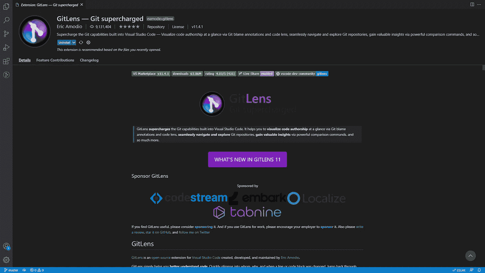

Doc-: [https://marketplace.visualstudio.com/items?itemName=eamodio.gitlens](https://marketplace.visualstudio.com/items?itemName=eamodio.gitlens)

当您与团队一起处理一个项目时，这个扩展非常有用，有时，您可能希望找到编写特定部分代码的人，或者在什么时候对文件进行了更改。

那么，这个扩展就很有帮助了。正如你在下面看到的，它显示了关于作者的内嵌信息，甚至给出了关于 PRs 的信息。

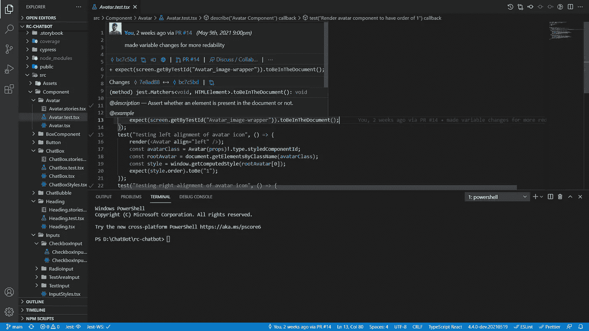

# 2.Git 历史

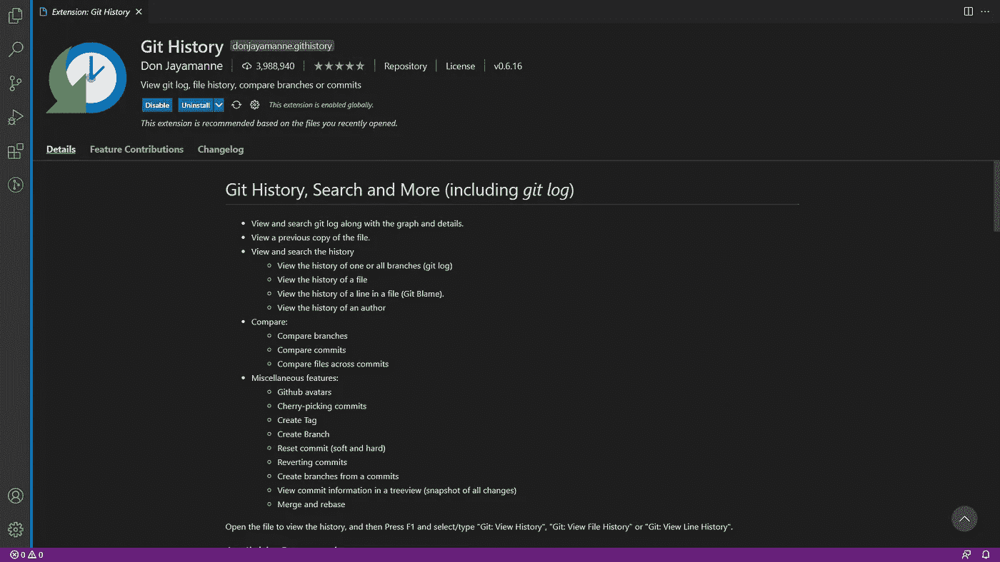

[https://marketplace.visualstudio.com/items?itemName=donjayamanne.githistory](https://marketplace.visualstudio.com/items?itemName=donjayamanne.githistory)

这个名字不言自明。它将显示文件的 git 历史。只需右击并点击选项 *Git:查看文件历史。*

它会显示你在 GitHub 上看到的你对文件所做的所有修改。

# 3.开始 git-bash

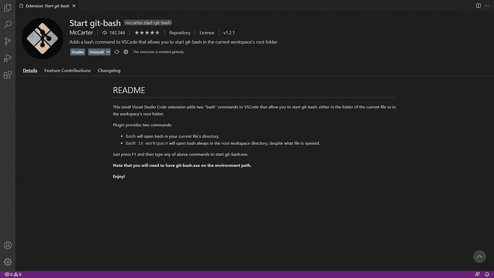

Doc-: [https://marketplace.visualstudio.com/items?itemName=McCarter.start-git-bash](https://marketplace.visualstudio.com/items?itemName=McCarter.start-git-bash)

通过使用这个扩展，可以从当前所在的 VSCode 目录中打开 git-bash。

## 安装后怎么做？

> 1.在环境变量- C:\Program Files\Git\
> 
> 2.重启 VSCode
> 
> 3.按 f1 并在工作区中键入 *bash* 或 *bash*

与团队合作进行一个实时项目，还是为朋友调试代码？微软为你提供的下一个扩展。

# 4.实时分享

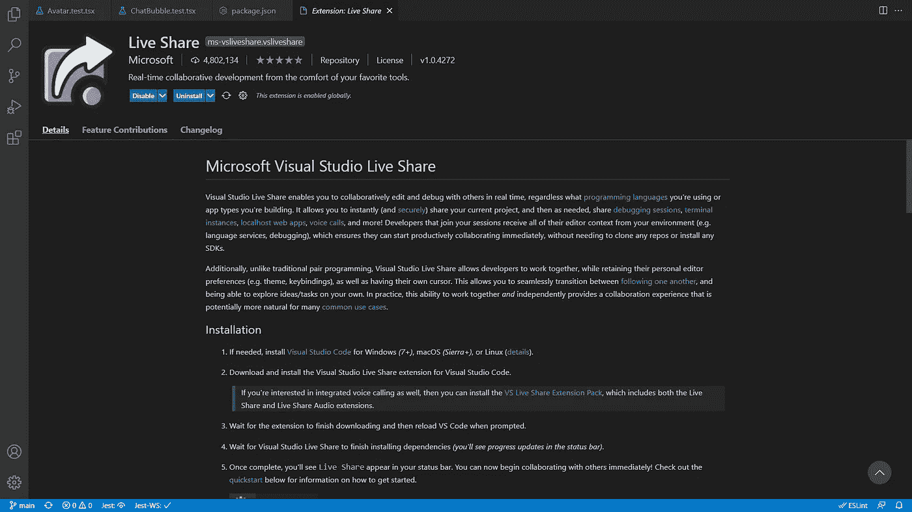

Doc-: [https://marketplace.visualstudio.com/items?itemName=MS-vsliveshare.vsliveshare](https://marketplace.visualstudio.com/items?itemName=MS-vsliveshare.vsliveshare)

> 这将帮助你非常容易地与你的其他队友共享代码空间。这对调试会话很有帮助。您可以访问和编辑其他开发人员在他们的机器上编写的文件和代码，而不需要这些文件。

设置:

1.  重新启动 VSCode。
2.  然后，您可以在状态栏中看到实时共享。点击并登录。

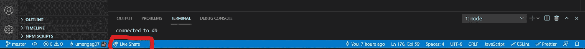

1.  然后，您只需点击左侧的实时共享图标即可开始会话或加入。

# 5.括号对着色机

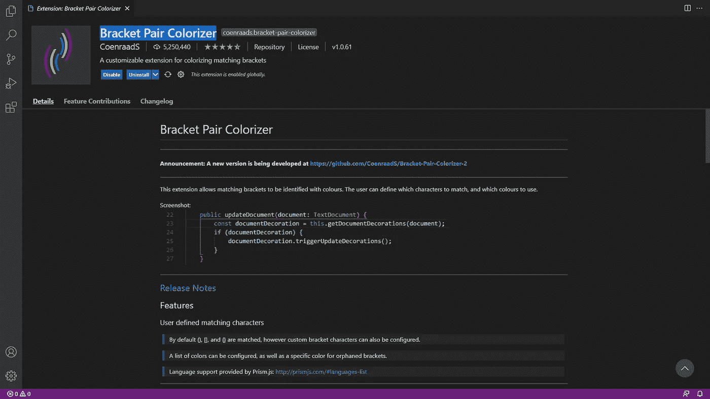

Doc-: [https://marketplace.visualstudio.com/items?itemName=CoenraadS.bracket-pair-colorizer](https://marketplace.visualstudio.com/items?itemName=CoenraadS.bracket-pair-colorizer)

**这是最好的 VSCode 扩展之一，你应该随身携带。一旦你安装了它，你的生活会轻松很多。😁**

当你找不到在哪里添加右括号时，这是非常令人沮丧的，这会导致一个错误。找到包含或删除括号的正确位置纯粹是浪费时间。

这就是为什么这个扩展有助于找到您想要找到的所有相关括号。如果你点击它，它会突出显示这对括号，这样括号内的代码部分就更容易看到了。

# 6.更漂亮—代码格式化程序

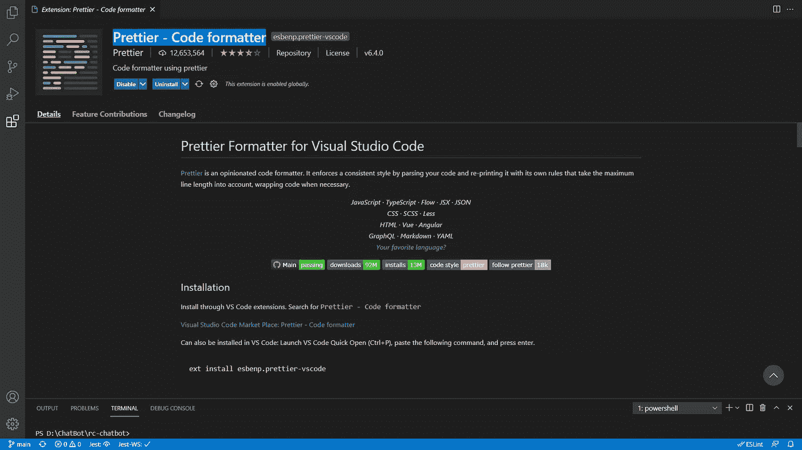

Doc-: [https://marketplace.visualstudio.com/items?itemName=esbenp.prettier-vscode](https://marketplace.visualstudio.com/items?itemName=esbenp.prettier-vscode)

**每个人的 VSCode 上都应该有这个扩展，现在就安装吧！**

这个扩展将根据预定义的规则格式化你的代码，并且*你不必过多考虑缩进。*

*人生从此排序。*😂😌

添加这个扩展后，您的代码肯定会看起来整洁干净。

# 7.路径智能感知

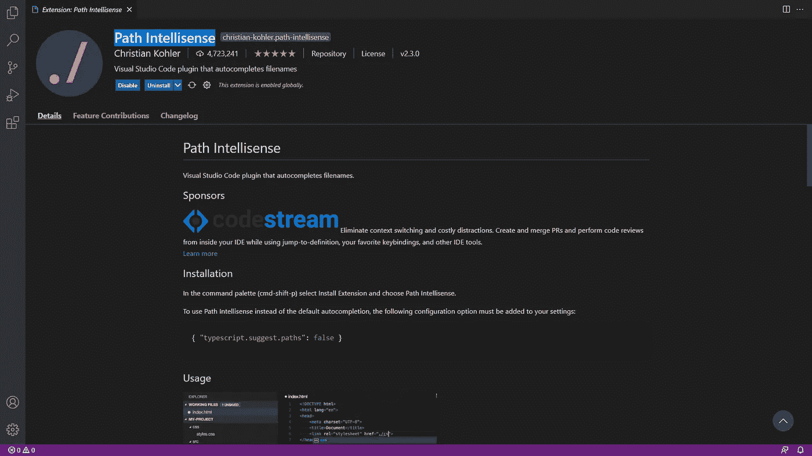

Doc-: [https://marketplace.visualstudio.com/items?itemName=christian-kohler.path-intellisense](https://marketplace.visualstudio.com/items?itemName=christian-kohler.path-intellisense)

这将显示您想要导入的文件的路径。从现在开始，你不必浪费时间去寻找你的导入路径，不管它应该是 ***../dir*** 或 ***../../dir。***

# 8.材料图标主题

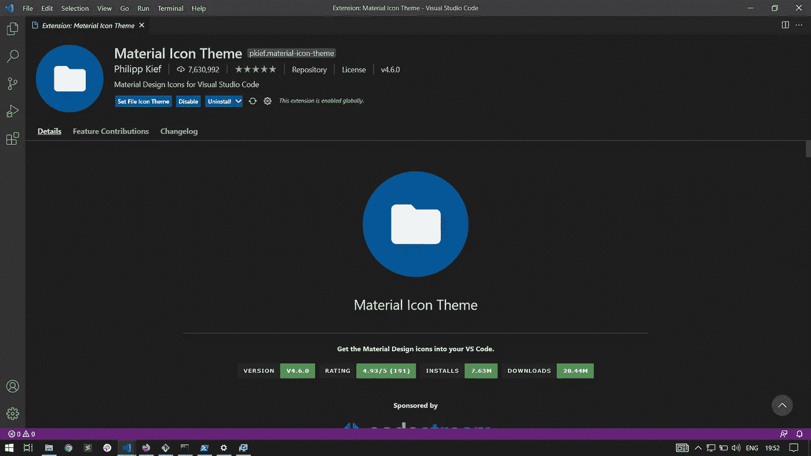

Doc-: [https://marketplace.visualstudio.com/items?itemName=PKief.material-icon-theme](https://marketplace.visualstudio.com/items?itemName=PKief.material-icon-theme)

想要更快地识别文件类型？太好了。那就装这个吧。

安装此扩展名后，您将能够比查看扩展名更快地识别文件类型，因为 ***您将在文件名前看到文件类型的图标。***

甚至我们的编码环境在这之后看起来也不错。

你可以看到下面所有的文件都有自己的图标，这更容易区分。

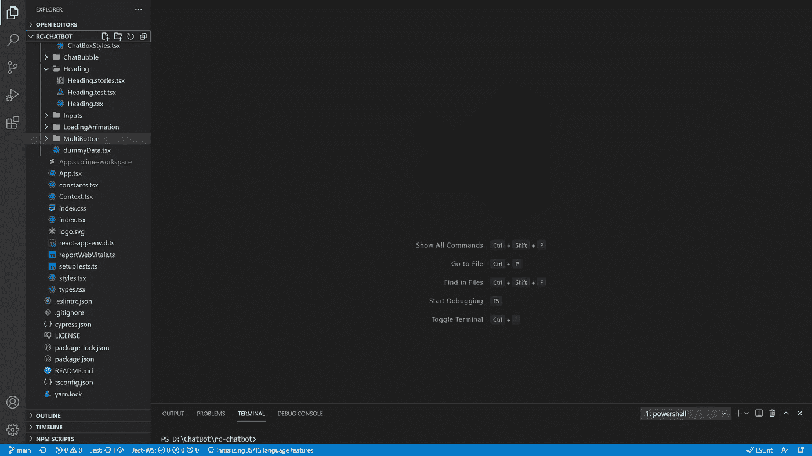

# 9.玩笑

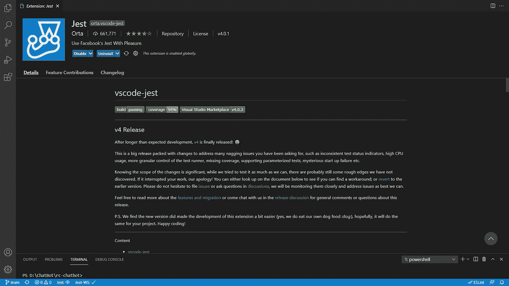

Doc-: [https://marketplace.visualstudio.com/items?itemName=Orta.vscode-jest](https://marketplace.visualstudio.com/items?itemName=Orta.vscode-jest)

这是写给所有使用 Jest 测试应用程序的 JavaScript 开发者的。这包括许多有助于测试的特性。

比如:

*   在线显示单个失败/通过。
*   在问题检查器中显示失败。
*   突出显示`expect`功能旁边的错误。
*   向快照文件添加语法突出显示。
*   一键更新失败的快照。
*   在被测试的文件中显示覆盖率信息。
*   帮助调试 VSCode 中的 Jest 测试。

# 10.埃斯林特

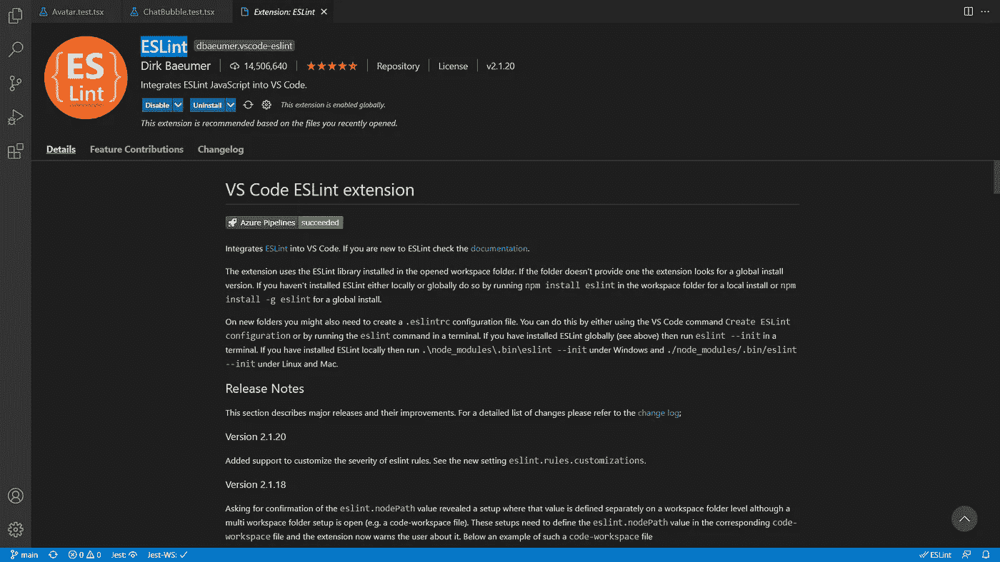

Doc-: [https://marketplace.visualstudio.com/items?itemName=dbaeumer.vscode-eslint](https://marketplace.visualstudio.com/items?itemName=dbaeumer.vscode-eslint)

这也适用于 **JavaScript/Typescript** 开发者。在检测到本地或全局安装的 ESlint 库后，它将帮助您显示代码中的林挺错误。

> 那么你就不需要运行脚本来检查林挺错误了。您可以在编写代码的同时进行解析。

***提示*** :一定要安装项目所用语言的扩展， [***智能感知***](https://vscode.readthedocs.io/en/latest/editor/intellisense/) 会有所帮助:

> 1.代码完成
> 
> 2.参数信息
> 
> 3.快速信息

> 这些扩展将帮助你节省大量的开发时间和精力，从现在起你可以更有效率。

✌️🤓

*更多内容请看*[*plain English . io*](http://plainenglish.io/)