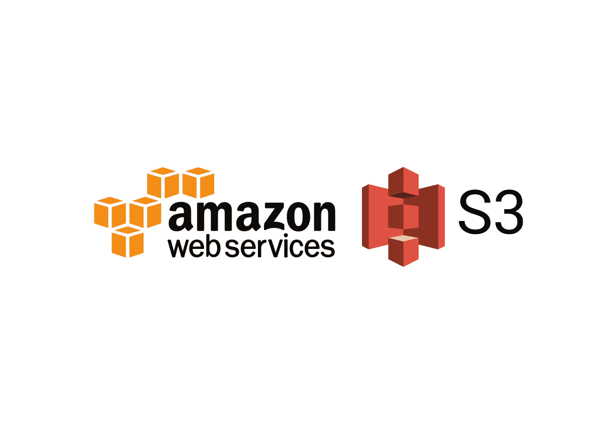
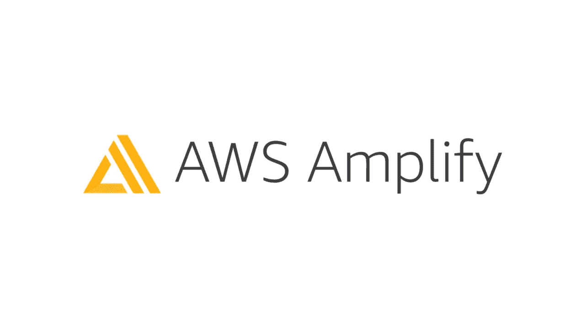
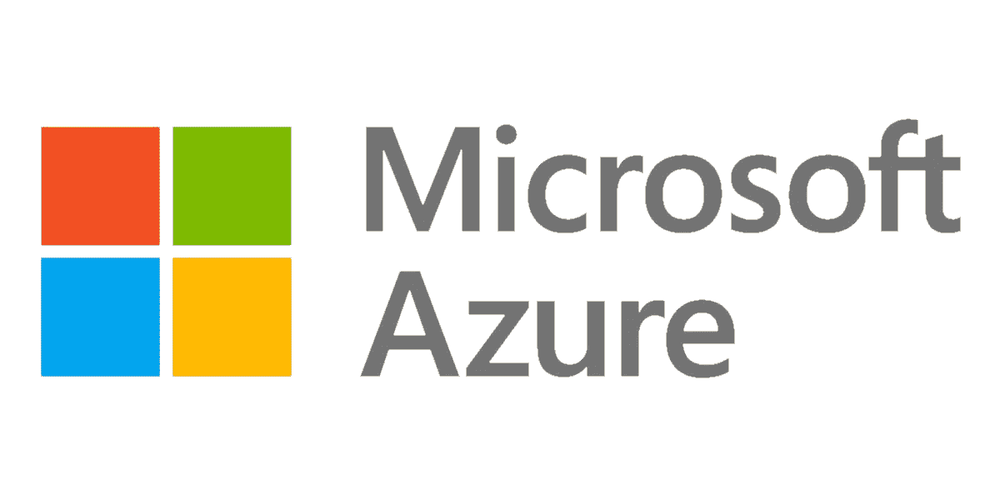
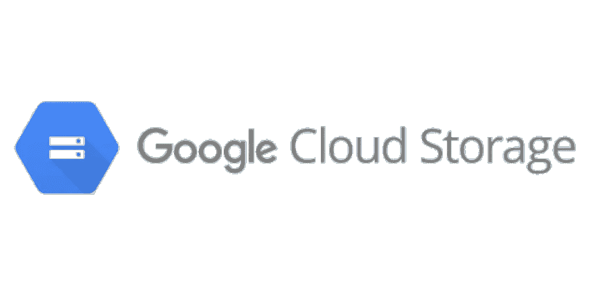

# 免费托管 React 应用的 10 种方式

> 原文：<https://javascript.plainenglish.io/10-ways-to-host-your-react-app-for-free-cf91fe615177?source=collection_archive---------1----------------------->

## 以下是为你的 React 应用提供免费托管的 10 项服务。

Photo by [NASA](https://unsplash.com/@nasa?utm_source=unsplash&utm_medium=referral&utm_content=creditCopyText) on [Unsplash](https://unsplash.com/s/photos/servers?utm_source=unsplash&utm_medium=referral&utm_content=creditCopyText)

React 是 JavaScript 中最流行的库。大多数开发商正采取行动应对。React 社区正在快速发展。随着越来越多的 React 应用被开发出来。

但这里的问题是托管应用程序的成本。随着应用程序用户的增长，我们需要基于它进行扩展，成本也会增加！所以在这里我们可以看到提供免费托管的服务。我们来主持吧。

# 1.网络生活

Netlify 是一个自动化现代网络项目的一体化平台。它使用 GitHub、Bitbucket 和 Gitlab 提供连续部署。React App 可以分 3 步部署。它还提供免费的自动 HTTPS。您也可以添加自定义域。借助 Netlify Edge，您的 React 应用程序能够以极快的速度访问到客户端。

除了部署，Netlify 还提供无服务器功能、表单、分析、CLI、API 等。这些功能大部分都是免费提供的，但有一些限制。

# **2。韦尔塞尔**

[Vercel](https://vercel.com)next . js 的创建者，一个现代的 react 框架。可以在 Vercel 中零配置部署 React App。它将通过其全球边缘网络提升应用性能。

Vercel 在 Bitbucket、Github 和 GitLab 中提供了 Pull 请求的预览链接，在部署前测试该特性。

Vercel 还提供了一些初学者模板来创建和部署一个新的应用程序。它提供连续部署、无服务器功能、HTTPS 等。

# 3.AWS S3

亚马逊网络服务是世界领先的云服务提供商。它提供几乎每一个云服务，有些服务只有 AWS 给出。

S3 也是 AWS 的服务之一。S3 水桶是众所周知的存储静态资产。S3 最常见的用途是保存图像。它还提供静态网站托管。

您只需要将 React 构建文件上传到 bucket。一旦上传完成。您可以使用 bucket URL 访问该应用程序。您还可以配置 CloudFront 来添加自定义域和 HTTPS。AWS 为新账户提供 12 个月的免费积分。您可以使用这些免费积分来使用 S3 和其他 AWS 服务。

# 4.AWS 放大器

亚马逊网络服务还提供了另一项名为 [Amplify](https://aws.amazon.com/amplify/?nc=sn&loc=0) 的服务来托管你的 React 应用。Amplify 将使用全球 CDN 构建和托管您的 React 应用程序。

Amplify 可以与 Git 服务集成，以实现持续部署。它还提供 HTTPS，自定义域，监控，密码保护，拉请求预览等等。

Amplify 免费提供 12 个月的服务。由于它使用了亚马逊 CloudFront CDN，部署的应用程序更快，并缓存在附近的边缘位置，以非常快速地提供服务。

# 5.微软 Azure

微软提供 [Azure](https://azure.microsoft.com/en-us/) 静态 Web 应用来托管你的 React 应用。托管应用程序从全球分布的点提供服务，以提供更好的性能。

Azure 提供免费的 HTTPS、自定义域、版本控制、Git 集成等等。

Azure 有这些服务的免费计划。它使用 Git 集成提供连续部署。

# 6.GitHub 页面

[GitHub Pages](https://pages.github.com/) 是全球最大、最先进的开发平台 GitHub 提供的服务。

您可以从 GitHub 存储库中直接托管 React 应用程序。你只需要做出改变，推动 React 应用上线。

GitHub 页面提供免费的 HTTPS 和自定义域名。您可以通过一些简单的步骤来配置 GitHub 页面。

# **7。谷歌云存储**

Google Cloud 提供 [**云存储桶**](https://cloud.google.com/storage/docs/hosting-static-website?skip_cache=true) 来托管静态站点。你需要做的就是创建一个桶，上传代码并公开。现在 React 应用程序已经部署好了。

云存储桶不提供 HTTPS 和自定义域。您可以使用 HTTPS 负载平衡服务对其进行配置。

云存储空间有每月限额的免费层计划。谷歌还为新账户提供 300 美元的免费积分。

# 8.提供；给予

[Render](https://render.com) 是一个云服务提供商，为静态和动态站点提供服务。你可以通过三个简单的步骤托管你的 React 应用。

Render 提供免费的 SSL，全球 CDN，自定义域，自动部署与 Git 集成。

Render 提供了一个免费的计划来托管静态站点，并为其他服务提供了有竞争力的价格。

# **9。浪涌**

[Surge](https://surge.sh) 是一个静态网站托管平台。您可以使用 surge CLI 进行部署。

Surge 没有提供任何 Web 控制台来托管网页。您可以从 CLI 托管 React 应用程序。

您可以使用 surge CLI 通过几个步骤来托管它。它提供免费的 SSL，自定义域配置。在 surge 中托管可能需要一些 CLI 技巧。

# **10。Heroku**

[Heroku](https://www.heroku.com/home) 是一个基于容器的云平台即服务。Heroku 提供几乎所有的云服务，比如 AWS。它的大部分服务都是免费的。

您可以使用[**Heroku build pack for create-React-App**](https://github.com/mars/create-react-app-buildpack)**部署 React 应用程序。**使用 Heroku CLI，您可以用几个命令部署 React 应用程序。Buildpack 用于自动部署，内置的捆绑器使部署不那么复杂。

Heroku 提供免费 SSL、自定义域和 Git 集成。

# 结论

还有一些更免费的服务，比如 **Firebase** 和 **Cloudflare** **Pages。**我希望您发现这很有用。感谢您的阅读。

需要学习更多？请随时在 [Twitter](https://twitter.com/Nilanth) 上联系。

## **延伸阅读:**

 [## 将可组合的 React 应用程序部署到 Netlify

### 在这篇博文中，我们将学习如何使用 Bit 来构建和部署一个可组合的 React 应用程序到 Netlify。在位…

比特云](https://bit.cloud/blog/deploying-a-composable-react-app-to-netlify-l7rlluzs)  [## 扩展 React 应用的 5 个技巧

### 1.将 Bit 用于可组合设计 2。设计令牌 3。网络请求的定制钩子 4。客户端与服务器状态 5。一个…

javascript.plainenglish.io](/5-tips-to-scale-up-your-react-apps-8fb68319062e) 

*更多内容请看* [***说白了就是***](https://plainenglish.io/) *。报名参加我们的* [***免费每周简讯***](http://newsletter.plainenglish.io/) *。关注我们关于* [***推特***](https://twitter.com/inPlainEngHQ) ，[***LinkedIn***](https://www.linkedin.com/company/inplainenglish/)*，*[***YouTube***](https://www.youtube.com/channel/UCtipWUghju290NWcn8jhyAw)*[***不和***](https://discord.gg/GtDtUAvyhW) *。对增长黑客感兴趣？检查出* [***电路***](https://circuit.ooo/) *。**