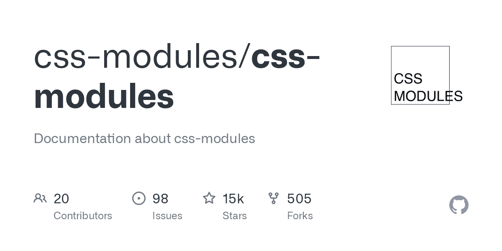
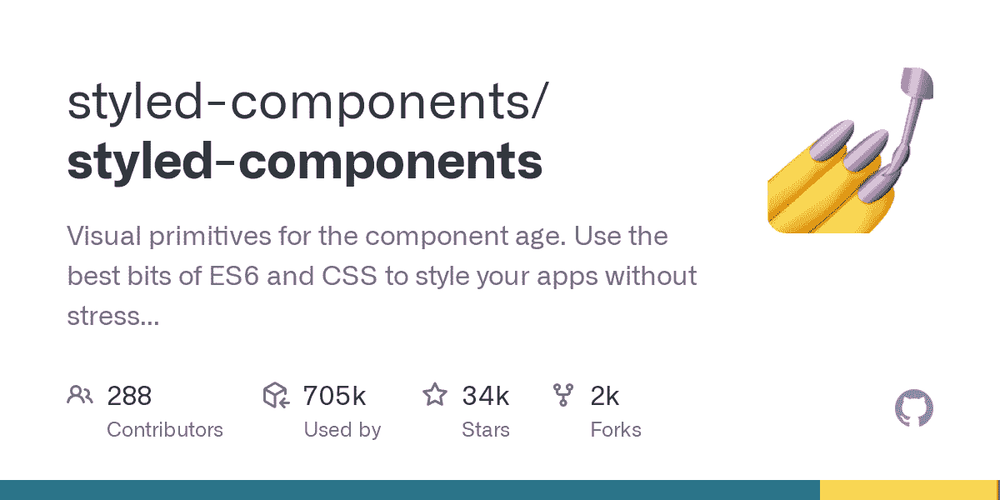
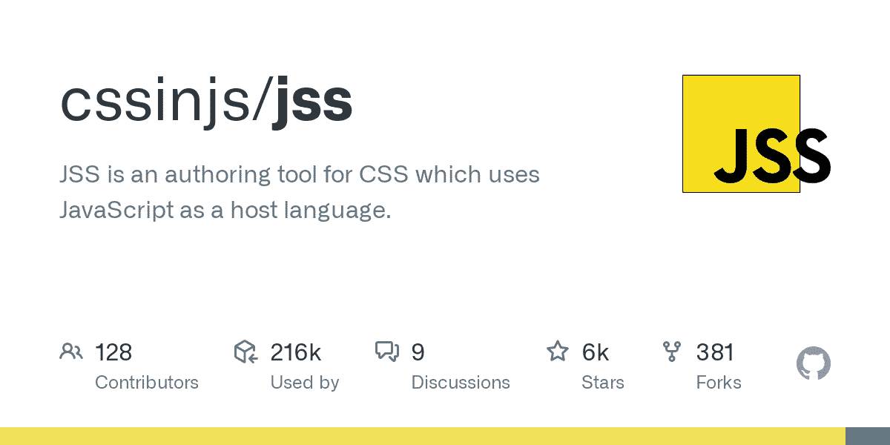
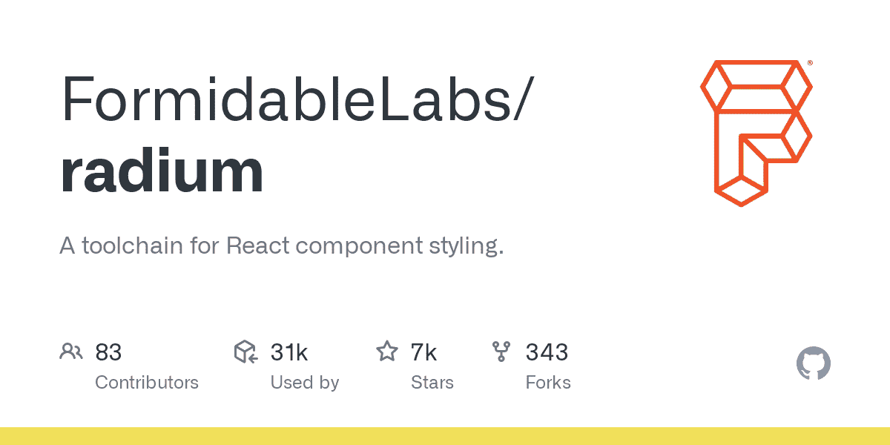
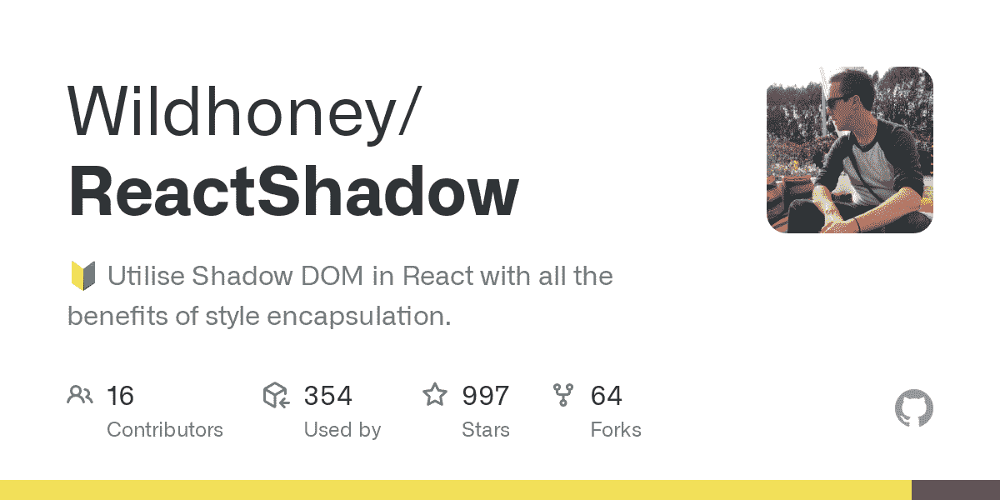
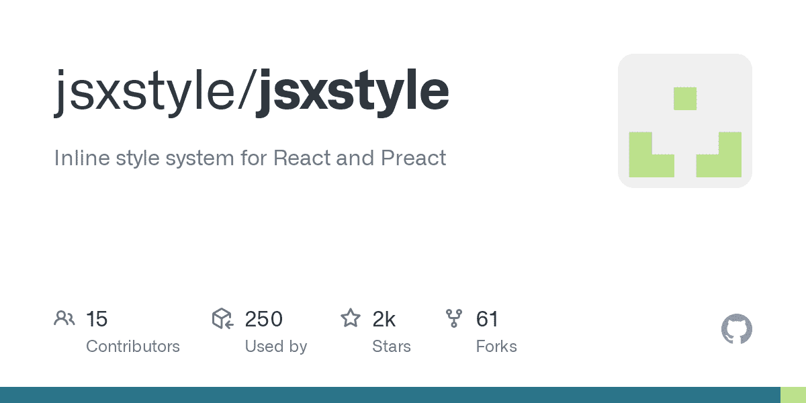
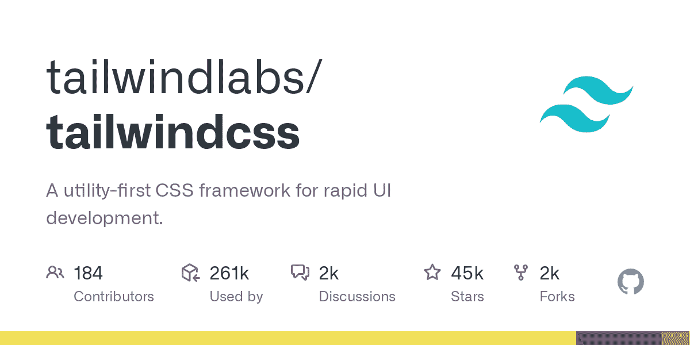

# 设计 React 应用程序的 10 种方式

> 原文：<https://javascript.plainenglish.io/10-ways-to-style-a-react-application-29db8f1f8fd0?source=collection_archive---------4----------------------->

React 是一个渲染 UI 的库，它不关心样式。React 是一件好事，但它也让我们独自在一个有很多选择的大海洋中。


通常，为 React 应用程序选择样式系统并不像看起来那么难。还有，你不一定要把文章里列出的 10 种方式都用上。

知道所有可用的选项是很好的，所以你可以根据情况选择最好的。

1.  内嵌样式
2.  样式表
3.  CSS 模块
4.  CSS 预处理器
5.  样式组件
6.  反应 JSS
7.  镭
8.  JSX 风格
9.  反应阴影
10.  实用 CSS 框架

## 1.在一条直线上的

内联 CSS 和普通样式标签是一样的。

## **2。样式表**

样式表在 react 生态系统中非常常见，而且很酷。唯一的问题是将样式从另一个组件中分离出来相当困难。

我们创建常规的样式表，并将它们导入到您的组件中

```
.container{
  width: 100%;
  padding: 12px;
  background: red;
}
```

默认情况下，Create-React-App 通过使用 PostCSS 执行了一些步骤，使其可以投入生产。

## **3。CSS 模块**

[CSS 模块](https://github.com/css-modules/css-modules)通过为每个类创建一个唯一的类名来解决风格隔离问题。



Create-React-App 内置了对 CSS 模块的支持。CSS 模块允许我们对文件使用相同的类名，而不用担心 CSS 名称冲突。

例如，我们在两个不同的文件上有相同的类`container`

```
// homepage.module.css **.container**{
  padding:12px;
  background:red;
}
```

如果我们在另一个文件中有相同的类名。

```
// contactpage.module.css
**.container**{
  padding: 12px;
  background:green;
}
```

## **4。CSS 预处理器**

通过使用 webpack loader，我们可以使用`SASS`、`SCSS`、`LESS`、`STYLUS`等。但不幸的是，在 CRA，它们都不被默认支持。

我们可以通过安装`node-sass`来使用`SCSS`或`SASS`

```
npm i node-sass
```

更多信息，请查看[官方文件。](https://create-react-app.dev/docs/adding-a-sass-stylesheet)

## 5.样式组件

不像 JS 那样编写 CSS，[样式组件](https://styled-components.com/)允许我们编写真正的 CSS。



通过`npm`安装样式化组件

```
npm i styled-components
```

让我们使用`styled-componets`创建相同的样式

Styled-Component 使用[标记的模板文字](https://developer.mozilla.org/en-US/docs/Web/JavaScript/Reference/Template_literals#tagged_templates)创建样式。

## 6.反应 JSS

JSS 被允许以声明性的、无冲突的和可重用的方式使用 Javascript 创建 CSS。



使用`npm`安装 [react-jss](https://cssinjs.org/react-jss/?v=v10.7.1)

```
npm i react-jss
```

然后使用`createUseStyles`创建风格

## 7.镭

Radium 是一套使用 javascript 创建**内联样式**的工具。镭做了一些[树摇动](/deep-dive-into-tree-shaking-ba2e648b8dcb)来消除死代码。



默认情况下，react 不允许带有类似`:hover`、`:focus`等伪选择器的内联样式。

使用`npm`安装[镭](https://formidable.com/open-source/radium/)

```
npm i radium
```

## 8.反应阴影

React Shadow 允许我们在 React 中创建影子 DOM，并具有样式封装的所有优点。



使用`npm`安装[延伸阴影](https://github.com/Wildhoney/ReactShadow)

```
npm i react-shadow
```

## 9.JSX 风格

[jsxstyle](https://github.com/jsxstyle/jsxstyle) 是一个**内联风格系统**用于 React 和 Preact。它在不牺牲性能的情况下提供了一流的开发人员体验。



使用`npm`安装 [jsxstyle](https://github.com/jsxstyle/jsxstyle)

## 10.实用框架

创建实用框架是为了避免创建样式表。最著名的实用程序框架是 [tailwindcss](https://tailwindcss.com/)



CRA 本身不支持 tailwindcss，我们需要使用一些 CRA 覆盖，如 CRACO。

更多信息，请查看[正式文件](https://tailwindcss.com/docs/guides/create-react-app)

希望你喜欢这篇文章。

快乐阅读 **❤️** 。

*更多内容请看*[***plain English . io***](http://plainenglish.io/)