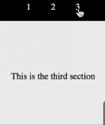
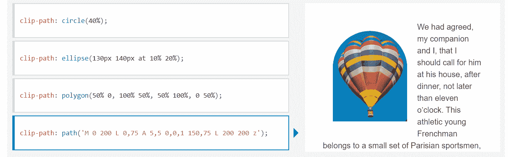
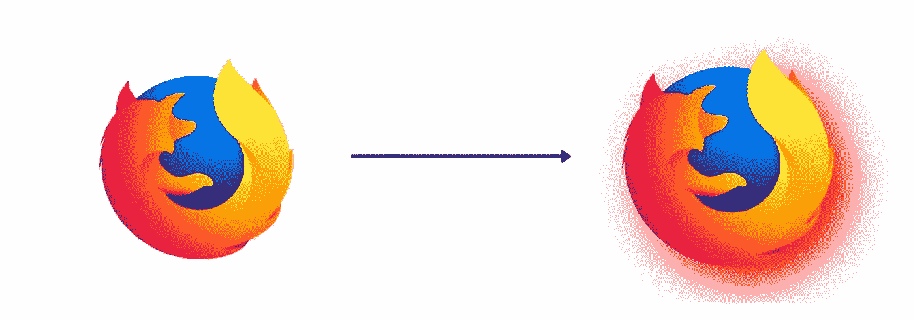
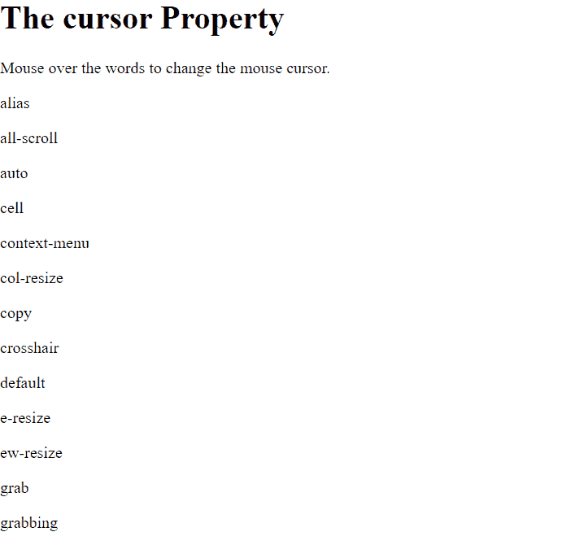
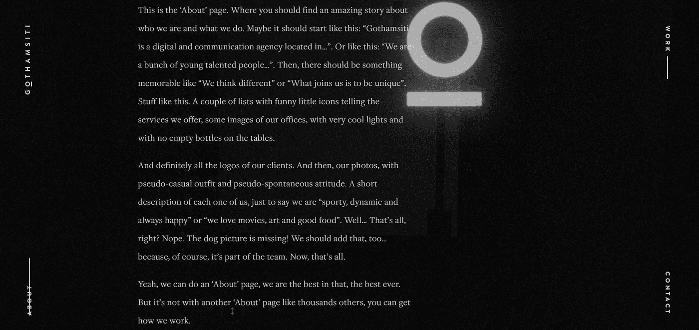
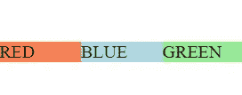

# 11 个极其有用的 CSS 一行程序

> 原文：<https://javascript.plainenglish.io/11-css-one-liners-that-are-insanely-useful-8a2878200474?source=collection_archive---------2----------------------->

## 只用几行 CSS 就能创建优秀的网站。


Photo by [Oladimeji Odunsi](https://unsplash.com/@oladimeg?utm_source=medium&utm_medium=referral) on [Unsplash](https://unsplash.com?utm_source=medium&utm_medium=referral)

在这个博客中，我们将会看到一些非常有用的 CSS 代码片段，它们很短但功能强大。

使用这些代码片段，您可以立即改善您的网站的外观和感觉。

以下是 11 个极其有用的 CSS 代码片段:

## 1.滚动行为

```
html {
  scroll-behavior: smooth;
}
```

这一行简单的代码可以让您不必编写复杂的 JavaScript。



Demo

该属性使我们能够定义当用户单击指向滚动框内锚定位置的链接时，浏览器的滚动位置是跳跃还是平滑过渡。

Chrome 版、Firefox 36+版、Edge 版都支持这个属性。

## 2.剪辑路径属性

```
clip-path: circle(40%);
clip-path: ellipse(130px 140px at 10% 20%);
clip-path: polygon(50% 0, 100% 50%, 50% 100%, 0 50%);
clip-path: path('M 0 200 L 0,75 A 5,5 0,0,1 150,75 L 200 200 z');
```



CSS 属性允许我们控制剪辑区域的哪一部分可以被显示。

显示区域内部的内容，而隐藏外部部分。

Chrome 版本 55+和 Edge 版本 12+支持该属性。您可以在 [MDN 文档](https://developer.mozilla.org/en-US/docs/Web/CSS/clip-path)中了解更多信息。

## 3.过滤属性

```
filter: drop-shadow(16px 16px 20px red);
```



[Source](https://developer.mozilla.org/en-US/docs/Web/CSS/filter).

使用这个 CSS 一行程序，你可以很容易地给你的图像添加令人惊奇的滤镜。

此属性允许轻松应用视觉效果，如投影、模糊、颜色偏移、反转颜色等。

下面给出了其中的一些属性。

```
filter: blur(5px);
filter: contrast(200%);
filter: grayscale(80%);
```

Chrome 版本 53+，Firefox 版本 35+，Edge 版本 12+都支持这个属性。

## 4.伪类

```
:is(header, main, footer) p:hover {
  color: red;
  cursor: pointer;
}
```

`:is()`函数帮助我们使用选择器列表将相同的样式应用于一堆不同的元素。

这些选择器列表作为参数传递给`:is()`函数，任何可以被选择器列表选择的元素都会受到影响。

在编写简短的 CSS 文件和实现 DRY(不要重复自己)原则时，它可以派上用场。

Chrome 版、Firefox 版、Edge 版都支持这个属性。

Chrome 版、Firefox 版、Edge 版都支持这个属性。

## 5.用户选择属性

```
div {
  -webkit-user-select: none; /* Safari */
  -ms-user-select: none; /* IE 10 and IE 11 */
  user-select: none; /* Standard syntax */
}
```

曾经想要阻止你的用户复制文本吗？

如果是，那么`user-select`就是允许你这么做的属性。

`user-select`属性指定文本是否可以被选择。

Chrome 版、Firefox 版、Edge 版都支持这个属性。

## 6.更改光标

```
div{
   cursor:alias;
}
```

利用这个简单而强大的属性，你可以很容易地改变光标的外观。



Demo. [Source](https://www.w3schools.com/cssref/tryit.asp?filename=trycss_cursor).

有很多值可以使用。不同的光标传达不同的意思。

例如，可移动对象有一个`cursor:grab`属性来表示它们是可拖动的元素。

Chrome 版、Firefox 版、Edge 版都支持这个属性。

## 7.插入符号颜色

```
input {
  caret-color: red;
}
```

仅使用普通 CSS，您就可以在输入、文本区域或任何可编辑的元素中更改光标的颜色。

根据网站的不同，它可以帮助你提供统一的网站。

Chrome 版本 57+，Firefox 版本 53+，Edge 版本 79+都支持这个属性。

## 8.自定义滚动条

```
::-webkit-scrollbar {
  width: 20px;
}
```

你可以很容易地定制滚动条，为你的网站提供一个独特的风格。

此外，你也可以改变滚动条轨道和拇指容易。

你可以在 [MDN](https://developer.mozilla.org/en-US/docs/Web/CSS/::-webkit-scrollbar) 网站上查看浏览器兼容性。

```
body::-webkit-scrollbar-track {
    -webkit-box-shadow: inset 0 0 6px rgba(0,0,0,0.9);}

body::-webkit-scrollbar-thumb {
  background-color: red;
  outline: 1px solid red;
}
```

## 9.写入方式

```
writing-mode: vertical-lr;
```

正确使用写作模式可以帮助你给你的网站增添趣味。

书写模式设置文本行是水平布局还是垂直布局。您也可以通过将它应用到 HTML 文件的根元素来为整个项目设置它。



[Source](https://www.gothamsiti.it/about).

Chrome 版、Firefox 版、Edge 版都支持这个属性。

## 10.边框

```
box-sizing: border-box;
width:100%;
```

将`box-sizing`设置为`border-box`是一个避免任何意外填充问题的巧妙技巧。

它告诉浏览器在元素本身的宽度和高度中指定的值中包含任何边框和填充。

例如，如果您的元素宽度是 125 像素，那么您添加的任何填充都将包含在该宽度(125 像素)本身中。

Chrome 版、Firefox 版、Edge 版都支持这个属性。

## 11.将物品放在中间

```
place-items: center stretch;
```

当这个属性与网格结合使用时，在同时沿块方向和内联方向对齐项目时，可以证明是非常有用的(即`[align-items](https://developer.mozilla.org/en-US/docs/Web/CSS/align-items)`和`[justify-items](https://developer.mozilla.org/en-US/docs/Web/CSS/justify-items)`属性)。



Centered items.

但是，值得一提的是，Internet Explorer 10 和早期版本不支持 align-items 属性。

Chrome 版、Firefox 版、Edge 版都支持这个属性。

## 结论

HTML 展示了数据的结构，而 CSS 则设计了数据的样式，使其更易于展示。

每个 web 开发人员在其职业生涯的某个阶段都会使用 CSS，了解强大的一行程序会派上用场。

此外，了解这些属性还可以让您避免编写复杂的 JavaScript 代码。

然而，值得一提的是，在使用任何 CSS 属性之前，您应该检查浏览器的兼容性。

如果你喜欢读这篇文章，考虑使用[我的推荐链接](https://medium.com/@anuragkanoria/membership)，这样你就可以通过点击[这里](https://medium.com/@anuragkanoria/membership)无限制地访问我的博客以及其他作者的博客。

*更多内容尽在*[***plain English . io***](http://plainenglish.io/)