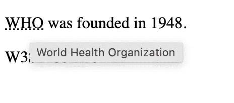
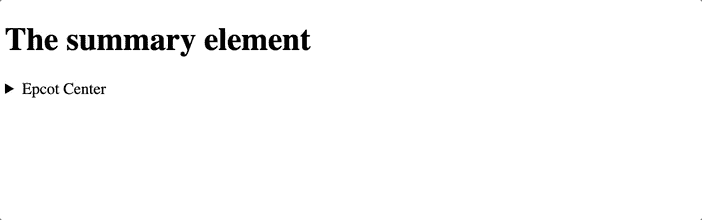

# 11 个非常有用的 HTML 一行程序

> 原文：<https://javascript.plainenglish.io/11-html-one-liners-that-are-insanely-useful-3b62f4e57a06?source=collection_archive---------0----------------------->

## 只需简单的 HTML 就能完成更多任务。


Photo by [kelisa Bernard](https://unsplash.com/@kellisa?utm_source=medium&utm_medium=referral) on [Unsplash](https://unsplash.com?utm_source=medium&utm_medium=referral)

HTML 和 CSS 是前端开发世界的支柱。

虽然精通 CSS 和 JavaScript 对于创建精彩的网站至关重要，但人们常常低估了仅仅使用一个普通的 HTML 文件所能完成的工作。

从延迟加载图像到给视频添加标题，HTML 可以做很多大多数开发者没有完全意识到的事情。

下面是 11 个你可以马上使用的 HTML 单句:

## #1.工具提示

```
<body><p>
<abbr title="World Health Organization">WHO</abbr> was founded in 1948.
</p>
<p title="Free Web tutorials">W3Schools</p></body>
```

向 HTML 元素添加简单的工具提示不需要 CSS 或 JavaScript。

使用`title`属性，您可以轻松地添加一个工具提示来为您的用户提供额外的信息。



Demo of the code snippet above.

## #2.[计] 下载

```
<a href="/images/myw3schoolsimage.jpg" download>
```

当您希望用户下载链接而不是导航到文件时,`download`属性非常有用。

此外，您还可以设置您的用户将下载的文件的文件名。

```
<a href="link/to/your/file" download="filename">Download link</a>
```

## #3.断词机会

```
<p>This is a veryveryveryveryveryveryveryveryveryveryveryveryveryveryveryveryveryvery<wbr>longwordthatwillbreakatspecific<wbr>placeswhenthebrowserwindowisresized.</p>
```

没有人喜欢 HTML 在不应该的地方打断单词。

使用`<wbr>`，你可以很容易地指出哪些地方(机会)可以打破常规。

当单词太长并且浏览器很可能在不正确的地方打断它时，这很有用。

## #4.文本方向

```
<p dir="auto">This text is following dir=auto</p>
```

使用`dir=”auto”`，浏览器将根据内容的语言更改文本对齐方式。

当你处理不像英语那样从左到右的语言时，这是非常有用的。

社交媒体聊天应用程序中可能会用到这个属性。

## #5.基础手风琴

```
<details>
  <summary>Epcot Center</summary>
  <p>Epcot is a theme park at Walt Disney World Resort featuring exciting attractions, international pavilions, award-winning fireworks and seasonal special events.</p>
</details>
```

通过使用`details`和`summary`语义元素，你可以创建一个非常简单的手风琴。



Demo of the code snippet above. Source: Author.

用`details`元素包装手风琴元素，标题使用`summary`元素。最后，使用`p`段落元素编写手风琴的主要内容。

## #6.内容可编辑

```
<p contenteditable='true'>This is a paragraph. Click the button to make me editable.</p>
```

通过将`contenteditable`属性设置为 true，您可以编辑任何内容。

不管是`div`还是`p`，它都会变成可编辑的。

此外，您还可以使用 [isContentEditable](https://www.w3schools.com/jsref/prop_html_iscontenteditable.asp) 属性来确定某个元素是否可编辑。

## #7.添加标题

```
<video width="320" height="240" controls>
  <source src="forrest_gump.mp4" type="video/mp4">
  <source src="forrest_gump.ogg" type="video/ogg">
  <track src="fgsubtitles_en.vtt" kind="subtitles" srclang="en" label="English">
  <track src="fgsubtitles_no.vtt" kind="subtitles" srclang="no" label="Norwegian">
</video>
```

仅使用 HTML，您就可以使用`<track>`元素为您的视频文件添加标题。

使用`src`属性指向字幕文件，使用`srclang`属性设置语言。

## #8.惰性装载

```


<!-- off-screen images -->


```

您可以通过将`loading`属性设置为‘lazy’来按需加载图像(也称为延迟加载)。

这是一种简单但非常有效的优化技术，只加载用户可见的部分，其他图像根据用户的需要稍后加载。

## #9.基本 URL

```
<head>
  <base href="https://www.w3schools.com/" target="_blank">
</head>

<body>

<a href="tags/tag_base.asp">HTML base Tag</a>
</body>
```

如果您在您的网站上多次调用一个公共域，您可以使用`<base>`元素来设置一个基本 URL，如上面提供的代码片段所示。

现在图像元素中`src`的实际值是"https://www.w3schools.com/images/stickman.gif"。

如果你使用过像 Axios[Axios](https://axios-http.com/)这样的库，设置一个基本 URL 是非常常见的做法。

## #10.控制上下文菜单和粘贴

```
<input type="text" onpaste="return false" value="Paste something in here"><div oncontextmenu="myFunction()" contextmenu="mymenu">
```

您可以监听事件，比如当他们使用右键单击或尝试粘贴内容时，并用`oncontextmenu`和`onpaste`属性处理这些事件。

如果你不想让用户粘贴到像密码这样的字段上，你可以在那个输入字段上写`onpaste=”return false”`，这样用户就不能粘贴了。

类似地，每当用户右键单击该元素时，`oncontextmenu`就会触发。

## #11.拼写检查

```
<p contenteditable="true" spellcheck="true">This is a praggagraph. It is editable. Try to change the text.</p>
```

属性`spellcheck`设置为 true 时，告诉浏览器必须检查该元素中用户输入的语法和拼写错误。

这是一个方便的属性，便于用户编写正确无误的内容。

## 最后的想法…

HTML 展示了数据的结构，而 CSS 则设计了数据的样式，使其更易于展示。

然而，HTML 不仅仅是建立数据的结构。

有了这些强大的一行属性，您可以直接从 HTML 文件中做更多的事情。

如果你喜欢读这篇文章，考虑使用[我的推荐链接](https://medium.com/@anuragkanoria/membership)，这样你就可以通过点击[这里](https://medium.com/@anuragkanoria/membership)无限制地访问我的博客以及其他作者的博客。

如果你正在使用 Chrome 浏览器，请随意查看我最近关于 Chrome 扩展的博客，我希望我能早点知道。

[](/9-chrome-extensions-i-wish-i-knew-earlier-a42ec954ac9e) [## 9+ Chrome 扩展我希望我能早点知道

### 大多数人不知道这些方便的扩展。

javascript.plainenglish.io](/9-chrome-extensions-i-wish-i-knew-earlier-a42ec954ac9e) 

*更多内容请看*[*plain English . io*](http://plainenglish.io/)*。报名参加我们的* [*免费周报在这里*](http://newsletter.plainenglish.io/) *。*