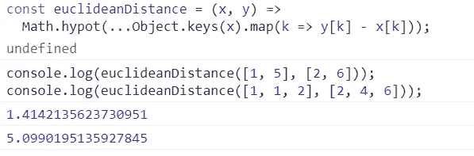

# 现代 JavaScript 中的 11 种数学算法

> 原文：<https://javascript.plainenglish.io/11-mathematical-algorithms-in-modern-javascript-bce71318e2da?source=collection_archive---------10----------------------->

## 处理数字的超级有用的帮手


Photo by [Black ice](https://www.pexels.com/es-es/@black-ice-551383?utm_content=attributionCopyText&utm_medium=referral&utm_source=pexels) in [Pexels](https://www.pexels.com/es-es/foto/muchos-numeros-1314543/?utm_content=attributionCopyText&utm_medium=referral&utm_source=pexels)

这个集合包含一组(> = ES6)算法来处理数字。事实是，我以为写这篇文章会花更少的时间，但最终，我花了更多的时间来找到每种情况的最优(或至少最简单)解决方案。

希望对你有用！

# 索引:

1.  reverse 编号
2.  isOdd
3.  sumAll
4.  平均的
5.  中位数
6.  计算 cd
7.  计算
8.  isPrime
9.  欧几里德距离
10.  是可分的
11.  格式到货币

# 1.reverse 编号

```
const reverseANumber = n => {
    //1\. 
    let sing = Math.sign(n).toString();//2\. 
    n = n.toString().replace('-','').replace('+','');//3.
    return sing.concat(n.split("").reverse().join(""));
};
```

## 例子

```
console.log(reverseANumber(1000));
console.log(reverseANumber(-1000));
console.log(reverseANumber(0001));
console.log(reverseANumber(12345));
```


Result of running the above code in Chrome dev tools.

## 说明

1.  首先，我们保存我们的号码。
2.  其次，我们将数字转换为字符串，以使用 replace 方法并消除符号。
3.  第三，我们用 String.prototype.split(')、Array.prototype.reverse()和 String.prototype.join(')，把 n 的反过来的值作为一个字符串；最后，我们连接先前保存的符号。

# 2.isOdd

以下方法使用模(%)运算符测试数字是奇数还是偶数，如果数字是奇数，则返回 true，如果数字是偶数，则返回 false。

```
const isOdd = num => num % 2 === 1;
```

## 示例:

```
console.log("1 is " + isOdd(1));
console.log("2 is " + isOdd(2));
console.log("3 is " + isOdd(3));
console.log("4 is " + isOdd(4));
console.log("5 is " + isOdd(5));
```


Result of running the above code in Chrome dev tools.

# 3.sumAll

这个方法将所有的数字相加，包括两个整数。

例如，给定下面的数组:[2，5]包括两个整数之间的和的所有数之和是 2+3+4+5 = 14。

```
const sumAll = (min, max) => ((max-min)+1) * (min + max) / 2;
```

## 示例:

```
sumAll(2,5);
```


Result of running the above code in Chrome dev tools.

但是如果第二个参数是零呢？结果为零，这是不正确的。

[1, 0] = 0

```
sumAll(1, 0);
```


我们可以改进算法来考虑这一点:

```
const sumAll = (min, max) => {return max === 0 ? min 
     : ((max-min)+1) * (min + max) / 2;
}
```


Result of running the above code in Chrome dev tools.

# 4.平均的

求一组数字的平均值就像把所有数字相加然后除以数字总数一样简单。

下面的方法使用 Array.prototype.reduce()增加用 0 初始化的累加器的值，然后将得到的数组除以其长度以获得其平均值。

```
const average = (...values) =>
  values.reduce((acc, val) => acc + val, 0) / values.length;
```

## 例子

```
console.log(average(1, 2, 3, 4, 5, 6, 7, 8, 9));
```


Result of running the above code in Chrome dev tools.

# 5.中位数

中值是所有数据从最低到最高排序时占据中心位置的值。

以下方法计算数字数组的中值:

```
const median = arr => {
  const mid = Math.floor(arr.length / 2),
  nums = [...arr].sort((a, b) => a - b);
  return arr.length % 2 !== 0 ? nums[mid] : (nums[mid - 1] + nums[mid]) / 2;
};
```

## 例子

```
console.log(median([5, 2, 10, 3, 20, 1]));
```


Result of running the above code in Chrome dev tools.

## 解释:

1.  计算中间值:3
2.  初始数组:[5，2，10，3，20，1]
3.  使用 Array.prototype.sort()对值进行排序:[1，2，3，5，10，20]
4.  如果数组长度为奇数，则返回中点处的数字，否则返回两个中间数字的平均值:[1，2， **3，5** ，10，20]
5.  (3 + 5 )/ 2 = 4

# 6.计算 cd

一组数的**最大公约数**是所有集合数相除后没有余数的最大正整数。它是集合中所有数字的最大倍数。

下面的方法计算一组数字的最大公约数。

考虑因素:

## 使用递归(对于数字数组)

如果 y 等于零，则返回 x。否则，返回 y 的 calculateGcd 和除法 x / y 的余数。

```
const calculateGcd= (...arr) => {
  const _calculateGcd = (x, y) => (!y ? x : _calculateGcd(y, x %  y));
  return [...arr].reduce((a, b) => _calculateGcd(a, b));
};
```

## 示例:

```
console.log(calculateGcd(9, 3));
```


Result of running the above code in Chrome dev tools.

## 无递归(仅针对两个数)

```
const calculateGcd = (x, y) => {
  x = Math.abs(x);
  y = Math.abs(y);
  while(y) {
    var t = y;
    y = x % y;
    x = t;
  }
  return x;
}
```

## 示例:

```
console.log(calculateGcd(9, 3));
```


Result of running the above code in Chrome dev tools.

# 7.计算

对于两个整数，x 和 y 表示为 LCM(x，y)，**最小公倍数**是能被 x 和 y 整除的最小正整数

我们可以实现这个数学公式，用 Gcd 求两个数的 LCM 这就是:LCM = (n1 x n2) / Gcd (n1，n2)。

```
const calculateGcd = (x, y) => {
  x = Math.abs(x);
  y = Math.abs(y);
  while(y) {
    var t = y;
    y = x % y;
    x = t;
  }
  return x;
}const lcm = (x, y) => {
  //1.
  let gcd = calculateGcd(x, y);

  //2.
  return (x * y) / gcd;
}
```

## 示例:

```
console.log(lcm(15, 20));
console.log(lcm(6, 8));
console.log(lcm(10, 2));
```


Result of running the above code in Chrome dev tools.

## 解释:

1.  首先使用我们之前的“计算 Gcd”方法获得 gcd。
2.  应用计算的 gdc 计算 lcm。

# 8.isPrime

质数是只能被自己和 1 整除的数。下面的方法检查一个数是否是质数。

```
const isPrime = n => {
  //1.
  const limit = Math.floor(Math.sqrt(n)); //2.
  for (let i = 2; i <= limit; i++){      //3.
      if (n % i === 0) return false;
  } //4\. 
   return n >= 2;
};
```

## 示例:

```
console.log(isPrime(1));
console.log(isPrime(7));
console.log(isPrime(11)); 
console.log(isPrime(4));
```


Result of running the above code in Chrome dev tools.

## 解释:

1.  计算给定数字的平方根。
2.  测试数字从 2 到计算的平方根。
3.  如果它们中的任何一个除以给定的数(n % i === 0)，则返回 false。我们只想要能被它们自己和 1 整除的数字。
4.  在另一种情况下，如果 n≥2，则返回 true。

# 9.欧几里德距离

欧氏空间中两点间的欧氏距离是两点间线段的长度。下面的方法计算任意维数的两点之间的距离。

```
const euclideanDistance = (x, y) =>
  Math.hypot(...Object.keys(x).map(k => y[k] - x[k]));
```

## 示例:

```
console.log(euclideanDistance([1, 5], [2, 6])); 
console.log(euclideanDistance([1, 1, 2], [2, 4, 6]));
```



Result of running the above code in Chrome dev tools.

## 解释:

1.  首先，我们将每个坐标映射到两点之间的差值。
2.  其次，我们使用 Math.hypot()方法来计算前面两点之间的欧氏距离。

# 10.是可分的

下面的方法检查第一个数字参数是否能被第二个整除。

我们使用模运算符(%)来检查余数是否等于 0。

```
const isDivisible = (dividend, divisor) => dividend % divisor === 0;
```

## 例子

```
console.log(isDivisible(10,1));
console.log(isDivisible(10,2));
console.log(isDivisible(10,3));
```


Result of running the above code in Chrome dev tools.

## 说明

如果计算被除数和除数之间的除法余数是零，那么它是可除的。

# 11.格式到货币

获取一个数字，并以指定的货币格式返回该数字。

我们可以使用 NumberFormat 实例将任何数字格式化为货币值:

```
const formatToCurrency = (n, curr, language) =>
  Intl.NumberFormat(language, {
    style: 'currency',
    currency: curr,
  }).format(n);
```

## 示例:

```
//Currency: US Dollar, currency lang format: USA
console.log(formatToCurrency(1000.10, 'USD', 'en-us'));//Currency: Euro, currency lang format: German
console.log(formatToCurrency(1000.10, 'EUR', 'de-DE'));//Currency: Euro, currency lang format: Local
console.log(formatToCurrency(1000.10, 'EUR'));
```


Result of running the above code in Chrome dev tools.

# 结论

到目前为止，这个用 JavaScript 编写的数学算法的小集合，我写得很开心，尽管有时候它们一开始并没有把我弄明白，我不得不上网一点点直到我成功。