# React 开发的 11 个必备工具

> 原文：<https://javascript.plainenglish.io/11-must-use-tools-for-react-development-36c3b6ba2218?source=collection_archive---------0----------------------->

## 在使用 React 超过 3 年后，我整理了最常用的工具，如果你使用 React，这些工具是必不可少的。

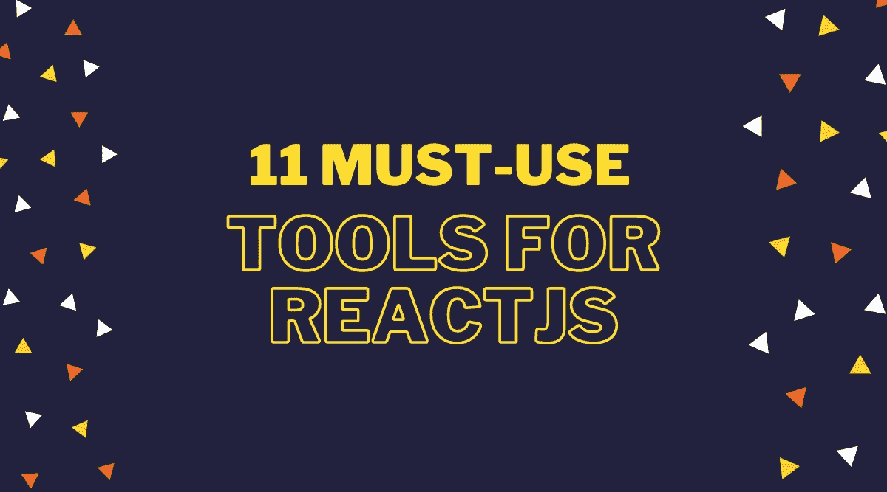

让我们深入探究每一个——

## 1.使用挂钩

容易理解的反应钩食谱。

有很多定制的钩子，你可以开箱即用，节省你的时间。

[https://usehooks.com](https://t.co/0iznNeUhAX?amp=1)

usehooks

## 2.反应视力

在几分钟内可视化您的 React 应用程序。

➵不需要设置
➵使用所有库
➵支持隐藏/显示组件

【reactsight.com 

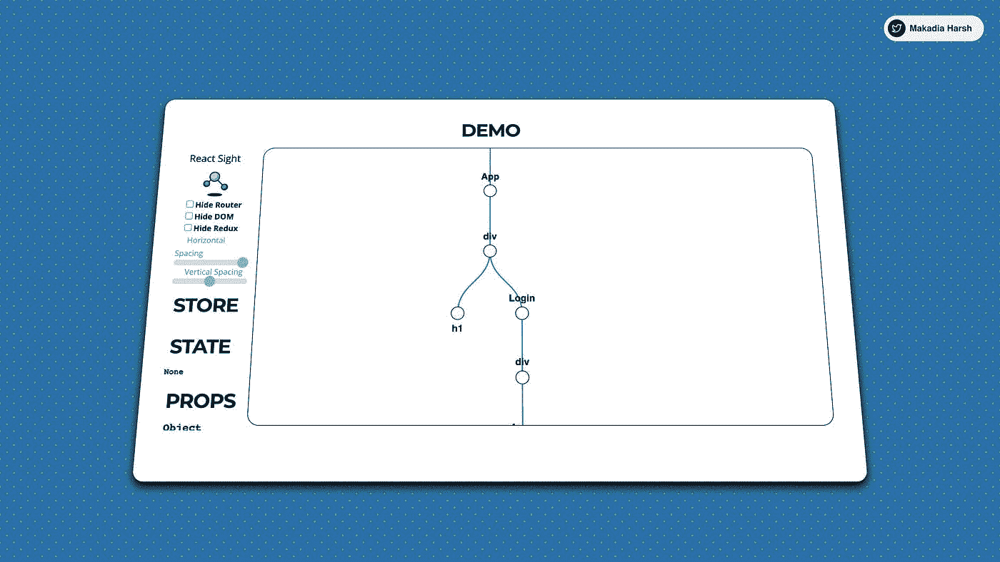

React Sight

## 3.束分析器

Webpack 插件和 CLI 实用程序，将包内容表示为一个方便的交互式可缩放树图。

在几秒钟内找出在你的构建中消耗更多空间的是什么。

 [## GitHub-web pack-contrib/web pack-bundle-analyzer:web pack 插件和 CLI 实用程序，代表…

### 使用交互式可缩放树状图可视化 webpack 输出文件的大小。npm 安装-保存-开发…

github.com](https://github.com/webpack-contrib/webpack-bundle-analyzer) 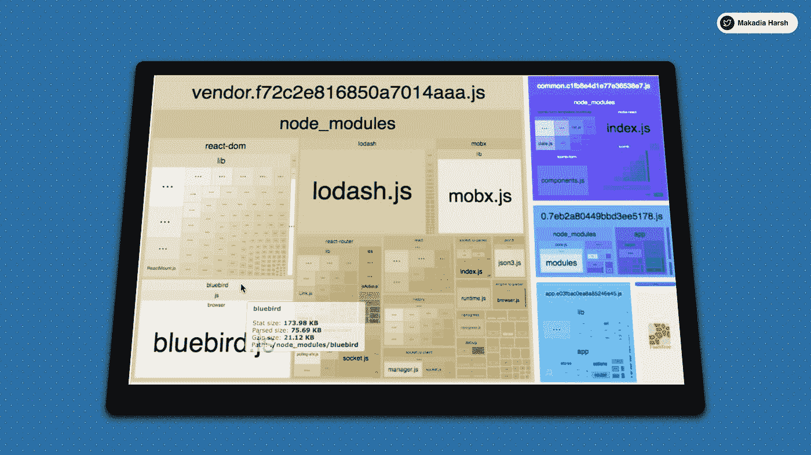

Bundle Analyzer

## 4.你为什么渲染

它猴子补丁反应通知你潜在的可避免的重新渲染。与 React Native 一起使用。

 [## GitHub-well done-Software/why-do-you-render:why-do-you-render by well done Software monkey…

### why-do-you-render by well done 软件 monkey patches 做出反应，通知您潜在可避免的重新渲染…

github.com](https://github.com/welldone-software/why-did-you-render) 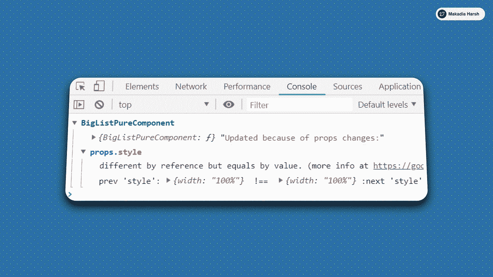

Why Did You Render

## 5.反应铬延伸

它允许您在 Chrome 开发工具中检查 React 组件层次结构。

在几分钟内捕捉应用程序中的多重重新渲染。

 [## React 开发人员工具

### 将 React 调试工具添加到 Chrome 开发者工具中。根据 2021 年 10 月 31 日修订版 2f8f60ca8 创建。

chrome.google.com](https://chrome.google.com/webstore/detail/react-developer-tools/fmkadmapgofadopljbjfkapdkoienihi?hl=en) 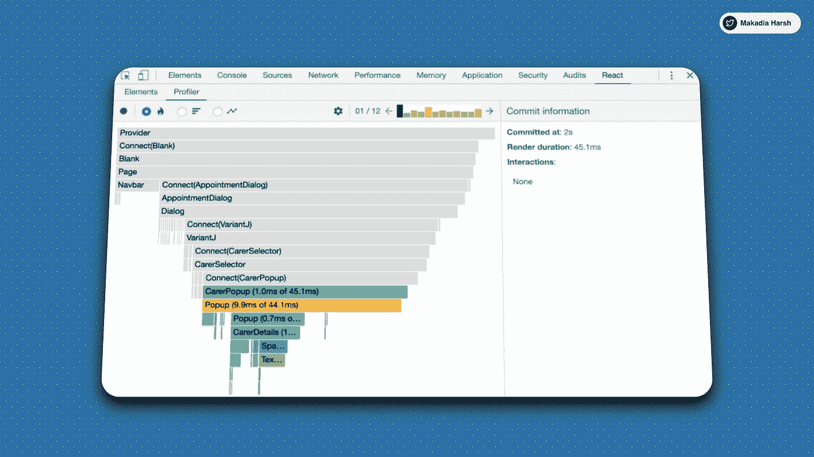

React Chrome Extension

## 6.故事书

更快地构建组件驱动的 ui。

Storybook 是一个开源工具，用于构建独立的 UI 组件和页面。它简化了 UI 开发、测试和文档。

[https://storybook.js.org](https://t.co/Bklt5xow9b?amp=1)

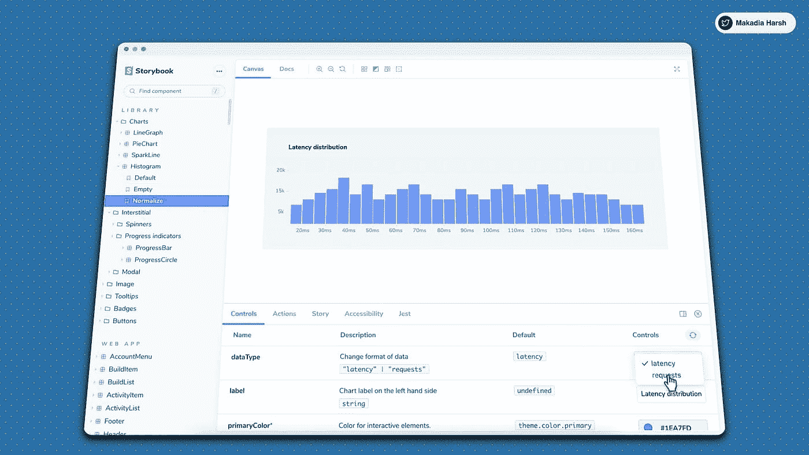

Storybook

## 7.福米克

在没有眼泪的情况下做出反应。

Formik 为输入验证、格式化、屏蔽、数组和错误处理提供了久经考验的解决方案。

[https://formik.org](https://t.co/MOQGUmYKoT?amp=1)

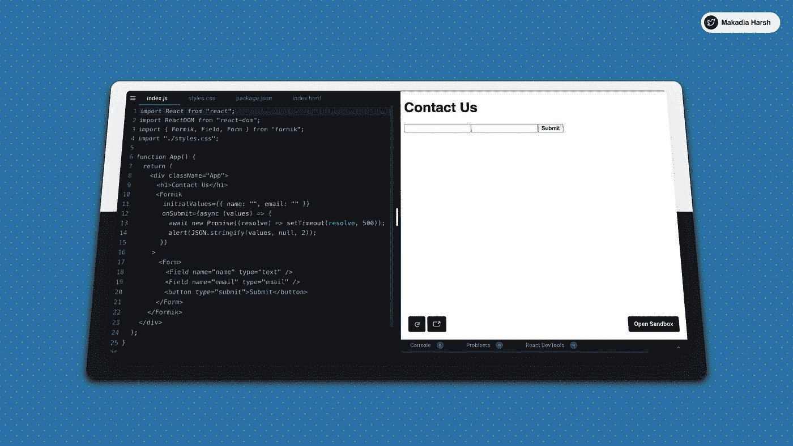

Formik

## 8.CodeSandBox

使用协作沙盒创建、共享和获取反馈，以实现快速 web 开发。

用于快速 web 开发的在线 IDE。

[codesandbox.io](https://t.co/FwtUFRx07u?amp=1)

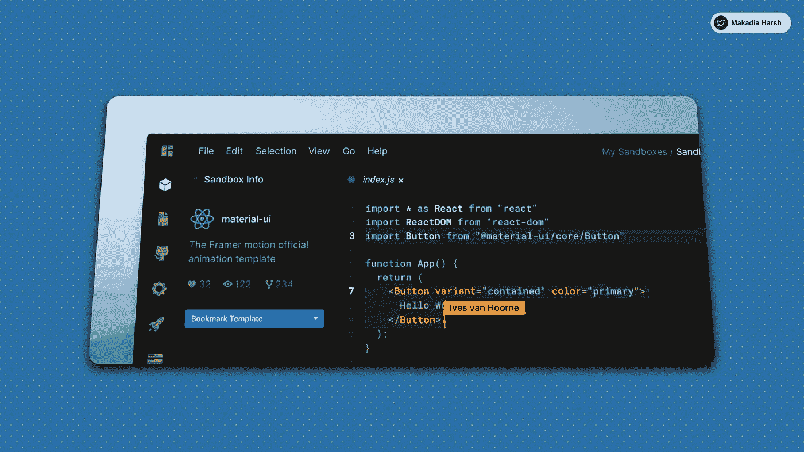

CodeSandBox

## 9.埃斯林特

查找并修复 JavaScript 代码中的问题

[https://eslint.org](https://t.co/YQJtZxTILg?amp=1)

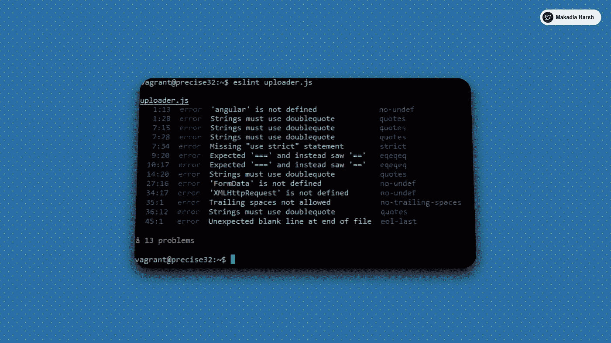

ESLINT

## 10.反应热加载器

实时调整 React 组件。

React Hot Loader 将保持装载状态，保留状态。

[http://gaearon.github.io/react-hot-loader/](http://gaearon.github.io/react-hot-loader/)

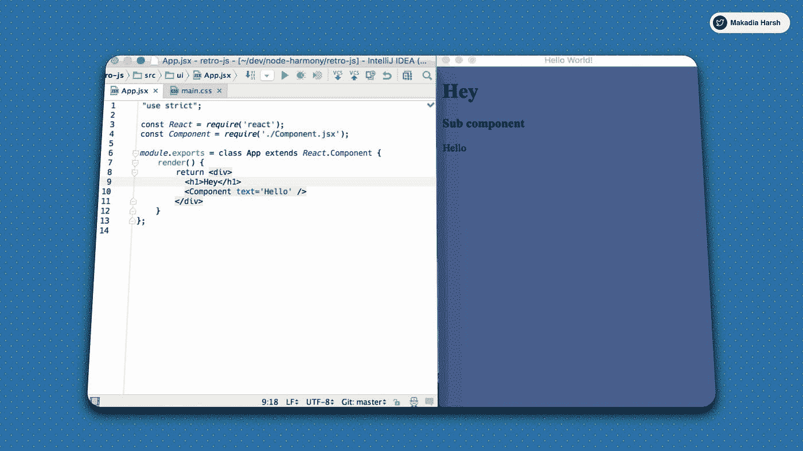

RHL

## 11.反应备忘单

React 你会喜欢的代码片段。

https://devhints.io/react

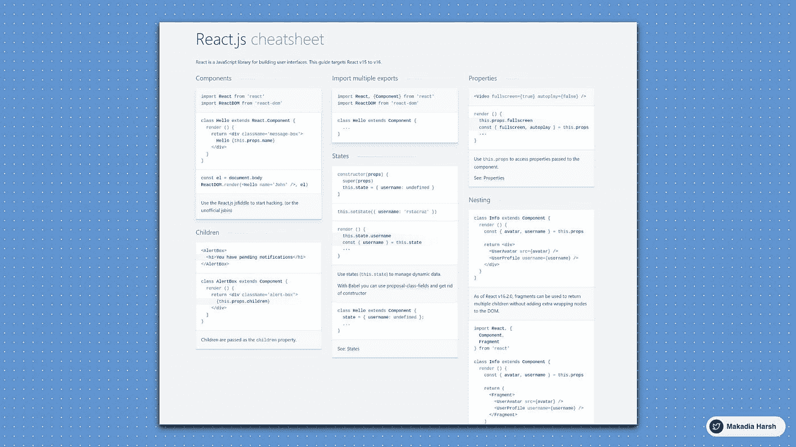

ReactJS Chetsheet

感谢您停下来查看这些资源，我相信在某个时间点它会对您有所帮助。

如果你喜欢我的内容，我在 Twitter 上很活跃 [@MakadiaHarsh](https://twitter.com/MakadiaHarsh) 。我在推特上发布关于 web 开发、无代码和低代码的信息，让开发人员的生活变得简单。

快乐学习！💻 😄

## 进一步阅读

 [## 帮助您在 React 中更快开发的 5 种工具和实践

### React 工具、技巧和最佳实践将帮助您更快地构建应用

javascript.plainenglish.io](/5-tools-practices-to-help-you-develop-faster-in-react-b884c1b20fc2) 

*更多内容看* [***说白了就是 io***](https://plainenglish.io/) *。报名参加我们的* [***免费周报***](http://newsletter.plainenglish.io/) *。关注我们关于* [***推特***](https://twitter.com/inPlainEngHQ) ， [***领英***](https://www.linkedin.com/company/inplainenglish/) *，*[***YouTube***](https://www.youtube.com/channel/UCtipWUghju290NWcn8jhyAw)*[***不和***](https://discord.gg/GtDtUAvyhW) *。**