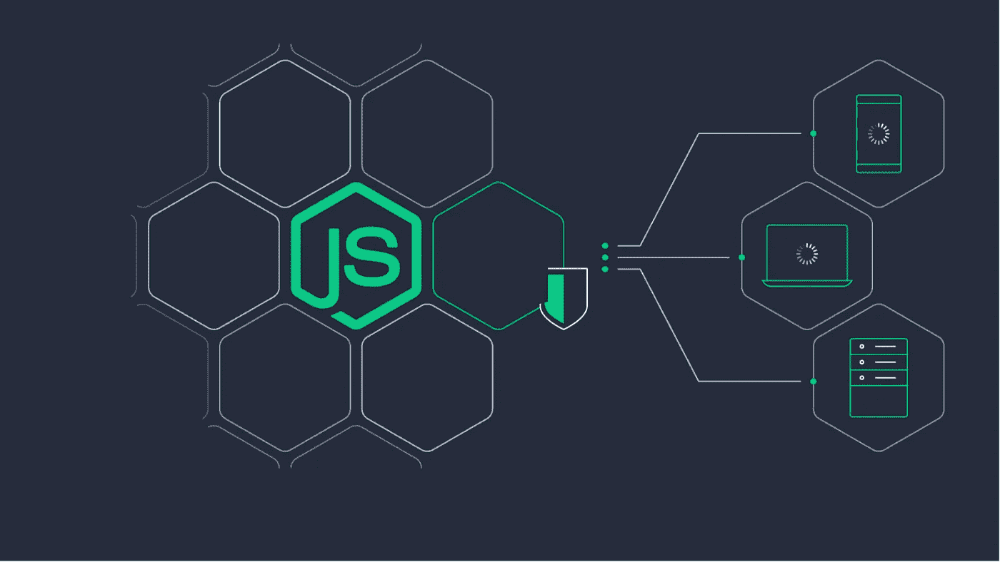

# 你应该知道的 11 个 Node.js 库

> 原文：<https://javascript.plainenglish.io/11-node-js-libraries-you-need-to-know-cf8c558d2600?source=collection_archive---------2----------------------->

## 2021 年最受欢迎的 Node.js 库

## 1.白垩

随着您更多地使用 Node.js，控制台中的大量日志变得难以应付&您将面临的最大问题是不断增加的日志消息，这使得阅读最重要的消息变得更加困难，因为它们会在混乱中丢失。您一定希望将这些日志消息分开，以新的方式显示它们。使用 Node.js 中的 **Chalk** 模块，您可以轻松解决这个问题，因为您可以使用一个非常简单的&易用 API 自定义日志消息的格式。

***安装:*** `npm i chalk`

## 2.UUID

一个非常流行的随机**唯一 id 生成器** &支持多种版本的格式。如果您正在寻找一个没有 bug 性能的唯一 id 生成器，那么强烈推荐它，它非常小，非常适合，不会增加您的项目包大小。如果使用 UUID 对你来说太老了，那么你可以使用 **nanoid** 这是一个很好的选择**。**

***安装:*** `npm i uuid`

## 3.《华盛顿明星报》

一个易于使用的 **WebSocket** 客户端和 Node.js 服务器，如果你正在寻找一个好的替代 *Socket。IO* 那么建议搭配 **ws** 。社区支持也很大&文档是最新的。

***安装:*** `npm i ws`

## 4.请求

如果你使用默认的 HTTP 模块来处理 HTTP 请求，这是很难掌握的。但是使用 request 模块，您会有更多的机会使用简单的选项，因为它只使用一个函数从 Node.js 发出 HTTP 请求，而且文档简洁易读，有很好的社区支持。

*这个库已经被* ***弃用*** *我会推荐你只在你想尝试一些你自己感兴趣的不一样的东西时使用它，因为这个库前段时间还不错。*

***安装:*** `npm i request`

## 5.JSDOM

一个很棒的库，可以像浏览器一样解析 HTML 并与之交互。它像浏览器一样实现 web 标准&你可以给它一些 HTML，它会解析这些 HTML，然后你可以使用普通的 **JavaScript DOM API 在内存中检查或修改这些 HTML。你可以创建一个与 Node.js 无缝协作的测试环境和 web-scrapers**

***安装:*** `npm i jsdom`

## 6.svgo

SVG 包含了很多我们在项目中不需要的数据，比如它可以包含编辑器元数据，注释隐藏元素，SVG 的这些额外部分阻碍了现代应用程序的超快的性能。在 Node.js 中，我们有 ***svgo*** 来移除 SVG 中多余的东西，而不会影响它们原来的渲染结果。您可以使用 CLI 或提供的模块本身来优化 SVG。

***安装:*** `npm i svgo`

## 7.web pack-捆绑包-分析器

默认情况下，webpack 为添加新库或进行优化提供了很多优势，但有时您会发现很难发现错误的优化或意外的包大小。有了这个库，您可以轻松地分析束中的每个组件大小，以便我们可以进行优化。

***安装:*** `npm i webpack-bundle-analyzer`

## 8.nodemon

该工具通过在目录中的文件发生变化时自动重启节点应用程序来帮助开发 **Node.js** 应用程序，它不需要对您的代码进行任何额外的更改，因为它是**节点**的替换包装。

***安装:*** `npm i nodemon`

## 9.唱针

就像 *Sass* ， **stylus** 是一个用 Node.js 编写的预处理器，如果你是一个初学者并且不想被新的语法淹没，那么你也可以用**编写普通的 **CSS** 。styl** 文件，因为它支持标准语法，这使得它非常适合只从 CSS 代码开始。

***安装:*** `npm i stylus`

## 10.骗子

使用这个模块，你可以创建假数据，不仅如此，你还可以感染那些有组织的假数据。它广泛用于生成 ***假名字、假地址、假产品价格、假 IP 地址、*** 等。您可以在测试应用程序期间使用它，这些应用程序需要一些资产来运行 node 中的测试，以观察应用程序的实际结果。

***安装:*** `npm i faker`

## 11.锋利的；尖利的

高效地处理图像是构建现代和用户友好的应用程序的主要部分，因为高质量的图像需要更多的时间来加载，而且它们会使数据库过载大量资产。使用 **sharp** 模块您可以轻松地将常见格式的图像转换为更小的尺寸，支持 **JPEG、PNG、WebP** & **TIFF** 图像转换。

***安装:***

 [## 2021 年终极网络开发者路线图

### 从基础到部署可伸缩的 Web 应用程序

javascript.plainenglish.io](/ultimate-web-developer-roadmap-for-2021-6758edd0bd3f)  [## 掌握 Git 命令行

### 像专家一样使用 Git 版本控制系统

javascript.plainenglish.io](/mastering-the-git-command-line-b2c6efe4f4ad)