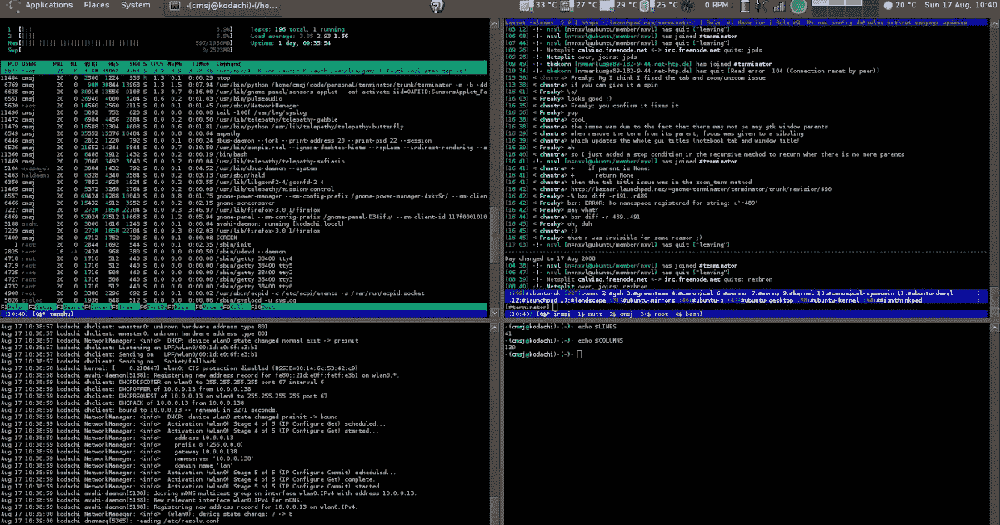

# 每个程序员都应该知道的 11 个生产力工具

> 原文：<https://javascript.plainenglish.io/11-productivity-tools-every-programmer-should-know-e0d571051752?source=collection_archive---------0----------------------->

## 进一步扩展您作为开发人员的能力。

Screenshot by the author

程序员在更短的时间内创造了越来越多伟大的东西(今天，一个小团队可以在几天内创建一个移动应用)，这主要是由于可用的工具和框架。

了解一套好的工具(和框架)会让生活变得更容易。它提高了生产率，所以我决定使用我使用的主要工具(以及我知道要使用的其他程序员)来进一步扩展我作为开发人员的能力。

# **1。终结符**

如果你像我一样，在一个终端(Api)中运行一个服务器，在另一个终端(客户机)中运行另一个服务器，并且仍然需要在其他终端中执行更多的任务，你肯定会喜欢使用 Terminator。

使用 Terminator，你可以在一个屏幕上打开几个终端，而不是有几个标签(并在它们之间迷失)，能够随时看到每个终端上正在发生的事情。

# **2。哦我的 Zsh**

Zsh 是一种让你在终端中运行命令的 shell 哦，我的 zsh’是一个管理其设置的很棒的框架。

有了 Oh My Zsh，你可以在你的终端上安装优雅的主题(这会让它看起来很有趣)和插件，让你的生活更轻松(autocomplete，Git，Capistrano，Docker 等)。

# **3。DbDesigner**

你如何为你的数据库建模？与其在纸上画出你想象的数据库应该是什么样子的模型，也许使用在线工具是个好主意，DbDesigner 可以帮助你完成这项任务(它是我最喜欢的数据库建模工具)。

# **4。气候代码**

你评价你写的代码的质量吗？Code Climate 是一个工具，可以帮助您实现这一功能的自动化。一旦你上传你的代码到仓库，它会做一个分析，给出你的项目的质量等级(考虑重复代码，复杂性等)。

对于开源项目是免费的。看一看这个工具来帮助您创建更高质量的代码是非常值得的。

# **5。**自动气象站云 9

Cloud9 是一个集成开发环境，允许你只使用一个浏览器来编写、运行和调试代码(不需要在你的机器上安装任何东西)。它从你所在的任何地方(办公室、家里等)带来代码。)、使用任何操作系统的代码(因为您将只使用浏览器)，以及与团队轻松共享您在云中的开发环境。

# **6。代号**

如果您需要不断地安全部署您的应用程序(首先运行测试)，那么 Codeship 可能是您的最佳选择。它检测您何时推送至您选择的分支，运行您在其平台上预先定义的测试，如果测试通过，它将部署到您选择的服务器，如 Aws、Heroku 或其他一些服务器私有定制脚本。

# **7。堆栈编辑**

你是否曾经需要编辑一个 README.md (markdown)并且浪费了很多时间让它看起来像你想要的样子？使用 StackEdit，你可以编辑你的 markdown 文件，同时查看结果，这加快了速度，使过程变得更加容易。

# **8。代码共享**

有了这个工具，你可以创建一个在线房间(有视频)来解释编程概念(参与者将实时查看你的代码)，如果你需要做这样的事情，代码共享是一个很好的方法。

# **9。邮递员**

当您想做一个简单的测试时，通过控制台(CURL)进行 HTTP 调用是非常有用的，但是当您需要传递头或大量参数时，这是一个很大的挑战。您可以通过使用 Postman 来避免这种情况，Postman 是一个图形界面，可以帮助您轻松地进行 HTTP 调用(甚至可以保存以前的调用供您重用)。

# **10。Uppy**

您可能已经需要在 web 项目中上传文件。Uppy 是一个完整的文件上传工具，可以与大多数框架集成，并在您下次需要时使这项任务变得更容易(它可以将文件上传到您的应用程序、Google Drive、Dropbox 等。).

# 11。弗朗兹

我使用许多通讯应用程序:WhatsApp、Messenger、Slack 等。，有时管理这一切可能是一个相当大的挑战。如果你有同样的困难，Franz 是一个可以帮助你的 APP。

这是一个在单个应用程序中聚合所有网络的工具，可以帮助你不留下任何丢失的消息(无需打开 10 个标签)。

在这些工具的帮助下，我们现在可以比平时更快、更聪明、更高效地工作。

*更多内容请看*[*plain English . io*](http://plainenglish.io/)