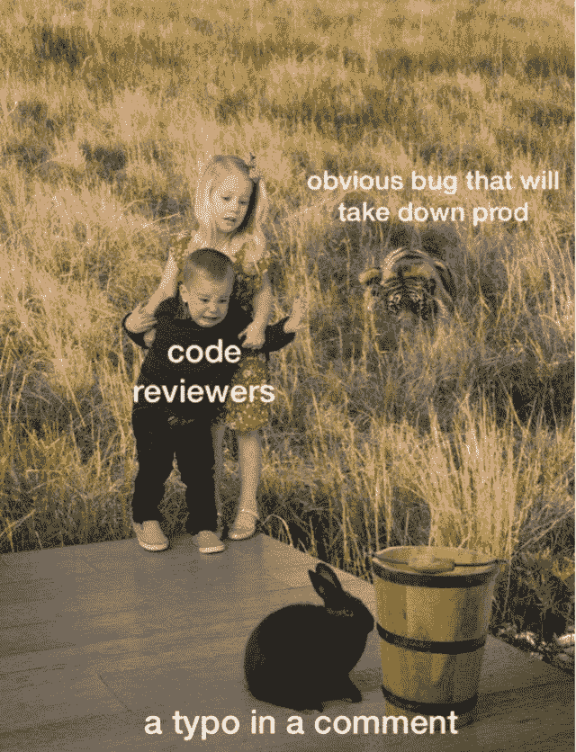
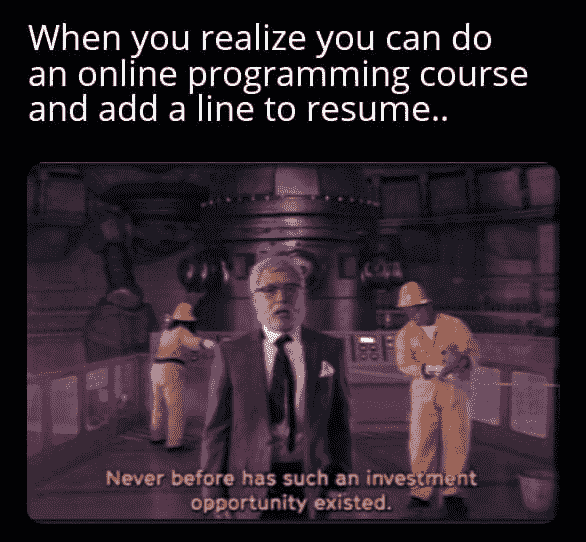
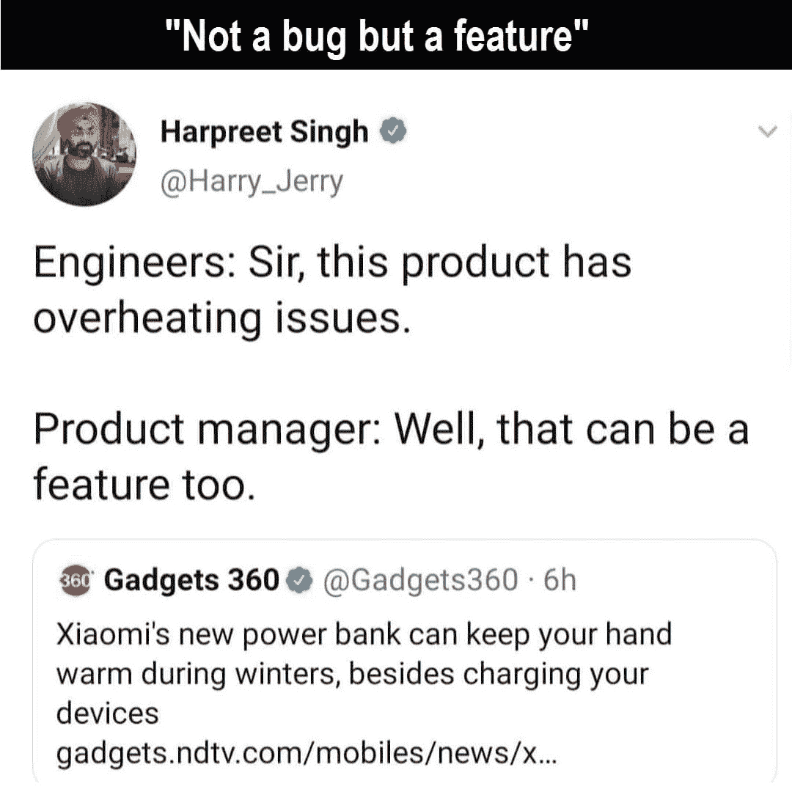
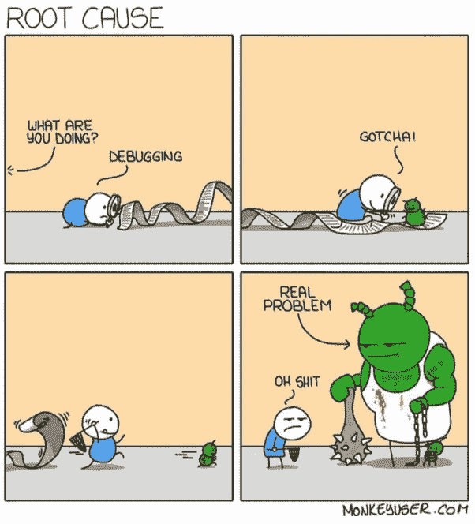
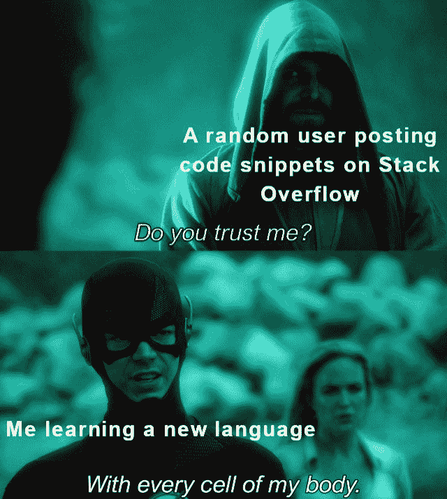
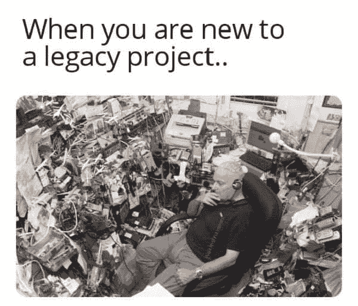

# 11 个让你笑死的编程笑话

> 原文：<https://javascript.plainenglish.io/11-programming-jokes-that-will-make-you-die-laughing-df41d5547f11?source=collection_archive---------1----------------------->

## 周一动机

## 2021 年最佳编程迷因

Photo by [S&B Vonlanthen](https://unsplash.com/@blavon?utm_source=medium&utm_medium=referral) on [Unsplash](https://unsplash.com?utm_source=medium&utm_medium=referral)

***模因和快乐有什么联系吗？*** 如果你是我这种类型的人，那么你可能也爱在下班后查看手机。猜猜我在那里看到了什么？

我主要是在互联网上看到**视频、抖音和模因**。我不知道为什么，但这有助于我提神醒脑，减轻工作压力。这就是为什么我相信 *laugher 是人类最好的刷新按钮。*

在这篇文章中，我收集了一些我喜欢的网络迷因。

# 展示自己的作品总是更好… LOL

[https://www.facebook.com/DZoneInc/photos/a.336758034711/10159513354989712](https://www.facebook.com/DZoneInc/photos/a.336758034711/10159513354989712)

# 发生了很多次…我总是去不同的页面…

[https://www.facebook.com/DZoneInc/photos/a.336758034711/10159513354989712](https://www.facebook.com/DZoneInc/photos/a.336758034711/10159513354989712)

# 为什么编译器不够智能，无法自动修复所有问题？

[https://www.facebook.com/DZoneInc/photos/a.336758034711/10159505422369712/](https://www.facebook.com/DZoneInc/photos/a.336758034711/10159505422369712/)

# 看起来很管用…那应该够了…哈哈…

[https://www.facebook.com/DZoneInc/photos/a.336758034711/10159501229644712/](https://www.facebook.com/DZoneInc/photos/a.336758034711/10159501229644712/)

# 我们周一继续吧…

[https://www.facebook.com/photo?fbid=2965577677092733&set=gm.2875612219372995](https://www.facebook.com/photo?fbid=2965577677092733&set=gm.2875612219372995)

# 时间是可以定义的，程序员

[https://www.facebook.com/photo?fbid=352070916544458&set=gm.2875632262704324](https://www.facebook.com/photo?fbid=352070916544458&set=gm.2875632262704324)

# 你身后藏着可怕的东西…

[https://www.facebook.com/DZoneInc/photos/10159479172079712](https://www.facebook.com/DZoneInc/photos/10159479172079712)

# 那种和平是无法想象的…

[https://www.facebook.com/javascriptJS/photos/a.1387402908063976/2251831714954420/](https://www.facebook.com/javascriptJS/photos/a.1387402908063976/2251831714954420/)

# 在家工作…饼图…老实说，不是真的...

[https://www.facebook.com/yuva.krishna.memes](https://www.facebook.com/yuva.krishna.memes)

# 开发与质量保证版本…

[https://www.monkeyuser.com/2018/happy-flow/?sc=true&dir=random](https://www.monkeyuser.com/2018/happy-flow/?sc=true&dir=random)

# 当任务管理器有责任关闭没有响应的东西时…

[https://www.facebook.com/photo?fbid=10159630257979673&set=gm.2870233513227290](https://www.facebook.com/photo?fbid=10159630257979673&set=gm.2870233513227290)

# 奖金时间

# 你喜欢幸运饼干吗？如果你收到这个，作为一个开发者你的反应是什么？

[https://www.facebook.com/yuva.krishna.memes](https://www.facebook.com/yuva.krishna.memes)

# 我也有同样的感觉…当我很少用纸和笔写字的时候…

[https://www.facebook.com/yuva.krishna.memes](https://www.facebook.com/yuva.krishna.memes)

# 我不在乎，我知道这是一种不好的态度，但让我享受这种感觉…

[https://www.facebook.com/yuva.krishna.memes](https://www.facebook.com/yuva.krishna.memes)

# 一切皆有可能..不管怎样，你都可以得到结果。

[https://www.facebook.com/yuva.krishna.memes](https://www.facebook.com/yuva.krishna.memes)

# 让我们来看看 Div 的虚拟世界…在我改变位置进行适当调整后，他们看起来是怎样的…

[https://www.facebook.com/yuva.krishna.memes](https://www.facebook.com/yuva.krishna.memes)

# 当我在代码中发现一个问题时，最常见的事情发生了…

[https://www.monkeyuser.com/](https://www.monkeyuser.com/)

# 下次我会试着写正确的代码…让我们今天就发出请求吧…

[https://www.monkeyuser.com/](https://www.monkeyuser.com/)

# 我的分支在做什么？

[https://www.facebook.com/ProgrammersCreateLife](https://www.facebook.com/ProgrammersCreateLife)

# 当我们每年收到太多的框架时..这很正常…

[https://www.facebook.com/programminggeeks.in](https://www.facebook.com/programminggeeks.in)

# 你喜欢什么？我正在学习一门新的语言…

[https://www.facebook.com/techindustan/](https://www.facebook.com/techindustan/)

# 为帮助我们脱帽致敬…

[https://www.facebook.com/programminggeeks.in](https://www.facebook.com/programminggeeks.in)

# 让我们做一些课程

# 后来意识到…

[https://www.facebook.com/javascriptJS/photos/a.1387402908063976/2193489080788684/](https://www.facebook.com/javascriptJS/photos/a.1387402908063976/2193489080788684/)

# 我们很安全…

[https://www.facebook.com/ProgrammersCreateLife/photos/3513764435339076](https://www.facebook.com/ProgrammersCreateLife/photos/3513764435339076)

# 将 bug 转化为功能…

# 当我找到根本原因时…

[https://www.quora.com/What-are-the-best-programming-comic-strips](https://www.quora.com/What-are-the-best-programming-comic-strips)

# 当我试图修复一个小错误时…

[https://www.quora.com/What-are-the-best-programming-comic-strips](https://www.quora.com/What-are-the-best-programming-comic-strips)

# 如何衡量代码质量？

[https://www.osnews.com/comics/page/4/](https://www.osnews.com/comics/page/4/)

 [## 25 个以上的 StackOverflow 编程迷因，所有开发人员都可以涉及到

### 编程幽默可以通过刷新你的情绪来减轻你的压力

javascript.plainenglish.io](/25-more-stackoverflow-programming-jokes-that-all-devs-can-relate-to-ebc2f9c11ca3) 

# IT 人如何看待彼此…

[https://www.facebook.com/ProgrammersCreateLife/photos/3355993314449523](https://www.facebook.com/ProgrammersCreateLife/photos/3355993314449523)

# StackOverflow 的真正英雄…

[https://www.quora.com/What-are-some-of-the-best-programmer-jokes-and-memes-out-there](https://www.quora.com/What-are-some-of-the-best-programmer-jokes-and-memes-out-there)

# 单元测试与集成测试

[https://iq.opengenus.org/best-programming-memes-of-2019/](https://iq.opengenus.org/best-programming-memes-of-2019/)

# 很好的幽默…

[https://www.facebook.com/ProgrammersCreateLife/photos/3136101556438701](https://www.facebook.com/ProgrammersCreateLife/photos/3136101556438701)

## 不需要信任…我知道你总是对的…

## 发生了很多…问了一个非常愚蠢的问题，但专家很乐意提供详细的答案…

## 耶！最好这样做，否则，你会因为重复的问题标志而失去一些分数…

## 当一个人经历一些事情时，心跳会加快…

## 绝对需要一个每天早晚都能给我袖手旁观的人…

## 我的代码依赖于你伙计…

## 我的代码统计…

## 当我们得到一个负分时，最糟糕的噩梦…

## 有趣的内部机制。但是专家总是英雄…

## 有时候…

## 关于结合的非常真实的陈述…

## 复制/粘贴是一回事，但你知道粘贴到哪里吗？

## 有不同的解决方案吗？让我们一个一个地试一试…

## 你们值得这种赞赏…

## 是的，你们帮了很大的忙……(只是有趣的时刻，每个人都有自己特定的角色)

# 新员工根据市场获得工资，老员工根据什么获得加薪？？？

[https://www.monkeyuser.com/2020/new-hire/?sc=true&dir=random](https://www.monkeyuser.com/2020/new-hire/?sc=true&dir=random)

# 它直接进入我的大脑…

[https://www.facebook.com/photo/?fbid=319001836626514&set=gm.2881565295444354](https://www.facebook.com/photo/?fbid=319001836626514&set=gm.2881565295444354)

# 我需要问是谁帮助了我… LOL

[https://www.facebook.com/yuva.krishna.memes/photos/a.105527467815845/376844277350828/](https://www.facebook.com/yuva.krishna.memes/photos/a.105527467815845/376844277350828/)

# 从哪里开始？

[https://www.facebook.com/javascriptJS/photos/a.1387402908063976/2261895900614668/](https://www.facebook.com/javascriptJS/photos/a.1387402908063976/2261895900614668/)

# 在家工作或学习时可以考虑哪些交通？

[https://www.facebook.com/adultswholovecartoons/photos/a.105042201224485/361407612254608/](https://www.facebook.com/adultswholovecartoons/photos/a.105042201224485/361407612254608/)

# 现在让我们来评论一下..我们稍后会修复它…

[https://www.facebook.com/jokesvala/photos/a.2330223400336101/6283557961669272/](https://www.facebook.com/jokesvala/photos/a.2330223400336101/6283557961669272/)

# 正则表达式可以在网上找到…老实说，从来没有试图学习这个东西…

[https://www.facebook.com/DZoneInc/photos/10159094540494712](https://www.facebook.com/DZoneInc/photos/10159094540494712)

# 所以编程给你守卫还是成为守卫？

[https://www.facebook.com/Coding000/photos/a.100326075349488/210613724320722/](https://www.facebook.com/Coding000/photos/a.100326075349488/210613724320722/)

# 她的眼睛说明了一切…

[https://www.facebook.com/yuva.krishna.memes/photos/a.105527467815845/376834894018433/](https://www.facebook.com/yuva.krishna.memes/photos/a.105527467815845/376834894018433/)

# 测试人员无论如何都能找到 bug 即使它是有效的或无效的…

[https://www.facebook.com/javascriptJS/photos/2210011465803112](https://www.facebook.com/javascriptJS/photos/2210011465803112)

# 为什么有人问它，盖伊？他们应该打电话给医生…

[https://www.facebook.com/photo/?fbid=10159583001913436&set=gm.6450394781652918](https://www.facebook.com/photo/?fbid=10159583001913436&set=gm.6450394781652918)

# 你的地址是什么？让我们检查一下你的 IT 幽默…

[https://www.facebook.com/techwithcodex/photos/a.137007467972178/333269081679348/](https://www.facebook.com/techwithcodex/photos/a.137007467972178/333269081679348/)

# 请随意分享你宝贵的掌声和评论，这样我将来可以提供更多类似的内容。

 [## 2021 年最佳编程幽默汇编

### 编程迷因可以减轻你的压力

blog.devgenius.io](https://blog.devgenius.io/best-programming-humor-compilations-2021-623473bfb0d)  [## 有趣的编程迷因会让你笑死

### 编笑话来点亮你的周五

blog.devgenius.io](https://blog.devgenius.io/funny-programming-memes-that-will-make-you-die-laughing-1ccd8e139040)  [## 编程迷因和幸福之间的联系

### 2021 年最佳编程迷因汇编

blog.devgenius.io](https://blog.devgenius.io/the-connection-between-programming-memes-and-happiness-d768ab85b83d)  [## 10 个能让你心情轻松的最佳编程笑话

### 你读过的关于编程迷因 2021 的最不可思议的文章

medium.com](https://medium.com/geekculture/10-best-programming-jokes-to-lighten-up-your-mood-8870dab2bff7) 

*更多内容尽在*[***plain English . io***](http://plainenglish.io/)