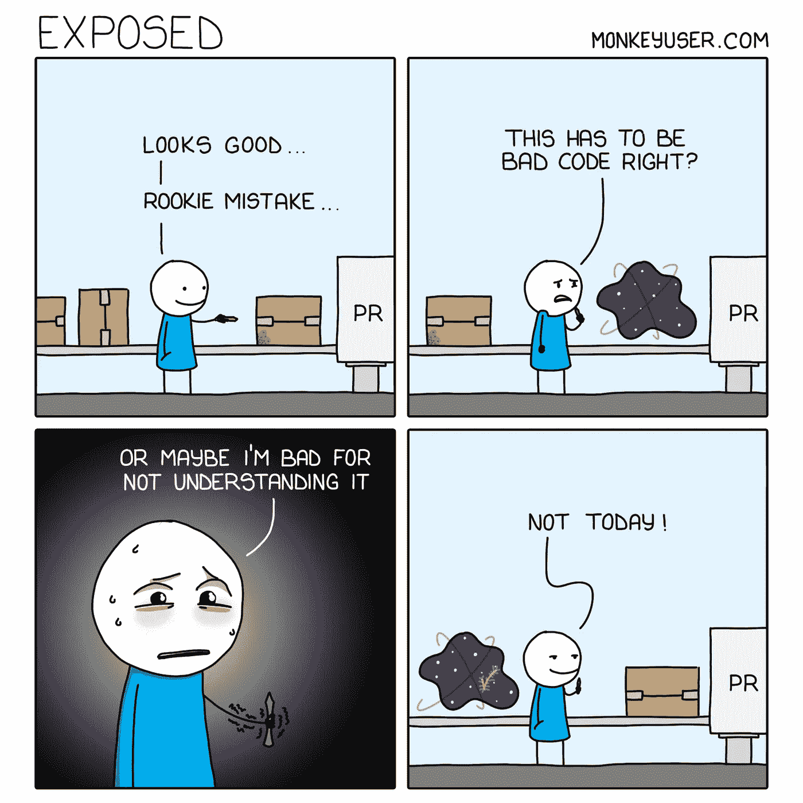
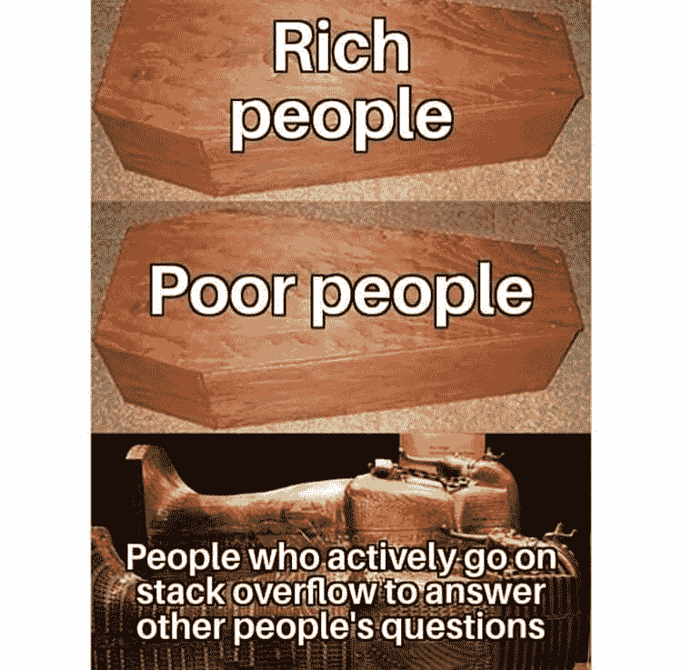
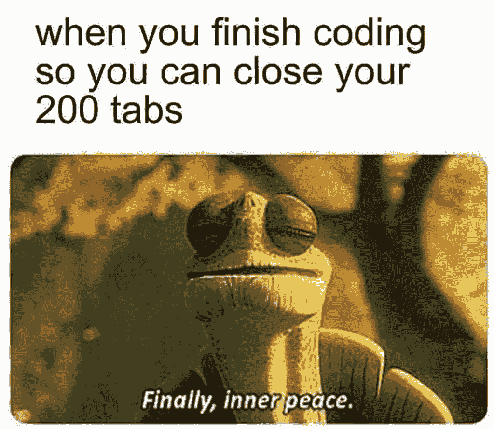

# 11 个能让你心情舒畅的编程迷因

> 原文：<https://javascript.plainenglish.io/11-programming-memes-that-will-lighten-up-your-mood-e165be3513ea?source=collection_archive---------6----------------------->

## 周一的动机

## 2021 年最佳节目迷因

Photo by [Brooke Cagle](https://unsplash.com/@brookecagle?utm_source=medium&utm_medium=referral) on [Unsplash](https://unsplash.com?utm_source=medium&utm_medium=referral)

***模因与幸福有什么联系吗？*T3 如果你是我喜欢的类型，我喜欢在完成工作后看手机，我在那边看到了什么？猜猜看。**

我主要看 T4 视频、抖音和网络上发布的迷因。我不知道为什么，但它有助于**提神和缓解工作压力**。这就是为什么我相信

> *“笑是人类最好的刷新按钮”*

在这篇文章中，我汇编了一些我在网上喜欢的模因。

# 你喜欢幸运饼干吗？如果您收到这个消息，作为开发人员，您会有什么反应？

[https://www.facebook.com/yuva.krishna.memes](https://www.facebook.com/yuva.krishna.memes)

# 我也有同样的感觉…当我很少用笔和纸写字的时候。

[https://www.facebook.com/yuva.krishna.memes](https://www.facebook.com/yuva.krishna.memes)

# 我不在乎，我知道这是一个坏的态度，但让我享受的感觉…

[https://www.facebook.com/yuva.krishna.memes](https://www.facebook.com/yuva.krishna.memes)

# 一切皆有可能..不管怎样，你都能得到结果…

[https://www.facebook.com/yuva.krishna.memes](https://www.facebook.com/yuva.krishna.memes)

# 让我们去虚拟世界的 Div…他们是如何照顾我改变立场，使正确的路线…

[https://www.facebook.com/yuva.krishna.memes](https://www.facebook.com/yuva.krishna.memes)

# 当我在代码中发现问题时，最常见的事情就会发生。

[https://www.monkeyuser.com/](https://www.monkeyuser.com/)

# 我下次会试着写正确的代码…让我们今天发送一个请求…

[https://www.monkeyuser.com/](https://www.monkeyuser.com/)

# 我的分公司在做什么？

[https://www.facebook.com/ProgrammersCreateLife](https://www.facebook.com/ProgrammersCreateLife)

# 当我们每年得到太多的框架时..这将是正常的…

[https://www.facebook.com/programminggeeks.in](https://www.facebook.com/programminggeeks.in)

# 你喜欢什么？我正在学习一种新的语言。

[https://www.facebook.com/techindustan/](https://www.facebook.com/techindustan/)

# 感谢你帮助我们…

[https://www.facebook.com/programminggeeks.in](https://www.facebook.com/programminggeeks.in)

# 奖金

# 让我们做一些课程

# 以后意识到…

[https://www.facebook.com/javascriptJS/photos/a.1387402908063976/2193489080788684/](https://www.facebook.com/javascriptJS/photos/a.1387402908063976/2193489080788684/)

# 我们很安全……

[https://www.facebook.com/ProgrammersCreateLife/photos/3513764435339076](https://www.facebook.com/ProgrammersCreateLife/photos/3513764435339076)

# 将臭虫变成特色…

# 当我找到根本原因时…

[https://www.quora.com/What-are-the-best-programming-comic-strips](https://www.quora.com/What-are-the-best-programming-comic-strips)

# 当我试图修复一个小臭虫时…

[https://www.quora.com/What-are-the-best-programming-comic-strips](https://www.quora.com/What-are-the-best-programming-comic-strips)

# 如何衡量代码质量？

[https://www.osnews.com/comics/page/4/](https://www.osnews.com/comics/page/4/)

 [## 另外 25 个 StackOverflow 编程模因，所有开发者都可以与之相关

### 编程幽默，可以通过刷新你的情绪来减轻你的压力

javascript.plainenglish.io](/25-more-stackoverflow-programming-jokes-that-all-devs-can-relate-to-ebc2f9c11ca3) 

# 信息技术人员如何看待彼此……

[https://www.facebook.com/ProgrammersCreateLife/photos/3355993314449523](https://www.facebook.com/ProgrammersCreateLife/photos/3355993314449523)

# StackOverflow 的真正英雄…

[https://www.quora.com/What-are-some-of-the-best-programmer-jokes-and-memes-out-there](https://www.quora.com/What-are-some-of-the-best-programmer-jokes-and-memes-out-there)

# 单元测试与集成测试

[https://iq.opengenus.org/best-programming-memes-of-2019/](https://iq.opengenus.org/best-programming-memes-of-2019/)

# 不错的幽默…

[https://www.facebook.com/ProgrammersCreateLife/photos/3136101556438701](https://www.facebook.com/ProgrammersCreateLife/photos/3136101556438701)

# 奖励时间

# 展示你的作品总是更好…哈哈

[https://www.facebook.com/DZoneInc/photos/a.336758034711/10159513354989712](https://www.facebook.com/DZoneInc/photos/a.336758034711/10159513354989712)

# 经常发生…我总是去不同的页面…

[https://www.facebook.com/DZoneInc/photos/a.336758034711/10159513354989712](https://www.facebook.com/DZoneInc/photos/a.336758034711/10159513354989712)

# 为什么编译器不够聪明，不能自动修复所有问题？

[https://www.facebook.com/DZoneInc/photos/a.336758034711/10159505422369712/](https://www.facebook.com/DZoneInc/photos/a.336758034711/10159505422369712/)

# 它看起来像它的工作…这应该够了…哈哈…

[https://www.facebook.com/DZoneInc/photos/a.336758034711/10159501229644712/](https://www.facebook.com/DZoneInc/photos/a.336758034711/10159501229644712/)

# 让我们星期一继续…

[https://www.facebook.com/photo?fbid=2965577677092733&set=gm.2875612219372995](https://www.facebook.com/photo?fbid=2965577677092733&set=gm.2875612219372995)

# 时间是可以定义的，程序员

[https://www.facebook.com/photo?fbid=352070916544458&set=gm.2875632262704324](https://www.facebook.com/photo?fbid=352070916544458&set=gm.2875632262704324)

# 一些可怕的东西藏在你的背后…

[https://www.facebook.com/DZoneInc/photos/10159479172079712](https://www.facebook.com/DZoneInc/photos/10159479172079712)

# 这种和平是不可想象的……

[https://www.facebook.com/javascriptJS/photos/a.1387402908063976/2251831714954420/](https://www.facebook.com/javascriptJS/photos/a.1387402908063976/2251831714954420/)

# 在家工作……饼状图……老实说，不是真的……

[https://www.facebook.com/yuva.krishna.memes](https://www.facebook.com/yuva.krishna.memes)

# 开发版本与质量保证版本…

[https://www.monkeyuser.com/2018/happy-flow/?sc=true&dir=random](https://www.monkeyuser.com/2018/happy-flow/?sc=true&dir=random)

# 当任务经理有责任关闭无响应的东西时…

[https://www.facebook.com/photo?fbid=10159630257979673&set=gm.2870233513227290](https://www.facebook.com/photo?fbid=10159630257979673&set=gm.2870233513227290)

# 奖励时间

# 你喜欢幸运饼干吗？如果您收到这个消息，作为开发人员，您会有什么反应？

[https://www.facebook.com/yuva.krishna.memes](https://www.facebook.com/yuva.krishna.memes)

# 我也有同样的感觉…当我很少用笔和纸写字的时候。

[https://www.facebook.com/yuva.krishna.memes](https://www.facebook.com/yuva.krishna.memes)

# 我不在乎，我知道这是一个坏的态度，但让我享受的感觉…

[https://www.facebook.com/yuva.krishna.memes](https://www.facebook.com/yuva.krishna.memes)

# 一切皆有可能..不管怎样，你都能得到结果…

[https://www.facebook.com/yuva.krishna.memes](https://www.facebook.com/yuva.krishna.memes)

# 让我们去虚拟世界的 Div…他们是如何照顾我改变立场，使正确的路线…

[https://www.facebook.com/yuva.krishna.memes](https://www.facebook.com/yuva.krishna.memes)

# 当我在代码中发现问题时，最常见的事情就会发生。

[https://www.monkeyuser.com/](https://www.monkeyuser.com/)

# 我下次会试着写正确的代码…让我们今天发送一个请求…

[https://www.monkeyuser.com/](https://www.monkeyuser.com/)

# 我的分公司在做什么？

[https://www.facebook.com/ProgrammersCreateLife](https://www.facebook.com/ProgrammersCreateLife)

# 当我们每年得到太多的框架时..这将是正常的…

[https://www.facebook.com/programminggeeks.in](https://www.facebook.com/programminggeeks.in)

# 你喜欢什么？我正在学习一种新的语言。

[https://www.facebook.com/techindustan/](https://www.facebook.com/techindustan/)

# 为帮助我们脱帽致敬…

[https://www.facebook.com/programminggeeks.in](https://www.facebook.com/programminggeeks.in)

# 请随意分享你宝贵的掌声和评论，这样我将来可以提供更多类似的内容。

 [## 2021 年最佳编程幽默汇编

### 编程迷因可以减轻你的压力

blog.devgenius.io](https://blog.devgenius.io/best-programming-humor-compilations-2021-623473bfb0d)  [## 有趣的编程迷因会让你笑死

### 编笑话来点亮你的周五

blog.devgenius.io](https://blog.devgenius.io/funny-programming-memes-that-will-make-you-die-laughing-1ccd8e139040)  [## 编程迷因和幸福之间的联系

### 2021 年最佳编程迷因汇编

blog.devgenius.io](https://blog.devgenius.io/the-connection-between-programming-memes-and-happiness-d768ab85b83d)  [## 10 个能让你心情轻松的最佳编程笑话

### 你读过的关于编程迷因 2021 的最不可思议的文章

medium.com](https://medium.com/geekculture/10-best-programming-jokes-to-lighten-up-your-mood-8870dab2bff7) 

*更多内容尽在*[***plain English . io***](http://plainenglish.io/)