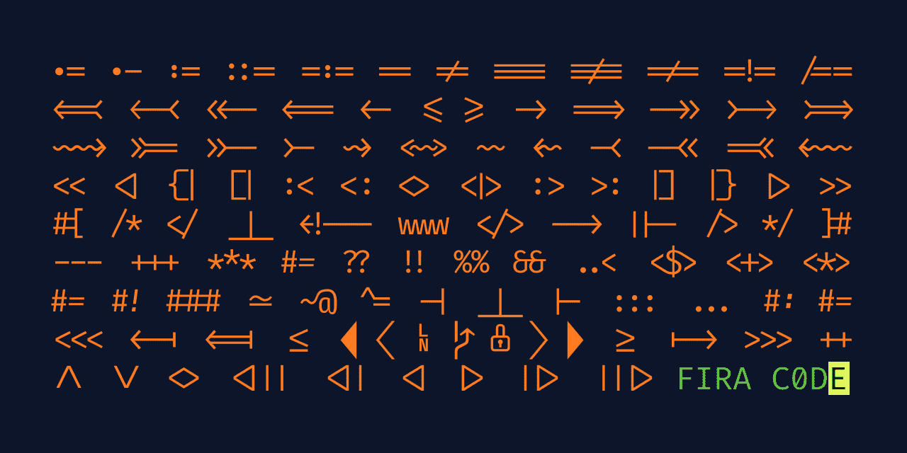
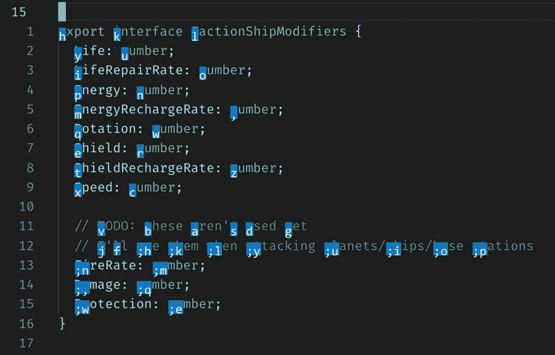
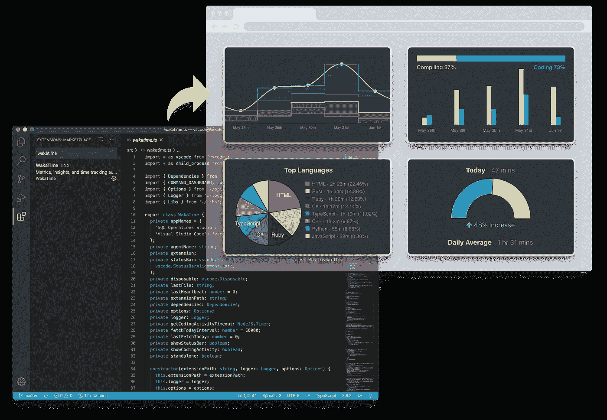
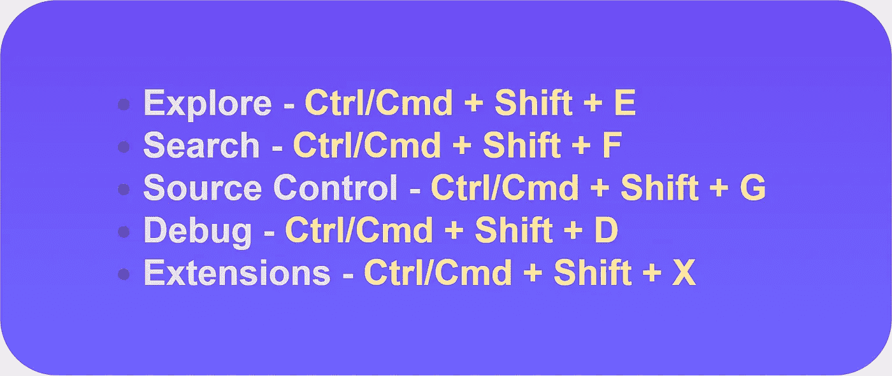
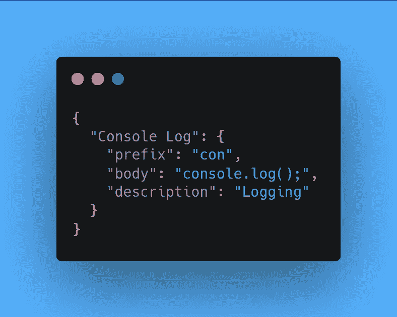

# 作为开发人员，您应该知道的 11 个 VS 代码特性和技巧

> 原文：<https://javascript.plainenglish.io/11-vs-code-features-tricks-you-should-know-as-a-developer-47e5ec0c362b?source=collection_archive---------8----------------------->

## 对 VS 代码更加自信

## 1.带连字的字体

带有连字的字体使代码更加整洁和方便。在处理大型项目时，您可以将出色的字体与连字结合使用，让编辑器体验更好。有几种字体支持连字，但你可以简单地坚持使用经典的 Fira 代码。

*   要在 VS 代码中启用连字，你只需在 VS 代码设置文件中添加**“editorligations”:true**。

## 2.彩虹缩进

这个 VS 代码扩展为你的文本前面的缩进着色，每一步交替四种特殊的颜色。如果你用 **JavaScript** 和 **Python** 写代码，那么这个特性对整洁的代码非常有用。

## 3.标签包装

如果你厌倦了重复输入东西，那么你应该理解 emmet，emmet 允许你编写一个缩写代码，并快速获得返回的相应标签。emmet 的最新版本支持大多数 Emmet 操作，包括扩展 Emmet 缩写和片段。

要使用标签换行:

*   选择文本。
*   打开命令调板。
*   执行 **Emmet:用缩写换行。**
*   输入标签 **div** (或缩写)。
*   然后点击**回车。**

## 4.Turbo Console.log()

当你只是需要快速输出一些东西时，你应该节省时间，而不是重复输入 **console.log** 。 **Turbo Console Log** 是 VS 代码中的一个很棒的扩展，它解决了这个问题，它允许记录下面一行中的任何变量，并在代码结构后自动加上前缀。

## 5.多光标编辑

我个人最喜欢的 VS 代码中最有用的特性之一，多光标编辑，你可以在一个快速的窗口中编辑多行。多光标编辑有几种方法，如下所示:

*   **ALT-CLICK:** 如果你想在一个文档中插入多个不在连续行上的光标，你只需要简单地按住 ALT 并点击每一行。
*   **CTRL-U:** 万一你点错了行，不想再重新选行，那就按 CTRL+U 撤销上一次光标操作。
*   带箭头键的 SHIFT-ALT 键:如果你选择了一个单词，并且想要包含引号或它附近的任何东西，只需简单地使用带箭头键的 SHIT+ALT 键来扩展你的选择区域。
*   **SHIFT-ALT-Drag:** 使用这个组合键可以创建一个矩形选区。

## 6.波拉科德

如果你熟悉分享源代码截图的著名工具 **(Carbon.sh)，**，但是所有这些工具都需要更多的努力来构建吸引人的源代码截图。 **Polacode** 以一种非常简单的方式做同样的工作，你可以使用你的默认编辑器字体，这在 Carbon 中是不可用的。

## 7.瓦卡提时间

这个扩展可以帮助你跟踪关于你的编程的度量和分析，你也可以查看你经常使用的编程语言，并与世界上的其他忍者进行比较。

## 8.整理

每当你想对数据的*列表*或变量*进行排序时，你只需选择你想排序的行，使用命令面板 **(F1)** 然后搜索排序。你会看到你可以选择排序**升序**或者**降序**。*

## 9.评论

添加注释是开发人员在团队工作时经常做的事情，在 VS 代码中，你可以在一瞬间注释掉单行或多行。

*虽然添加评论有两种方式。*

*   您可以通过按下 **Ctrl** 或 **Cmd +/，**来注释一行，再次按下它将取消注释该行。
*   为了创建一个块注释，选择你想要注释的选项，然后按下 **Shift+Alt+A** 。

## 10.自定义侧栏

在编写代码时，你总是想要尽可能多的空间，你可以通过按下 **Ctrl** 或 **Cmd + B、**来关闭侧边栏，你也可以再次按下 **Ctrl** 或 **Cmd + B** 来撤销侧边栏**。**此外，如果您想打开特定的菜单，您可以使用下面给出的菜单专用键盘快捷键。

## 11.自定义片段

没有人喜欢一遍又一遍地输入相同的代码，代码片段扩展为我们完成了这项工作。但是有时候我们只需要一个定制的代码片段来让事情变得简单。在 VS 代码中，你可以创建定制的代码片段，减少重复输入相同的代码。

*创建自定义代码片段:*

*   转到设置图标并选择**用户片段**，现在选择您想要创建的片段的语言。
*   ***例如*** *，*如果你想为 **JavaScript** 项目创建一个自定义的代码片段。您必须编写*键/值*对，其中一个键包含定义的数据。
*   **前缀**定义了代码片段的触发词，**正文**是将要插入的代码，**描述**是可选的，由*智能感知*显示。

> ***注:*** *用户片段是用 JSON 写的*

 [## REST API 设计的 8 个最佳实践

### 构建更好的 REST APIs

mohit19.medium.com](https://mohit19.medium.com/8-best-practices-for-rest-api-design-3fd1b837b283)  [## 掌握 JavaScript 编码面试的 50 个问题

### JavaScript 编码面试问题:第 1 部分

javascript.plainenglish.io](/50-questions-to-master-the-javascript-coding-interview-639d2ac12630)  [## 现代 CSS 开发人员路线图

### 掌握 CSS 的关键概念

javascript.plainenglish.io](/the-modern-css-developer-roadmap-1ea112451dde)  [## 每个软件开发人员都应该知道的 9 条编程原则

### 很好地了解干净代码的编程原则

javascript.plainenglish.io](/9-programming-principles-every-software-developer-should-know-9fffe3c5258) 

*更多内容请看*[***plain English . io***](http://plainenglish.io)