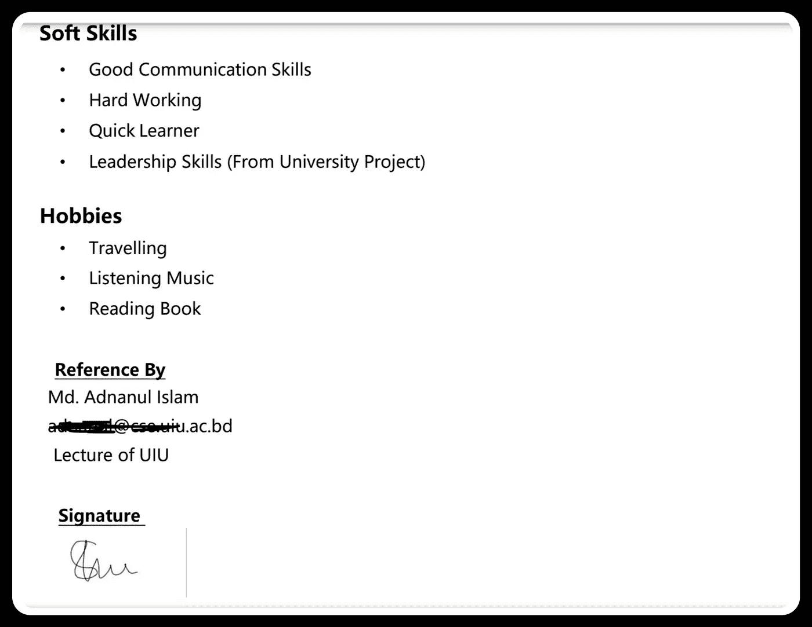
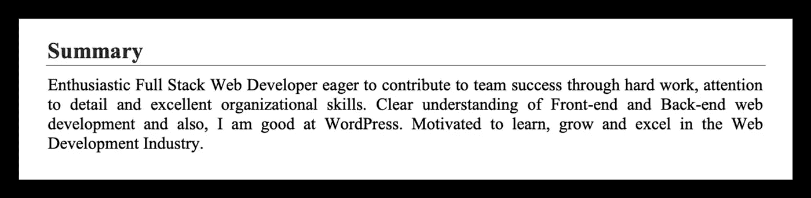
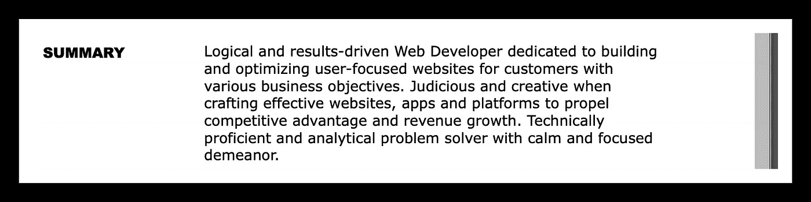
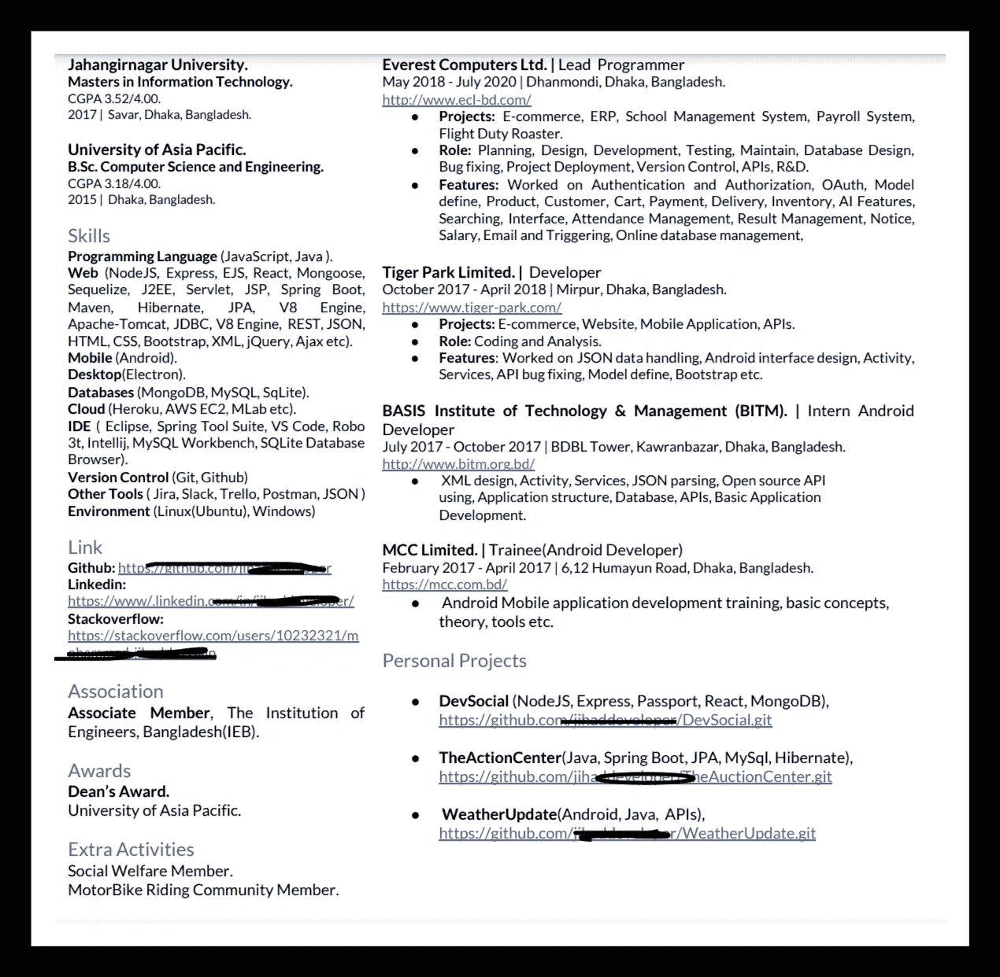
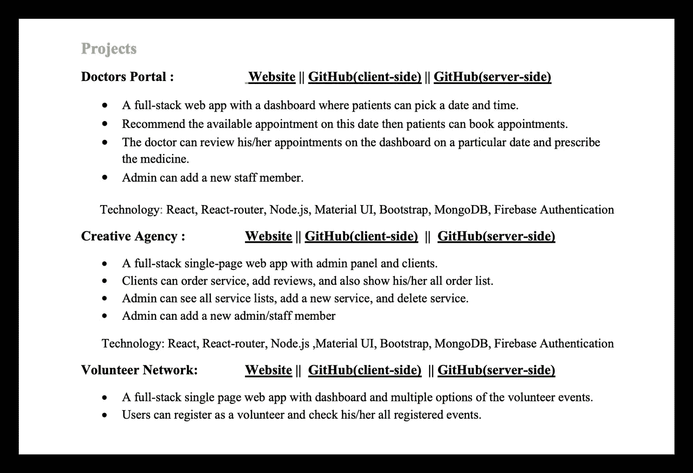
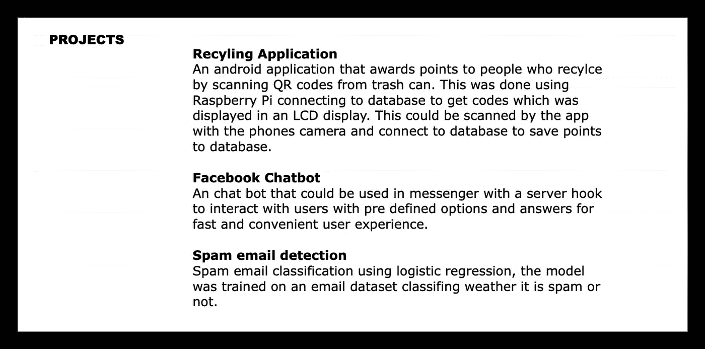
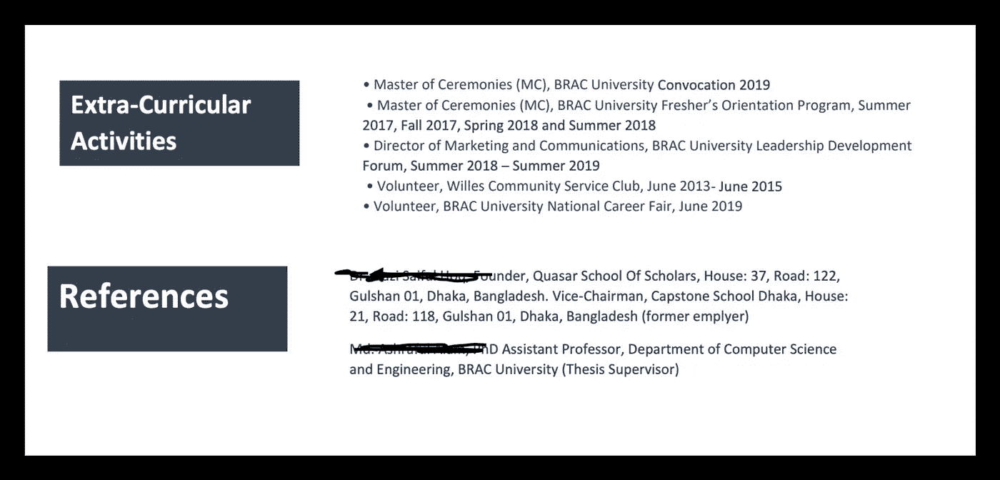

# 改善技术简历的 11 种方法

> 原文：<https://javascript.plainenglish.io/11-ways-to-improve-your-technical-resume-3379161c9160?source=collection_archive---------5----------------------->

## 用一些现实生活中常见错误例子


Photo by [Markus Winkler](https://unsplash.com/@markuswinkler?utm_source=unsplash&utm_medium=referral&utm_content=creditCopyText) on [Unsplash](https://unsplash.com/s/photos/resume?utm_source=unsplash&utm_medium=referral&utm_content=creditCopyText)

最近，我有幸列出了参加技术面试的候选人名单。入围名单**并不像想象的那么有趣。花了很长时间。大约有 230 份简历，只有 8 份入围面试。**

现在我正试图从路的另一边收集我的思维过程。希望这些能让我自己的(也许还有你的)简历更好。

我们开始吧！

# 1.最常见的错误

该职位面向 **nodeJS 开发人员**(可选 nestJS 经验)。

但是 30%的简历中甚至没有单词`**node**`或`**javascript**`。所以没有相关经验是首要原因。

> 请阅读职位描述！

不要对你找到的每个职位空缺都投简历。**至少花 2 分钟**了解要求，然后再申请。

# 2.不必要的细节

> 我为什么要关心占你简历 30%的兴趣爱好？

简历的每一寸都很重要。不要只是填补纸上的空白。添加真正重要的**经验和项目**。



如果你是一个绝对的新生，没有任何经验，那么你可以添加他们。但对我来说，它们只是浪费宝贵的空间。

# 3.无意义的目标或总结

我认为你简历中的目标/总结部分没有增加任何价值，也没有增加任何被面试的机会。



copy-paste summary

反正大部分都是**复制粘贴**。那何必呢？



copy-paste summary

不要只写没人关心的东西。如果你一定要写，那就保持简短和有意义。

# 4.太长或太短

简历要**短而甜**。有人说它不应该超过一页。

不要太执着于把简历做小！

下面的简历试图通过使用**较小的字体**和**多栏**将所有内容都压缩在一页上。一点都不好看！



所以找到那个甜蜜点。我会说 2-4 页的《T21》可以作为你思考的一个很好的起点。

# 5.作品演示

只是说说而已，意义不大。

> 眼见为实

你应该包括一些你的工作的现场演示或者至少一个截图链接(保存在 google drive 中)。证明你对自己的技术很自信。

这里是一个很好的例子，演示链接提供了我可以点击和检查。



demo of your work

# 6.不要解释项目，而是解释你的角色

也许你已经做了一个非常大的项目。不要试图吹嘘那个项目的**规模或重要性**。而是试着解释你在这个项目中的角色/影响。

下面是一个不好的例子



boring description of projects

## 要记住的事情

*   你参与了那个项目的哪个部分/模块？
*   你给代码的特定部分带来了什么样的创新/改进？
*   为什么你是那个项目的重要成员。

我认为这些答案会对审查你简历的人产生影响。

# 7.注意布局和间距

视觉吸引力是你简历中非常重要的一部分。

对**字体大小和间距**要多加小心。有些文本太短，有些太大，会分散视觉注意力，对整体产生负面影响。

下面是一个不好的例子。



# 8.比起冗长的描述，更喜欢要点

当你把你的经历或角色写在一个很长的段落里时，你很难发现什么。有些人可能甚至没有读过。

试着用 2-3 句话总结你想说的，并用要点来表达。

# 9.用数字来解释你的影响

如果可能的话，试着用数字来解释你对项目的影响。不要说

```
I worked on the frontend.
```

相反，说

```
I improved the initial loading time by 30%
```

这向雇主表明你确实了解自己的工作。

# 10.给你的简历起一个合适的名字

发送前，请花 1 分钟时间重命名文件名。不要只发一个名为`resume.pdf`的文件。以后就很难追踪了，而且可能会给你留下不好的印象。

大多数工作申请都要求你用一种特殊的方式来命名你的简历。如果是那样的话，那就做吧。即使他们没有提到任何事情，发送一份名字恰当的简历也能表明你是一名专业人士

所以要格外小心。

# 11.包括您的个人资料

如果你是一名专业技术人员，那么你必须在网上展示你的技能。

尽量包括你的`Github`、`LinkedIn`、`Stackoverflow`、`Medium`等。如果可能的话，试着提前花些时间来组织它们。他们可以带来巨大的变化。

如果你有一个个人网站，这是一个很大的优势。

# 结论

这些观点可能非常主观。我试图在这里解释我的观点。有些点在别人眼里可能不准确。为此提前道歉。请随意分享你的想法。

今天到此为止。祝您愉快！:D